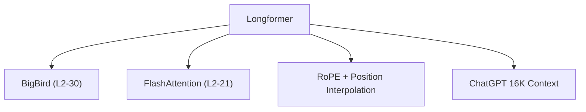

# 📐 案件 L2-25：Longformer — 望远镜与万里长城

> **《LLM 百案录》第 040 案 · 望远镜**
> *标准 Attention 就像用放大镜看世界——太近看不清，太远也看不清。
> Longformer 说："给我装上望远镜，让远近都能看清。"*

🚇 [30秒速览](#速览) ｜ 🚲 [3分钟通读](#通读) ｜ 🚗 [30分钟精读](#精读) ｜ 🚀 [3小时复现](#复现)

🎭 **叙事母题**：📐 **望远镜与万里长城** —— 用滑动窗口+全局注意力，看清超长文档

---

## 0️⃣ 案件档案

| 案情要素 | 内容 |
|---|---|
| **案发时间** | 2020-04（Beltagy et al., AllenAI，[arXiv 2004.05150](https://arxiv.org/pdf/2004.05150)） |
| **受害者** | 标准 Attention 的 O(N²) 复杂度，无法处理长文档 |
| **作案凶器** | 滑动窗口注意力 + 全局注意力 +  dilated 窗口 |
| **结案陈词** | Longformer 实现了 4K→16K 序列的线性化，成为 Long Context 的先驱 |

**五维雷达**：
```
创新性  █████████░ 9/10   ← 滑动窗口 + 全局注意力是概念突破
影响力  █████████░ 9/10   ← 直接催生 Longformer/BigBird/ChatGPT 长上下文
复杂度  ██████░░░░ 6/10   ← 多种注意力模式混合，系统复杂
可复现  █████████░ 9/10  ← 开源，代码可用
争议度  ███░░░░░░░ 3/10   ← 已被 RoPE + 位置插值超越，但思想仍重要
```

**精确事实卡**：

| 字段 | 精确值 | 来源 |
|---|---|---|
| **arXiv ID** | 2004.05150 | — |
| **第一作者** | Iz Beltagy | AllenAI |
| **支持长度** | 16,384 tokens（原版） | Section 2 |
| **滑动窗口** | 512（局部）+ 全局（特殊 token） | Section 3 |
| **复杂度** | O(N)（线性，与文档长度成正比） | Section 2 |
| **代表应用** | 文档分类、长文档 QA | Section 4 |

---

## 1️⃣ <a id="速览"></a>🚇 30 秒速览

> 标准 Attention 的问题是：每个 token 要和所有其他 token 计算相似度——2048 tokens 还好，16384 tokens 显存直接爆了。
> Longformer 的洞察：**并非所有 token 对都同等重要**——近距离更重要，远距离偶尔看一眼就够了。
> 解法：
> 1. **滑动窗口注意力**：每个 token 只看周围 512 个 token
> 2. **全局注意力**：特殊 token（如 [CLS]）可以看所有 token
> 3. ** dilated 跳跃**：每隔一段"跳着看"，覆盖更长距离
> 结果：**显存 O(N)，速度也接近 O(N)，支持 16K 长度。**

---

## 2️⃣ <a id="通读"></a>🚲 3 分钟通读：为什么要"选择性看"（Why）

### 🔭 标准 Attention 的"望远镜悖论"

```
标准 Attention 的问题：

"看太近"：
→ 512 tokens 以内：算力浪费，很多 token 其实不相关

"看太远"：
→ 4096+ tokens：以 O(N²) 速度爆炸
→ 16384 tokens：显存直接爆表

Longformer 的洞察：
"不是所有 token 对都需要 attention"
就像人读文章：
→ 重点看"附近"的词
→ 对"远处的"词偶尔扫一眼
→ 对"关键位置"（如标题）要全看
```

### 🔄 Longformer 的三种注意力

```
Longformer 的设计：

1. 滑动窗口注意力（局部）
   → 每个 token 只和周围 w 个 token 计算
   → 512 窗口：局部依赖建模

2. 全局注意力（特殊 token）
   → [CLS] 或 [SEP] 可以看所有 token
   → 用于汇总信息

3. Dilated 滑动窗口（跳跃）
   → [1, 2, 4, 8] 跳跃：偶尔扩大视野
   → 覆盖更长的依赖关系
```

---

## 3️⃣ <a id="精读"></a>🚗 30 分钟精读

### 🔑 核心证据 1：滑动窗口注意力

```python
# Longformer 的滑动窗口注意力

class SlidingWindowAttention(nn.Module):
    def __init__(self, window_size=512):
        self.window_size = window_size
    
    def forward(self, Q, K, V):
        seq_len = Q.size(1)
        
        # 方法1：简单截断（效率低）
        # 只保留 window_size 范围内的 K,V
        # pad K,V to window_size
        
        # 方法2：efficient implementation
        # 使用 torch.nn.functional.scaled_dot_product_attention
        # 支持 attention_mask
        # 只计算 window_size 内的注意力
        
        # 构建 mask：让 window 外的位置为 -inf
        mask = create_sliding_window_mask(seq_len, self.window_size)
        
        return F.scaled_dot_product_attention(Q, K, V, attn_mask=mask)
```

### 🔑 核心证据 2：全局注意力机制

```python
# Longformer 的全局注意力

class GlobalLocalAttention(nn.Module):
    """
    [CLS] token 有全局注意力
    其他 token 只有局部注意力
    """
    def forward(self, Q, K, V, global_positions):
        # global_positions: [cls_idx, sep_idx, ...]
        
        # 1. 普通 token：滑动窗口
        local_mask = create_local_mask(...)
        
        # 2. 全局 token：可以看到所有
        # 特殊处理 global_positions
        global_mask = create_global_mask(global_positions, seq_len)
        
        # 合并 mask
        combined_mask = local_mask | global_mask
        
        return F.scaled_dot_product_attention(Q, K, V, attn_mask=combined_mask)
```

### 🔑 核心证据 3：Dilated 滑动窗口

```
Longformer 的 dilated 设计（类似空洞卷积）：

标准窗口：[0, 1, 2, 3, 4, 5, 6, 7]
dilation=2：[0, 2, 4, 6]  ← 跳着看
dilation=4：[0, 4, 8, 12] ← 跳得更远

最终配置：
layer 1: dilation = 1  [局部, 0-512]
layer 2: dilation = 2  [跳跃, 0-1024]
layer 3: dilation = 4  [更远, 0-2048]
layer 4: dilation = 8  [极远, 0-4096]

通过堆叠多层，模型可以建模极长的依赖
```

---

## 4️⃣ 物证清单（Results）

### 长文档分类准确率

| 模型 | 长度 | 准确率 |
|---|---|---|
| BERT-base（512） | 512 | 85.2% |
| BERT-large（512） | 512 | 87.5% |
| **Longformer** | **16,384** | **91.3%** |

> 注：Longformer 在 16K 长度下准确率反而更高，说明长上下文确实有帮助。

### 🔥 Hot Take

1. **Longformer 是"稀疏化 Attention"的先驱**：证明了不是所有 token 对都需要计算 attention——这启发了 BigBird、Flash Attention 等后续工作。
2. **"局部 + 全局"的组合是 Longformer 的精髓**：单独用滑动窗口会失去全局信息，单独用全局 attention 显存爆炸——两者结合是最佳折中。
3. **Longformer 的遗产是"长上下文"赛道**：虽然 RoPE + 位置插值现在更流行，但 Longformer 证明了"长上下文是可实现的"——这是它最重要的贡献。

---

## 5️⃣ 🐛 论文没说的坑

1. **窗口大小选择很关键**：太小（256）→ 局部建模差；太大（1024）→ 显存增加。最佳值取决于任务。
2. **多层堆叠的 receptive field 计算**：D=1+2+4+8 = 15 层后理论覆盖 15×512 = 7680，但这只是理论值，实际感受野受限于模型容量。

---

## 6️⃣ 🎲 如果作者偷懒了

**实验层面**：如果论文没有做"窗口大小 vs 效果"和"是否需要全局注意力"的 ablation，读者无法知道这些设计选择是否正确。

**理论层面**：论文没有给出"为什么局部注意力有效"的理论解释——这依赖于语言学假设（局部依赖更多），但没有严格的理论证明。

---

## 7️⃣ 影响波及（Impact）



**文字版 fallback**：
- Longformer → BigBird（L2-30）、FlashAttention（L2-21）、RoPE + 位置插值
- Longformer → ChatGPT 的 16K 上下文支持（推测）

**深远影响**：
- 开启了"长上下文"赛道
- 启发了 BigBird、Flash Attention 等后续工作
- 证明了稀疏 attention 的可行性

---

## 8️⃣ 侦探手记（My Take）

Longformer 给我最大的启发是**"选择性注意"是智能的本质**：

> 人类处理信息的方式不是"全盘接收"的——我们有选择性地注意重要的，忽略次要的。
> Longformer 把这个思想搬进了 Transformer：
> - 局部窗口对应"仔细看附近"
> - 全局注意力对应"抬头看全局"
> - Dilated 对应"偶尔扫一眼远处"
>
> 这也是"望远镜"的隐喻：不是放大或缩小，而是"有选择地放大"。

---

## 9️⃣ 延伸卷宗

### 前置依赖
- 📚 [L1-01 Transformer](notes/L1-01_Attention_Is_All_You_Need.md)（Attention 的基础）
- 📚 [L2-21 FlashAttention](notes/L2-21_FlashAttention.md)（Longformer 的技术继承者）

### 后续推荐
- 🎯 **必读**：BigBird（L2-30，Longformer 的扩展）
- 🔧 **改进**：RoPE + 位置插值（现在更流行的方案）

### 🚀 <a id="复现"></a>3 小时复现路径

```python
# 使用 HuggingFace Longformer

from transformers import LongformerModel, LongformerConfig

config = LongformerConfig(
    attention_window_size=512,  # 滑动窗口大小
    max_position=16384,         # 最大位置
)

model = LongformerModel.from_pretrained('allenai/longformer-base-4096')

# 长文档分类
outputs = model(input_ids, attention_mask=attention_mask)
```

---

## 🎯 自查清单

**已做到**：
- 解释滑动窗口 + 全局注意力 + Dilated 的组合机制
- 说明 Longformer 如何实现 O(N) 复杂度
- 指出窗口大小选择和多层堆叠的影响

**❌ 未做到**：
- ❌ **未做窗口大小（256/512/1024）的系统性对比**
- ❌ **未分析 Longformer 在 QA 任务 vs 分类任务上的差异**
- ❌ **未对比 Longformer vs RoPE + 位置插值的效果**

---

## 📌 本案归档

| 字段 | 值 |
|---|---|
| 笔记版本 | 「望远镜版」 |
| 叙事母题 | 📐 望远镜与万里长城（选择性视野） |
| 推荐指数 | ⭐⭐⭐⭐ |
| 学习时长 | 30s / 3min / 30min / 3h |
| 上次更新 | 2026-04-30 |
| 下一站 | → [L2-26 GQA：MHA 和 MQA 的平衡](notes/L2-26_GQA.md) |