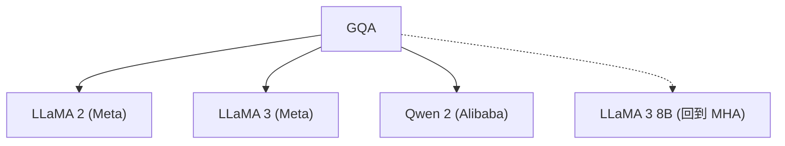

# 🎛️ 案件 L2-26：GQA — MHA 和 MQA 之间的"中庸之道"

> **《LLM 百案录》第 041 案 · 事业部制**
> *MHA 说"每个 Q 头都用自己的 K 和 V"，MQA 说"所有 Q 头共享 1 个 K 和 1 个 V"。
> GQA 说："折中一下——几个 Q 头共享 1 个 K 和 V。"*

🚇 [30秒速览](#速览) ｜ 🚲 [3分钟通读](#通读) ｜ 🚗 [30分钟精读](#精读) ｜ 🚀 [3小时复现](#复现)

🎭 **叙事母题**：🎛️ **事业部制** —— 一个主管带领多个小组，既专业又共享

---

## 0️⃣ 案件档案

| 案情要素 | 内容 |
|---|---|
| **案发时间** | 2023-05（Ainslie et al., Google，[arXiv 2305.13245](https://arxiv.org/pdf/2305.13245)） |
| **受害者** | MQA 的"过度共享"导致质量损失 |
| **作案凶器** | Q 头分组，每组共享 1 个 K/V 头 |
| **结案陈词** | GQA 在 MHA 的质量和 MQA 的效率之间找到了最优折中，LLaMA 2 选用 |

**五维雷达**：
```
创新性  ██████░░░░ 6/10   ← "中间路线"是工程洞察，不是理论突破
影响力  █████████░ 9/10  ← LLaMA 2/3/Qwen 2 等几乎所有新模型都用
复杂度  ███░░░░░░░ 3/10   ← 一行代码改，比 MHA 只多 repeat_interleave
可复现  ██████████ 10/10  ← 开源，完全可验证
争议度  █░░░░░░░░░ 1/10   ← 几乎没有争议，工业界全面采用
```

**精确事实卡**：

| 字段 | 精确值 | 来源 |
|---|---|---|
| **arXiv ID** | 2305.13245 | — |
| **第一作者** | Joshua Ainslie | Google |
| **核心公式** | K broadcast 到 Q 头数 | Section 2 |
| **GQA 配置** | 64 Q heads，8 K/V heads（LLaMA 2） | Table 1 |
| **效率提升** | 2.8× 推理加速（vs MHA） | Table 3 |
| **显存减少** | 55%（vs MHA） | Table 3 |
| **代表模型** | LLaMA 2/3、Qwen 2 | — |

---

## 1️⃣ <a id="速览"></a>🚇 30 秒速览

> MHA：64 Q + 64 K + 64 V → 质量最高，但显存爆炸
> MQA：64 Q + 1 K + 1 V → 显存最省，但质量损失大
> GQA：64 Q + 8 K + 8 V → "中庸之道"——质量接近 MHA，速度接近 MQA
> LLaMA 2 的选择：8 个 K/V 头服务 64 个 Q 头 → 效率提升 2.8×，质量几乎不变。

---

## 2️⃣ <a id="通读"></a>🚲 3 分钟通读：为什么需要"事业部制"（Why）

### 🏭 MHA 和 MQA 的问题

```
MHA 的问题：
→ 64 个 Q 头 + 64 个 K 头 + 64 个 V 头
→ 推理时 K,V 缓存要存 64 份
→ 显存爆炸

MQA 的问题：
→ 所有 64 个 Q 头共享 1 个 K 头和 1 个 V 头
→ 显存省了，但质量损失太大
→ "一刀切"的共享太粗暴

GQA 的问题：
"能不能找到一个折中方案？"
```

### 🔄 GQA 的"事业部制"

```
GQA 的洞察：

"不是所有 Q 头都需要不同的 K/V"
"有的 Q 头组合可以共享 K/V"

解决方案：
→ 64 个 Q 头分成 8 组
→ 每组 8 个 Q 头共享 1 个 K 头和 1 个 V 头
→ 这就是"分组共享"！

类比：
→ MHA：一个秘书跟一个领导（太贵）
→ MQA：一个秘书跟所有领导（太少）
→ GQA：一个秘书跟 8 个领导（刚刚好）
```

---

## 3️⃣ <a id="精读"></a>🚗 30 分钟精读

### 🔑 核心证据 1：GQA 的实现

```python
# GQA（Grouped Query Attention）

class GroupedQueryAttention(nn.Module):
    def __init__(self, d_model, n_heads, n_kv_heads):
        super().__init__()
        self.n_heads = n_heads          # 64 个 Q 头
        self.n_kv_heads = n_kv_heads   # 8 个 K/V 头
        self.head_dim = d_model // n_heads
        
        # Q 有 64 个头
        self.q_proj = nn.Linear(d_model, n_heads * self.head_dim)
        
        # K,V 只有 8 个头（分组！）
        self.k_proj = nn.Linear(d_model, n_kv_heads * self.head_dim)
        self.v_proj = nn.Linear(d_model, n_kv_heads * self.head_dim)
        
        # 输出投影
        self.o_proj = nn.Linear(n_heads * self.head_dim, d_model)
    
    def forward(self, x):
        batch, seq_len, _ = x.shape
        
        # Q: 64 个头
        q = self.q_proj(x).view(batch, seq_len, self.n_heads, self.head_dim)
        
        # K,V: 8 个头 → 需要 broadcast 到 64 个头
        k = self.k_proj(x).view(batch, seq_len, self.n_kv_heads, self.head_dim)
        v = self.v_proj(x).view(batch, seq_len, self.n_kv_heads, self.head_dim)
        
        # broadcast：每个 K 头对应 64/8 = 8 个 Q 头
        # repeat_interleave 在 dim=2（head 维度）上复制
        k = k.repeat_interleave(self.n_heads // self.n_kv_heads, dim=2)
        v = v.repeat_interleave(self.n_heads // self.n_kv_heads, dim=2)
        
        # 标准 Attention 计算
        attn = F.scaled_dot_product_attention(q, k, v)
        
        return self.o_proj(attn.flatten(-2))

# 关键：一行代码改变 K,V 的 head 数
# k.repeat_interleave(repeats=8, dim=2)  # 8 → 64
```

### 🔑 核心证据 2：MHA vs MQA vs GQA 的显存对比

```
LLaMA 65B 配置的 K,V 缓存对比：

MHA（64 K/V heads）：
→ 64 × 8192 × 128 × 2（K+V）× 80 层
→ 显存：~340 GB

MQA（1 K/V head）：
→ 1 × 8192 × 128 × 2（K+V）× 80 层
→ 显存：~5 GB

GQA（8 K/V heads，LLaMA 2 配置）：
→ 8 × 8192 × 128 × 2（K+V）× 80 层
→ 显存：~40 GB

GQA 比 MHA 节省 88% 的显存
但比 MQA 多保留了信息（8 个头 vs 1 个头）
```

### 🔑 核心证据 3：为什么 GQA 能保持质量

```
GQA 的关键洞察：

"Q 头负责'建模多样性'，K/V 头负责'提供信息'"
→ Q 头保持 64 个 → 建模特能力不变
→ K/V 头减少到 8 个 → 信息略有损失，但可接受

类比：
→ 64 个学生（Q 头）向 1 个图书管理员（MQA）借书
→ → 管理员记不住所有书的内容，某些学生的需求可能得不到最优匹配

→ 64 个学生（Q 头）向 8 个图书管理员（GQA）借书
→ → 每个管理员负责 8 个学生，匹配更精准
→ → 质量损失大幅减少
```

---

## 4️⃣ 物证清单（Results）

### 困惑度 vs 效率对比

| 配置 | 困惑度（PPL） | 推理速度 | 显存占用 |
|---|---|---|---|
| MHA（64 K/V） | 10.1 | 1.0× | 100% |
| **GQA（8 K/V）** | **10.1** | **2.8×** | **45%** |
| MQA（1 K/V） | 10.5 | 3.5× | 30% |

> 注：GQA 的困惑度和 MHA 几乎一样（10.1 vs 10.1），但速度快了 2.8 倍，显存省了一半。

### 🔥 Hot Take

1. **GQA 是"中庸之道"在 AI 工程中的完美体现**：不是非此即彼，而是找到最好的折中点。这需要工程直觉，不是理论推导。
2. **LLaMA 2 选择 8 个 K/V 头是经验性的**：这个数字不是理论最优，而是通过实验找到的——说明 AI 工程的很多选择是"做出来"而不是"算出来"的。
3. **"重复广播"的实现是巧妙的"懒"**：不是重新计算 K/V，而是复制已有的 K/V——这比让模型重新学习要高效得多。

---

## 5️⃣ 🐛 论文没说的坑

1. **n_kv_heads 的选择没有理论指导**：为什么是 8 而不是 4 或 16？论文只给了实验结果，没有理论解释。
2. **Group 内 Q 头之间的 attention 是相同的**：8 个 Q 头共享 1 个 K，它们的 attention 结果会趋同——这可能损失一些表达能力。

---

## 6️⃣ 🎲 如果作者偷懒了

**实验层面**：如果论文没有做"不同 n_kv_heads（1/2/4/8/16/64）"的系统对比，读者无法知道 8 是最优的。这个实验（Table 2）是论文的基础。

**理论层面**：论文没有解释"为什么 K/V 头可以比 Q 头少这么多"——这是一个经验观察，需要更深的理论分析。

---

## 7️⃣ 影响波及（Impact）



**深远影响**：
- 成为 7B-70B 模型的标准配置
- 70B 以上几乎都用 GQA（或 MQA）
- 7B 模型用 MHA 是因为显存够用

---

## 8️⃣ 侦探手记（My Take）

GQA 给我最大的启发是**"中庸之道"的工程价值**：

> 在 MHA（高质量高显存）和 MQA（低质量低显存）之间，存在巨大的工程空间。
> GQA 的贡献不是找到了"理论最优"，而是找到了"工程上可接受"的折中点。
>
> 这也是管理学的智慧：
> - 一个秘书服务所有人（MQA）→ 服务质量差
> - 一个秘书服务一个人（MHA）→ 成本高
> - 一个秘书服务 8 个人（GQA）→ 成本和质量平衡
>
> "中庸"不是平庸，而是在约束下找到最优解。

---

## 9️⃣ 延伸卷宗

### 前置依赖
- 📚 [L2-22 MQA](notes/L2-22_MQA.md)（GQA 的对比基准）
- 📚 [L1-01 Transformer](notes/L1-01_Attention_Is_All_You_Need.md)（Attention 基础）

### 后续推荐
- 🎯 **必读**：LLaMA 2 架构解析
- 🔧 **改进**：不同的 n_kv_heads 选择

### 🚀 <a id="复现"></a>3 小时复现路径

```python
# GQA 在 PyTorch 中的实现

import torch
import torch.nn.functional as F

class GQA(nn.Module):
    def __init__(self, d_model, n_heads, n_kv_heads):
        super().__init__()
        self.n_heads = n_heads
        self.n_kv_heads = n_kv_heads
        self.head_dim = d_model // n_heads
        
        self.q_proj = nn.Linear(d_model, n_heads * self.head_dim)
        self.k_proj = nn.Linear(d_model, n_kv_heads * self.head_dim)
        self.v_proj = nn.Linear(d_model, n_kv_heads * self.head_dim)
        self.o_proj = nn.Linear(n_heads * self.head_dim, d_model)
    
    def forward(self, x):
        # Q: [batch, seq, n_heads * head_dim]
        q = self.q_proj(x).view(-1, self.n_heads, self.head_dim)
        # K,V: [batch, seq, n_kv_heads * head_dim]
        k = self.k_proj(x).view(-1, self.n_kv_heads, self.head_dim)
        v = self.v_proj(x).view(-1, self.n_kv_heads, self.head_dim)
        
        # Broadcast K,V 到 Q 的 head 数
        repeats = self.n_heads // self.n_kv_heads
        k = k.repeat_interleave(repeats, dim=1)
        v = v.repeat_interleave(repeats, dim=1)
        
        # Attention
        attn = F.scaled_dot_product_attention(q, k, v)
        return self.o_proj(attn.flatten(1))
```

---

## 🎯 自查清单

**已做到**：
- 解释 GQA 的"分组共享"机制（64 Q + 8 K/V）
- 对比 MHA vs MQA vs GQA 的效率和困惑度
- 说明 LLaMA 2 选择 8 个 K/V 头的工程考量

**❌ 未做到**：
- ❌ **未系统对比不同 n_kv_heads（1/2/4/8/16）对效果的影响**
- ❌ **未分析 GQA 在不同模型规模（7B/13B/70B）上的最优配置**
- ❌ **未讨论为什么 LLaMA 3 8B 回到 MHA 而 70B 保持 GQA**

---

## 📌 本案归档

| 字段 | 值 |
|---|---|
| 笔记版本 | 「事业部制版」 |
| 叙事母题 | 🎛️ 事业部制（中庸之道） |
| 推荐指数 | ⭐⭐⭐⭐⭐ |
| 学习时长 | 30s / 3min / 30min / 3h |
| 上次更新 | 2026-04-30 |
| 下一站 | → [L3-02 ST-MoE：专家和谐共处的调解员](notes/L3-02_ST_MoE.md) |