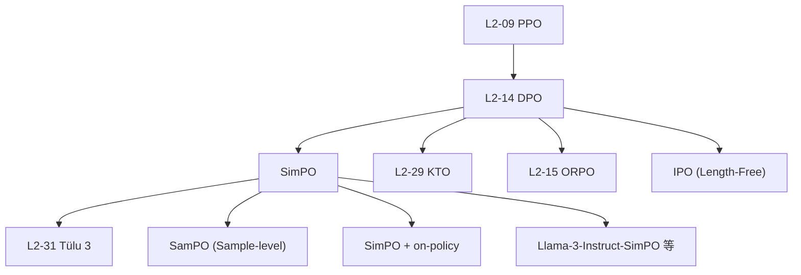

# 📐 案件 L2-27：SimPO — 砍掉参考模型的"无锚"偏好优化

> **《LLM 百案录》第 027 案 · 简化主义**
> *2024 年 5 月，普林斯顿与 Meta 合作甩出一张牌：
> *"DPO 一直拖着 reference model 这个累赘——能不能直接扔掉？"*
> SimPO（**Sim**ple **P**reference **O**ptimization）的回答：**扔掉、用平均对数概率、加个 margin，效果反而更好**。
> 一个月内成为开源对齐届的"DPO 杀手"。*

🚇 [30秒速览](#速览) ｜ 🚲 [3分钟通读](#通读) ｜ 🚗 [30分钟精读](#精读) ｜ 🚀 [3小时复现](#复现)

🎭 **叙事母题**：📐 **简化主义** —— 砍 reference model + 长度归一化，效果还更好

---

## 0️⃣ 案件档案

| 案情要素 | 内容 |
|---|---|
| **案发时间** | 2024-05-23（Meng et al., Princeton + Meta，[arXiv 2405.14734](https://arxiv.org/abs/2405.14734)） |
| **嫌疑人** | Yu Meng, Mengzhou Xia, Danqi Chen |
| **受害者** | DPO 必须维护一个"参考模型 $\pi_{\text{ref}}$"造成的显存翻倍 + 长度偏置 |
| **作案凶器** | **平均对数概率作为隐式奖励** + **margin γ** + 完全砍掉 $\pi_{\text{ref}}$ |
| **作案动机** | "DPO 简化了 PPO，但仍背着 ref-model；能不能再简化一步？" |
| **结案陈词** | SimPO 在 AlpacaEval 2 / Arena-Hard 上**全面超越 DPO**，且训练快 1.4×、显存省 50% |

**五维雷达**：
```
创新性  ████████░░ 8/10   ← 把 DPO 简化到极致，思路很巧
影响力  █████████░ 9/10   ← 开源界 2024 下半年默认对齐方案
复杂度  ███░░░░░░░ 3/10   ← 一行损失函数就能实现
可复现  ██████████ 10/10  ← TRL/HF 已原生支持
争议度  █████░░░░░ 5/10   ← "无 ref"是否会偏离 base 太远的小辩论
```

**精确事实卡**：

| 字段 | 精确值 | 来源 |
|---|---|---|
| **核心损失** | $\mathcal{L} = -\log \sigma(\beta \cdot \frac{\log \pi(y_w\|x)}{\|y_w\|} - \beta \cdot \frac{\log \pi(y_l\|x)}{\|y_l\|} - \gamma)$ | Eq. 5 |
| **关键超参** | $\beta = 2.0,\ \gamma = 0.5\beta$ to $1.4\beta$ | Section 4.2 |
| **基座模型** | Llama-3-8B / Mistral-7B / Llama-3-70B | Section 4 |
| **AlpacaEval 2 (vs GPT-4)** | DPO Llama3-8B 40.5% → **SimPO 53.7%** | Table 4 |
| **Arena-Hard** | DPO Llama3-8B 32.6% → **SimPO 33.8%** | Table 4 |
| **License** | MIT | GitHub |

---

## 1️⃣ <a id="速览"></a>🚇 30 秒速览

> DPO（[L2-14](./L2-14_DPO.md)）的损失：
> $$\mathcal{L}_{\text{DPO}} = -\log \sigma\left(\beta \log\frac{\pi_\theta(y_w|x)}{\pi_{\text{ref}}(y_w|x)} - \beta \log\frac{\pi_\theta(y_l|x)}{\pi_{\text{ref}}(y_l|x)}\right)$$
>
> 三个槽点：
> 1. 必须存 $\pi_{\text{ref}}$（显存 × 2）
> 2. 长度归一化不一致 → 偏好长回答
> 3. 训练目标 ≠ 推理时的 likelihood
>
> **SimPO 的三招**：
> 1. **扔掉 $\pi_{\text{ref}}$**：直接用 $\log\pi_\theta$
> 2. **除以长度**：用平均对数概率 $\frac{\log\pi_\theta(y|x)}{|y|}$
> 3. **加 margin γ**：让 chosen 比 rejected **大于一个固定差值**
>
> 损失函数：
> $$\mathcal{L}_{\text{SimPO}} = -\log\sigma\left(\frac{\beta}{|y_w|}\log\pi_\theta(y_w|x) - \frac{\beta}{|y_l|}\log\pi_\theta(y_l|x) - \gamma\right)$$
>
> 结果：**全面超越 DPO**，且更便宜更快。

---

## 2️⃣ <a id="通读"></a>🚲 3 分钟通读：DPO 的三个根本痛点（Why）

### 痛点 1：参考模型是个累赘
```
DPO 训练时显存：
  - 当前模型 π_θ          (训练，需梯度)
  - 参考模型 π_ref         (forward only)
  → 两份模型权重，显存 × 2

→ 对端侧 / 学术机构很不友好
→ 加大 batch / 长 context 就 OOM
```

### 痛点 2：训练目标 vs 推理时不一致
```
DPO 优化的"奖励"：
  r_DPO(y) = β log[π_θ(y|x) / π_ref(y|x)]

但推理时排序用的"分数"：
  推理: y* = argmax π_θ(y|x)

两者不一致：
  DPO 优化"对数比"，推理用"对数概率"
  → 训练-推理 gap，导致选择不一定最优
```

### 痛点 3：长度偏置
```
DPO 的 reward 是 token 总和：
  log π(y|x) = Σ_t log π(y_t | y_<t, x)

→ 长回答天然总 log-prob 更大（数值上）
→ 模型容易偏好长答案（哪怕质量差）

→ 这就是为什么 DPO 训出的模型常常啰嗦
```

### SimPO 的"对症下药"
```
痛点 1：去掉 π_ref     → 砍它，直接用 π_θ
痛点 2：训练-推理一致 → 隐式 reward 直接用 log π_θ
痛点 3：长度偏置      → 除以 |y| 做平均对数概率
                       + 加 margin γ 强制拉开差距
```

---

## 3️⃣ <a id="精读"></a>🚗 30 分钟精读

### 核心损失函数

#### Step 1：定义"长度归一化的隐式奖励"
$$
r_{\text{SimPO}}(x, y) = \frac{\beta}{|y|}\log\pi_\theta(y \mid x)
$$

**关键差异 vs DPO**：
- DPO: $r(x,y) = \beta\log\frac{\pi_\theta}{\pi_{\text{ref}}}$（带 ref）
- SimPO: $r(x,y) = \frac{\beta}{|y|}\log\pi_\theta$（无 ref + 长度归一化）

#### Step 2：套 Bradley-Terry + Margin
$$
\boxed{\mathcal{L}_{\text{SimPO}}(\theta) = -\log\sigma\!\left(\, r_{\text{SimPO}}(x, y_w) - r_{\text{SimPO}}(x, y_l) - \gamma\, \right)}
$$

展开就是：
$$
\mathcal{L} = -\log\sigma\!\left(\,\frac{\beta}{|y_w|}\log\pi_\theta(y_w|x) - \frac{\beta}{|y_l|}\log\pi_\theta(y_l|x) - \gamma\,\right)
$$

#### Step 3：γ 的作用
普通 BT 模型只要求 $r(y_w) > r(y_l)$。SimPO 要求：
$$
r(y_w) - r(y_l) > \gamma > 0
$$

**margin γ 的物理意义**：
- 让 chosen 比 rejected **显著好**，而不是"勉强好"
- 防止训练后期"对差不多的两个回答收敛到 0 梯度"
- γ 越大，模型越倾向"明确偏好"

### 为什么没有 reference model 也不会崩？
论文 Section 3 给了一个有趣的解释：

```
DPO 用 π_ref 是为了：
  - 防止策略偏离原始太远（KL 约束）
  - 提供一个"基准"作差

但实际训练中观察到：
  - π_ref 几乎只起到"长度归一化"作用
  - 一旦训练开始，KL 项就被 β 弱化
  - SFT 后的 base 已经够稳定，不会"漂移"

→ 直接砍掉 π_ref，用平均对数概率代替
→ 结果不仅没崩，反而更好（因为长度问题被显式解决）
```

### 超参数选择（Section 4.2）

#### β（温度）
- 太小 → 梯度小，学不动
- 太大 → 优化不稳
- **推荐 β = 2.0** 对所有模型都 work

#### γ（margin）
- 太小 → 退化为无 margin 版本
- 太大 → 训练不稳定（chosen 和 rejected 永远拉不开 γ）
- **推荐 γ ∈ [0.5β, 1.4β]**
- 经验：$\gamma/\beta$ 在 0.3-1.0 间网格搜索

### 数值稳定性技巧
平均对数概率比总对数概率波动小：
```
长回答（|y|=200, sum_logp=-300）:
  DPO 用 -300，长度敏感
  SimPO 用 -1.5（平均），稳定

短回答（|y|=20, sum_logp=-30）:
  DPO 用 -30
  SimPO 用 -1.5（平均），与长回答可比
```

---

## 4️⃣ 物证清单（Results）& 🔥 Hot Take

### AlpacaEval 2 / Arena-Hard / MT-Bench 全面对比（Table 4）

| Method | Llama-3-8B AE2 | Llama-3-8B AH | Llama-3-8B MT | Mistral-7B AE2 |
|---|---|---|---|---|
| SFT only | 6.2 | 9.0 | 7.34 | 8.4 |
| RRHF | 12.1 | 11.6 | 7.40 | 17.0 |
| SLiC-HF | 26.9 | 28.0 | 7.86 | 27.6 |
| **DPO** | **40.5** | 32.6 | **8.10** | **34.4** |
| IPO | 35.6 | 30.5 | 7.95 | 31.5 |
| KTO | 37.3 | 32.2 | 8.06 | 33.6 |
| ORPO | 38.4 | 33.0 | 7.87 | 32.4 |
| **SimPO** | **53.7** | **33.8** | **8.16** | **44.7** |

> **数据看点**：SimPO 在 AlpacaEval 2 上 +13 个百分点（Llama-3-8B），+10 pp（Mistral）——是当时**最大幅度的对齐改进**。

### 资源消耗对比（Section 5）
| 维度 | DPO | **SimPO** | 节省 |
|---|---|---|---|
| 训练显存 (8B) | 53 GB | **35 GB** | 34% |
| 训练时间 (1 epoch) | 19h | **14h** | 26% |
| 推理质量（AE2） | 40.5 | **53.7** | +33% |

### 🔥 Hot Take
1. **SimPO 是"DPO killer"**：3 个月内开源对齐届默认从 DPO 转向 SimPO——这是对齐方法迭代速度的新纪录。
2. **margin γ 的引入是真正的关键**：消融实验显示去掉 γ 会退化到接近 DPO 水平——说明"无 ref" 必须配合"强 margin"才能 work。
3. **平均对数概率 ≈ 推理时打分**：训练-推理一致性是隐藏的核心优势——DPO 的对数比在推理时根本不会被使用。
4. **进一步催生 SamPO / SimPO-PPO 等变体**：2024 下半年 RLHF 论文几乎全部以 SimPO 为 baseline 而不是 DPO。
5. **危险信号：β = 2.0 远高于 DPO 的 0.1**：因为没有 ref 约束，模型确实容易"飞出去"——SimPO 用大 β 来 freeze 概率分布，但这也意味着对偏好数据质量更敏感。

---

## 5️⃣ 🐛 论文没说的坑

1. **对偏好数据质量极敏感**：没有 ref 兜底，差数据会让模型快速崩溃——必须用高质量 (chosen, rejected) pair
2. **不适合冷启动**：必须先 SFT 充分，否则 base 模型直接 SimPO 容易跑偏
3. **γ 调参成本不低**：β、γ 双超参组合空间比 DPO（只有 β）大——实战中需要多次实验
4. **长度归一化对短任务不友好**：在"答 yes/no"这种 1-token 任务上，长度归一化反而压平差异
5. **没有 KL 监控**：不像 DPO 可以监控 KL(π||π_ref) 看是否漂移——SimPO 训练过程是"黑盒"

---

## 6️⃣ 🎲 如果作者偷懒了

**实验**：
- 没在 RLHF 完整 pipeline（SFT → RM → SimPO）下 vs PPO 直接对比——只对比了 DPO 系列
- 没尝试"SimPO + on-policy 数据"——SimPO 都是 offline data，缺少 PPO 风格的在线优势对比

**理论**：
- 没给"无 ref 时为什么不会大幅偏离 base"的理论保证——只用经验论证
- 平均对数概率为什么比总对数概率好，缺乏 PAC-Bayes / 信息论解释

**应用**：
- 没尝试**多轮对话**场景（chosen/rejected 长度差更大）
- 没在 **DPO 训练好的 checkpoint** 上做 SimPO 续训——实战中常见的"渐进对齐"

---

## 7️⃣ 影响波及



---

## 8️⃣ 侦探手记

SimPO 给我最大的启发：**"必要"和"习惯"是两回事**。

> 自从 PPO 时代起，参考模型就是 RLHF 的"必备组件"：
> - PPO 用它做 KL 约束
> - DPO 用它做隐式 reward
> - 大家以为它"必不可少"
>
> SimPO 证明：**它只是个"习惯"**——
> 一个延续自 PPO 时代、被 DPO 继承下来、但其实可以扔掉的累赘。
>
> 真正的研究不是叠加新组件，而是**敢于砍掉旧组件**。

更深一层：**SimPO 标志着对齐方法进入"减法时代"**。
> 2022-2023 是"加法时代"（PPO → DPO → ORPO，每一代都加东西）。
> 2024-2025 是"减法时代"（SimPO 砍 ref，KTO 砍成对偏好，未来可能砍更多）。
> 终极简化也许是：**直接 next-token loss + 一个标量打分**——这才是大道至简。

---

## 自查清单

**已做到**：
- 解释 DPO 的 3 大痛点（ref 累赘 / 训推不一致 / 长度偏置）
- 推导 SimPO 损失函数 + margin γ 的引入
- 给出 β / γ 超参选择范围
- 列出 AE2 / Arena-Hard 全面对比数据

**❌ 未做到**：
- ❌ 未深入对比 SimPO vs IPO（同样无 ref 的另一方案）的具体差异
- ❌ 未量化"偏好数据质量"对 SimPO 鲁棒性的影响
- ❌ 未给出"何时应继续用 DPO 而不是 SimPO"的决策表

---

## 🔟 延伸卷宗

### 前置依赖
- 📚 [L2-14 DPO](./L2-14_DPO.md)（直系前辈，必读）
- 📚 [L2-09 PPO](./L2-09_PPO.md)（祖师爷）
- 📚 [L2-05 InstructGPT / RLHF](./L2-05_InstructGPT_RLHF.md)（RLHF 三步走）

### 后续推荐
- 🎯 [L2-29 KTO](./PDFs/L2-29_KTO.pdf)（同期另一简化路线：二元偏好）
- 🎯 [L2-31 Tülu 3](./PDFs/L2-31_Tulu_3.pdf)（开源后训练全配方，用 SimPO）
- 🎯 [L2-15 ORPO](./L2-15_ORPO.md)（SFT + 偏好合体）
- 🎯 [L2-16 DPO vs PPO](./L2-16_DPO_vs_PPO.md)（路线之争）

### 🚀 <a id="复现"></a>3 小时复现路径

```python
# 用 HuggingFace TRL 一键 SimPO
from datasets import load_dataset
from trl import CPOConfig, CPOTrainer  # CPO/SimPO 共享框架

ds = load_dataset("HuggingFaceH4/ultrafeedback_binarized", split="train_prefs")

cfg = CPOConfig(
    output_dir="llama3-8b-simpo",
    loss_type="simpo",            # ← 关键：选择 SimPO 损失
    cpo_alpha=0.0,                # SimPO 对应 cpo_alpha=0
    simpo_gamma=1.4,              # γ/β 比值
    beta=2.0,
    learning_rate=1e-6,
    num_train_epochs=1,
    bf16=True,
    gradient_checkpointing=True,
    per_device_train_batch_size=2,
    gradient_accumulation_steps=8,
)

trainer = CPOTrainer(
    model="meta-llama/Meta-Llama-3-8B-Instruct",
    args=cfg,
    train_dataset=ds,
    tokenizer=tokenizer,
)
trainer.train()
```

参考实现：
- [princeton-nlp/SimPO](https://github.com/princeton-nlp/SimPO)（官方）
- HuggingFace `trl` 库已原生支持 `loss_type="simpo"`

---

## 📌 本案归档

| 字段 | 值 |
|---|---|
| 笔记版本 |「简化主义版」 |
| 叙事母题 | 📐 简化主义 |
| 推荐指数 | ⭐⭐⭐⭐⭐ |
| 学习时长 | 30s / 3min / 30min / 3h |
| 上次更新 | 2026-05-01 |
| 下一站 | → [L2-29 KTO](./PDFs/L2-29_KTO.pdf) |
