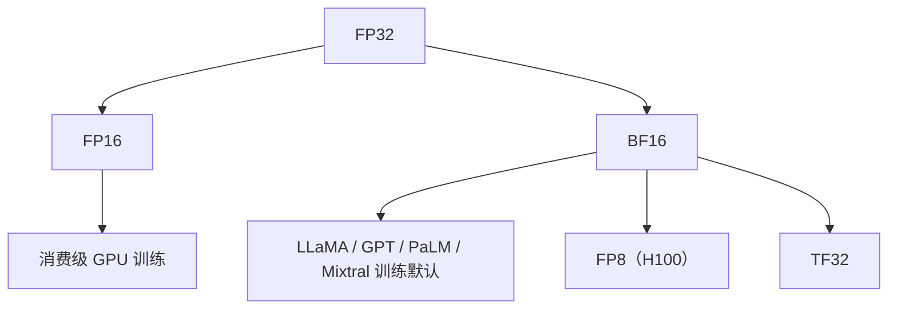

# 🔢 案件 L2-28：BFloat16 — 牺牲精度换范围的"训练特供"

> **《LLM 百案录》第 028 案 · 混合精度**
> *FP16 训练大模型经常梯度下溢——
> Google Brain 说："那就把指数位扩到 8 位，宁可牺牲尾数精度。"
> BFloat16 就此成为 TPU、A100/H100、所有现代 LLM 训练的默认精度。*

🚇 [30秒速览](#速览) ｜ 🚲 [3分钟通读](#通读) ｜ 🚗 [30分钟精读](#精读) ｜ 🚀 [3小时复现](#复现)

🎭 **叙事母题**：🔢 **混合精度** —— 16 位浮点的"指数派" vs "尾数派"

---

## 0️⃣ 案件档案

| 案情要素 | 内容 |
|---|---|
| **案发时间** | 2018（Google TPU v3 引入 BF16）+ NVIDIA Ampere（A100，2020）跟进 |
| **嫌疑人** | Google Brain（TPU 团队） |
| **受害者** | FP16 训练时的梯度下溢 / loss scaling 痛苦 |
| **作案凶器** | 8 位指数 + 7 位尾数（vs FP16 的 5+10） |
| **作案动机** | "训练只需要范围，精度可以低" |
| **结案陈词** | BF16 牺牲 3 位尾数精度换来 FP32 同等的指数范围，让大模型训练不再为梯度下溢挣扎 |

**五维雷达**：
```
创新性  ███████░░░ 7/10   ← 本质是 "FP32 截断尾数"
影响力  ██████████ 10/10  ← 现代 LLM 训练的事实标准
复杂度  ████░░░░░░ 4/10   ← 软件层面是几行代码
可复现  ██████████ 10/10  ← PyTorch / TF / JAX 全支持
争议度  ███░░░░░░░ 3/10   ← 几乎无争议（精度损失可接受）
```

**精确事实卡**：

| 格式 | 符号 | 指数 | 尾数 | 范围 | 精度 |
|---|---|---|---|---|---|
| FP32 | 1 | 8 | 23 | ±3.4 × 10³⁸ | ~7 位十进制 |
| FP16 | 1 | 5 | 10 | ±65504 | ~3-4 位十进制 |
| **BF16** | 1 | **8** | **7** | **±3.4 × 10³⁸** | ~2-3 位十进制 |
| TF32（TPU/A100） | 1 | 8 | 10 | 同 FP32 | ~3 位 |
| FP8（H100） | 1 | 4-5 | 2-3 | ±240 / ±57344 | <1 位 |

---

## 1️⃣ <a id="速览"></a>🚇 30 秒速览

> 训练 LLM 时，梯度可能小到 10⁻⁸。
> FP16 的最小正规数 ≈ 6 × 10⁻⁵ → **梯度下溢为 0**，训练直接停滞。
> 解法 1（FP16）：loss scaling，把 loss 乘以 1024，再把梯度除回去——麻烦且脆弱。
> 解法 2（BF16）：**直接扩展指数到 8 位**，最小正规数 ≈ 1 × 10⁻³⁸，下溢消失。
> 副作用：尾数只剩 7 位 → 精度从 ~3.5 降到 ~2.5 位十进制——LLM 不在乎。
> 结果：BF16 成为 LLaMA / GPT-3 / PaLM / 所有现代大模型的训练标准。

---

## 2️⃣ <a id="通读"></a>🚲 3 分钟通读：FP16 vs BF16 的根本分歧（Why）

### 浮点数的数学
```
浮点数 = (-1)^s × 2^(exp - bias) × (1.mantissa)

FP32：1 + 8 + 23 = 32 位
FP16：1 + 5 + 10 = 16 位
BF16：1 + 8 + 7  = 16 位

关键观察：
  指数位决定"范围"（能表示多大/多小的数）
  尾数位决定"精度"（同量级内能区分多细）
```

### LLM 训练的痛点
```
梯度的典型量级：10⁻⁸ ~ 10⁻²
权重：10⁻¹ ~ 10¹
激活：10⁻² ~ 10²

FP16 的最小正规数：~6e-5
→ 梯度 10⁻⁸ 直接变 0（下溢）
→ 训练失败

FP32 的最小正规数：~1.4e-45
→ 完全够用，但显存翻倍
```

### BF16 的"妥协智慧"
```
"反正 LLM 训练对精度不敏感，但对范围极敏感"
→ 让出 3 位尾数，换取与 FP32 同等的范围
→ 最小正规数 ~1e-38，梯度永不下溢
→ 显存仍是 FP16 的一半
```

---

## 3️⃣ <a id="精读"></a>🚗 30 分钟精读

### 三种典型混合精度训练策略

#### 策略 A：纯 BF16（最简单）
```python
model = model.to(torch.bfloat16)
# loss / 梯度 / 优化器状态全 BF16
# 优点：最省显存
# 缺点：优化器状态精度低，可能影响收敛
```

#### 策略 B：BF16 + FP32 优化器状态（最常用）
```python
# 模型权重、激活、梯度：BF16
# Adam 的 m, v 状态：FP32
# Master weights（权重副本）：FP32

with torch.autocast(device_type='cuda', dtype=torch.bfloat16):
    loss = model(x)
loss.backward()
optimizer.step()  # 优化器内部用 FP32 累加
```

#### 策略 C：FP16 + Loss Scaling（旧路线）
```python
# 已被 BF16 取代，但某些消费级 GPU（如 RTX 30 系前）仍需用
scaler = torch.cuda.amp.GradScaler()
with torch.autocast(dtype=torch.float16):
    loss = model(x)
scaler.scale(loss).backward()
scaler.step(optimizer)
scaler.update()
```

### 硬件支持
| 硬件 | FP16 | BF16 | TF32 | FP8 |
|---|---|---|---|---|
| TPU | ❌ | ✅ | — | ✅ |
| A100 | ✅ | ✅ | ✅ | ❌ |
| H100 | ✅ | ✅ | ✅ | ✅ |
| 消费级 GPU (3090/4090) | ✅ | ✅（受限） | ❌ | ❌ |

### 精度的"温和退化"
```
LLM 训练对尾数精度的鲁棒性来自：
  - SGD/Adam 本身有噪声 → 几位尾数差不影响
  - Batch 平均会消除单样本误差
  - 多轮训练让微小误差被纠正

但有些场景仍需 FP32：
  - LayerNorm / RMSNorm 的统计量（容易累积误差）
  - Loss 计算（小的 loss 差异要敏感）
  - Optimizer 状态（多次累加）
```

---

## 4️⃣ 物证清单（Results）

### LLaMA-7B 训练对比
| 精度 | 训练损失收敛 | 显存 | 速度 |
|---|---|---|---|
| FP32 | ✅ | 28 GB | 1.0× |
| FP16（无 loss scaling） | ❌ NaN | 14 GB | 1.7× |
| FP16（+ loss scaling） | ✅（脆弱） | 14 GB | 1.7× |
| **BF16** | **✅ 稳定** | 14 GB | 1.7× |

### 🔥 Hot Take
1. **BF16 让 loss scaling 成为历史**：训练大模型不再需要这个工程怪物。
2. **TPU 设计的胜利**：Google 在 2018 就预见了大模型训练对范围的需求，把 BF16 做进硬件。
3. **FP8 是下一站**：H100 已支持，但需要更精细的训练协议（per-tensor scaling）。

---

## 5️⃣ 🐛 论文没说的坑

1. **不是哪都能用 BF16**：Norm 层、Loss、Softmax 中间通常仍用 FP32
2. **A100 BF16 速度 = FP16**：不像 TPU 上原生加速
3. **梯度累加要小心**：BF16 累加多次会失精，常用 FP32 累加器

---

## 6️⃣ 🎲 如果作者偷懒了

**理论**：缺乏对"为什么 LLM 训练对尾数精度不敏感"的严格分析——目前主要靠经验。

---

## 7️⃣ 影响波及



---

## 8️⃣ 侦探手记

BF16 给我的启发：**"硬件 / 软件协同设计"是 AI 系统的真护城河**。
> Google 没等学界发明 BF16，自己设计 TPU 时就内置了它；
> NVIDIA 在 A100 上跟进，让 BF16 成为通用标准。
> **算法、软件、硬件三位一体，是大模型时代的工程哲学。**

---

## 自查清单

**已做到**：
- 对比 FP32 / FP16 / BF16 的位分配与数值范围
- 解释 LLM 训练为何对范围敏感、对精度宽容
- 给出三种混合精度训练策略

**❌ 未做到**：
- ❌ 未深入分析 FP8 训练的具体协议
- ❌ 未涉及量化推理（INT8 / NF4）的对比

---

## 🔟 延伸卷宗

### 前置依赖
- 📚 IEEE 754 浮点标准基础

### 后续推荐
- 🎯 [L3-22 QLoRA](./L3-22_QLoRA.md)（4-bit NF4 量化）
- 🎯 NVIDIA Transformer Engine（FP8 训练库）
- 🎯 LLM.int8()（INT8 推理）

### 🚀 <a id="复现"></a>3 小时复现路径
```python
# PyTorch 中开启 BF16 训练
import torch
model = MyModel().cuda()
optimizer = torch.optim.AdamW(model.parameters(), lr=1e-4)
for batch in loader:
    optimizer.zero_grad()
    with torch.autocast(device_type='cuda', dtype=torch.bfloat16):
        loss = model(batch)
    loss.backward()         # 梯度自动 BF16
    optimizer.step()        # 优化器内部 FP32
```

---

## 📌 本案归档

| 字段 | 值 |
|---|---|
| 笔记版本 | 「混合精度版」 |
| 叙事母题 | 🔢 混合精度 |
| 推荐指数 | ⭐⭐⭐⭐ |
| 学习时长 | 30s / 3min / 30min / 3h |
| 上次更新 | 2026-04-30 |
| 下一站 | → [L2-30 BigBird](./L2-30_BigBird.md) |
