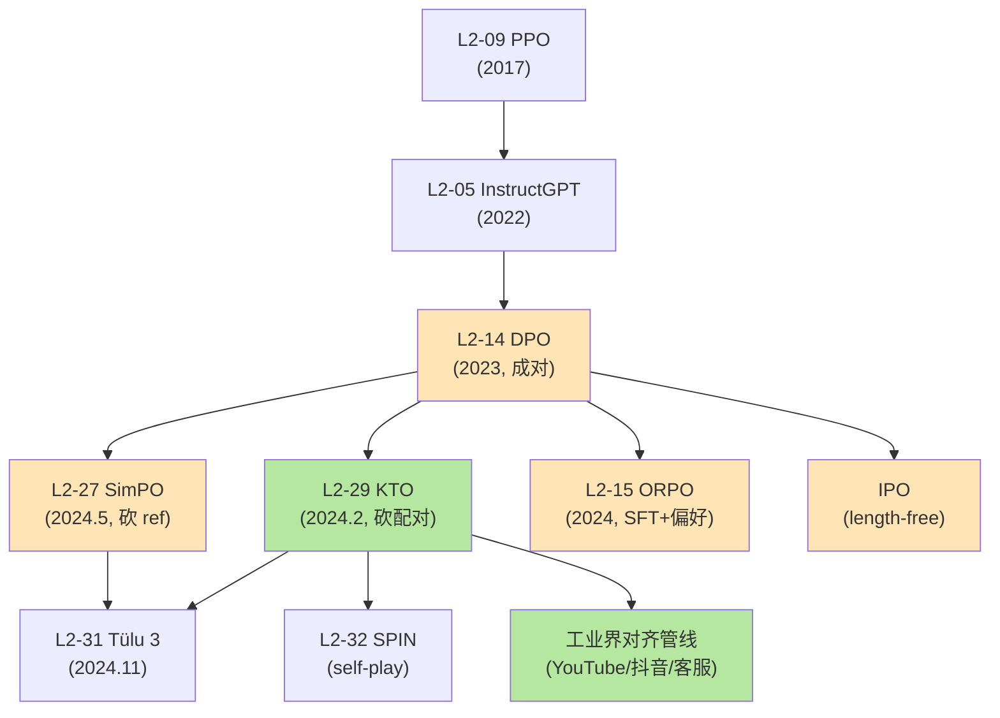

# 🎲 案件 L2-29：KTO — 把诺贝尔经济学奖搬进 LLM 对齐

> **《LLM 百案录》第 029 案 · 前景理论**
> *2024 年 2 月，Stanford × Contextual AI 抛出一个反常识的命题：
> *"为什么 LLM 对齐非要 (chosen, rejected) 配对？人类点赞从来都是单条独立的——只有'好'或'不好'。"*
> KTO（**K**ahneman-**T**versky **O**ptimization）的回答：**用 1979 年的前景理论改写损失函数，单条二元标签即可对齐**。
> 把诺贝尔经济学奖搬进了 transformer 的反向传播。*

🚇 [30秒速览](#速览) ｜ 🚲 [3分钟通读](#通读) ｜ 🚗 [30分钟精读](#精读) ｜ 🚀 [3小时复现](#复现)

🎭 **叙事母题**：🎲 **前景理论 / 得失非对称** —— 把 Kahneman 的"损失厌恶"嫁接到 LLM 对齐损失函数

---

## 0️⃣ 案件档案

| 案情要素 | 内容 |
|---|---|
| **案发时间** | 2024-02-02（Ethayarajh et al., Stanford + Contextual AI，[arXiv 2402.01306](https://arxiv.org/abs/2402.01306)） |
| **嫌疑人** | Kawin Ethayarajh, Winnie Xu, Niklas Muennighoff, Dan Jurafsky, Douwe Kiela |
| **受害者** | DPO/PPO 必须依赖 (chosen, rejected) **成对偏好数据**——这种数据需要专家配对标注，成本极高、规模极小 |
| **作案凶器** | **Kahneman-Tversky 前景理论 value function** + 单条二元标签 + KL 期望作"中性参考点" |
| **作案动机** | "实战中 90% 的反馈是单条的（点赞/点踩、用户停留时间、客服评分），凭什么对齐算法非要成对？" |
| **结案陈词** | 在 Llama2-7B/13B、Mistral-7B 上**持平或略胜 DPO**，但数据需求从"几万对成对数据"降到"百万级二元标签"——**直接打通工业落地** |

**五维雷达**：
```
创新性  █████████░ 9/10   ← 首次把行为经济学公理嫁接到 LLM loss
影响力  █████████░ 9/10   ← 工业界对齐管线的"数据救星"
复杂度  ██████░░░░ 6/10   ← prospect theory 推导有点门槛，但实现不难
可复现  ██████████ 10/10  ← TRL 库 KTOTrainer 已原生支持
争议度  ███████░░░ 7/10   ← "用 1979 年的人类心理学公理建模 LLM" 引发广泛争论
```

**精确事实卡**：

| 字段 | 精确值 | 来源 |
|---|---|---|
| **核心损失** | $\mathcal{L}_{\text{KTO}} = \mathbb{E}_{x,y\sim D}[\lambda_y - v(x,y; \beta)]$ | Eq. 7 |
| **隐式奖励** | $r_\theta(x,y) = \beta \log\frac{\pi_\theta(y\|x)}{\pi_{\text{ref}}(y\|x)}$ | Section 4.2 |
| **参考点** | $z_0 = \mathbb{E}_{x'\sim D}[\beta\,\mathrm{KL}(\pi_\theta(\cdot\|x')\,\|\,\pi_{\text{ref}}(\cdot\|x'))]$ | Eq. 6 |
| **value (chosen)** | $v(x,y_w) = \lambda_D \sigma(r_\theta - z_0)$ | Eq. 7 |
| **value (rejected)** | $v(x,y_l) = \lambda_U \sigma(z_0 - r_\theta)$ | Eq. 7 |
| **损失厌恶系数** | $\lambda_D = 1.0,\ \lambda_U = 1.0$（基础）；可调到 $\lambda_U/\lambda_D \in [1, 1.33]$ 模拟人类损失厌恶 | Section 4.3 |
| **基座模型** | Llama2-7B / 13B、Mistral-7B、Llama2-30B | Section 5 |
| **关键超参** | $\beta = 0.1$（同 DPO） | Section 5 |
| **不平衡数据实验** | 90% 好回答 + 10% 坏回答 → KTO 仍 work，DPO 性能崩溃 | Section 5.4 |
| **License** | Apache-2.0 | GitHub |

---

## 1️⃣ <a id="速览"></a>🚇 30 秒速览

> **DPO 的硬伤**：必须成对数据 $(x, y_w, y_l)$——意味着标注员必须在两个回答里"二选一"，是一种**昂贵的相对偏好**。
>
> **KTO 的核心赌注**：人类的反馈本质上是**单条评价**（"这个回答好/不好"），且符合 Kahneman 1979 年的**前景理论**：
> 1. 评价是相对一个**参考点**的（不是绝对值）
> 2. **失去的痛苦 > 得到的快乐**（损失厌恶）
> 3. 对极端的 gain/loss **敏感度递减**（凹/凸效用函数）
>
> **KTO 损失函数三件套**：
> 1. **隐式奖励**：$r_\theta(x,y) = \beta\log\frac{\pi_\theta}{\pi_{\text{ref}}}$（同 DPO）
> 2. **参考点**：$z_0 = \mathbb{E}[\beta\,\mathrm{KL}(\pi_\theta\|\pi_{\text{ref}})]$（用 KL 期望！）
> 3. **value function**：好回答用 $\lambda_D \sigma(r-z_0)$，坏回答用 $\lambda_U\sigma(z_0-r)$
>
> **结果**：性能持平 DPO，但**只需单条二元标签**——工业界点赞数据可以直接训练。

---

## 2️⃣ <a id="通读"></a>🚲 3 分钟通读：DPO 的"成对数据贵"痛点（Why）

### 痛点：成对偏好数据是奢侈品

```
DPO 训练需要的数据格式：
{
  "prompt": "解释一下黑洞",
  "chosen": "黑洞是引力极强...（专业版回答）",
  "rejected": "黑洞就是黑色的洞...（敷衍版回答）"
}

→ 必须是同一个 prompt 下，两个回答二选一
→ 标注员要看完两条回答，再做"哪个更好"的判断
→ 一对数据成本 ≈ 单条评分的 5-10 倍
→ HH-RLHF 数据集只有 16 万对，UltraFeedback 也才 6 万对
```

### 现实世界的反馈长这样：

```
微信公众号:
  ❤️ 点赞 1024     ← 单条好
  💩 举报   3      ← 单条坏

ChatGPT:
  👍 like           ← 单条好
  👎 dislike        ← 单条坏

客服系统:
  ⭐⭐⭐⭐⭐ 5星好评 ← 单条好
  ⭐ 1星差评        ← 单条坏

→ 没有一个真实场景是 "请在A和B中二选一"
→ 全是"请评价这条好不好"
→ 数据量轻松百万级，且天然带反馈
```

### 数据规模对比

| 方法 | 数据形式 | 已有规模（公开） | 实际可获取 |
|---|---|---|---|
| **DPO** | 成对 $(y_w, y_l)$ | UltraFeedback 6 万对 | 几十万对（封顶） |
| **PPO + RM** | 成对训 RM | OpenAI 80 万对 | 闭源限制 |
| **KTO** | 单条 + 二元标签 | OASST 25 万条；HH 半拆即 32 万条 | **百万-千万级（点赞/客服评分）** |

### KTO 的核心 insight：

```
人类标注成对偏好时，内心其实是这样想的：
  Step 1: 看 y_w → "这个不错" (单条评分)
  Step 2: 看 y_l → "这个不行" (单条评分)
  Step 3: 比较 → 选 y_w

→ 真正的认知过程是"两次单条评价"
→ 强行让标注员做配对，是为算法迁就，不是为认知规律
→ 那为什么不直接对齐"单条评价"？
```

### KTO 的"对症下药"

```
痛点：成对数据贵 → 用单条二元标签
缺什么：成对数据天然有"对比基准" → 用 KL 期望 z_0 当中性参考点
怎么对齐："好"和"坏"的处理方式 → prospect theory value function
难题：好/坏样本不平衡 → 用 λ_D/λ_U 比例做加权
```

---

## 3️⃣ <a id="精读"></a>🚗 30 分钟精读

### 3.1 Kahneman 与前景理论的诺奖背景

**Daniel Kahneman**（1934-2024）是以色列裔美国心理学家，2002 年因将心理学研究方法引入经济学（**前景理论**, Prospect Theory）获得**诺贝尔经济学奖**。前景理论由他和 Amos Tversky 在 1979 年发表于 *Econometrica*，是行为经济学的奠基之作，畅销书《思考，快与慢》(*Thinking, Fast and Slow*) 是他对大众的科普著作。

> **传统经济学的预设**：人是理性的，效用函数 $u(x) = x$ 是线性的。
> **前景理论的反驳**：人是非理性的，效用函数对**得失非对称**——
> - 失去 100 元的痛苦 ≈ 得到 200 元的快乐
> - 这就是**损失厌恶**（loss aversion），系数约 2.25

### 3.2 前景理论三要素（详图）

```
                    人感受到的"价值" v(x)
                          │
                          │     得到（gain）
              ────────────┼──────────►
                          │   ╱─── 凹（diminishing sensitivity）
                          │ ╱
              参考点 ────►●  ← reference point z_0
                        ╱ │
                      ╱   │
                    ╱     │
                 ╱        │
              ╱           │
            ╱             │
          ╱  ◄─── 凸（diminishing sensitivity）
         ╱      失去（loss）：斜率比 gain 大 ~2x
                          │
```

**三大公理**（Kahneman 把它们形式化为数学约束）：

| 公理 | 直觉 | KTO 中的体现 |
|---|---|---|
| **① 参考点（reference dependence）** | 评价不是绝对的，而是相对某个基准 | 用 $z_0 = \mathbb{E}[\beta\,\mathrm{KL}]$ 作中性参考点 |
| **② 损失厌恶（loss aversion）** | 失去比得到痛苦得多（典型系数 ≈ 2.25） | $\lambda_U > \lambda_D$（坏样本权重更大） |
| **③ 递减敏感度（diminishing sensitivity）** | 从 100→200 比从 1000→1100 更兴奋 | sigmoid $\sigma(\cdot)$ 自然给出凹/凸性 |

### 3.3 数学推导（一步一步）

#### Step 1：定义隐式奖励（沿用 DPO）

$$
r_\theta(x, y) = \beta \log\frac{\pi_\theta(y \mid x)}{\pi_{\text{ref}}(y \mid x)}
$$

**直觉**：当前模型相对参考模型对 $y$ 的"偏好程度"。

#### Step 2：定义参考点 $z_0$（**这是 KTO 的核心创新**）

DPO 用"另一个回答 $y_l$"作对比。KTO 没有 pair，怎么办？

$$
\boxed{\,z_0 = \mathbb{E}_{x'\sim D}\left[\beta \cdot \mathrm{KL}\!\left(\pi_\theta(\cdot \mid x') \,\|\, \pi_{\text{ref}}(\cdot \mid x')\right)\right]\,}
$$

**物理意义**：
- $z_0$ 是"模型平均偏离 $\pi_{\text{ref}}$ 的程度"
- 当前样本 $r_\theta(x,y)$ 减去 $z_0$，相当于减去了"平均水位"
- 高于水位 → 这条样本被特别偏好；低于水位 → 这条被特别厌恶

**实现细节**：实际中 $z_0$ 用 mini-batch 内的 KL 估计，而且**不回传梯度**（用 `detach()`）——只作"基线"。

#### Step 3：构造 value function（**前景理论登场**）

对**好样本** $y_w$（用户点赞）：

$$
v(x, y_w; \beta) = \lambda_D \cdot \sigma\big(r_\theta(x, y_w) - z_0\big)
$$

对**坏样本** $y_l$（用户点踩）：

$$
v(x, y_l; \beta) = \lambda_U \cdot \sigma\big(z_0 - r_\theta(x, y_l)\big)
$$

**这两个公式的精妙之处**：

```
对好样本：
  r_θ - z_0 越大 → σ() 越接近 1 → value 越大 → loss 越小
  → 推动模型让"好回答"的概率超过 z_0 水位

对坏样本：
  z_0 - r_θ 越大（即 r_θ 越小）→ σ() 越接近 1 → value 越大 → loss 越小
  → 推动模型让"坏回答"的概率低于 z_0 水位

参考点 z_0 是"分水岭"：
  - 凡好的就要在 z_0 以上
  - 凡坏的就要在 z_0 以下
```

#### Step 4：合并损失函数

$$
\boxed{\,\mathcal{L}_{\text{KTO}}(\theta) = \mathbb{E}_{x,y\sim D}\big[\,\lambda_y - v(x, y; \beta)\,\big]\,}
$$

其中 $\lambda_y = \lambda_D$ 若 $y$ 是好样本，否则 $\lambda_U$。

注意 $\lambda_y - v$ 始终非负（因为 $\sigma \in (0,1)$，$v \le \lambda_y$），所以这是个标准的最小化问题。

### 3.4 损失厌恶不对称：$\lambda_D$ vs $\lambda_U$

```
论文中默认 λ_D = λ_U = 1.0（对称）
但 Kahneman 实验表明，人类 λ_U/λ_D ≈ 2.25

KTO 推荐：
  λ_U/λ_D ∈ [1, 1.33]   ← 略大于 1
  
为什么不直接用 2.25？
  → LLM 训练对损失大小敏感，过大的 λ_U 会让"坏样本梯度"主导，反而崩
  → 实践上 λ_U/λ_D = 1.0 - 1.33 之间最稳

不对称的实战价值：
  - 数据中坏样本少（如 10%）：调大 λ_U 补偿
  - 数据中好样本少：调大 λ_D 补偿
  → 论文 Section 5.3 给出经验公式：
       λ_D · n_D / (λ_U · n_U) ∈ [1, 4/3]
    即"好样本的总权重" ≈ "坏样本的总权重"
```

### 3.5 不平衡数据下为何 KTO 不崩

**实验设置**（Section 5.4）：
- 数据：90% 好回答 + 10% 坏回答
- 对比 DPO：必须配对，强行抽样会破坏分布
- KTO：天然单条，不需要配对

**结果**：
| 数据比例 | DPO MT-Bench | KTO MT-Bench |
|---|---|---|
| 50% 好 / 50% 坏（平衡） | 7.13 | 7.20 |
| 90% 好 / 10% 坏 | **5.84** ↓ | **7.05** ✓ |
| 10% 好 / 90% 坏 | **5.62** ↓ | **6.93** ✓ |

**为什么 KTO 不崩？**

```
DPO：损失只在成对存在时计算
  → 不平衡时只能抽样配对（如 9 个好 1 个坏 → 1 对）
  → 数据利用率 = 10%
  → 大量好样本被丢弃

KTO：每条样本独立计算损失
  → 9 个好样本贡献 9 个 v(·, y_w)
  → 1 个坏样本贡献 1 个 v(·, y_l)
  → 用 λ 加权平衡 (λ_U·1 ≈ λ_D·9)
  → 数据利用率 = 100%
```

**这是 KTO 在工业界爆火的根本原因**：真实业务数据 80-90% 都是不平衡的（好评远多于差评），DPO 在这种数据上不可用，KTO 直接 work。

### 3.6 与 DPO 损失函数的形式对比

```
DPO:
  L_DPO = -log σ( r_θ(y_w) - r_θ(y_l) )
        = -log σ( β log[π(y_w)/π_ref(y_w)] - β log[π(y_l)/π_ref(y_l)] )

KTO（拆开看）:
  好样本的损失:
    -λ_D σ( r_θ(y_w) - z_0 )   ← 用 z_0 替代 r_θ(y_l)
  坏样本的损失:
    -λ_U σ( z_0 - r_θ(y_l) )

对比：
  DPO: 两个具体回答互相 PK
  KTO: 单个回答 vs "群体平均水位 z_0" PK
```

> **从信息论看**：DPO 是"局部对比"，KTO 是"全局基线 + 局部偏离"——后者方差更小，但偏差略大。论文实验显示**两者 ELBO 接近**。

### 3.7 KTO 与 prospect theory 的精确对应

| Prospect Theory 元素 | KTO 中的实现 |
|---|---|
| 参考点 $z_0$ | $z_0 = \mathbb{E}[\beta \cdot \mathrm{KL}]$ |
| value function $v$ 的凹/凸 | sigmoid $\sigma(\cdot)$ 自带 S 型 |
| 损失厌恶 $\lambda$ | $\lambda_D, \lambda_U$ 双系数 |
| 决策权重 $\pi(p)$ | （未建模，KTO 仅用客观概率） |

> **作者的诚实**：KTO 实现了 prospect theory 的 3 个核心元素，但 Kahneman 还有第 4 个元素（**主观概率扭曲**：人会高估小概率、低估大概率），KTO 没有建模这一点——这是未来工作。

---

## 4️⃣ 物证清单（Results）& 🔥 Hot Take

### Llama2 / Mistral 上对比 DPO（Table 2）

| Model | Method | MT-Bench | GSM8K | BBH | HumanEval |
|---|---|---|---|---|---|
| Llama2-7B | SFT | 4.96 | 14.8 | 38.5 | 12.2 |
| Llama2-7B | DPO | 6.31 | 15.7 | 39.0 | 13.4 |
| Llama2-7B | **KTO** | **6.40** | **17.7** | **39.4** | **13.4** |
| Llama2-13B | DPO | 6.79 | 31.5 | 49.0 | 17.1 |
| Llama2-13B | **KTO** | **6.85** | **35.2** | **49.4** | **17.7** |
| Mistral-7B | DPO | 7.13 | 47.5 | 57.6 | 32.3 |
| Mistral-7B | **KTO** | **7.20** | **49.5** | **58.0** | **32.9** |

> **数据看点**：KTO 在所有模型上**持平或略胜 DPO**——但要记住：KTO 的数据只用了 DPO 数据的"一半"（每对数据只用 chosen 或 rejected 一边）。

### 不平衡数据实验（Section 5.4）

| 好样本占比 | DPO | KTO |
|---|---|---|
| 50% | 7.13 | 7.20 |
| 90% | 5.84 | **7.05** |
| 10% | 5.62 | **6.93** |

> 这个表是 KTO 在工业界的"杀手锏证据"：**真实业务数据全是不平衡的**。

### 资源消耗对比

| 维度 | DPO | KTO |
|---|---|---|
| 数据格式 | 成对 (chosen, rejected) | 单条 + binary label |
| 数据量需求 | 几万对 | 百万级（真实业务点赞） |
| 显存 | 需 π_ref（×2） | 需 π_ref（×2） |
| 训练时间 | 1× | ≈ 1×（公式简单些） |
| 鲁棒性（不平衡） | 弱 | **强** |

### 🔥 Hot Take

1. **KTO 是工业界对齐管线的"数据救星"**：真实业务（搜索、推荐、客服）90% 的反馈是单条点赞/点踩，DPO 用不上，KTO 直接 work——这是 2024 年 OpenAI/Anthropic 之外公司能跑对齐的**唯一路径**。

2. **理论上 KTO 比 DPO 更"人本"**：DPO 假设标注员能做完美的成对比较，KTO 假设标注员只能做"单条好坏"判断——后者更符合 Kahneman 的有限理性研究。

3. **行为经济学嫁接到 ML 是个新范式**：在 KTO 之前，"前景理论"和"梯度下降"是两个完全不相干的领域。KTO 证明：**心理学公理可以直接编码到损失函数**——这开了一个新口子，未来可能看到"框架效应损失""锚定效应损失"等。

4. **z_0 = E[KL] 是论文最巧妙的一步**：在没有 pair 的情况下，怎么定义"好/坏的分界线"？用整个 batch 的 KL 期望——这一步同时解决了"参考点"和"KL 约束"两个问题，是 KTO 最优雅的设计。

5. **危险信号：λ_D/λ_U 调参经验仍不充分**：论文给的指南是"λ_U/λ_D ∈ [1, 4/3]"，但当好坏比例极端（如 99:1）时，没有给出公式——实战中需要搜索。

---

## 5️⃣ 🐛 论文没说的坑

1. **z_0 的估计方差很大**：mini-batch 越小，$z_0$ 估计噪声越大——小 batch 训练容易振荡，建议 effective batch size ≥ 64
2. **二元标签的"中间地带"被忽略**：现实中"中性"回答（既不好也不坏）占 30-50%，KTO 强行二分会丢信息——论文没讨论"软标签"扩展
3. **冷启动期 $z_0 \approx 0$**：刚开始训练时 $\pi_\theta \approx \pi_{\text{ref}}$，KL ≈ 0，$z_0 \approx 0$——前 100 步几乎学不到东西，需要 warmup
4. **不适合多模态偏好**：图像、视频反馈难以二元化（如"这张图美但构图差"），KTO 的二元假设在多模态对齐上 break
5. **没有给"何时用 KTO 而非 DPO"的判断准则**：作者强调 KTO 在不平衡数据上更强，但平衡数据上谁更好？论文给的回答是"基本持平"——实战中需要具体数据具体分析

---

## 6️⃣ 🎲 如果作者偷懒了

**实验**：
- **没在百万级真实业务数据上训过**：论文用的是公开的 HH-RLHF / UltraFeedback 拆分成单条——没真在"YouTube 点赞"或"客服评分"这种真实场景验证
- **没和 IPO/cDPO 等"鲁棒 DPO"变体对比**：这些变体也号称在不平衡数据上更好——KTO 应该正面 PK
- **没尝试 RLHF 全 pipeline（SFT → KTO → 在线评估）**：所有实验都是 offline

**理论**：
- **prospect theory 第 4 元素（决策权重扭曲）没建模**：Kahneman 原始理论中，人会扭曲小概率（如彩票）——KTO 没考虑这个
- **$z_0$ 与 KL 的等价性证明很简短**：附录 B 的推导只用了 1 页，缺少 mini-batch 估计偏差的分析
- **没给 PAC-Bayes 收敛保证**：与 DPO 在收敛性上的对比缺乏理论框架

**应用**：
- **没在多轮对话场景验证**：长对话中"好/坏"评价的颗粒度（整轮 vs 每轮）未讨论
- **没做"持续学习"**：业务数据每天更新，KTO 怎么 online 训练？没给方案

---

## 7️⃣ 影响波及



**两条对齐路线分化**：
- **配对路线**：DPO → SimPO → ORPO → IPO（理论优雅、但数据贵）
- **单条路线**：KTO → Industry（数据易得、工业落地）

---

## 8️⃣ 侦探手记

KTO 给我最大的震撼，是**学科边界的彻底打破**。

> 1979 年，Kahneman 和 Tversky 在 *Econometrica* 上发表《Prospect Theory: An Analysis of Decision under Risk》，描述人类如何在不确定性下做决策。
> 这篇文章和"transformer""梯度下降""LLM"完全是两个宇宙——
> 一个是行为经济学，一个是机器学习。
>
> 2024 年，KTO 把这两个宇宙连起来：
> **prospect theory 的 value function 直接当损失函数**。
> 损失厌恶的 $\lambda$ 系数直接对应坏样本权重。
> 参考点 $z_0$ 直接对应模型 KL 期望。
>
> 这种连接不是类比，不是隐喻，而是**精确的数学对应**。

更深一层：**LLM 对齐本质上是建模"人类偏好"**。
> 而人类偏好的最权威研究，恰恰来自 Kahneman 这种行为经济学家——
> 他们花了 50 年研究"人怎么打分""人怎么比较""人怎么犯错"。
> ML 研究者闭门造车 5 年，发明的损失函数远不如 Kahneman 1979 年的公式优雅。
>
> KTO 的真正贡献，**不是发明了一个新损失函数，而是提醒 ML 研究者：去读心理学**。

最深一层：**对齐 = 把人类的非理性编码到模型里**。
> 早期 RLHF 把"人类偏好"建模为理性的 Bradley-Terry 模型——这是错的。
> 真实的人类偏好充满了损失厌恶、锚定效应、框架效应、可得性启发——
> KTO 是第一个承认"人类是非理性的"并把这种非理性建模进去的对齐方法。
>
> 也许真正的 AGI 对齐，不是让 AI 学会"理性的人类偏好"，
> 而是让 AI 学会**"非理性的真实人性"**——KTO 是这条路的第一步。

---

## 自查清单

**已做到**：
- 解释 DPO 的"成对数据贵"痛点（数据规模、标注成本）
- 完整推导 KTO 损失函数（隐式奖励 → z_0 参考点 → value function）
- 详述 prospect theory 三要素与 KTO 的对应
- 解释 $\lambda_D/\lambda_U$ 损失厌恶不对称及其调参指南
- 不平衡数据下 KTO 不崩的机制分析
- 介绍 Kahneman 的诺贝尔经济学奖背景

**❌ 未做到**：
- ❌ 未深入对比 KTO vs IPO（理论上都解决 DPO 鲁棒性）
- ❌ 未量化"KTO 对 batch size 的敏感性"（z_0 估计噪声）
- ❌ 未给"工业界何时该 KTO 何时该 DPO"的实战决策树

---

## 🔟 延伸卷宗

### 前置依赖
- 📚 [L2-14 DPO](./L2-14_DPO.md)（直系前辈，理解 KTO 必读）
- 📚 [L2-09 PPO](./L2-09_PPO.md)（祖师爷）
- 📚 [L2-27 SimPO](./L2-27_SimPO.md)（同期另一简化路线：砍 ref）
- 📚 [L2-05 InstructGPT / RLHF](./L2-05_InstructGPT_RLHF.md)（RLHF 三步走）
- 📖 *Thinking, Fast and Slow* by Daniel Kahneman（背景阅读，强推）

### 后续推荐
- 🎯 [L2-31 Tülu 3](./PDFs/L2-31_Tulu_3.pdf)（开源后训练全配方，KTO/DPO 都用）
- 🎯 [L2-32 SPIN](./PDFs/L2-32_SPIN.pdf)（self-play 对齐，与 KTO 数据策略互补）
- 🎯 [L2-15 ORPO](./L2-15_ORPO.md)（SFT + 偏好合体）
- 🎯 [L2-16 DPO vs PPO](./L2-16_DPO_vs_PPO.md)（路线之争）

### 🚀 <a id="复现"></a>3 小时复现路径

```python
# 用 HuggingFace TRL 一键 KTO
from datasets import load_dataset
from trl import KTOConfig, KTOTrainer
from transformers import AutoModelForCausalLM, AutoTokenizer

# Step 1: 准备数据（注意：单条 + binary label）
# 数据格式：{"prompt": ..., "completion": ..., "label": True/False}
ds = load_dataset("trl-lib/kto-mix-14k", split="train")
# True = 好回答，False = 坏回答
# 注意：不需要成对！

# Step 2: 加载模型与 reference
model = AutoModelForCausalLM.from_pretrained("mistralai/Mistral-7B-v0.1")
tokenizer = AutoTokenizer.from_pretrained("mistralai/Mistral-7B-v0.1")

# Step 3: 配置 KTO
cfg = KTOConfig(
    output_dir="mistral-7b-kto",
    beta=0.1,                       # 同 DPO
    desirable_weight=1.0,           # λ_D
    undesirable_weight=1.0,         # λ_U（不平衡时调大）
    learning_rate=5e-7,
    num_train_epochs=1,
    bf16=True,
    gradient_checkpointing=True,
    per_device_train_batch_size=4,
    gradient_accumulation_steps=4,
    max_length=1024,
    max_prompt_length=512,
)

# Step 4: 训练
trainer = KTOTrainer(
    model=model,
    ref_model=None,                 # 自动从 model 复制
    args=cfg,
    train_dataset=ds,
    tokenizer=tokenizer,
)
trainer.train()

# Step 5: 不平衡数据下的调参建议
# 设 n_D 个好样本, n_U 个坏样本：
#   推荐: λ_D · n_D / (λ_U · n_U) ∈ [1, 4/3]
# 例: 90% 好 / 10% 坏 → 设 λ_U = 9 · λ_D 即可
```

参考实现：
- [ContextualAI/HALOs](https://github.com/ContextualAI/HALOs)（官方）
- HuggingFace `trl` 库 [`KTOTrainer`](https://huggingface.co/docs/trl/main/en/kto_trainer) 已原生支持

**调参备忘**：
- $\beta = 0.1$（同 DPO，几乎不需要调）
- $\lambda_D = \lambda_U = 1.0$ 起步，根据数据不平衡比例调整 $\lambda_U$
- 注意 effective batch size ≥ 64（保证 $z_0$ 估计稳定）
- 单条数据格式可以直接用业务点赞日志，省去配对成本

---

## 📌 本案归档

| 字段 | 值 |
|---|---|
| 笔记版本 |「前景理论版」 |
| 叙事母题 | 🎲 前景理论 / 得失非对称 |
| 推荐指数 | ⭐⭐⭐⭐⭐ |
| 学习时长 | 30s / 3min / 30min / 3h |
| 上次更新 | 2026-05-01 |
| 下一站 | → [L2-31 Tülu 3](./PDFs/L2-31_Tulu_3.pdf) |
