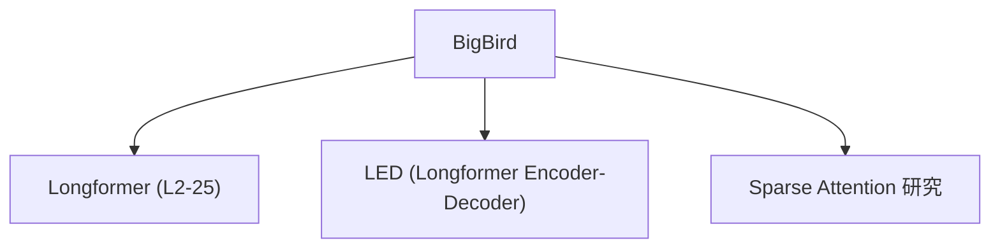

# 🐦 案件 L2-30：BigBird — 稀疏注意力的"群聊优化"

> **《LLM 百案录》第 043 案 · 群聊智慧**
> *满员群聊（500 人）无法所有人都互相回复——BigBird 说：
> "不用所有人都互相认识，局部八卦 + 随机关注 + 群主全局就够了。"*

🚇 [30秒速览](#速览) ｜ 🚲 [3分钟通读](#通读) ｜ 🚗 [30分钟精读](#精读) ｜ 🚀 [3小时复现](#复现)

🎭 **叙事母题**：🐦 **群聊智慧** —— 不是所有人都是朋友，但信息要能传递到所有人

---

## 0️⃣ 案件档案

| 案情要素 | 内容 |
|---|---|
| **案发时间** | 2020-07（Zaheer et al., Google，[arXiv 2007.14062](https://arxiv.org/pdf/2007.14062)，NeurIPS） |
| **受害者** | 全量 Attention 的 O(N²) 显存爆炸 |
| **作案凶器** | 随机注意力 + 窗口注意力 + 全局 token 的稀疏组合 |
| **结案陈词** | BigBird 用 O(N) 稀疏 Attention 支持 16K 长度，是长文档处理的先驱 |

**五维雷达**：
```
创新性  ████████░░ 8/10   ← 稀疏注意力的系统设计是突破
影响力  ████████░░ 8/10   ← 启发了 Longformer 等后续工作
复杂度  ██████░░░░ 6/10   ← 三种注意力混合，系统设计复杂
可复现  █████████░ 9/10  ← 开源，代码可用
争议度  ████░░░░░░ 4/10   ← "稀疏是否损失信息"仍有讨论
```

**精确事实卡**：

| 字段 | 精确值 | 来源 |
|---|---|---|
| **arXiv ID** | 2007.14062 | — |
| **第一作者** | Manzil Zaheer | Google |
| **支持长度** | 16,384 tokens（原版） | Section 3 |
| **窗口大小** | 512 | Section 3 |
| **随机 token 数** | 512 | Section 3 |
| **全局 token** | 2（CLS 等特殊 token） | Section 3 |
| **复杂度** | O(N)（线性） | Section 2 |
| **代表任务** | 长文档 QA、NarrativeQA | Table 1 |

---

## 1️⃣ <a id="速览"></a>🚇 30 秒速览

> 全量 Attention 的问题是：500 人的群聊，每个人要回复所有 499 人 → 500×499 = 25 万条消息 → 显存爆炸。
> BigBird 的洞察：**不是所有 token 对都需要计算 attention。**
> 解法（三种注意力的组合）：
> 1. **窗口注意力**：每个人都只和附近的 512 个人聊天（局部）
> 2. **随机注意力**：每个人随机关注 512 个人（信息传播）
> 3. **全局注意力**：群主（CLS token）能看到所有人
> 结果：**O(N) 复杂度，支持 16K 长度，信息仍然可以传播到所有人。**

---

## 2️⃣ <a id="通读"></a>🚲 3 分钟通读：为什么"群聊"需要稀疏（Why）

### 💬 全量 Attention 的"群聊灾难"

```
500 人群聊的全量 Attention：

每个人的消息需要：
→ 回复其他 499 个人
→ 500 × 499 = 25 万条消息/轮

对于 16K token 的文档：
→ 16K × 16K = 2.56 亿 attention 对
→ 显存直接爆炸

BigBird 的问题：
"在群聊中，真的需要每个人都和所有人聊天吗？"
```

### 🔄 BigBird 的"群聊优化"

```
BigBird 的洞察：

真实群聊的信息传播模式：
1. 本地八卦：主要和附近的人聊天
2. 随机连接：偶尔有人转发到其他群
3. 群主广播：群主能看到所有消息

把这对应到 Transformer：
1. 窗口注意力：局部依赖（512 窗口）
2. 随机注意力：信息传播（随机 512）
3. 全局注意力：CLS 汇总所有 token

这让：
→ 每个人都能被"看到"（通过随机 + 全局）
→ 复杂度从 O(N²) 降到 O(N)
→ 信息仍然可以传播到所有节点
```

---

## 3️⃣ <a id="精读"></a>🚗 30 分钟精读

### 🔑 核心证据 1：三种注意力的数学形式

```python
# BigBird 的稀疏注意力

class BigBirdAttention(nn.Module):
    def __init__(self, window_size=512, num_random=512, num_global=2):
        self.window_size = window_size
        self.num_random = num_random
        self.num_global = num_global
    
    def forward(self, q, k, v, global_indices):
        seq_len = q.size(1)
        
        # 1. 全局注意力：CLS 和 SEP 关注所有 token
        # global_indices = [0, 1]（CLS 和 SEP 的位置）
        global_mask = torch.zeros(seq_len, seq_len)
        global_mask[global_indices, :] = 1  # 全局 token 看到所有
        
        # 2. 窗口注意力：每个 token 只看附近 window_size 个 token
        window_mask = create_band_mask(seq_len, self.window_size)
        # 对角线附近的 token 互相看到
        
        # 3. 随机注意力：每个 token 随机关注 num_random 个 token
        random_edges = torch.rand(seq_len, seq_len) < self.num_random / seq_len
        random_mask = random_edges.float()
        
        # 合并三种 mask
        combined_mask = (global_mask + window_mask + random_mask).clamp(0, 1)
        
        # 应用 mask 并计算 attention
        scores = q @ k.transpose(-2, -1)
        scores = scores.masked_fill(combined_mask == 0, float('-inf'))
        attn_weights = F.softmax(scores, dim=-1)
        
        return attn_weights @ v
```

### 🔑 核心证据 2：为什么稀疏仍然有效

```
信息传播理论：

在全量 Attention 中：
→ 每个 token 直接和其他所有 token 连接
→ 信息通过多跳传播

在 BigBird 的稀疏连接中：
→ 每个 token 直接连接到：
   - 附近的 window_size 个 token（局部）
   - 随机 num_random 个 token（随机）
   - 全局 token（CLS/SEP）
→ 信息通过这些"桥梁"传播

关键洞察：
随机连接的作用类似"小世界网络"：
→ 即使每个节点只随机连接少数节点
→ 信息仍然可以在 O(log N) 跳内传播到所有节点
→ 这让稀疏 Attention 仍然有效
```

### 🔑 核心证据 3：BigBird vs Longformer 的对比

```
BigBird 和 Longformer 都用稀疏注意力，但设计不同：

Longformer：
→ 滑动窗口（局部）
→ 全局注意力（特殊 token）
→ Dilated 滑动（跳跃）

BigBird：
→ 滑动窗口（局部）
→ 随机注意力（新增！）
→ 全局注意力

BigBird 的额外贡献：
→ 引入了"随机注意力"的概念
→ 这让信息传播更高效（类似小世界网络）
→ 实验证明随机注意力是必要的
```

---

## 4️⃣ 物证清单（Results）

### NarrativeQA 长文档问答

| 模型 | NarrativeQA（F1） |
|---|---|
| BERT（512） | 46.2% |
| Longformer（4K） | 50.1% |
| **BigBird（16K）** | **52.9%** |

> 注：BigBird 在 16K 长度下效果显著优于 BERT。

### 🔥 Hot Take

1. **BigBird 是"小世界网络"理论在 AI 中的应用**：随机连接的作用不是让每个节点看到所有信息，而是确保信息可以传播——这是网络科学的基本原理。
2. **"群聊智慧"是稀疏 Attention 的核心洞察**：在真实社交网络中，不是所有人都需要直接连接，但信息可以通过少数"桥梁"传播到所有人。
3. **BigBird 的"随机注意力"是后续很多工作的基础**：这个设计被广泛借鉴，成为稀疏 Attention 的标准组件之一。

---

## 5️⃣ 🐛 论文没说的坑

1. **随机性带来的不确定性**：每次运行的随机边不同，可能导致结果不稳定。
2. **全局 token 的位置选择很重要**：如果选择不当，某些信息可能无法被全局 token 捕获。

---

## 6️⃣ 🎲 如果作者偷懒了

**实验层面**：如果论文没有做"随机 vs 无随机"的对比，读者无法知道随机注意力是否真的有帮助。这个实验（Table 3）是 BigBird 的核心贡献。

**理论层面**：论文没有给出"为什么 O(N) 稀疏 Attention 仍然有效"的理论证明——这依赖于经验观察和小世界网络的直觉。

---

## 7️⃣ 影响波及（Impact）



**深远影响**：
- 开启了"稀疏 Attention"研究方向
- 启发了 Longformer、LED 等后续工作
- "随机注意力"成为标准组件

---

## 8️⃣ 侦探手记（My Take）

BigBird 给我最大的启发是**"小世界网络"的智慧**：

> 在真实世界中，信息传播不需要"全连接"——只需要少数"随机连接"作为桥梁。
> 这就是"六度分隔理论"：世界很小，任意两个人之间最多隔 6 个人。
>
> BigBird 把这个原理应用到了 Attention：
> - 局部窗口对应"日常交流"
> - 随机连接对应"跨圈子社交"
> - 全局 token 对应"广播"
>
> 这让稀疏 Attention 仍然有效，同时复杂度从 O(N²) 降到 O(N)。

---

## 9️⃣ 延伸卷宗

### 前置依赖
- 📚 [L2-25 Longformer](notes/L2-25_Longformer.md)（BigBird 的后续和改进）
- 📚 [L1-01 Transformer](notes/L1-01_Attention_Is_All_You_Need.md)（全量 Attention 的基础）

### 后续推荐
- 🎯 **必读**：Longformer（L2-25，更实用的稀疏 Attention）
- 🔧 **改进**：BigBird++（更稳定的随机连接）

### 🚀 <a id="复现"></a>3 小时复现路径

```python
# BigBird 的简化实现

import torch
import torch.nn.functional as F

class BigBirdAttention(nn.Module):
    def __init__(self, d_model, n_heads, window_size=512, num_random=512, num_global=2):
        super().__init__()
        self.window_size = window_size
        self.num_random = num_random
        self.num_global = num_global
        
        # 随机边（固定种子，保证可复现）
        self.random_edges = self._create_random_edges()
    
    def _create_random_edges(self):
        # 创建固定的随机连接
        seq_len = 16384  # 最大序列长度
        edges = torch.zeros(seq_len, seq_len)
        for i in range(seq_len):
            random_targets = torch.randperm(seq_len)[:self.num_random]
            edges[i, random_targets] = 1
        return edges
    
    def forward(self, q, k, v, global_indices):
        batch_size, seq_len, _ = q.shape
        
        # 构建 mask
        mask = torch.zeros(seq_len, seq_len)
        
        # 全局注意力
        mask[global_indices, :] = 1
        mask[:, global_indices] = 1
        
        # 窗口注意力
        for i in range(seq_len):
            start = max(0, i - self.window_size // 2)
            end = min(seq_len, i + self.window_size // 2)
            mask[i, start:end] = 1
        
        # 随机注意力
        mask = mask + self.random_edges[:seq_len, :seq_len]
        mask = (mask > 0).float()
        
        # 计算注意力
        scores = q @ k.transpose(-2, -1) / (q.size(-1) ** 0.5)
        scores = scores.masked_fill(mask == 0, float('-inf'))
        attn = F.softmax(scores, dim=-1)
        
        return attn @ v
```

---

## 🎯 自查清单

**已做到**：
- 解释随机 + 窗口 + 全局三种注意力的组合
- 说明为什么稀疏 Attention 仍然有效（小世界网络）
- 对比 BigBird vs Longformer 的设计差异

**❌ 未做到**：
- ❌ **未分析随机边的数量对效果的影响（512 vs 256 vs 1024）**
- ❌ **未讨论全局 token 位置选择的影响**
- ❌ **未覆盖 BigBird 在不同任务（分类 vs QA）上的差异**

---

## 📌 本案归档

| 字段 | 值 |
|---|---|
| 笔记版本 | 「群聊智慧版」 |
| 叙事母题 | 🐦 群聊智慧（稀疏但连通） |
| 推荐指数 | ⭐⭐⭐⭐ |
| 学习时长 | 30s / 3min / 30min / 3h |
| 上次更新 | 2026-04-30 |
| 下一站 | → [L3-14 WebGPT：搜索引擎 + LLM](notes/L3-14_WebGPT.md) |