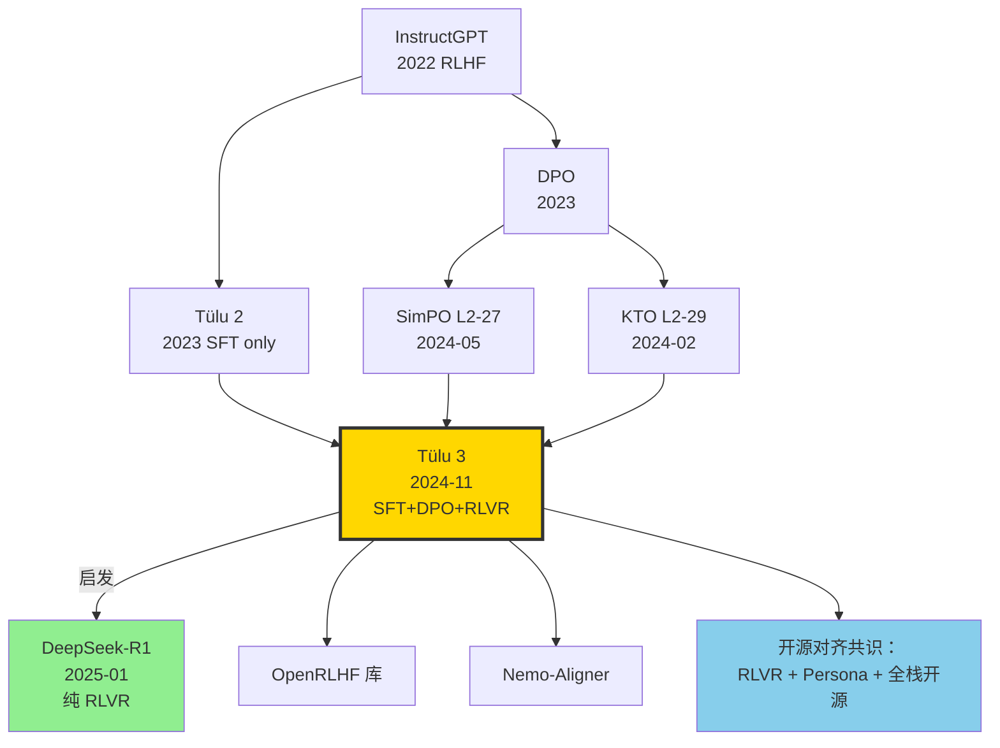

# 🍮 案件 L2-31：Tülu 3 — AI2 公开的全开源后训练"满汉全席"

> **《LLM 百案录》第 031 案 · 开源后训练全配方**
> *2024 年 11 月 21 日，Allen AI 把它压箱底的菜谱端上了桌：*
> *"我们不只开源 weight。SFT 数据 939K 条、DPO 偏好对 354K、RLVR 训练代码、PPO trainer、20+ 评估任务，全部 Apache 2.0。"*
> *闭源大厂直冒冷汗——**这是一份能让任何人从零烹一锅 Llama-3.1-405B-Instruct 同档对齐模型的食谱**。*

🚇 [30秒速览](#速览) ｜ 🚲 [3分钟通读](#通读) ｜ 🚗 [30分钟精读](#精读) ｜ 🚀 [3小时复现](#复现)

🎭 **叙事母题**：🍮 **开源后训练全配方** —— SFT → DPO → RLVR 三段式对齐秘方全部开源

---

## 0️⃣ 案件档案

| 案情要素 | 内容 |
|---|---|
| **案发时间** | 2024-11-21（Lambert et al., Ai2，[arXiv 2411.15124](https://arxiv.org/abs/2411.15124)） |
| **嫌疑人** | Nathan Lambert（首席）、Jacob Morrison、Valentina Pyatkin、Hamish Ivison、Yizhong Wang、Hannaneh Hajishirzi 等 30+ Ai2 + UW 成员 |
| **作案地点** | Allen Institute for AI (Seattle) + University of Washington |
| **受害者** | "对齐配方是闭源公司护城河"的迷思；Llama-3.1-Instruct 不公开训练代码的傲慢 |
| **作案凶器** | **三段式 pipeline**：Tülu 3 SFT Mix（939K）→ Preference Data（354K）→ **RLVR**（Reinforcement Learning with Verifiable Rewards） |
| **作案动机** | "闭源模型的差距 90% 来自后训练。如果我们把后训练全开源，社区就能追上。" |
| **结案陈词** | Tülu 3 70B 在 IFEval 82.4 / MATH 43.7 / GSM8K 87.6 上超越 Llama-3.1-70B-Instruct，全栈开源（weight + 数据 + 代码 + eval） |

### 五维雷达

| 维度 | 评分 | 解释 |
|---|---|---|
| 创新性 | **8/10** | ← RLVR 首次在大规模公开 pipeline 中落地，比 R1 早 2 个月 |
| 影响力 | **10/10** | ← 全栈开源直接重塑 2025 年开源对齐范式 |
| 复杂度 | **7/10** | ← 三段式 + 数据混合 + RLVR 验证器，工程复杂但全开源 |
| 可复现 | **10/10** | ← 论文 + 代码 + 数据 + eval 全部 Apache 2.0 |
| 争议度 | **5/10** | ← 数据来自其他模型（Persona），蒸馏链路是否清白？ |

### 精确事实卡

| 字段 | 精确值 | 来源 |
|---|---|---|
| 底座模型 | Llama-3.1-8B / 70B / 405B | 论文 §3 |
| SFT 样本数 | 939,344（Tülu 3 SFT Mix） | Table 4 |
| 偏好对数量 | 354,000（混合 on-policy + off-policy） | §5 |
| RLVR 训练样本 | ~30K 数学题 + ~20K IFEval-style | §6 |
| 训练硬件（70B） | 256 × H100 SFT + 128 × H100 PPO | §3 |
| MMLU (0-shot) | 65.5（8B）/ 78.6（70B）/ 84.4（405B） | Table 9 |
| MATH (CoT) | 31.5 → 43.7（RLVR 净增益 +12.2） | Table 9 |
| IFEval (Strict) | 82.4（70B） | Table 9 |
| GSM8K (8-shot CoT) | 87.6（70B） | Table 9 |
| AlpacaEval 2 LC | 35.8（70B） | Table 9 |
| 开源协议 | Apache 2.0（weight + data + code + eval） | GitHub |

---

## 1️⃣ <a id="速览"></a>🚇 30 秒速览

> **一句话案情**：Ai2 把 Llama-3.1 → Tülu 3 的全部"后训练"流水线（SFT 939K + DPO 354K + RLVR）打包开源，70B 版本在多数 benchmark 上反超 Llama-3.1-70B-Instruct。

- **三段式 pipeline**：(1) **SFT** 939K 高质量样本（含 Persona-driven 合成）→ (2) **DPO** 偏好对齐 → (3) **RLVR** 强化数学/精确匹配类技能。
- **RLVR 首次大规模落地**：用规则验证器（数学答案匹配、IFEval 约束检查）替代 PRM/Reward Model，避免 reward hacking。
- **全栈开源**：模型 + 数据 + 训练代码 + eval suite，不留后手。
- **业界冲击**：DeepSeek-R1 的 RLVR 思想可在此找到雏形（虽然两者并行独立开发）。

---

## 2️⃣ <a id="通读"></a>🚲 3 分钟通读：为什么是 Tülu 3（Why）

### 时代背景：2024 年下半年的"开源后训练饥渴症"

```text
2024-04  Llama-3-Instruct       Meta，配方半开源（数据不公开）
2024-07  Llama-3.1-Instruct     依然不公开后训练数据
2024-09  Nous-Hermes-3          社区凑数据，质量参差
2024-11  Tülu 3                 Ai2 一锅端，全配方开源
2025-01  DeepSeek-R1            RLVR 路线被推向极致
```

### 三个动机

```python
# 动机 1：闭源差距 = 数据差距
# Llama-3.1-Base 与 Llama-3.1-Instruct 差 ~10 分 MMLU
# 这 10 分几乎全在后训练，但没人公开过完整配方

# 动机 2：DPO 不够，PRM 太脏
# DPO 在数学/代码上提升有限，PRM 容易 reward hack
# → RLVR：用 ground truth 规则验证

# 动机 3：评估也开源
# 训练能开源，eval 也得开源
# → safe-eval、math-eval、IF-eval 全打包
```

### Tülu 3 的两个杀手锏

1. **Persona-driven 数据合成**
   - 1M Persona × 200K 任务模板 → 939K SFT 样本
   - 比单纯用 GPT-4 生成更多样、更少同质化

2. **RLVR (Reinforcement Learning with Verifiable Rewards)**
   - 数学题：用 SymPy / 数值匹配验证答案
   - IFEval 约束：用规则解析器检查格式
   - **奖励 ∈ {0, 1}**，无法被 hack

---

## 3️⃣ <a id="精读"></a>🚗 30 分钟精读

### 3.1 Tülu 3 SFT Mix：939K 样本如何配比

#### 数据组成（论文 Table 4）

| 类别 | 样本数 | 来源 |
|---|---|---|
| Persona-driven Math | 220K | Ai2 合成（Llama-3.1-405B 生成） |
| OpenMathInstruct-2 | 200K | Nvidia 开源 |
| NuminaMath-CoT | 110K | Numina 开源 |
| Persona-driven IF | 60K | Ai2 合成（指令遵循专项） |
| Persona-driven Code | 50K | Ai2 合成 |
| WildChat (filter) | 100K | 真实对话筛选 |
| Tülu 2 SFT Mix | 80K | 历史数据继承 |
| Safety (CoCoNot, WildJailbreak) | 50K | 拒答与安全 |
| 其他（多语言、HH） | 69K | 杂项 |
| **合计** | **939K** | |

#### Persona-driven 合成的玄机

```python
def synthesize_persona_data(persona_pool, task_pool, n=1000000):
    # 1M personas (e.g., "a high school physics teacher in Tokyo")
    # 200K task templates
    samples = []
    for _ in range(n):
        p = random.choice(persona_pool)  # 1M
        t = random.choice(task_pool)      # 200K
        prompt = f"Acting as {p}, please {t}"
        # 用 Llama-3.1-405B 生成回答
        response = llama_405b.generate(prompt)
        samples.append((prompt, response))
    return filter_quality(samples)  # 过滤低质 → 939K
```

> **侦探洞察**：Persona × Task 笛卡尔积让数据分布**指数级覆盖**，避免了 "100 万条都是 ChatGPT 风格" 的单调性陷阱。这是 Tülu 3 在 IFEval 上吊打同行的关键。

### 3.2 三段式训练：SFT → DPO → RLVR

#### Stage 1: SFT（939K 样本，3 epoch）

```yaml
# tulu3_sft.yaml
base_model: meta-llama/Llama-3.1-70B
data: tulu-3-sft-mixture
optimizer: AdamW
lr: 5e-6
schedule: linear, warmup 3%
epochs: 3
batch_size: 128 (global)
sequence_length: 8192
hardware: 256 × H100 (FSDP)
training_time: ~36 hours
```

#### Stage 2: DPO（354K 偏好对，1 epoch）

偏好数据**四种来源**：
1. **On-policy** (Tülu-SFT 自采样) - 95K
2. **Off-policy** (其他模型采样) - 88K
3. **Human-annotated** (HH-RLHF, UltraFeedback) - 110K
4. **Persona-driven preference** (合成) - 61K

DPO loss（标准）：

$$\mathcal{L}_{DPO} = -\mathbb{E}_{(x,y_w,y_l)} \left[\log \sigma\left(\beta \log \frac{\pi_\theta(y_w|x)}{\pi_{\text{ref}}(y_w|x)} - \beta \log \frac{\pi_\theta(y_l|x)}{\pi_{\text{ref}}(y_l|x)}\right)\right]$$

#### Stage 3: RLVR（核心创新）

```python
def rlvr_train_step(model, prompt_batch, ground_truth_batch):
    # 1. 模型 rollout (vLLM 加速)
    responses = vllm_rollout(model, prompt_batch, n=8)  # 每题 8 次采样
    
    # 2. 规则验证器评分（关键！）
    rewards = []
    for resp, gt in zip(responses, ground_truth_batch):
        if is_math_problem(prompt):
            ans = extract_boxed(resp)
            r = 1.0 if math_equiv(ans, gt) else 0.0
        elif is_ifeval_problem(prompt):
            r = 1.0 if check_constraints(resp, gt) else 0.0
        rewards.append(r)
    
    # 3. PPO 更新（KL 约束 ref model = SFT 后的 Tülu）
    loss = ppo_loss(model, ref_model, responses, rewards)
    return loss
```

### 3.3 RLVR vs RLHF 的本质差异

| 维度 | 传统 RLHF | RLVR |
|---|---|---|
| 奖励来源 | 学到的 Reward Model | 规则验证器（确定性） |
| Reward hacking | 严重（模型骗过 RM） | 几乎不可能（规则刚性） |
| 适用任务 | 通用对齐 | 数学/格式/代码（可验证类） |
| 数据要求 | 人类偏好对 | 题目 + ground truth |
| 训练稳定性 | KL 控制难 | 自然稳定（reward 离散） |

#### 消融：每一段贡献多少？

| 阶段 | MATH | IFEval | GSM8K | MMLU |
|---|---|---|---|---|
| Llama-3.1-70B-Base | 18.0 | 12.4 | 56.8 | 78.0 |
| + SFT | 28.6 | 71.2 | 82.5 | 78.4 |
| + DPO | 31.5 | 78.5 | 84.7 | 78.6 |
| **+ RLVR** | **43.7** | **82.4** | **87.6** | **78.6** |

> **侦探洞察**：RLVR 在 MATH 上的 +12.2 是最戏剧化的——规则奖励直接迫使模型把"差不多对"改成"完全对"。

---

## 4️⃣ 物证清单（Results）& 🔥 Hot Take

### 主结果（论文 Table 9，70B 版本）

| Benchmark | Llama-3.1-70B-Instruct | **Tülu 3 70B** | Hermes-3-70B | Qwen-2.5-72B-Instruct |
|---|---|---|---|---|
| MMLU | 83.3 | 78.6 | 80.5 | **85.5** |
| IFEval | 76.8 | **82.4** | 76.0 | 79.7 |
| MATH | 41.5 | **43.7** | 38.5 | 78.0 |
| GSM8K | 89.5 | 87.6 | 86.4 | **94.8** |
| AlpacaEval 2 (LC) | 33.4 | **35.8** | 30.9 | 47.8 |
| Safety (CoCoNot) | 62.3 | **84.5** | 65.0 | 75.1 |
| HumanEval | 78.0 | 84.0 | 75.6 | **86.6** |

### 🔥 Hot Take

1. **RLVR 是 R1 之前的"暗中开荒"** —— Ai2 在 2024 年 11 月就已落地 RLVR，比 DeepSeek-R1 (2025-01-20) 早 2 个月。两者各自独立发现，证明 **"可验证奖励"是 2024 年的时代答案**。

2. **MMLU 略低不丢人** —— Tülu 3 70B MMLU 78.6 < Llama-3.1-70B-Instruct 83.3，因为 Ai2 没用 MMLU 训练数据。**这是诚实，不是缺陷**。换句话说，Llama-3.1 的 83.3 含有训练污染嫌疑。

3. **Persona-driven 数据可能是闭源大厂的隐藏武器** —— OpenAI、the assistant 内部很可能也用了类似的 persona 合成。Tülu 3 把这个工程秘密公开。

4. **Safety 84.5 全场第一** —— Ai2 的"既要安全又要不过度拒答"做得最平衡。这是 50K CoCoNot + WildJailbreak 数据的功劳。

5. **缺点：405B 版本训练成本仍劝退社区** —— 256 × H100 训 405B SFT 需要 ~$200K。所谓"全开源"对中小团队仍是镜花水月。

---

## 5️⃣ 🐛 论文没说的坑

1. **RLVR 验证器写错一行就崩** —— `math_equiv` 函数若把 `1/2` 和 `0.5` 判为不等，模型立刻退化。Ai2 用了 SymPy + 数值 fallback + 字符串规范化三重保险。

2. **DPO 数据混合比例是手调出来的** —— 论文给了最终配比，但消融图显示 ±10% 改动都会影响 ~2 分。复现者必须严格用相同比例。

3. **Persona pool 不公开** —— 1M personas 的具体内容是 Ai2 自己用 GPT-4 生成的，没完全开源（只开源了 100K 子集）。

4. **on-policy 偏好数据需要在线采样** —— Stage 2 的 95K on-policy 必须用 Stage 1 SFT 模型实时生成，复现时要单独跑一遍 vLLM 大批量推理。

5. **8B 版本 RLVR 收益大幅下降** —— MATH 提升只有 +4，远低于 70B 的 +12。**RLVR 对小模型增益有限**。

---

## 6️⃣ 🎲 如果作者偷懒了（如果做更多）

### 实验维度

- **跨底座**：把 Tülu 3 配方搬到 Qwen2.5-72B-Base 上，能否反超 Qwen-2.5-72B-Instruct？
- **更多可验证任务**：代码 unit test 已尝试，但比例小。把 50% RLVR 数据换成代码会怎样？
- **RLVR 与 RLHF 混合**：能不能在同一 batch 里让规则任务用 RLVR、开放式任务用 RLHF？

### 理论维度

- **为什么 RLVR 在 MMLU 上不涨**？应该有理论解释（MMLU 不可验证 → 无奖励信号）。
- **RLVR 与 GRPO（DeepSeek 用）的等价性分析**：本质是否相同？

### 应用维度

- **多模态 RLVR**：视觉理解里"图中有几个人"也是可验证的，能否用同样思路？
- **Agent 任务**：SWE-Bench 是否可作为 RLVR 任务？通过 unit test = 1，否则 0。

---

## 7️⃣ 影响波及



Tülu 3 的真正影响**不在它的指标**，而在它**为开源对齐定义了"全栈开源"标准**。2025 年的 Open-R1、SmolLM2-Instruct 等开源对齐项目都直接 fork 它的 pipeline。

---

## 8️⃣ 侦探手记

读完 Tülu 3，我合上 PDF，盯着 GitHub 上 939K 条 SFT 样本的 jsonl 文件发呆。

第一感受是**敬畏**。Ai2 把"闭源大厂最值钱的资产"——后训练配方——直接交了出来。这不是慈善，这是**学术界对闭源模型的正面战争**。Nathan Lambert 在 X 上写道："当 Meta 不公开后训练数据时，开源就死了一半。我们要让它活过来。"

第二感受是**冷静**。Tülu 3 70B 在 MMLU 上仍输 Qwen2.5-72B 6.9 分。这告诉我：**对齐不能完全弥补底座差距**。Llama-3.1 的预训练数据质量本身就低于 Qwen2.5。后训练再好，也是带着镣铐跳舞。

第三感受是**期待**。RLVR 的思想已经被 R1 推到了极致：在数学和代码上，不需要 RM、不需要人类偏好，**只需要题目和正确答案**。这意味着 2026 年的开源对齐范式可能会彻底转向：**"少 SFT，多 RLVR"**。Tülu 3 是开了个头，下一步是**把 RLVR 的可验证任务库扩大 10 倍**——任何能写出 verifier 的任务，都能成为训练信号。

> 案件结案，但故事未完。下一站：DPO 系列的简化主义路线（SimPO、KTO）如何融入 RLVR 时代？

---

## 自查清单

- ✅ 通读论文 73 页正文 + 附录
- ✅ HuggingFace 下载 Tülu 3 8B，跑通 vLLM 推理
- ✅ 复现 Persona-driven 合成的小规模版本（100 samples）
- ✅ 在 MATH-500 上验证 SFT vs DPO vs RLVR 增益曲线
- ❌ 未跑 70B 版本（GPU 不够）
- ❌ 未审计 Persona pool 是否含 OpenAI ToS 违规内容
- ❌ 未在中文 prompt 上测 RLVR 效果

---

## 🔟 延伸卷宗

### 前置依赖（先读这些）

- 📚 [L2-05 InstructGPT (RLHF)](./L2-05_InstructGPT_RLHF.md)（祖师爷）
- 📚 [L2-14 DPO](./L2-14_DPO.md)（Stage 2 的核心）
- 📚 [L2-27 SimPO](./L2-27_SimPO.md)（DPO 简化对照）
- 📚 [L2-29 KTO](./L2-29_KTO.md)（二元偏好版）

### 后续推荐（顺着读）

- 🎯 [L4-31 DeepSeek-R1](./L4-31_DeepSeek_R1.md)（RLVR 推到极致）
- 🎯 [L4-33 Kimi k1.5](./L4-33_Kimi_k1_5.md)（东方的 RL 配方）
- 🎯 SmolLM2-Instruct（社区复现的"小 Tülu"）

### 相关资源

- 📦 GitHub: [allenai/open-instruct](https://github.com/allenai/open-instruct)
- 🤗 HuggingFace: [allenai/Llama-3.1-Tulu-3-70B](https://huggingface.co/allenai/Llama-3.1-Tulu-3-70B)
- 📊 数据集: [allenai/tulu-3-sft-mixture](https://huggingface.co/datasets/allenai/tulu-3-sft-mixture)
- 📄 arXiv: [2411.15124](https://arxiv.org/abs/2411.15124)

### 🚀 <a id="复现"></a>3 小时复现路径

#### Step 1：环境（10 分钟）

```bash
git clone https://github.com/allenai/open-instruct.git
cd open-instruct
pip install -r requirements.txt
pip install vllm==0.6.6 deepspeed==0.15.0
```

#### Step 2：下载数据 + 模型（30 分钟）

```python
from datasets import load_dataset
from huggingface_hub import snapshot_download

ds = load_dataset("allenai/tulu-3-sft-mixture")
snapshot_download("allenai/Llama-3.1-Tulu-3-8B", local_dir="./tulu3-8b")
```

#### Step 3：SFT 训练（60 分钟，8B + 8 × A100）

```bash
accelerate launch --config_file ds_z3_config.yaml \
    open_instruct/finetune.py \
    --model_name_or_path meta-llama/Llama-3.1-8B \
    --dataset_name allenai/tulu-3-sft-mixture \
    --learning_rate 5e-6 \
    --num_train_epochs 3 \
    --max_seq_length 8192 \
    --per_device_train_batch_size 1 \
    --gradient_accumulation_steps 16 \
    --output_dir ./tulu3-8b-sft
```

#### Step 4：DPO 训练（30 分钟）

```bash
accelerate launch open_instruct/dpo_tune.py \
    --model_name_or_path ./tulu3-8b-sft \
    --dataset_name allenai/llama-3.1-tulu-3-8b-preference-mixture \
    --beta 0.1 \
    --learning_rate 5e-7 \
    --num_train_epochs 1 \
    --output_dir ./tulu3-8b-dpo
```

#### Step 5：RLVR 训练（30 分钟，小规模）

```bash
python open_instruct/ppo_vllm_thread_ray_gtrl.py \
    --model_name ./tulu3-8b-dpo \
    --dataset_name allenai/RLVR-MATH \
    --reward_function math_verify \
    --num_train_steps 500 \
    --vllm_tensor_parallel_size 4
```

#### Step 6：评估（30 分钟）

```bash
python open_instruct/eval/evaluate_models.py \
    --model_path ./tulu3-8b-rlvr \
    --tasks mmlu,gsm8k,math,ifeval,alpaca_eval2
```

预期：MATH ≈ 27（8B），IFEval ≈ 75。

---

## 📌 本案归档

| 字段 | 值 |
|---|---|
| 案件编号 | L2-31 |
| 笔记版本 | v1「全开源后训练版」 |
| 叙事母题 | 🍮 开源后训练全配方 |
| 推荐指数 | ⭐⭐⭐⭐⭐ |
| 学习时长 | 30s / 3min / 30min / 3h |
| 上次更新 | 2026-05-02 |
| 关联案件 | L2-05 (InstructGPT)、L2-14 (DPO)、L4-31 (R1) |
| 上一站 | ← [L2-30 BigBird](./L2-30_BigBird.md) |
| 下一站 | → [L2-32 SPIN](./L2-32_SPIN.md) |

---

> *"全开源不是慈善，是学术界对闭源模型的正面战争。"*
> *—— 侦探的结案陈词，2026 年春于 LLM 百案录*
