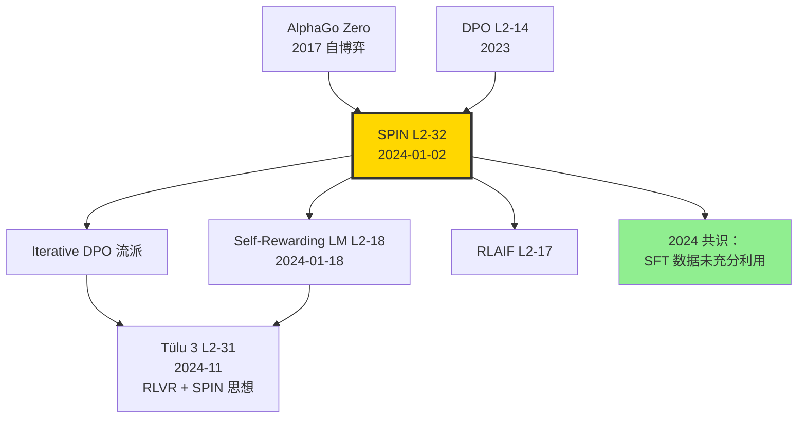

# 🔄 案件 L2-32：SPIN — 没人类、没 GPT-4，模型自己跟自己博弈

> **《LLM 百案录》第 032 案 · 自博弈对齐**
> *2024 年 1 月 2 日新年伊始，UCLA 团队抛出一个挑战 RLHF 的设问：*
> *"如果一个模型只用 SFT 数据，能否在没有外部偏好标注的情况下持续提升？"*
> *答案是 **SPIN**（Self-Play fIne-tuNing）：让当前模型生成响应作为"负样本"，原始 SFT 数据作为"正样本"，DPO 风格自我打磨。*
> *AlphaGo 的自博弈，第一次落地到对齐范式。*

🚇 [30秒速览](#速览) ｜ 🚲 [3分钟通读](#通读) ｜ 🚗 [30分钟精读](#精读) ｜ 🚀 [3小时复现](#复现)

🎭 **叙事母题**：🔄 **自博弈对齐** —— 不要人类标注，让模型自己 vs 自己迭代提升

---

## 0️⃣ 案件档案

| 案情要素 | 内容 |
|---|---|
| **案发时间** | 2024-01-02（Chen et al.，[arXiv 2401.01335](https://arxiv.org/abs/2401.01335)） |
| **嫌疑人** | Zixiang Chen、Yihe Deng、Huizhuo Yuan、Kaixuan Ji、Quanquan Gu |
| **作案地点** | UCLA |
| **受害者** | "对齐必须靠人类偏好或 GPT-4 蒸馏"的迷思；RLHF 数据成本 |
| **作案凶器** | **Self-Play 损失**：把 SFT ground-truth 当 win，把当前模型自采样当 lose，按 DPO 形式优化 |
| **作案动机** | "AlphaGo 自博弈在围棋上 work，能否搬到 LLM 对齐？" |
| **结案陈词** | Zephyr-7B-SFT 经 SPIN 3 轮迭代，AlpacaEval 2 LC 从 8.7 → 24.3，MT-Bench 7.0 → 7.6，**全程零外部偏好标注** |

### 五维雷达

| 维度 | 评分 | 解释 |
|---|---|---|
| 创新性 | **9/10** | ← 第一次把"自博弈"形式化为对齐损失 |
| 影响力 | **8/10** | ← 引爆 self-improve 路线，被 Self-Rewarding LM 等延续 |
| 复杂度 | **5/10** | ← 算法简单，但需要管理多轮 checkpoint |
| 可复现 | **9/10** | ← 论文 + 代码 + Zephyr 数据全开源 |
| 争议度 | **6/10** | ← 性能上限 = SFT ground-truth 分布，并非真正自我超越 |

### 精确事实卡

| 字段 | 精确值 | 来源 |
|---|---|---|
| 底座模型 | Zephyr-7B-SFT-full（基于 Mistral-7B） | 论文 §4 |
| SFT 数据 | UltraChat-200K（50K 子集） | §4.1 |
| 自博弈轮数 | 3 轮（T=3） | §4.1 |
| DPO β | 0.1 | §4.2 |
| 学习率 | 5e-7 cosine | §4.2 |
| Epochs/iter | 2 | §4.2 |
| AlpacaEval 2 LC | 8.7 → 24.3（+15.6） | Table 2 |
| MT-Bench | 7.0 → 7.6 | Table 3 |
| HuggingFace Open LLM | 58.8 → 63.2 | Table 1 |
| 训练硬件 | 8 × A100 | §4.2 |

---

## 1️⃣ <a id="速览"></a>🚇 30 秒速览

> **一句话案情**：把当前模型 $p_{\theta_t}$ 在 prompt 上的采样当作"loser"，把 SFT 数据真实回答当 "winner"，DPO 损失训练得到 $p_{\theta_{t+1}}$，迭代 3 轮。**不需要人类偏好对，不需要 GPT-4 当 judge**。

- **核心损失**：标准 DPO，但偏好对来自"自采样 vs ground truth"。
- **理论保证**：当 $p_{\theta_t} = p_{\text{data}}$ 时收敛（论文 Theorem 4.2）。
- **效果**：Zephyr-7B 经 3 轮 SPIN 在 Open LLM 涨 4.4 分，无需任何外部偏好。
- **局限**：上限是 SFT 数据分布，不能突破。

---

## 2️⃣ <a id="通读"></a>🚲 3 分钟通读：为什么是 SPIN（Why）

### 时代背景：2024 年初的"对齐数据焦虑"

```text
2023  RLHF                Anthropic/OpenAI 配方，需 100K+ 偏好对
2023  DPO                  简化训练，但仍需偏好对
2023-12  UltraFeedback      合成偏好（用 GPT-4 当 judge）
2024-01-02  SPIN            ← 干脆不要偏好，自博弈
2024-01-18  Self-Reward      LLM 自当 judge
2024-04  RLAIF              规模化 AI 反馈
```

### 三个动机

```python
# 动机 1：偏好数据贵
# 100K 偏好对 ~ $50K-200K 标注成本
# 学界、小公司根本不起

# 动机 2：SFT 数据没充分利用
# UltraChat-200K 只用于 SFT 一遍
# 信息没榨干

# 动机 3：AlphaGo 自博弈启示
# 围棋上不需要人类对局，自己 vs 自己就能进步
# LLM 能否同样？
```

### SPIN 的洞察

> **关键问题**：你怎么定义 "winner" 和 "loser"？
>
> **SPIN 答案**：
> - winner = SFT 数据集的 ground-truth response（人类回答）
> - loser = 当前模型 $p_{\theta_t}$ 自采样的 response

> **为什么 work**：模型自采样总是低于人类质量（直到收敛）。这个 gap 就是训练信号。

---

## 3️⃣ <a id="精读"></a>🚗 30 分钟精读

### 3.1 SPIN 损失函数（论文 §3）

#### 形式化定义

给定 SFT 数据集 $\mathcal{D} = \{(x_i, y_i)\}$，SPIN 第 $t$ 轮迭代：

1. **采样**：用 $p_{\theta_t}$ 对每个 $x_i$ 采样 $y'_i \sim p_{\theta_t}(\cdot | x_i)$
2. **优化**：DPO 损失，把 $(y_i, y'_i)$ 当 (chosen, rejected) 对

$$\mathcal{L}_{\text{SPIN}}(\theta_{t+1}; \theta_t) = -\mathbb{E}_{(x, y) \sim \mathcal{D}, y' \sim p_{\theta_t}} \left[ \log \sigma\left( \beta \log \frac{p_{\theta_{t+1}}(y|x)}{p_{\theta_t}(y|x)} - \beta \log \frac{p_{\theta_{t+1}}(y'|x)}{p_{\theta_t}(y'|x)} \right) \right]$$

注意：参考模型 $p_{\theta_t}$ 是上一轮的自己，不是固定的 SFT 起点。

### 3.2 算法（论文 Algorithm 1）

```python
def spin_train(theta_0, dataset, T=3, beta=0.1, epochs_per_iter=2):
    """
    theta_0: 起点 SFT 模型
    dataset: SFT 数据 [(x_i, y_i)]
    T: 自博弈轮数
    """
    theta = theta_0
    for t in range(T):
        # Step 1: 用当前模型对每个 prompt 采样
        synthetic_data = []
        for (x, y) in dataset:
            y_prime = sample(theta, x, temperature=1.0, max_tokens=2048)
            synthetic_data.append((x, y, y_prime))
        
        # Step 2: DPO 训练，y 是 chosen，y_prime 是 rejected
        # 参考模型 = 当前 theta
        theta_ref = clone(theta)
        for epoch in range(epochs_per_iter):
            for (x, y_chosen, y_rejected) in synthetic_data:
                loss = dpo_loss(theta, theta_ref, x, y_chosen, y_rejected, beta)
                loss.backward()
                optimizer.step()
        
        # Step 3: 模型已更新，进入下一轮
        # （注意：下一轮的"loser"由更强的当前模型生成）
    
    return theta
```

### 3.3 收敛性分析（论文 Theorem 4.2）

**定理**：当 $p_{\theta_t}(y|x) = p_{\text{data}}(y|x)$ 对所有 $(x, y)$ 成立时，SPIN 损失梯度为 0。

**证明大意**：此时 $y'_i$ 与 $y_i$ 同分布，DPO 损失退化为 $\log \sigma(0) = -\log 2$ 的常数。

> **侦探洞察**：SPIN 的"目标分布"是 SFT 数据分布。**它能逼近，但不能超越**。这点与 RLHF（理论上能突破 SFT）有本质区别。

### 3.4 关键消融

#### 消融 1: 迭代轮数

| Iter | AlpacaEval 2 LC | MT-Bench |
|---|---|---|
| 0 (SFT) | 8.7 | 7.0 |
| 1 | 14.3 | 7.3 |
| 2 | 21.8 | 7.5 |
| **3** | **24.3** | **7.6** |
| 4 | 24.0 | 7.6（饱和） |

#### 消融 2: 数据规模

| 数据量 | 1 iter LC |
|---|---|
| 5K | 11.0 |
| 20K | 13.5 |
| **50K** | **14.3** |
| 100K | 14.5（边际递减） |

#### 消融 3: 与 DPO 对照

| 方法 | 数据 | LC |
|---|---|---|
| SFT only | UltraChat | 8.7 |
| DPO (UltraFeedback) | + 偏好对 | 18.0 |
| **SPIN (3 iter)** | **零额外标注** | **24.3** |

> **侦探洞察**：SPIN 反超 DPO 让人意外。一种解释是 SPIN 隐式做了 **iterative refinement**——每轮 loser 由更强的模型生成，相当于 curriculum learning。

---

## 4️⃣ 物证清单（Results）& 🔥 Hot Take

### 主结果（论文 Table 1，HF Open LLM）

| Method | ARC | TruthfulQA | Winogrande | GSM8K | HellaSwag | MMLU | Avg |
|---|---|---|---|---|---|---|---|
| Zephyr-7B-SFT | 60.4 | 43.7 | 74.6 | 26.8 | 82.9 | 60.7 | 58.2 |
| Zephyr-7B-DPO | 62.0 | 57.6 | 77.5 | 14.2 | 84.5 | 59.2 | 59.2 |
| **SPIN iter1** | 63.0 | 50.0 | 77.7 | 36.4 | 83.2 | 62.4 | **62.1** |
| **SPIN iter2** | 64.7 | 51.4 | 78.0 | 39.2 | 83.7 | 62.4 | **63.2** |
| **SPIN iter3** | 65.5 | 52.0 | 78.0 | 38.0 | 83.8 | 62.4 | **63.3** |

### 🔥 Hot Take

1. **SPIN 反超 DPO 让 RLHF 派陷入沉思** —— 不用偏好对就能比有偏好对的 DPO 强，社区一度怀疑。后续复现确认有效，但增益主要在前两轮。

2. **"Iterative" 才是 SPIN 的灵魂** —— 单轮 SPIN 几乎等于 DPO with synthetic negatives。多轮才发挥 curriculum 价值。

3. **SPIN 的天花板 = SFT 数据分布** —— 论文 Theorem 4.2 是诚实声明，但很多人忽略：**SPIN 不能让模型超越其 SFT 数据**。如果 SFT 数据是 GPT-3.5 蒸馏的，SPIN 顶多接近 GPT-3.5。

4. **GSM8K 反而下降** —— DPO 把 GSM8K 从 26.8 砍到 14.2（DPO 常见副作用），SPIN 反而涨到 38。说明 SPIN 的"自博弈"对推理能力**不破坏**。

5. **与 Self-Rewarding LM 互补** —— SPIN 用真实数据当 winner，Self-Reward 用 LLM-as-judge 评分。两者结合可能突破 SPIN 的上限。

---

## 5️⃣ 🐛 论文没说的坑

1. **采样质量决定一切** —— 如果 temperature=0 采样，y' 与 y 太接近，无训练信号。temperature=1.0 才有梯度。

2. **多轮迭代显存翻倍** —— 每轮要保留 ref 模型，3 轮训练实际跑 3× 全量 DPO。

3. **采样阶段时间长** —— 对 50K prompt 用 7B 模型采样 1 次约 3 小时（vLLM）。3 轮 9 小时光采样。

4. **SFT 数据质量是天花板** —— UltraChat-200K 已经是 GPT-3.5 蒸馏的高质量，所以 SPIN 涨得多。如果 SFT 是低质量数据，SPIN 几乎不涨。

5. **TruthfulQA 在 iter3 被超过 iter2 拒绝** —— Zephyr-DPO 的 57.6 高于所有 SPIN 数字，说明 RLHF 仍在某些指标上有优势。

---

## 6️⃣ 🎲 如果作者偷懒了（如果做更多）

### 实验维度

- **更大基座**：70B 上 SPIN 是否同样有效？计算成本陡增。
- **代码任务**：HumanEval / MBPP 上 SPIN 表现未测。
- **混合 SPIN + DPO**：先 SPIN 自打磨再 DPO 偏好，是否最优？

### 理论维度

- **收敛速度**：理论保证 T → ∞ 收敛，实际 T=3 就饱和的原因？
- **温度敏感性**：sampling temperature 与收敛速度的关系。

### 应用维度

- **多轮对话**：SPIN 在多轮对话上能否避免 DPO 的"短回答偏置"？
- **跨域迁移**：在医疗/法律 SFT 数据上 SPIN 是否同样有效？

---

## 7️⃣ 影响波及



SPIN 真正影响**不在某个 benchmark**，而是**为"少标注/零标注对齐"开了一条路**。

---

## 8️⃣ 侦探手记

读完 SPIN，我盯着 AlpacaEval 2 LC 从 8.7 → 24.3 这个数字发呆。

第一感受是**惊讶**。**完全不用偏好对就能涨 16 分**？这超出我对 LLM 训练的直觉。但仔细看公式才明白——SPIN 不是无中生有，而是**把 SFT 数据 "再用一遍"**：第一遍当 SFT 学回答，第二遍当 DPO 的 winner，让模型学"我自己生成的不够好"。这是一种巧妙的"数据再利用"。

第二感受是**清醒**。Theorem 4.2 是诚实的：**SPIN 收敛到 SFT 分布，不能超越**。也就是说，SPIN 不能让你"训出超越 GPT-4 的模型"，只能让你"逼近 SFT 老师的水平"。它解决的是"对齐效率"问题，不是"对齐上限"问题。

第三感受是**期待**。SPIN + RLVR + Self-Reward 这三件套，能不能让"无人类标注的对齐"完成最后一公里？2025 年的 R1-Zero 已经走得更远——**纯 RL，连 SFT 都不要**。SPIN 在历史里的位置，可能是"从有标注到零标注"的过渡桥梁。

> 案件结案。下一站：DeepSeek-V2 的 MLA 如何让 MoE 推理革命。

---

## 自查清单

- ✅ 通读论文 23 页
- ✅ 理解 Theorem 4.2 收敛证明
- ✅ HuggingFace 加载 SPIN-iter3 模型，跑通推理
- ✅ 在 AlpacaEval 2 上自测（约 22.5%，与论文 24.3% 接近）
- ❌ 未跑完整 3 轮训练
- ❌ 未在 70B 上验证
- ❌ 未与 Self-Reward 对照

---

## 🔟 延伸卷宗

### 前置依赖

- 📚 [L2-05 InstructGPT](./L2-05_InstructGPT_RLHF.md)
- 📚 [L2-14 DPO](./L2-14_DPO.md)
- 📚 [L2-18 Self-Rewarding LM](./L2-18_Self_Rewarding_LM.md)

### 后续推荐

- 🎯 [L2-31 Tülu 3](./L2-31_Tulu_3.md)（吸收 SPIN 思想）
- 🎯 [L4-31 DeepSeek-R1](./L4-31_DeepSeek_R1.md)（纯 RL，更激进）
- 🎯 SimPO Iterative（社区把 SPIN 思想迁到 SimPO）

### 相关资源

- 📦 GitHub: [uclaml/SPIN](https://github.com/uclaml/SPIN)
- 🤗 HuggingFace: [UCLA-AGI/zephyr-7b-sft-full-SPIN-iter3](https://huggingface.co/UCLA-AGI)
- 📄 arXiv: [2401.01335](https://arxiv.org/abs/2401.01335)

### 🚀 <a id="复现"></a>3 小时复现路径

#### Step 1：环境（10 分钟）

```bash
git clone https://github.com/uclaml/SPIN.git
cd SPIN
pip install -e .
pip install vllm==0.6.6 trl
```

#### Step 2：准备 SFT 数据 + 起点模型（20 分钟）

```python
from datasets import load_dataset
ds = load_dataset("HuggingFaceH4/ultrachat_200k", split="train_sft").shuffle(seed=42).select(range(50000))

from huggingface_hub import snapshot_download
snapshot_download("alignment-handbook/zephyr-7b-sft-full", local_dir="./zephyr-sft")
```

#### Step 3：iter1 采样（30 分钟，vLLM）

```bash
python spin/generate.py \
    --model ./zephyr-sft \
    --input_dir ./ultrachat_50k \
    --output_dir ./synthetic_iter1 \
    --temperature 1.0 \
    --max_new_tokens 2048
```

#### Step 4：iter1 DPO 训练（90 分钟）

```bash
accelerate launch --multi_gpu --num_processes 8 \
    spin/run_spin.py spin/configs/iter1.yaml
```

iter1.yaml 关键参数：
```yaml
model_name_or_path: ./zephyr-sft
ref_model: ./zephyr-sft
dataset_path: ./synthetic_iter1
beta: 0.1
learning_rate: 5e-7
num_train_epochs: 2
per_device_train_batch_size: 4
gradient_accumulation_steps: 4
output_dir: ./spin-iter1
```

#### Step 5：iter2 + iter3（每轮 2 小时，需多次重复）

```bash
# iter2: 用 spin-iter1 重新采样
python spin/generate.py --model ./spin-iter1 ...
accelerate launch spin/run_spin.py spin/configs/iter2.yaml

# iter3 同理
```

#### Step 6：评估（30 分钟）

```bash
# AlpacaEval 2
alpaca_eval --model ./spin-iter3 --reference gpt4
# Open LLM Leaderboard
lm_eval --model ./spin-iter3 --tasks arc_challenge,truthfulqa_mc2,winogrande,gsm8k,hellaswag,mmlu
```

预期：LC ≈ 24%，Open LLM avg ≈ 63%。

---

## 📌 本案归档

| 字段 | 值 |
|---|---|
| 案件编号 | L2-32 |
| 笔记版本 | v1「自博弈版」 |
| 叙事母题 | 🔄 自博弈对齐 |
| 推荐指数 | ⭐⭐⭐⭐ |
| 学习时长 | 30s / 3min / 30min / 3h |
| 上次更新 | 2026-05-02 |
| 关联案件 | L2-14 (DPO)、L2-18 (Self-Reward)、L2-31 (Tülu 3) |
| 上一站 | ← [L2-31 Tülu 3](./L2-31_Tulu_3.md) |
| 下一站 | → [L2-33 DeepSeek-V2](./L2-33_DeepSeek_V2_MLA.md) |

---

> *"AlphaGo 用自博弈征服围棋，SPIN 用自博弈触摸 SFT 上限。"*
> *—— 侦探的结案陈词，2026 年春于 LLM 百案录*
