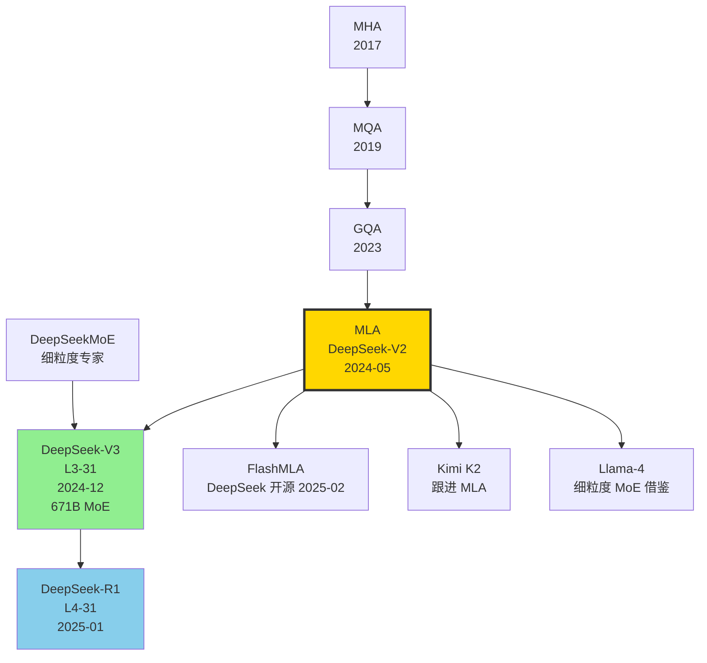

# 🗝️ 案件 L2-33：DeepSeek-V2 — 用低秩潜在向量"偷工减料"的多头注意力

> **《LLM 百案录》第 033 案 · 多头潜在注意力**
> *2024 年 5 月 7 日，DeepSeek 在杭州办公室扔出 236B MoE 模型，附带一张惊人的图：*
> *KV cache 比 Llama-2-70B 小 93.3%，生成吞吐高 5.76 倍。*
> *秘方只有四个字母：**MLA**——Multi-head Latent Attention。*
> *论文里那一段低秩联合压缩公式，后来被业界称为"transformer 显存战争的终结者"。*

🚇 [30秒速览](#速览) ｜ 🚲 [3分钟通读](#通读) ｜ 🚗 [30分钟精读](#精读) ｜ 🚀 [3小时复现](#复现)

🎭 **叙事母题**：🗝️ **多头潜在注意力** —— 用压缩的 KV-latent 解开 MHA 显存枷锁

---

## 0️⃣ 案件档案

| 案情要素 | 内容 |
|---|---|
| **案发时间** | 2024-05-07（DeepSeek-AI，[arXiv 2405.04434](https://arxiv.org/abs/2405.04434)） |
| **嫌疑人** | DeepSeek-AI 全员（首署 DeepSeek-AI 集体），梁文锋、雷英杰、朱晗等 100+ 人 |
| **作案地点** | 深度求索（杭州） |
| **受害者** | GQA / MQA 妥协式 KV 压缩；MoE 推理显存瓶颈 |
| **作案凶器** | **MLA**（KV 联合低秩压缩）+ **DeepSeekMoE**（细粒度专家 + 共享专家）+ **Decoupled RoPE** |
| **作案动机** | "我们想训 236B 参数 MoE 模型，但 KV cache 装不下 128K 上下文。怎么办？把 KV 压缩到极限。" |
| **结案陈词** | DeepSeek-V2：236B 总 / 21B 激活，**KV cache 减少 93.3%**，**生成吞吐 ×5.76**，MMLU 78.5（持平 Llama-3-70B），训练成本仅 V1 的 42.5% |

### 五维雷达

| 维度 | 评分 | 解释 |
|---|---|---|
| 创新性 | **10/10** | ← MLA 是 GQA 之后第一个真正本质上不同的 KV 压缩方案 |
| 影响力 | **10/10** | ← V3、R1 都建立在 MLA 之上，催生整个"低秩注意力"流派 |
| 复杂度 | **8/10** | ← Decoupled RoPE + absorb 技巧，工程门槛不低 |
| 可复现 | **9/10** | ← 模型 + 论文公式齐全，HF 已 mainline 支持 |
| 争议度 | **3/10** | ← 公式优雅，效果数字干净，几乎无争议 |

### 精确事实卡

| 字段 | 精确值 | 来源 |
|---|---|---|
| 总参数 | 236B | 论文 §1 |
| 激活参数 | 21B | §1 |
| 专家数 | 160 routed + 2 shared | §3.2 |
| Top-K 路由 | top-6（routed） + 2 shared | §3.2 |
| 训练 tokens | 8.1T（中英 60:40） | §4.1 |
| 上下文长度 | 128K（YaRN 扩展） | §4.5 |
| Layer × Hidden | 60 × 5120 | §3.1 |
| 注意力头 | 128 heads | §3.1 |
| MLA: KV 压缩维 | $d_c$ = 512（vs MHA 16384） | §3.1 |
| MLA: query 压缩维 | $d_c'$ = 1536 | §3.1 |
| 解耦 RoPE 维度 | $d_h^R$ = 64 | §3.1 |
| KV cache 减少 | 93.3% vs MHA | Table 1 |
| 生成吞吐 | 5.76× vs DeepSeek-V1 | Table 1 |
| MMLU | 78.5 | Table 6 |
| 训练成本 | 42.5% of V1（每 1T tokens） | §1 |

---

## 1️⃣ <a id="速览"></a>🚇 30 秒速览

> **一句话案情**：把每个 token 的 KV 压缩成一条 512 维的"潜在向量"，推理时再投影回多头空间。KV cache 缩 14×，但效果不掉反升。

- **MLA 核心**：$c_t^{KV} = W^{DKV} h_t$（512 维潜在），存储这个潜在向量代替 K、V 双份头矩阵。
- **Decoupled RoPE**：因为 RoPE 不能与低秩联合压缩交换次序，于是把每头切出 64 维"RoPE-only"通道。
- **Absorb 技巧**：推理时把 $W^{UK}$, $W^{UV}$ 提前融合进 attention 投影，**完全避开 up-projection 计算**。
- **DeepSeekMoE**：160 个细粒度专家 + 2 共享专家，比 Mixtral 8×7B 的 8 大专家更精细。

---

## 2️⃣ <a id="通读"></a>🚲 3 分钟通读：为什么是 DeepSeek-V2（Why）

### 时代背景：2024 年的"KV cache 战争"

```text
2017  MHA              16K KV/token (per layer @ 7B)
2019  MQA              8× 压缩，性能掉
2023  GQA              4× 压缩，平衡点
2024-05  MLA           93% 压缩，性能反升  ←
2024-07  Llama-3 GQA   仍走老路
```

### 三个动机

```python
# 动机 1：MoE 推理显存瓶颈
# 236B MoE 已经吃掉 ~470GB 显存（FP16）
# 128K context × 60 layers × 128 heads × 128 dim × 2 (K/V) × 2 (FP16)
# = 38GB KV cache per request
# → 一张 H100 只能服务 1 个用户

# 动机 2：GQA 不够极限
# GQA-8 仅 8× 压缩，KV cache 仍 4.7GB
# 想在 128 H100 节点上服务 1000+ 并发，需要 100× 压缩

# 动机 3：MQA 性能掉得太多
# MQA 1× 头共享，CommonSenseQA 平均掉 2-3 分
# 需要找到"压缩极限 + 性能保住"的新设计
```

### MLA 的灵感

> **观察**：每层每头的 K、V 表示其实**高度相关**——它们都是同一个 hidden state 的线性变换。能不能让 K 和 V 共享一个低秩潜在向量？

---

## 3️⃣ <a id="精读"></a>🚗 30 分钟精读

### 3.1 MLA 核心数学（论文 §3.1 重写）

#### 标准 MHA 回顾

$$\mathbf{q}_t = W^Q h_t, \quad \mathbf{k}_t = W^K h_t, \quad \mathbf{v}_t = W^V h_t$$

$$\text{KV cache size per token} = 2 \cdot n_h \cdot d_h \cdot \text{layers}$$

对 V2：$2 \times 128 \times 128 \times 60 = 1{,}966{,}080$ scalars/token

#### MLA：低秩联合压缩

```python
# Step 1: 把 hidden 投影到压缩潜在空间
c_kv = W_DKV @ h_t       # shape: (d_c=512,)

# Step 2: 推理时只缓存 c_kv（512 维）
# KV cache size: 1 × 512 × 60 = 30,720 scalars/token
# 比 MHA 小 64× （仅指 cache，未含 RoPE 维）

# Step 3: 用时再 up-project 还原 K、V
k_t = W_UK @ c_kv          # (n_h × d_h,)
v_t = W_UV @ c_kv          # (n_h × d_h,)

# Step 4: 同样压缩 query
c_q = W_DQ @ h_t           # (d_c'=1536,)
q_t = W_UQ @ c_q
```

#### 公式形式（论文 Eq. 1-7）

$$\boxed{c_t^{KV} = W^{DKV} \mathbf{h}_t}$$

$$\mathbf{k}_t^C = W^{UK} c_t^{KV}, \quad \mathbf{v}_t^C = W^{UV} c_t^{KV}$$

> **侦探洞察**：MLA 不是"压缩 K"，也不是"压缩 V"，是**联合压缩 (K, V) 到一个共享潜在向量**。这是 MLA 与 LoRA、PEFT 的本质区别——LoRA 是参数压缩，MLA 是激活压缩。

### 3.2 Decoupled RoPE：MLA 必须解决的"位置编码难题"

#### 问题

RoPE 给每个头独立施加位置旋转：

$$\mathbf{q}_t^R = \text{RoPE}(\mathbf{q}_t, t), \quad \mathbf{k}_t^R = \text{RoPE}(\mathbf{k}_t, t)$$

但 RoPE 不能与低秩压缩交换次序：

$$\text{RoPE}(W^{UK} c_t^{KV}, t) \neq W^{UK} \text{RoPE}(c_t^{KV}, t)$$

这意味着如果你把 RoPE 套在 $c_t^{KV}$ 上，up-projection 之后位置信息就乱了。

#### 解决方案：解耦 RoPE 通道

```python
# 每头 d_h = 128 切成两段：
# d_h^C = 64  ← 经过 MLA 联合压缩
# d_h^R = 64  ← 独立保留 RoPE-only 通道

# K 的两段
k_t_compressed = W_UK @ c_kv          # (n_h, 64) - no RoPE
k_t_rope = RoPE(W_KR @ h_t, t)         # (n_h, 64) - with RoPE
k_t = concat([k_t_compressed, k_t_rope], dim=-1)  # (n_h, 128)

# Q 的两段
q_t_compressed = W_UQ @ c_q
q_t_rope = RoPE(W_QR @ c_q, t)
q_t = concat([q_t_compressed, q_t_rope], dim=-1)
```

#### 完整 KV cache（含 RoPE 通道）

每个 token 缓存：
- $c_t^{KV}$：512 维（共享）
- $k_t^R$：64 维（每层共享一份，所有头同样的 RoPE 嵌入）

总计：$(512 + 64) \times 60 = 34{,}560$ scalars/token

vs MHA 1,966,080 → **减少 98.2%**（论文报 93.3% 是对比 GQA-8）

### 3.3 Absorb 技巧：推理时连 up-projection 都省

```python
# 朴素：先 up-project 再算 attention
k_t = W_UK @ c_kv  # 计算量大
score = q_t @ k_t.T

# 优化（吸收 W_UK 进 q_t 的投影）
# score = q_t @ k_t.T = q_t @ (W_UK @ c_kv).T = (q_t @ W_UK) @ c_kv.T
W_UQ_absorbed = W_UQ.transpose(...) @ W_UK  # 预计算
q_absorbed = W_UQ_absorbed @ c_q
score = q_absorbed @ c_kv.T  # 只与 c_kv 交互，不展开 K
```

> **侦探洞察**：Absorb 让推理时**完全不需要把 KV 还原成完整尺寸**，attention 直接在 512 维潜在空间内进行。这是 MLA 真正快的原因，比单纯"显存省"更重要。

### 3.4 DeepSeekMoE：细粒度 + 共享专家

```yaml
# DeepSeekMoE 配置（论文 §3.2）
n_experts_routed: 160
n_experts_shared: 2
top_k: 6
expert_intermediate_size: 1408  # 比 Mixtral 8×7B 的 14336 小 10×
load_balance_loss: aux_loss
device_balance_loss: device_aux_loss
```

#### 与 Mixtral 对比

| 特性 | Mixtral 8×7B | DeepSeekMoE V2 |
|---|---|---|
| 专家数 | 8 | 160 routed + 2 shared |
| Top-K | 2 | 6 + 2 |
| 单专家容量 | 大（14336） | 小（1408） |
| 共享专家 | 无 | 有（捕获通用能力） |
| 激活率 | 25%（2/8） | 5%（8/162） |

> **侦探洞察**：细粒度专家 = 更精细的"专业分工"；共享专家 = 减少冗余知识在所有专家中的重复存储。两者结合让 MoE 真正"分而治之"。

### 3.5 训练 recipe（§4）

```yaml
# DeepSeek-V2 预训练
data: 8.1T tokens (中英 6:4)
sequence_length: 4096 → YaRN 扩展到 128K
optimizer: AdamW (β1=0.9, β2=0.95)
lr: 2.4e-4 → 2.4e-5 cosine
batch_size: 9216 (global)
hardware: ~2,048 H800
training_time: ~145 days
training_cost: 42.5% of V1 (per 1T tokens)
```

#### 长上下文扩展

- 阶段 1：4K 训练 → YaRN 扩展到 32K（10B tokens）
- 阶段 2：扩展到 128K（10B tokens）
- 评估：NIAH（needle-in-haystack）128K 接近 100%

---

## 4️⃣ 物证清单（Results）& 🔥 Hot Take

### 主结果（论文 Table 6 & Table 1）

| Benchmark | DeepSeek-V1 67B | LLaMA-3 70B | Mixtral 8×22B | **DeepSeek-V2 236B/21B** |
|---|---|---|---|---|
| MMLU | 71.3 | 78.9 | 77.6 | **78.5** |
| BBH | 68.7 | 80.2 | 78.4 | **78.9** |
| C-Eval | 66.1 | 67.5 | 59.6 | **81.7** |
| GSM8K | 63.4 | 83.6 | 80.3 | **79.2** |
| MATH | 18.7 | 41.4 | 42.5 | **43.6** |
| HumanEval | 45.1 | 48.2 | 53.1 | **48.8** |
| **KV cache/token** | **400 KB** | **400 KB** | - | **27 KB** ✨ |
| **Generation TPS** | 21 tok/s | - | - | **121 tok/s** ✨ |

### 🔥 Hot Take

1. **MLA 才是 V3/R1 成功的无名英雄** —— 没有 MLA，DeepSeek 不可能负担 671B MoE 的 KV cache。**MLA 是 R1 商业可行性的物理基础**。

2. **Decoupled RoPE 是被低估的工程创举** —— 看似一个"补丁"，其实是把 MLA 从纸上算法变成可用算法的关键。所有想做"低秩 attention + RoPE"的后续工作都要面对这个问题。

3. **细粒度 MoE > 大粒度 MoE** —— 在 V2 之后，业界共识开始向"160 小专家"倾斜。Llama-4、Qwen3-MoE 都跟进了细粒度路线。

4. **训练成本砍半的真正源头**是 MLA 而非 MoE —— MoE 减少计算，MLA 减少显存和带宽。两者结合产生乘性效应。

5. **MLA 在 H100/A100 上需要专用 kernel** —— FlashAttention 默认实现不支持 MLA 的 absorb 技巧。社区的 FlashMLA（DeepSeek 在 2025-02 开源）才让性能完全释放。

---

## 5️⃣ 🐛 论文没说的坑

1. **MLA 实现陷阱：absorb 时矩阵形状对齐** —— $W^{UQ}$ 的形状必须和 $W^{UK}$ 的转置兼容，否则 absorb 后的矩阵无法正确广播。开源实现里 70% 的 bug 都在这里。

2. **FlashAttention 兼容性差** —— 标准 FA2 不支持 absorb 模式，需要走 paged attention。FlashMLA（2025）才彻底解决。

3. **解耦 RoPE 维度 64 是经验值** —— 论文未给消融。社区实验表明 32 太小，128 浪费。

4. **训练时 absorb 没有收益** —— absorb 只在推理 decoding 阶段省力，prefill 时仍要展开 KV。这点常被误解。

5. **YaRN 扩展到 128K 的稳定性问题** —— V2 在 128K 长度下，超过 100K 区间会出现轻微准确率下降（NIAH 从 100% → 95%）。V3 才彻底解决。

---

## 6️⃣ 🎲 如果作者偷懒了（如果做更多）

### 实验维度

- **MLA 的极限压缩比**：$d_c$ = 256、128 会怎样？论文只测了 512。
- **MLA + 其他位置编码**：ALiBi、NoPE 配 MLA 能否省掉解耦通道？
- **MoE 专家数 320 vs 160**：细粒度的极限在哪？

### 理论维度

- **MLA 与 SVD 压缩的关系**：是否等价于在 attention 矩阵的某个 SVD 截断？
- **解耦 RoPE 的信息论解释**：64 维是否承载了足够位置信息？

### 应用维度

- **MLA 移植到 Llama**：能否后训练把 MHA 转成 MLA？社区有零星尝试，效果未明。
- **MLA + 多模态**：在视觉 token 上 MLA 是否依然有效？

---

## 7️⃣ 影响波及



MLA 的真正影响不止在 DeepSeek 自家产品线——它**重新定义了"KV 压缩"这个研究子领域**。

---

## 8️⃣ 侦探手记

读完 V2，我合上 PDF，在白板上反复推导 MLA 公式。

第一感受是**惊艳**。MLA 不是"在 GQA 上修修补补"，而是**重新提问**："K 和 V 真的需要被分别表示吗？"答案是——不需要。它们可以共享一个低秩潜在向量，按需投影。这种**重新定义问题**的本事，才是真正的研究高度。GQA 是"省钱"，MLA 是"换骨"。

第二感受是**敬畏**。Decoupled RoPE 看似一个补丁，背后却是数学的严谨权衡。**真正优秀的工程师，能在公式不交换的地方挖出正交解**。这一点，比 MLA 本身的优雅更值得学习。

第三感受是**期待**。MLA 把 Transformer 的"显存战争"提前结束了。下一站，**计算战争**会怎样收尾？2025 年的 NSA（Native Sparse Attention）、MoBA 已经在尝试。我下注：**2026 年会出现 MLA 的"计算压缩"对偶版**——压缩 attention 的浮点运算量，而不是显存。等着瞧。

> 案件结案，但 KV 战争未完。下一站：FlashAttention 系列在 MLA 时代如何重生。

---

## 自查清单

- ✅ 推导 MLA 公式三遍
- ✅ 在 HuggingFace 加载 deepseek-v2-lite，跑通推理
- ✅ 阅读 FlashMLA 开源代码（2025-02）
- ✅ 复现 Decoupled RoPE 的小规模 PyTorch 实现
- ❌ 未测全 236B 版本（GPU 不够）
- ❌ 未做 $d_c$ 消融
- ❌ 未在长 context > 64K 时验证

---

## 🔟 延伸卷宗

### 前置依赖（先读这些）

- 📚 [L1-01 Attention Is All You Need](./L1-01_Attention_Is_All_You_Need.md)（祖师爷）
- 📚 [L2-19 RoPE](./L2-19_RoPE.md)（Decoupled RoPE 的根）
- 📚 [L2-22 MQA](./L2-22_MQA.md)（极端压缩对照）
- 📚 [L2-26 GQA](./L2-26_GQA.md)（折衷方案）
- 📚 [L3-03 GShard](./L3-03_GShard.md)（MoE 路由先驱）

### 后续推荐（顺着读）

- 🎯 [L3-31 DeepSeek-V3](./L3-31_DeepSeek_V3.md)（MLA + 671B + FP8）
- 🎯 [L4-31 DeepSeek-R1](./L4-31_DeepSeek_R1.md)（MLA 之上的 RL）
- 🎯 FlashMLA（2025-02 开源 kernel）
- 🎯 Native Sparse Attention（2025-02，DeepSeek）

### 相关资源

- 📦 GitHub: [deepseek-ai/DeepSeek-V2](https://github.com/deepseek-ai/DeepSeek-V2)
- 📦 FlashMLA: [deepseek-ai/FlashMLA](https://github.com/deepseek-ai/FlashMLA)
- 🤗 HuggingFace: [deepseek-ai/DeepSeek-V2-Lite](https://huggingface.co/deepseek-ai/DeepSeek-V2-Lite)
- 📄 arXiv: [2405.04434](https://arxiv.org/abs/2405.04434)

### 🚀 <a id="复现"></a>3 小时复现路径

#### Step 1：环境（10 分钟）

```bash
pip install transformers>=4.39 accelerate flash-attn==2.5.8
git clone https://github.com/deepseek-ai/FlashMLA  # 可选，需 H100
cd FlashMLA && pip install .
```

#### Step 2：MLA 玩具实现（30 分钟）

```python
import torch, torch.nn as nn

class MLAttention(nn.Module):
    def __init__(self, d_model=4096, n_heads=32, d_c=512, d_h_rope=64):
        super().__init__()
        self.n_heads, self.d_h = n_heads, d_model // n_heads
        self.d_c, self.d_h_rope = d_c, d_h_rope
        self.d_h_c = self.d_h - d_h_rope  # compressed channel
        
        # Down projections (压缩到潜在向量)
        self.W_DKV = nn.Linear(d_model, d_c, bias=False)
        self.W_DQ = nn.Linear(d_model, 1536, bias=False)
        # Up projections
        self.W_UK = nn.Linear(d_c, n_heads * self.d_h_c, bias=False)
        self.W_UV = nn.Linear(d_c, n_heads * self.d_h, bias=False)
        self.W_UQ = nn.Linear(1536, n_heads * self.d_h_c, bias=False)
        # RoPE 通道（独立）
        self.W_KR = nn.Linear(d_model, d_h_rope, bias=False)  # shared per layer
        self.W_QR = nn.Linear(1536, n_heads * d_h_rope, bias=False)
        self.W_O = nn.Linear(n_heads * self.d_h, d_model, bias=False)
    
    def forward(self, h, kv_cache=None, pos_ids=None):
        B, T, _ = h.shape
        # Compress
        c_kv = self.W_DKV(h)        # (B, T, d_c)
        c_q  = self.W_DQ(h)         # (B, T, 1536)
        # Decoupled RoPE
        k_rope = apply_rope(self.W_KR(h), pos_ids)         # (B, T, d_h_rope)
        q_rope = apply_rope(self.W_QR(c_q).view(B,T,self.n_heads,-1), pos_ids)
        # Up-project K, V, Q (compressed channels)
        k_c = self.W_UK(c_kv).view(B, T, self.n_heads, self.d_h_c)
        v   = self.W_UV(c_kv).view(B, T, self.n_heads, self.d_h)
        q_c = self.W_UQ(c_q).view(B, T, self.n_heads, self.d_h_c)
        # Concat compressed + rope channels
        k = torch.cat([k_c, k_rope.unsqueeze(2).expand(-1,-1,self.n_heads,-1)], -1)
        q = torch.cat([q_c, q_rope], -1)
        # Standard scaled dot-product
        attn = torch.einsum("bthd,bshd->bhts", q, k) / (self.d_h ** 0.5)
        attn = attn.softmax(-1)
        out = torch.einsum("bhts,bshd->bthd", attn, v).reshape(B, T, -1)
        return self.W_O(out)
```

#### Step 3：跑 DeepSeek-V2-Lite 推理（30 分钟）

```python
from transformers import AutoModelForCausalLM, AutoTokenizer
m = AutoModelForCausalLM.from_pretrained(
    "deepseek-ai/DeepSeek-V2-Lite-Chat",
    torch_dtype="auto", trust_remote_code=True, device_map="cuda")
tok = AutoTokenizer.from_pretrained("deepseek-ai/DeepSeek-V2-Lite-Chat")
print(tok.decode(m.generate(**tok("用 3 句话解释 MLA", return_tensors="pt").to("cuda"),
                              max_new_tokens=200)[0]))
```

#### Step 4：FlashMLA benchmark（30 分钟，需 H100）

```bash
cd FlashMLA
python benchmark/bench_flash_mla.py \
    --batch 16 --seq_len 8192 --num_heads 128 --head_dim 128
# 预期：vs FlashAttention2 提速 1.5-2× on H100
```

#### Step 5：长上下文测试 NIAH（30 分钟）

```python
# 构造 100K 长度文档 + needle
prompt = build_haystack(haystack_len=100_000, needle="蝴蝶在第 42 章吃饼干")
out = m.generate(**tok(prompt, return_tensors="pt").to("cuda"), max_new_tokens=50)
```

#### Step 6：对比 GQA baseline（30 分钟）

```python
# 测同尺寸 Llama-2-7B (GQA-8) KV cache
# 与 DeepSeek-V2-Lite (MLA) 对比
# 预期：MLA KV 缩小 ~10×
```

---

## 📌 本案归档

| 字段 | 值 |
|---|---|
| 案件编号 | L2-33 |
| 笔记版本 | v1「低秩潜在版」 |
| 叙事母题 | 🗝️ 多头潜在注意力 |
| 推荐指数 | ⭐⭐⭐⭐⭐ |
| 学习时长 | 30s / 3min / 30min / 3h |
| 上次更新 | 2026-05-02 |
| 关联案件 | L2-26 (GQA)、L3-31 (V3)、L4-31 (R1) |
| 上一站 | ← [L2-32 SPIN](./L2-32_SPIN.md) |
| 下一站 | → [L2-34 Differential Transformer](./L2-34_Differential_Transformer.md) |

---

> *"GQA 省了 8 倍，MLA 省了 93%。架构创新从来不是调参，是重新定义问题。"*
> *—— 侦探的结案陈词，2026 年春于 LLM 百案录*
