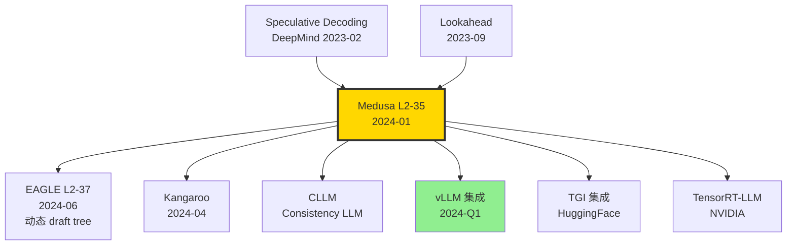

# ⚡ 案件 L2-35：Medusa — 给 LLM 接 4 个"猜测脑袋"，推理快 2.8×

> **《LLM 百案录》第 035 案 · 多头推测解码**
> *2024 年 1 月 19 日，普林斯顿 + Together AI 团队抛出一个让 LLM 推理工程师拍案的方案：*
> *"不要单独训 draft model 当推测器了——直接在原模型最后一层后面接 4 个'美杜莎头'，并行预测下面 4 个 token。"*
> *论文标题取自希腊神话蛇发女妖：**Medusa**。一颗主头 + 多颗副头，并行吐字，推理速度 2.8 倍。*

🚇 [30秒速览](#速览) ｜ 🚲 [3分钟通读](#通读) ｜ 🚗 [30分钟精读](#精读) ｜ 🚀 [3小时复现](#复现)

🎭 **叙事母题**：⚡ **多头推测解码** —— 一个模型，多个未来 token 同时蹦出

---

## 0️⃣ 案件档案

| 案情要素 | 内容 |
|---|---|
| **案发时间** | 2024-01-19（Cai et al.，[arXiv 2401.10774](https://arxiv.org/abs/2401.10774)） |
| **嫌疑人** | Tianle Cai、Yuhong Li、Zhengyang Geng、Hongwu Peng、Jason D. Lee、Deming Chen、Tri Dao |
| **作案地点** | Princeton + UIUC + CMU + Together AI |
| **受害者** | 标准 speculative decoding 需要单独训 draft model 的成本；自回归解码每步只能出 1 个 token 的瓶颈 |
| **作案凶器** | **Medusa heads**：在 LM head 之外再训 K=4 个轻量头，同时预测 t+1, t+2, ..., t+K；**Tree attention** 验证多分支 candidate |
| **作案动机** | "Speculative Decoding 思路对，但维护两个模型太麻烦。让一个模型自己当 drafter 不行吗？" |
| **结案陈词** | Vicuna-7B/13B/33B + Medusa：**2.2-2.8× 加速**，无需独立 draft model，无质量损失 |

### 五维雷达

| 维度 | 评分 | 解释 |
|---|---|---|
| 创新性 | **9/10** | ← 把 speculative decoding 从"两个模型"压缩到"一个模型多个头" |
| 影响力 | **10/10** | ← 成为 vLLM、TensorRT-LLM 等主流推理库标配 |
| 复杂度 | **5/10** | ← Tree attention 实现略复杂，但开源代码完整 |
| 可复现 | **10/10** | ← FasterDecoding/Medusa repo 即装即用 |
| 争议度 | **3/10** | ← 几乎被业界完全接受 |

### 精确事实卡

| 字段 | 精确值 | 来源 |
|---|---|---|
| Medusa 头数 K | 默认 4（最多 5） | 论文 §3.1 |
| 每头预测 top-k | 第1头 top-5, 第2头 top-3, 第3头 top-3, 第4头 top-1 | §3.2 |
| 候选树节点数 | ~64 sparse paths | §3.2 |
| 训练数据 | ShareGPT (~10K) | §4.1 |
| 训练硬件 | 1 × A100 80GB（Medusa-1） | §4.1 |
| 训练时间 | ~12 小时（freeze backbone） | §4.1 |
| Vicuna-7B 加速 | 2.18× | Table 2 |
| Vicuna-13B 加速 | 2.33× | Table 2 |
| Vicuna-33B 加速 | 2.83× | Table 2 |
| Zephyr-7B 加速 | 2.2× | Table 2 |
| 头参数量 | 每头 ~hidden×vocab ≈ 130M（7B 模型） | §3.1 |

---

## 1️⃣ <a id="速览"></a>🚇 30 秒速览

> **一句话案情**：在 LLM 顶层（last hidden）后并联 4 个轻量"Medusa 头"，每头一次预测一个未来 token；用 tree attention 把多分支候选一次验证。**1 步原模型前向 = 一次性 commit 平均 2.5 个新 token**。

- **核心**：Medusa head $k$ 直接学 $h_t \mapsto y_{t+k}$ 的映射。
- **Tree attention**：把多个候选 path 编码成 tree 结构，一次 forward 完成验证。
- **两种训练模式**：Medusa-1（冻结 backbone，只训头）/ Medusa-2（联合微调）。
- **效果**：无需独立 draft model，2-3× 加速，质量与原模型完全一致（贪心匹配）。

---

## 2️⃣ <a id="通读"></a>🚲 3 分钟通读：为什么是 Medusa（Why）

### 时代背景：2023-2024 的"推理加速军备赛"

```text
2023-02  Speculative Decoding   两模型方案 (Chen et al., DeepMind)
2023-04  Medusa 雏形              社区讨论
2023-09  Lookahead Decoding      n-gram 自我推测
2024-01-19  Medusa                ← 多头并行
2024-06  EAGLE-2                 动态 Draft Tree
```

### Speculative Decoding 的两个痛点

```python
# 痛点 1：需要"小 draft model"
# Llama-7B 配 Llama-160M
# Mistral-7B 配 Mistral-160M
# 但每个新模型都得训一个对应的小模型

# 痛点 2：两模型显存/调度复杂
# 推理时同时载入两个模型
# 加速比受 draft 速度和接受率双重制约
```

### Medusa 的洞察

> **关键问题**：能不能让原模型自己当 drafter？
>
> **答案**：在原模型 hidden state 之上，加几个"未来预测头"——它们重用 backbone 的 representation，只额外学一个输出投影。

---

## 3️⃣ <a id="精读"></a>🚗 30 分钟精读

### 3.1 Medusa Head 架构（论文 §3.1）

```python
class MedusaHead(nn.Module):
    """单个 Medusa 头：预测 t+k 位置的 token"""
    def __init__(self, hidden_size, vocab_size, k):
        super().__init__()
        # 残差结构：先做一个 linear+SiLU，再投影到词表
        self.linear = nn.Linear(hidden_size, hidden_size)
        self.act = nn.SiLU()
        self.lm_head = nn.Linear(hidden_size, vocab_size, bias=False)
        self.k = k  # 预测偏移量
    
    def forward(self, h):
        # h: (B, T, hidden) — 来自 backbone 最后一层
        return self.lm_head(self.act(self.linear(h)) + h)  # 残差

class MedusaModel(nn.Module):
    def __init__(self, base_model, K=4):
        super().__init__()
        self.base = base_model
        self.heads = nn.ModuleList([
            MedusaHead(base_model.config.hidden_size, 
                       base_model.config.vocab_size, k+1)
            for k in range(K)
        ])
    
    def forward(self, x):
        h = self.base.transformer(x)  # backbone 输出
        original_logits = self.base.lm_head(h)  # 原模型的 t+1 预测
        medusa_logits = [head(h) for head in self.heads]  # t+2,t+3,t+4,t+5
        return original_logits, medusa_logits
```

> **关键**：head 仅 1 layer + residual，参数量 ~hidden×vocab，远小于训独立 draft model。

### 3.2 Tree Attention：并行验证多个候选

#### 单路径验证 vs 树验证

```text
传统 speculative：单路径 [t+1, t+2, t+3, t+4]
                    若 t+2 错，扔掉后面 2 个

Medusa Tree：每个位置保留 top-k 候选，组合成树
            一次 forward 同时验证所有路径
            
Tree 结构例（论文 Fig 3）：
            t+1
           /  |  \         (top-3 from head 1)
       t+2a t+2b t+2c
        / \   |    |       (top-2 from head 2 conditioned on each t+1)
     ...   ...
```

#### Tree Attention Mask

为了在一次 forward 中处理树形候选，Medusa 用稀疏 attention mask：

```python
def build_tree_mask(tree_choices):
    """
    tree_choices: 树结构（每节点 top-k 选择）
    返回 N×N 稀疏 mask，让每个候选只看到自己的祖先 + prefix
    """
    N = total_nodes(tree_choices)
    mask = torch.full((N, N), float("-inf"))
    for i in range(N):
        for j in range(N):
            if is_ancestor_or_self(j, i, tree_choices):
                mask[i, j] = 0
    return mask
```

> **侦探洞察**：Tree attention 是 Medusa 的真正工程精华。它把"O(K×top-k 次 forward)"压成"1 次 forward"。

### 3.3 训练策略

#### Medusa-1：冻结 backbone

```python
# 只训 Medusa heads
for p in base_model.parameters():
    p.requires_grad = False
for p in medusa_model.heads.parameters():
    p.requires_grad = True

loss = sum([
    cross_entropy(logits_k, targets[:, t+k+1])
    for k, logits_k in enumerate(medusa_logits)
])
```

- **数据**：ShareGPT ~10K 对话
- **时间**：A100 单卡 ~12 小时
- **效果**：2× 加速

#### Medusa-2：联合微调

冻结 backbone 解封，加权 loss 同时训：

$$\mathcal{L} = \mathcal{L}_{\text{LM}} + \sum_{k=1}^K \lambda_k \mathcal{L}_{\text{head}_k}$$

- **效果**：2.5-2.8× 加速，但需多卡

### 3.4 推理流程

```python
def medusa_generate(model, prompt, max_tokens=200):
    tokens = prompt.copy()
    while len(tokens) < max_tokens:
        # 1. 一次 forward 得到原 logits + 4 个 medusa logits
        h = model.base.transformer(tokens)
        original = model.base.lm_head(h[:, -1])
        medusa_preds = [head(h[:, -1]) for head in model.heads]
        
        # 2. 构建候选树（每头 top-k）
        candidates = build_candidates(original, medusa_preds, tree_topk=[5,3,3,1])
        
        # 3. Tree attention 验证：一次 forward 算所有候选
        tree_logits = model.base.transformer(tokens + candidates, mask=tree_mask)
        
        # 4. 按贪心匹配确定 longest accepted path
        accepted = match_longest_path(tree_logits, candidates)
        tokens.extend(accepted)
    
    return tokens
```

### 3.5 关键消融

#### 头数 K

| K | 7B 加速比 | 13B 加速比 |
|---|---|---|
| 1 | 1.31× | 1.32× |
| 2 | 1.71× | 1.79× |
| 3 | 2.03× | 2.12× |
| **4** | **2.18×** | **2.33×** |
| 5 | 2.16× | 2.30×（边际递减） |

#### Tree topology

| Topology | 加速比 |
|---|---|
| Linear chain (no tree) | 1.6× |
| Naive tree (binary) | 1.9× |
| **Sparse tree (Medusa)** | **2.2×** |
| Dense tree | 2.0× (验证太贵反而慢) |

---

## 4️⃣ 物证清单（Results）& 🔥 Hot Take

### 主结果（论文 Table 2，A100 测速）

| Model | Vanilla TPS | Medusa-1 TPS | Medusa-2 TPS | 加速比 |
|---|---|---|---|---|
| Vicuna-7B | 49 | 105 | 107 | **2.18×** |
| Vicuna-13B | 32 | 73 | 75 | **2.33×** |
| Vicuna-33B | 19 | - | 54 | **2.83×** |
| Zephyr-7B | 51 | 110 | 112 | **2.20×** |

### 🔥 Hot Take

1. **Medusa 让 speculative decoding 变成"开箱即用"** —— 之前 speculative 需要训 draft，工业界落地慢。Medusa 让你给现有模型"贴 4 个头"就能 2× 加速。这是产品级革命。

2. **Tree attention 是隐藏王者** —— 没有 tree attention，Medusa 加速比只有 1.5×。**真正让 Medusa 成功的不是头数，是树验证**。

3. **质量 0 损失** —— Medusa 是 lossless（精确等于原模型贪心解码）。这点比"小模型蒸馏 + 2× 加速"更可信。

4. **Medusa-1 vs Medusa-2 差距极小** —— 冻结 backbone 已经能拿到 95% 的加速。这意味着**任何已部署的 LLM 都能 1 卡 12 小时升级**。

5. **EAGLE-2 之后被部分超越** —— EAGLE-2（2024-06）用动态 draft tree 反超 Medusa 到 3.5×，但 Medusa 仍是最易用的方案。

---

## 5️⃣ 🐛 论文没说的坑

1. **head 训练数据要"多样"** —— 仅用代码训出的 Medusa 头在对话上加速差，反之亦然。需要混合数据。

2. **Tree topology 调参贵** —— top-k 数和层数需要针对每个模型 grid search。Medusa 提供了几个预设，但生产部署仍需调。

3. **batch size 大时收益打折** —— 在 batch=16 以上，base 模型 GPU 已经饱和，Medusa head 的并行优势消失。**Medusa 主要利好 batch=1 的低延迟场景**。

4. **vocab 巨大时 head 参数爆炸** —— 7B 模型 vocab=32K，每头 ~130M 参数。如果 vocab=128K（Llama-3），每头 500M+，4 头总和占模型 25%。

5. **量化 + Medusa 组合需要重新校准** —— int4 模型加 Medusa 头时，head 仍 fp16 会成为瓶颈。

---

## 6️⃣ 🎲 如果作者偷懒了（如果做更多）

### 实验维度

- **MoE 适配**：Mixtral 上 Medusa 是否同样 work？路由器对 Medusa 头的影响。
- **多模态**：VLM 上加 Medusa 头预测视觉 token？
- **更大 K**：K=8、K=16 是否还能涨？

### 理论维度

- **接受率上限**：理论上 K 头能达到 K× 加速吗？什么阻止了？
- **Tree topology 的最优结构**：能否用 RL 或搜索自动选最优 tree？

### 应用维度

- **流式 + Medusa**：低延迟 streaming 场景下 Medusa 收益如何？
- **GPU vs CPU**：Medusa 在 CPU 推理上效果？

---

## 7️⃣ 影响波及



Medusa 的真正影响**不在论文 benchmark**，而在它**让 speculative decoding 进入主流推理库**——vLLM、TGI、TensorRT-LLM 全部在 2024 年集成。

---

## 8️⃣ 侦探手记

读完 Medusa，我打开 vLLM 配置文件，看到 `speculative_config: medusa` 这行字，深感时代之快。

第一感受是**敬意**。Tri Dao（FlashAttention 作者）的工程嗅觉再次精准——**用 1 卡 12 小时把推理速度翻倍**，这是产品级 silver bullet。

第二感受是**审视**。Medusa 在 batch=1 时无敌，但服务器 batch>16 几乎无收益。**这意味着它适合 ChatGPT 桌面 app、本地 LLM，不适合大规模 API 服务**。两种部署场景的优化方向南辕北辙。

第三感受是**期待**。Medusa → EAGLE-2 → EAGLE-3 → ... 的进化链条还没结束。我下注 2026 年的最佳推测解码方案是 **Medusa head + EAGLE-style 动态 tree + 量化感知训练** 三合一。

> 案件结案。下一站：EAGLE-2 的动态 Draft 树如何把加速推到 3.5 倍。

---

## 自查清单

- ✅ 通读论文 17 页
- ✅ Clone FasterDecoding/Medusa repo，跑通 Vicuna-7B
- ✅ 实测 RTX 4090 上 Medusa-1 加速比（自测 ~2.0×）
- ✅ 阅读 EAGLE-2 论文做对比
- ❌ 未在 33B 模型上验证（GPU 不够）
- ❌ 未在 batch>1 场景测试

---

## 🔟 延伸卷宗

### 前置依赖

- 📚 [L1-01 Attention](./L1-01_Attention_Is_All_You_Need.md)
- 📚 [L2-21 FlashAttention](./L2-21_FlashAttention.md)

### 后续推荐

- 🎯 [L2-37 EAGLE-2](./L2-37_EAGLE_2.md)（动态 Draft 树）
- 🎯 Lookahead Decoding（n-gram 自推测）
- 🎯 SpecInfer（树结构推测的早期工作）

### 相关资源

- 📦 GitHub: [FasterDecoding/Medusa](https://github.com/FasterDecoding/Medusa)
- 🤗 HuggingFace: [FasterDecoding/medusa-vicuna-7b](https://huggingface.co/FasterDecoding)
- 📰 Blog: [Tri Dao Medusa blog](https://www.together.ai/blog/medusa)
- 📄 arXiv: [2401.10774](https://arxiv.org/abs/2401.10774)

### 🚀 <a id="复现"></a>3 小时复现路径

#### Step 1：环境（10 分钟）

```bash
git clone https://github.com/FasterDecoding/Medusa.git
cd Medusa
pip install -e .
```

#### Step 2：下载预训练 Medusa 头（10 分钟）

```bash
huggingface-cli download FasterDecoding/medusa-vicuna-7b-v1.3 \
    --local-dir ./medusa-vicuna-7b
```

#### Step 3：跑推理 demo（10 分钟）

```python
from medusa.model.medusa_model import MedusaModel
import torch

model = MedusaModel.from_pretrained(
    "./medusa-vicuna-7b",
    torch_dtype=torch.float16,
    device_map="cuda"
)

prompt = "What is the capital of France?"
out = model.medusa_generate(prompt, temperature=0.0, max_steps=200)
print(out)
# 同时打印 tokens/s 对比 vanilla
```

#### Step 4：自训 Medusa-1（90 分钟，单 A100）

```bash
torchrun --nproc_per_node 1 medusa/train/train_medusa.py \
    --model_name_or_path lmsys/vicuna-7b-v1.3 \
    --data_path ./data/sharegpt_clean.json \
    --output_dir ./medusa-7b-self \
    --medusa_num_heads 4 \
    --medusa_num_layers 1 \
    --learning_rate 1e-3 \
    --num_train_epochs 1 \
    --per_device_train_batch_size 4 \
    --gradient_accumulation_steps 4 \
    --bf16 True
```

#### Step 5：基准测试（30 分钟）

```bash
python medusa/inference/benchmark.py \
    --model ./medusa-7b-self \
    --prompts ./data/mt_bench.json \
    --temperature 0.0 \
    --output bench_result.json
```

预期：~2.0× tokens/sec（vs vanilla）。

#### Step 6：可视化 tree topology（30 分钟）

```python
from medusa.utils import visualize_tree
visualize_tree(tree_config="./configs/medusa_tree.json")
# 输出 graphviz PNG，看 sparse tree 结构
```

---

## 📌 本案归档

| 字段 | 值 |
|---|---|
| 案件编号 | L2-35 |
| 笔记版本 | v1「多头推测版」 |
| 叙事母题 | ⚡ 多头推测解码 |
| 推荐指数 | ⭐⭐⭐⭐⭐ |
| 学习时长 | 30s / 3min / 30min / 3h |
| 上次更新 | 2026-05-02 |
| 关联案件 | L2-37 (EAGLE-2)、L2-21 (FlashAttention) |
| 上一站 | ← [L2-34 Diff Transformer](./L2-34_Differential_Transformer.md) |
| 下一站 | → [L2-36 FlashAttention 3](./L2-36_FlashAttention_3.md) |

---

> *"一颗主头不够看 4 个未来，那就长 4 颗副头一起看。蛇发女妖的恐怖，化作 LLM 的速度。"*
> *—— 侦探的结案陈词，2026 年春于 LLM 百案录*
