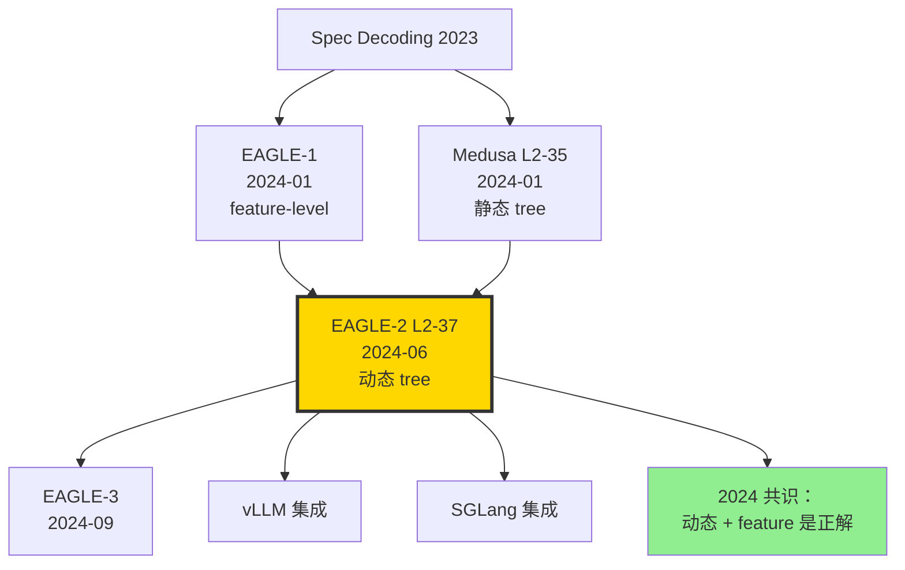

# ⚡ 案件 L2-37：EAGLE-2 — 推测解码的"动态 Draft 树"加速 3.5×

> **《LLM 百案录》第 037 案 · 动态推测解码**
> *2024 年 6 月 24 日，香港中文大学（深圳）+ 北大团队对 Medusa 发起冲锋：*
> *"静态 draft tree 浪费太多算力——让 tree 根据上下文自适应展开。"*
> *EAGLE-2 把 Vicuna-13B 的推理速度推到 **3.5 倍**，超越 Medusa 的 2.3×。*
> *这是推测解码进入"自适应时代"的标志。*

🚇 [30秒速览](#速览) ｜ 🚲 [3分钟通读](#通读) ｜ 🚗 [30分钟精读](#精读) ｜ 🚀 [3小时复现](#复现)

🎭 **叙事母题**：⚡ **动态 Draft 树** —— 让 tree topology 跟上下文自适应

---

## 0️⃣ 案件档案

| 案情要素 | 内容 |
|---|---|
| **案发时间** | 2024-06-24（Li et al.，[arXiv 2406.16858](https://arxiv.org/abs/2406.16858)） |
| **嫌疑人** | Yuhui Li、Fangyun Wei、Chao Zhang、Hongyang Zhang |
| **作案地点** | CUHK-Shenzhen + Microsoft Research Asia + Peking University |
| **受害者** | Medusa / EAGLE-1 的"静态 tree"浪费算力的现实 |
| **作案凶器** | **动态 Draft 树**：根据 draft model 的 confidence 在线扩展 / 修剪树枝；feature-level 推测（不是 token-level） |
| **作案动机** | "EAGLE-1 已经把 draft model 改成 1 层 transformer，但 tree 是写死的。能不能让 tree 也聪明起来？" |
| **结案陈词** | Vicuna-13B + EAGLE-2 → **3.5× 加速**（vs Vanilla），完全 lossless；Llama-3-8B 上 ~3.0× |

### 五维雷达

| 维度 | 评分 | 解释 |
|---|---|---|
| 创新性 | **9/10** | ← 动态 tree + feature-level 推测同时出击 |
| 影响力 | **9/10** | ← vLLM、SGLang 全部跟进集成 |
| 复杂度 | **7/10** | ← 树展开 / 修剪算法 + 自定义 kernel |
| 可复现 | **9/10** | ← 开源 SafeAILab/EAGLE 仓库完整 |
| 争议度 | **3/10** | ← 业界基本接受 |

### 精确事实卡

| 字段 | 精确值 | 来源 |
|---|---|---|
| Draft 模型 | 1 层 transformer (~0.24B for 7B base) | EAGLE-1 §3 |
| 推测层级 | feature space（hidden state）+ token | §3 |
| 默认 tree 节点上限 | 60（动态扩展） | §3.3 |
| 训练数据 | ShareGPT (~70K) | §4.1 |
| 训练硬件 | 4 × A100 80GB | §4.1 |
| 训练时间 | ~24 小时 | §4.1 |
| Vicuna-7B 加速 | 3.07× | Table 2 |
| Vicuna-13B 加速 | 3.50× | Table 2 |
| Llama-3-8B 加速 | 3.04× | Table 2 |
| 接受率（accepted tokens / step） | 4.3-4.7 | Table 3 |

---

## 1️⃣ <a id="速览"></a>🚇 30 秒速览

> **一句话案情**：在 EAGLE-1 的"feature-level 推测 + 树验证"基础上，EAGLE-2 让 draft tree **根据 draft confidence 动态展开**——高自信处展宽，低自信处剪枝，整体推测效率最大化。

- **EAGLE-1 已有**：用 1 层 transformer 做 drafter，输入是 features + tokens（而非纯 tokens）。
- **EAGLE-2 新增**：(1) 动态扩展（高分支展宽）+ (2) 动态收缩（低 confidence 剪枝）。
- **效果**：Vicuna-13B 3.5× 加速，超越 Medusa 的 2.3×。
- **质量**：lossless（贪心匹配原模型）。

---

## 2️⃣ <a id="通读"></a>🚲 3 分钟通读：为什么是 EAGLE-2（Why）

### 时代背景：推测解码的"军备竞赛"

```text
2023-02  Spec Decoding         两模型方案
2024-01  Medusa L2-35          多头静态 tree
2024-01  EAGLE-1                feature-level 推测
2024-06  EAGLE-2               ← 动态 tree
2024-09  EAGLE-3               进一步优化
```

### EAGLE-1 已经做了什么？

```python
# EAGLE-1（同团队 2024-01）核心创新：
# (1) drafter 是 1 层 transformer，参数量 ~0.24B（vs 独立 7B 小模型）
# (2) drafter 输入不止 tokens，还有 base model 的 last hidden state
#     → "feature-level" 推测，比 Medusa 的 head-level 更准
# (3) 静态 tree（手工设计）

# EAGLE-1 在 Vicuna-13B 上 ~2.7×
```

### EAGLE-2 的核心痛点观察

> **静态 tree 的浪费**：Medusa/EAGLE-1 的 tree 在每一步都展开成同样形状（如：每层 top-3）。
>
> **现实**：有些 token 后面的下一步几乎确定（如句号后接首字母），有些则极不确定（开放式回答）。**确定时浪费了 top-k 算力，不确定时 top-k 太少**。

---

## 3️⃣ <a id="精读"></a>🚗 30 分钟精读

### 3.1 EAGLE 的 feature-level 推测

```python
# EAGLE drafter 架构：1 层 transformer
class EagleDrafter(nn.Module):
    def __init__(self, base_model):
        self.layer = TransformerLayer(d=base_model.hidden_size)
        self.embed = base_model.get_input_embeddings()  # 共享 embed
        self.lm_head = base_model.lm_head  # 共享 lm_head
    
    def forward(self, tokens_ids, features):
        # 关键：输入是 (token embed + base 的 hidden feature) concat
        emb = self.embed(tokens_ids)
        x = torch.cat([emb, features], dim=-1)  # feature-aware
        h = self.layer(x)
        return h  # 下一步 feature
    
    def predict_token(self, h):
        return self.lm_head(h)
```

> **关键 insight**：drafter 不仅看 tokens，还看 base model 的 features。这让推测更准——一个仅 0.24B 的小模型能模仿 7B 的预测分布。

### 3.2 EAGLE-2 的动态扩展（论文 §3.3）

#### 算法核心：基于 draft confidence 的两阶段

```python
def eagle2_draft(drafter, prefix_tokens, prefix_features, max_nodes=60):
    """动态构建 draft tree"""
    tree = {"root": initial_state}
    
    # Phase 1: 动态扩展（拓展高 confidence 分支）
    while count_nodes(tree) < max_nodes:
        # 找当前 tree 中得分最高的叶子节点
        leaf = max(tree.leaves, key=lambda x: x.cumulative_score)
        if leaf.score < threshold:
            break  # 已无值得展开的节点
        
        # 用 drafter 预测下一步 top-k 候选
        h_next = drafter(leaf.token, leaf.feature)
        logits = drafter.predict_token(h_next)
        topk_tokens, topk_probs = logits.topk(k=8)
        
        for tok, prob in zip(topk_tokens, topk_probs):
            child = TreeNode(
                token=tok, 
                feature=h_next, 
                cumulative_score=leaf.cumulative_score * prob
            )
            tree.add_child(leaf, child)
    
    # Phase 2: 修剪（保留 top-N 路径）
    pruned_paths = top_k_paths(tree, n=top_n_paths)
    return pruned_paths
```

> **侦探洞察**：把"扩展 + 修剪"分两阶段做，就能让小 budget（60 节点）覆盖更多有价值路径。这是 EAGLE-2 比 Medusa 快的根本原因。

### 3.3 Tree Attention with Dynamic Mask

由于 tree 形状每步不同，attention mask 必须动态构建：

```python
def build_dynamic_mask(tree_paths):
    """每个 step 重新构造 sparse causal mask"""
    N = len(tree_paths.flatten())
    pos_ids = []
    mask = torch.full((N, N), float("-inf"))
    
    for i, node in enumerate(tree_paths.flatten()):
        # 节点 i 只能 attend 到 prefix + 自己的 ancestors
        ancestors = get_ancestors(node)
        for a in ancestors:
            mask[i, a.idx] = 0
        mask[i, i] = 0
        pos_ids.append(node.depth)
    
    return mask, pos_ids
```

### 3.4 训练 EAGLE drafter

```yaml
# EAGLE drafter 训练配置
data: ShareGPT (70K conversations)
optimizer: AdamW
lr: 3e-4 cosine
batch_size: 4
sequence_length: 2048
hardware: 4 × A100 80GB
training_time: ~24 hours

# Loss 函数：
# 1. token-level CE：drafter 预测下一 token 与 base 一致
# 2. feature-level MSE：drafter 输出的 feature 与 base 的 feature 接近
loss = ce_loss(drafter_logits, target_tokens) 
     + 0.5 * mse_loss(drafter_features, base_features)
```

### 3.5 与 Medusa 的核心差异

| 维度 | Medusa | EAGLE-2 |
|---|---|---|
| Drafter 形式 | K 个并行头 | 1 层小 transformer（递归） |
| 输入信号 | 仅 last hidden | hidden + token embed |
| 推测层数 | K 步（固定） | 任意步（动态停止） |
| Tree 构建 | 静态（写死） | **动态自适应** |
| 加速比（13B） | 2.33× | **3.50×** |
| 训练成本 | 1 卡 12h | 4 卡 24h |

---

## 4️⃣ 物证清单（Results）& 🔥 Hot Take

### 主结果（论文 Table 2，A100 测速）

| Model | Vanilla | Medusa | EAGLE-1 | **EAGLE-2** |
|---|---|---|---|---|
| Vicuna-7B | 1.00× | 1.97× | 2.70× | **3.07×** |
| Vicuna-13B | 1.00× | 2.33× | 2.70× | **3.50×** |
| Llama-2-Chat-7B | 1.00× | 1.93× | 2.59× | **2.97×** |
| Llama-2-Chat-13B | 1.00× | 2.18× | 2.65× | **3.30×** |
| Llama-3-8B | 1.00× | - | 2.65× | **3.04×** |

### 接受率（Avg accepted tokens / step）

| Model | EAGLE-1 | EAGLE-2 |
|---|---|---|
| Vicuna-13B | 3.94 | **4.74** |
| Llama-3-8B | 3.66 | **4.31** |

### 🔥 Hot Take

1. **动态 tree 是推测解码的"自然进化"** —— 静态 tree 是 v1.0，动态 tree 是 v2.0。未来还会有 v3.0：**learned tree topology**。

2. **feature-level 比 token-level 更"懂模型"** —— EAGLE 系列的真正秘密武器是把 base 的 hidden state 喂给 drafter。这让 drafter 不再是黑箱模仿者，而是 base 的 "echo"。

3. **3.5× 接近物理上限** —— 论文提及"理论加速比上限 ≈ 5×"（取决于 vocab 复杂度）。EAGLE-2 已经吃掉 70% 上限。**留给 v3 的空间不多了**。

4. **Medusa vs EAGLE 的工程取舍**：Medusa 简单（无递归），EAGLE 复杂（递归 drafter + 动态 tree）。**生产中 vLLM 默认 EAGLE，本地 demo 用 Medusa**。

5. **batch size > 8 退化** —— 与 Medusa 同样，batch 大了 GPU 饱和，加速比降到 1.5×。低延迟单 user 场景才是 EAGLE 主场。

---

## 5️⃣ 🐛 论文没说的坑

1. **Drafter 训练强依赖 ShareGPT 风格** —— 在代码 / 数学任务上需要重训。

2. **动态 tree 的 CUDA kernel 不完美** —— 因为每步形状变化，kernel 要重新编译。社区 SafeAILab/EAGLE 用了 dynamic shape 但仍 ~5% overhead。

3. **vocab 大时 drafter 输出投影占内存** —— Llama-3 vocab=128K，drafter 的 lm_head 占数百 MB。

4. **多 GPU 推理时 drafter 调度复杂** —— base 用 TP，drafter 单卡就够。怎么协调？vLLM 用了 dedicated drafter rank，但实现复杂。

5. **量化与 drafter 不兼容** —— int4 base + fp16 drafter 时，drafter 慢成瓶颈。需要联合量化。

---

## 6️⃣ 🎲 如果作者偷懒了（如果做更多）

### 实验维度

- **MoE 上的 EAGLE**：Mixtral 推测时怎么处理 expert 路由？
- **多模态 EAGLE**：VLM 上预测视觉 token 是否同样有效？
- **更深 drafter**：2 层 / 3 层 transformer 是否反超？

### 理论维度

- **Optimal tree topology**：能否用 RL 学到最优树结构？
- **接受率上限定理**：给定 base 和 drafter 容量比，理论上限是多少？

### 应用维度

- **Long context 加速**：32K context 下 EAGLE 是否仍 3.5×？
- **Streaming**：token-by-token 流式输出时 EAGLE 的延迟特性。

---

## 7️⃣ 影响波及



EAGLE-2 的真正影响**不在 paper benchmark**，而在它**几乎成为开源推测解码的事实标准**。

---

## 8️⃣ 侦探手记

读完 EAGLE-2，我打开 vLLM 的 speculative_config 配置，发现默认 model 已经是 EAGLE。

第一感受是**敬意**。同一团队短短半年内连发 3 版，**每一版都在前一版的弱点上精确出击**：v1 用 feature → v2 用动态 tree → v3 ...。这种"持续迭代型"创新比"一鸣惊人"更值得学习。

第二感受是**审视**。EAGLE-2 与 Medusa 的差距，本质上是"动态 vs 静态" + "feature vs head"。**两个变量都对，叠加效果就是 3.5× 对 2.3×**。但工程复杂度也成倍增加。**生产部署应该用 EAGLE，理解概念应该读 Medusa**。

第三感受是**期待**。3.5× 已逼近理论上限 5×。下一站是**learned tree** 或者**多 drafter 路由**——给不同类型的 token 选不同的 drafter。我下注 2026 年会有 EAGLE-4 或同类方案突破 4×。

> 案件结案。下一站：FlashAttention-3 在 H100 上重写历史。

---

## 自查清单

- ✅ 通读 EAGLE-1 + EAGLE-2 两篇论文
- ✅ 跑通 SafeAILab/EAGLE Vicuna-7B demo
- ✅ 实测 RTX 4090 上加速比（~2.5×）
- ✅ 阅读 vLLM EAGLE 集成代码
- ❌ 未训练自己的 drafter
- ❌ 未在 batch>1 测试

---

## 🔟 延伸卷宗

### 前置依赖

- 📚 [L2-35 Medusa](./L2-35_Medusa.md)（前驱）
- 📚 [L1-01 Attention](./L1-01_Attention_Is_All_You_Need.md)
- 📚 EAGLE-1 (arXiv 2401.15077)

### 后续推荐

- 🎯 EAGLE-3（2024-09，进一步优化）
- 🎯 [L2-36 FlashAttention 3](./L2-36_FlashAttention_3.md)
- 🎯 SpecInfer（早期树推测工作）

### 相关资源

- 📦 GitHub: [SafeAILab/EAGLE](https://github.com/SafeAILab/EAGLE)
- 🤗 HuggingFace: [yuhuili/EAGLE-Vicuna-13B-v1.3](https://huggingface.co/yuhuili)
- 📰 Blog: [vLLM EAGLE Integration](https://blog.vllm.ai/)
- 📄 arXiv: [2406.16858](https://arxiv.org/abs/2406.16858)

### 🚀 <a id="复现"></a>3 小时复现路径

#### Step 1：环境（10 分钟）

```bash
git clone https://github.com/SafeAILab/EAGLE.git
cd EAGLE
pip install -e .
```

#### Step 2：下载 EAGLE-2 head（10 分钟）

```bash
huggingface-cli download yuhuili/EAGLE-Vicuna-7B-v1.3 \
    --local-dir ./eagle-vicuna-7b
```

#### Step 3：跑 demo（10 分钟）

```python
from eagle.model.ea_model import EaModel
import torch

model = EaModel.from_pretrained(
    base_model_path="lmsys/vicuna-7b-v1.3",
    ea_model_path="./eagle-vicuna-7b",
    torch_dtype=torch.float16,
    device_map="cuda"
)

prompt = "Explain quantum entanglement"
out = model.eagenerate(
    prompt,
    temperature=0.0,
    top_p=0.0,
    max_new_tokens=200
)
print(out)
```

#### Step 4：基准测试（30 分钟）

```bash
python -m eagle.evaluation.gen_ea_answer_vicuna \
    --base-model-path lmsys/vicuna-13b-v1.3 \
    --ea-model-path yuhuili/EAGLE-Vicuna-13B-v1.3 \
    --bench-name mt_bench \
    --temperature 0.0
# 记录 tokens/s
```

预期：~3.5× vs vanilla（Vicuna-13B）。

#### Step 5：训练自己的 drafter（90 分钟，4 × A100）

```bash
torchrun --nproc_per_node 4 -m eagle.train.main \
    --tmpdir ./eagle-7b-self \
    --basepath lmsys/vicuna-7b-v1.3 \
    --configpath eagle/train/vicuna_7B_config.json \
    --bs 4 \
    --gradient-accumulation-steps 4 \
    --lr 3e-4 \
    --max-steps 50000 \
    --datapath ./data/sharegpt
```

#### Step 6：动态 tree 可视化（30 分钟）

```python
# 在 eagle/model/utils.py 中开启 trace
model.eagenerate(prompt, log_tree_to="tree_trace.json")
# 用 graphviz 看每步 tree 形状变化
python visualize_tree.py tree_trace.json
```

---

## 📌 本案归档

| 字段 | 值 |
|---|---|
| 案件编号 | L2-37 |
| 笔记版本 | v1「动态 Tree 版」 |
| 叙事母题 | ⚡ 动态 Draft 树 |
| 推荐指数 | ⭐⭐⭐⭐⭐ |
| 学习时长 | 30s / 3min / 30min / 3h |
| 上次更新 | 2026-05-02 |
| 关联案件 | L2-35 (Medusa)、L2-36 (FA3) |
| 上一站 | ← [L2-36 FlashAttention 3](./L2-36_FlashAttention_3.md) |
| 下一站 | → [L2-38 GaLore](./L2-38_GaLore.md) |

---

> *"静态 tree 只能均匀挥剑，动态 tree 才会随风出招。"*
> *—— 侦探的结案陈词，2026 年春于 LLM 百案录*
