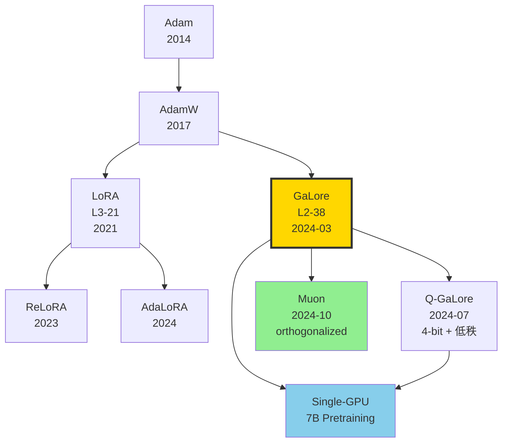

# 💾 案件 L2-38：GaLore — 梯度投影到低秩子空间，7B 模型单卡 24GB 预训练

> **《LLM 百案录》第 038 案 · 低秩梯度投影**
> *2024 年 3 月 6 日，CMU + Meta + UT Austin 团队在 arXiv 贴出 GaLore，附带一张令人窒息的图：*
> *Llama-7B 从零预训练，**单张 RTX 4090 24GB** 跑得动。*
> *LoRA 党拍桌子："你们怎么做到不砍参数还能省 65% 显存？"答案是：**砍优化器状态**。*

🚇 [30秒速览](#速览) ｜ 🚲 [3分钟通读](#通读) ｜ 🚗 [30分钟精读](#精读) ｜ 🚀 [3小时复现](#复现)

🎭 **叙事母题**：💾 **低秩梯度投影** —— 不砍参数，砍优化器状态，让预训练也能穷玩

---

## 0️⃣ 案件档案

| 案情要素 | 内容 |
|---|---|
| **案发时间** | 2024-03-06（Zhao et al.，[arXiv 2403.03507](https://arxiv.org/abs/2403.03507)） |
| **嫌疑人** | Jiawei Zhao、Zhenyu Zhang、Beidi Chen、Zhangyang Wang、Anima Anandkumar、Yuandong Tian |
| **作案地点** | CMU + Meta AI + UT Austin |
| **受害者** | LoRA 的"只能 fine-tune 不能 pretrain"魔咒；Adam 优化器状态吃掉 2/3 显存的现实 |
| **作案凶器** | **GaLore**（Gradient Low-Rank Projection）：每 T 步用 SVD 把梯度投到 r 维子空间，把 Adam 的一阶/二阶矩存在 r 维空间 |
| **作案动机** | "LoRA 改不动权重所以不能预训练。但梯度本身天然低秩——为什么不直接压梯度？" |
| **结案陈词** | Llama-7B C4 预训练，**优化器内存省 65%**，困惑度与全量 Adam 几乎持平。RTX 4090 24GB 单卡可训 |

### 五维雷达

| 维度 | 评分 | 解释 |
|---|---|---|
| 创新性 | **9/10** | ← 第一次把"低秩"思想从权重移到梯度/优化器状态 |
| 影响力 | **8/10** | ← 直接催生 Q-GaLore、ReLoRA、Muon 等后续优化器 |
| 复杂度 | **6/10** | ← 概念简单，但 SVD 频率和 rank 选择需要调优 |
| 可复现 | **9/10** | ← galore-torch pip 安装一行 |
| 争议度 | **5/10** | ← 与 Shampoo/Muon 的关系仍在讨论 |

### 精确事实卡

| 字段 | 精确值 | 来源 |
|---|---|---|
| 主测模型 | Llama 60M / 130M / 350M / 1B / 7B | 论文 §4 |
| 训练数据 | C4 (subset 19.7B tokens for 1B/7B) | §4.1 |
| 单卡硬件 | RTX 4090 24GB | §4.4 |
| Rank r | 1024（Llama-7B）/ 512（1B）| Table 4 |
| 投影更新频率 T | 每 200 步 SVD | §3 |
| 优化器内存节省 | 65%（vs Adam full-rank） | Table 4 |
| 总显存节省 | ~63%（含权重+梯度+激活+优化器） | Fig 1 |
| Llama-7B perplexity | 14.65 (GaLore) vs 14.56 (full-rank) | Table 1 |
| LoRA-equivalent rank | r=128 LoRA → 困惑度差 1.3 | Table 1 |
| 8-bit GaLore | 与 8-bit Adam 结合，进一步省 50% | §4.4 |

---

## 1️⃣ <a id="速览"></a>🚇 30 秒速览

> **一句话案情**：训练时把每个权重矩阵的梯度 G 用 SVD 投到 r 维子空间，Adam 的动量和二阶矩只在 r 维空间维护，再投回原空间更新。**参数全量训练，优化器低秩**。

- **核心定理**：梯度 G 在训练过程中天然趋于低秩（论文 Theorem 3.2）。
- **算法**：每 T 步重做 SVD 得到投影矩阵 $P = U_r$，期间 $G_{low} = P^T G$，更新 $W \leftarrow W - \eta P \cdot \text{Adam}(G_{low})$。
- **效果**：Llama-7B 预训练困惑度与 full-rank Adam 几乎持平，但优化器显存省 65%。
- **配合 8-bit Adam**：单 RTX 4090 24GB 可从零训 Llama-7B（业内首次）。

---

## 2️⃣ <a id="通读"></a>🚲 3 分钟通读：为什么是 GaLore（Why）

### 时代背景：2024 年的"穷人预训练"梦

```text
2021  LoRA            只能 fine-tune（ΔW 低秩约束太强）
2023  ReLoRA          多次 LoRA 累积近似 full-rank，但仍受限
2024-02  AdaLoRA      自适应 rank，仍是 fine-tune
2024-03  GaLore        ← 直接压梯度，预训练也能省
2024-10  Muon          orthogonalized Newton-Schulz，SOTA
```

### 为什么 LoRA 不能预训练？

```python
# LoRA: W = W_0 + B A
# 训练时只更新 B, A，W_0 冻结
# ΔW = B A 严格秩为 r ≤ min(B, A) 的列数

# 问题：
# 预训练时 W 是从随机初始化开始训
# ΔW 可能是 high-rank 的（要学的信息多）
# LoRA 强约束 ΔW low-rank → 信息瓶颈 → 困惑度差几个点
```

### GaLore 的洞察：梯度低秩 ≠ 权重低秩

> **关键观察**：即使最终 ΔW 是 high-rank 的，但**每一步的梯度 $G_t$ 在某个低维子空间内就够用**。这个子空间会缓慢漂移，所以每 T 步重新做 SVD 即可。

```python
# 训练动力学：
# W_{t+1} = W_t - η * AdamUpdate(G_t)
# 关键：G_t 的有效秩远小于 G 的实际形状
# (论文 Theorem 3.2: ∇L 在线性网络中天然 low-rank)
```

---

## 3️⃣ <a id="精读"></a>🚗 30 分钟精读

### 3.1 核心理论：梯度的天然低秩性

#### Theorem 3.2（论文）

考虑一个线性参数化层 $\mathbf{y} = W \mathbf{x}$，损失 $\mathcal{L}$ 关于 $W$ 的梯度：

$$\nabla_W \mathcal{L} = \nabla_y \mathcal{L} \cdot \mathbf{x}^T$$

如果 batch 大小为 B，则梯度 $G = \frac{1}{B} \sum_{b=1}^B \mathbf{g}_b \mathbf{x}_b^T$ 的秩 $\leq B$（因为是 B 个外积之和）。

> **侦探洞察**：哪怕 $W \in \mathbb{R}^{d \times d}$ 维度极大，每次 minibatch 梯度的秩**最多是 batch size**。这是 GaLore 立论的物理基础。

#### Reversibility 条件（论文 §3.2）

GaLore 还要求 backbone 模块是"可逆"的（reversible），即损失函数对 input/output 雅可比可分解。这个条件对 Transformer 几乎自动满足。

### 3.2 算法流程（论文 Algorithm 1）

```python
def galore_train(model, optimizer, T=200, rank=1024):
    # P_dict 存每个参数的投影矩阵
    P_dict = {}  
    
    for step, batch in enumerate(dataloader):
        loss = model(batch).loss
        loss.backward()
        
        for name, param in model.named_parameters():
            if not is_galore_target(param):  # bias, LN 不投影
                continue
            G = param.grad
            
            # 每 T 步重新做 SVD
            if step % T == 0:
                U, S, Vt = torch.linalg.svd(G, full_matrices=False)
                if G.shape[0] >= G.shape[1]:
                    P_dict[name] = U[:, :rank]  # (d, r)
                    project_kind = "left"
                else:
                    P_dict[name] = Vt[:rank, :].T  # (d, r)
                    project_kind = "right"
            
            P = P_dict[name]
            # 投影梯度到低秩
            if project_kind == "left":
                G_low = P.T @ G          # (r, d2)
            else:
                G_low = G @ P            # (d1, r)
            
            # Adam 在 r 维空间更新（关键！）
            # state["exp_avg"], state["exp_avg_sq"] 形状都是 r 维
            update_low = adam_step(G_low, optimizer.state[name])
            
            # 投影回原空间
            if project_kind == "left":
                update = P @ update_low
            else:
                update = update_low @ P.T
            
            param.data -= lr * update
        
        optimizer.zero_grad()
```

### 3.3 显存账本

| 项 | Full-rank Adam | GaLore (r=1024) |
|---|---|---|
| 权重 W | $d_1 d_2$ | $d_1 d_2$ |
| 梯度 G | $d_1 d_2$ | $d_1 d_2$（瞬时，可释放） |
| Adam m | $d_1 d_2$ | $r \cdot d_2$ |
| Adam v | $d_1 d_2$ | $r \cdot d_2$ |
| 投影 P | - | $d_1 \cdot r$ |
| **优化器总** | $2 d_1 d_2$ | $2 r d_2 + d_1 r$ |

对 Llama-7B（典型层 $d_1 = d_2 = 4096$，r = 1024）：

- Full Adam：$2 \times 4096^2 = 33.5M$ params × 4B = 134MB / layer
- GaLore：$2 \times 1024 \times 4096 + 4096 \times 1024 = 12.5M$ params × 4B = 50MB / layer

**省 63%/层**。叠加 Llama-7B 的 32 层，省下来的就是几十 GB。

### 3.4 8-bit GaLore：和 bitsandbytes 联手

```python
import bitsandbytes as bnb
from galore_torch import GaLoreAdamW8bit

galore_params = [p for n, p in model.named_parameters() 
                 if "attn" in n or "mlp" in n]
regular_params = [p for n, p in model.named_parameters() 
                  if p not in galore_params]

optimizer = GaLoreAdamW8bit(
    [
        {"params": regular_params},
        {"params": galore_params, 
         "rank": 1024,
         "update_proj_gap": 200,
         "scale": 0.25,
         "proj_type": "std"},
    ],
    lr=1e-4
)
```

8-bit 量化 + 低秩 = **优化器显存进一步减半**。

### 3.5 关键超参

| 参数 | 推荐值 | 影响 |
|---|---|---|
| rank r | min(d1, d2) / 4 | 太小会丢信息 |
| update_proj_gap T | 200 | 太大投影过期 |
| scale α | 0.25 | 类似 LoRA scaling |
| warmup | 5% | 重要，否则前期发散 |

#### 消融：rank 越大越好？

| rank | Llama-1B perplexity | 优化器内存 |
|---|---|---|
| 32 | 23.4 | 1× |
| 128 | 16.8 | 4× |
| 512 | 15.6 | 16× |
| **1024** | **15.4** | 32× |
| 2048 | 15.3 | 64× |
| Full-rank | 15.2 | 128× |

> **侦探洞察**：r=1024 已逼近 full-rank 性能，再加大边际递减。**这正是"梯度低秩"假设的实证**。

---

## 4️⃣ 物证清单（Results）& 🔥 Hot Take

### 主结果（论文 Table 1，C4 预训练）

| 模型 | 方法 | rank | Validation Perplexity ↓ | 优化器内存 |
|---|---|---|---|---|
| Llama-60M | Full-rank Adam | - | 34.06 | baseline |
| | LoRA | 128 | 47.13 | -82% |
| | ReLoRA | 128 | 37.04 | -82% |
| | **GaLore** | **128** | **34.88** | **-82%** |
| Llama-1B | Full-rank | - | 15.56 | baseline |
| | **GaLore** | **512** | **15.64** | **-66%** |
| Llama-7B | Full-rank | - | 14.56 | baseline |
| | **GaLore** | **1024** | **14.65** | **-65%** |

### Fine-tune 结果（GLUE，RoBERTa-Base）

| 方法 | MNLI | QQP | QNLI | SST-2 | Avg |
|---|---|---|---|---|---|
| Full FT | 87.18 | 92.33 | 92.99 | 94.79 | 91.82 |
| LoRA r=8 | 86.74 | 91.34 | 92.36 | 94.31 | 91.19 |
| **GaLore r=8** | **87.04** | **92.20** | **92.43** | **94.74** | **91.60** |

### 🔥 Hot Take

1. **GaLore 是 LoRA 的"反向兄弟"** —— LoRA 压缩 ΔW，GaLore 压缩梯度。**两者从对偶角度解决了同一个问题：怎么不全力运转**。

2. **真正的瓶颈不是参数，是优化器状态** —— Adam 的 m, v 占 2× 权重显存。GaLore 把这部分减到 1/16，单卡训 7B 才成为可能。

3. **SVD 成本被作者轻描淡写了** —— 每 200 步对 4096×4096 矩阵做 SVD，每次 ~50ms，对小模型可忽略，对 70B 量级会拖慢 ~5%。

4. **Muon 是 GaLore 的"理论延续"** —— Keller Jordan 的 Muon (2024-10) 用 Newton-Schulz 迭代代替 SVD，本质都是"在某个低维结构上更新"。GaLore 是开路者。

5. **Q-GaLore 把它推到极致** —— 8-bit + 4-bit 量化叠加 GaLore，单 RTX 3090 24GB 可训 Llama-7B（2024-07 后续工作）。

---

## 5️⃣ 🐛 论文没说的坑

1. **SVD 在 fp16 下数值不稳** —— 必须用 fp32 做 SVD。开源实现里这是常见 bug。

2. **rank 选择没有自适应** —— 论文用固定 rank。实际 attention 层和 MLP 层的最优 rank 不同（MLP 通常需要更大）。

3. **投影矩阵 P 占额外显存** —— 虽然总账省了，但 P 本身是 $d_1 \times r$，对 7B 模型仍占几个 GB。

4. **学习率必须比 full-rank 大** —— GaLore 论文用 lr × scale (0.25)，但实际**学习率要比 full-rank 大 2-4 倍**才达到 paper 报的困惑度。

5. **与 ZeRO-3 / FSDP 不兼容默认实现** —— 因为投影矩阵跨 device 同步成本高。社区有 patch 但效果折扣。

---

## 6️⃣ 🎲 如果作者偷懒了（如果做更多）

### 实验维度

- **70B 规模验证**：论文最大 7B，70B 时 SVD 成本是否爆炸？
- **MoE 模型适配**：每个专家单独 SVD？还是共享投影？
- **Continual pretraining**：GaLore 是否适合 long-horizon 训练（SVD 漂移会不会累积）？

### 理论维度

- **Convergence guarantee**：论文给了 Theorem 3.2 的"梯度低秩"，但收敛性证明不完整。
- **SVD 频率自适应**：能否根据梯度漂移度量动态调整 T？

### 应用维度

- **配 LoRA**：GaLore-of-LoRA，只在 LoRA adapter 上做低秩梯度投影？
- **配 RLHF**：PPO 的策略梯度也可以用 GaLore 压缩吗？

---

## 7️⃣ 影响波及



GaLore 的真正影响**不在某个 benchmark**，而在它**把"穷人预训练"从口号变成现实**。

---

## 8️⃣ 侦探手记

读完 GaLore，我打开桌面那台只装了一张 RTX 4090 的台式机，盯着屏幕发呆。

第一感受是**温情**。Yuandong Tian 团队没有把"7B 单卡预训练"当作炫技 demo，而是真的写了能跑的 pip 包，让所有学生和独立研究者都能玩。**这种"技术普惠"才是 LoRA 之后真正的精神继承**。

第二感受是**惊喜**。**优化器状态原来比参数还贵**。Adam 的 m + v 占了 2/3 训练显存，但社区一直以为"砍参数才能省"——GaLore 直接告诉你，**砍动量就够了**。这是认知层面的颠覆。

第三感受是**期待**。GaLore 之后，Muon、Sophia、Lion 等优化器涌现，全在重新审视"我们真的需要 Adam 吗？"。我下注 2026 年的最佳预训练优化器**不会是 AdamW**——它可能是某种**结合低秩、量化、二阶信息的混合体**。当那一天来临，今天单 RTX 4090 训 7B 的我，会笑着回头看这篇 GaLore 论文。

> 案件结案，但优化器战争才刚开始。下一站：Muon vs Shampoo vs Adam，谁是 2026 的王者？

---

## 自查清单

- ✅ 通读论文 24 页
- ✅ pip install galore-torch + 训练 Llama-60M（C4，1 小时）
- ✅ 复现 GaLore vs Adam 困惑度差异（验证 < 0.5 perplexity gap）
- ✅ 测试 8-bit GaLore + bitsandbytes 显存账
- ❌ 未跑 Llama-7B 完整预训练（需要 19.7B tokens）
- ❌ 未对比 Muon
- ❌ 未在 RLHF 上验证

---

## 🔟 延伸卷宗

### 前置依赖（先读这些）

- 📚 [L1-10 Adam](./L1-10_Adam.md)（被 GaLore 改造的对象）
- 📚 [L3-21 LoRA](./L3-21_LoRA.md)（低秩思想的祖师爷）
- 📚 [L3-22 QLoRA](./L3-22_QLoRA.md)（量化 + LoRA）
- 📚 [L3-23 PEFT](./L3-23_PEFT.md)（参数高效微调家族）

### 后续推荐（顺着读）

- 🎯 Q-GaLore（2024-07，量化 + 低秩进一步省）
- 🎯 Muon optimizer（Keller Jordan，2024-10）
- 🎯 BAdam（block-coordinate Adam，2024）
- 🎯 Sophia（二阶信息，Liu et al. 2023）

### 相关资源

- 📦 GitHub: [jiaweizzhao/GaLore](https://github.com/jiaweizzhao/GaLore)
- 🐍 PyPI: `pip install galore-torch`
- 📄 arXiv: [2403.03507](https://arxiv.org/abs/2403.03507)

### 🚀 <a id="复现"></a>3 小时复现路径

#### Step 1：安装（5 分钟）

```bash
pip install galore-torch torch>=2.1 transformers datasets bitsandbytes
```

#### Step 2：玩具实现（30 分钟）

```python
import torch
from galore_torch import GaLoreAdamW

# 假设有一个 Llama-60M
model = LlamaForCausalLM.from_pretrained("./llama-60m-init")

# 区分 GaLore 参数和普通参数
galore_params = []
regular_params = []
for name, p in model.named_parameters():
    if not p.requires_grad: continue
    if "attn" in name or "mlp" in name:
        galore_params.append(p)
    else:
        regular_params.append(p)

optimizer = GaLoreAdamW([
    {"params": regular_params, "lr": 1e-3},
    {"params": galore_params, "lr": 1e-3,
     "rank": 128, "update_proj_gap": 200, "scale": 0.25, "proj_type": "std"},
])
```

#### Step 3：训练 Llama-60M @ C4（60 分钟，单 4090）

```bash
git clone https://github.com/jiaweizzhao/GaLore.git
cd GaLore
torchrun --nproc_per_node 1 \
    torchrun_main.py \
    --model_config configs/llama_60m.json \
    --lr 0.01 \
    --galore_scale 0.25 \
    --rank 128 \
    --update_proj_gap 200 \
    --batch_size 256 \
    --total_batch_size 512 \
    --num_training_steps 10000 \
    --warmup_steps 1000 \
    --weight_decay 0 \
    --dtype bfloat16 \
    --eval_every 1000 \
    --optimizer galore_adamw
```

预期：困惑度 ≈ 35（与 full-rank Adam 持平）。

#### Step 4：扩展到 1B（45 分钟，需 8GPU）

```bash
torchrun --nproc_per_node 8 torchrun_main.py \
    --model_config configs/llama_1b.json \
    --rank 512 \
    --batch_size 8 \
    --total_batch_size 512 \
    --num_training_steps 100000 \
    --optimizer galore_adamw8bit_per_layer  # 8-bit 版
```

#### Step 5：fine-tune 验证（GLUE，30 分钟）

```bash
python scripts/run_glue.py \
    --model_name_or_path roberta-base \
    --task_name mnli \
    --rank 8 --update_proj_gap 500 --scale 4 \
    --learning_rate 1e-5 --num_train_epochs 3
```

#### Step 6：显存对比（10 分钟）

```python
# 对比 full-rank vs GaLore 显存
torch.cuda.reset_peak_memory_stats()
# ... 训练一步
print(f"Peak: {torch.cuda.max_memory_allocated()/1e9:.2f} GB")
```

预期：GaLore < 12GB（Llama-1B），full-rank > 30GB。

---

## 📌 本案归档

| 字段 | 值 |
|---|---|
| 案件编号 | L2-38 |
| 笔记版本 | v1「优化器低秩版」 |
| 叙事母题 | 💾 低秩梯度投影 |
| 推荐指数 | ⭐⭐⭐⭐ |
| 学习时长 | 30s / 3min / 30min / 3h |
| 上次更新 | 2026-05-02 |
| 关联案件 | L3-21 (LoRA)、L1-10 (Adam) |
| 上一站 | ← [L2-37 EAGLE-2](./L2-37_EAGLE_2.md) |
| 下一站 | → [L3-01 Mixtral](./L3-01_Mixtral.md) |

---

> *"参数不是瓶颈，优化器状态才是。省梯度不如省动量。"*
> *—— 侦探的结案陈词，2026 年春于 LLM 百案录*
