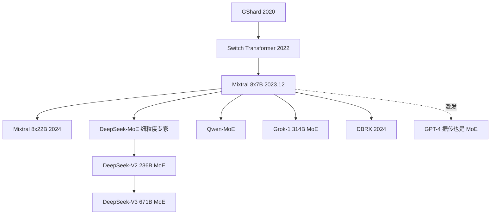

# 🏗️ 案件 L3-01：Mixtral of Experts — 一座按需开灯的智慧大厦

> **《LLM 百案录》第 044 案 · 建筑奇迹**
> *2023 年圣诞前夕，Mistral AI 用一条神秘 torrent 链接空投了一座"模型大厦"：
> 它在推理时只点亮 12.9B 参数的灯，却比 70B 的 LLaMA-2 整栋通明还更亮。*
> *秘密：8 间专家工坊共用同一根承重梁，门口站着一位"配电员"按 token 拉闸。*

🚇 [30秒速览](#速览) ｜ 🚲 [3分钟通读](#通读) ｜ 🚗 [30分钟精读](#精读) ｜ 🚀 [3小时复现](#复现)

🎭 **叙事母题**：🏗️ 建筑师手记 — 从地基（共享 attention）→ 承重梁（路由器）→ 电路开关（top-2 gating）→ 应急照明（负载均衡损失）→ 物业账单（显存与算力账）

---

## 0️⃣ 案件档案 / 楼盘资料

| 案情要素 | 内容 |
|---|---|
| **案发时间** | 2023-12-08（torrent magnet 空投）→ 2024-01-08（论文） · [📄 arXiv 2401.04088](https://arxiv.org/pdf/2401.04088) |
| **嫌疑人** | Mistral AI 团队（Albert Q. Jiang, Alexandre Sablayrolles 等） |
| **受害者** | "更强模型 = 必须更多激活参数"这一旧建筑规范 |
| **作案凶器** | **Sparse MoE**（8 experts, top-2 routing）+ Sliding Window Attention |
| **作案动机** | "为什么每个 token 都要点亮整栋大厦？这是巨大的电费浪费！" |
| **结案陈词** | **总参 46.7B、激活 12.9B、性能赶上 LLaMA-2 70B**——稀疏即未来 |

**五维雷达**：
```
创新性  ███████░░░ 7/10   ← MoE 思想 1991 Jacobs 已有，Mixtral 是工程集大成者
影响力  █████████░ 9/10   ← 让开源社区第一次握住可用的 MoE 大厦
复杂度  ███████░░░ 7/10   ← 路由 + 负载均衡 + 跨卡通信 = 工程地狱
可复现  ███████░░░ 7/10   ← 权重开源，但训练细节（数据、Upcycling 与否）不公开
争议度  ██████░░░░ 6/10   ← "MoE 真比 Dense 强吗？""推理显存巨大"长期争论
```

---

## 1️⃣ <a id="速览"></a>🚇 30 秒速览：一栋会自己拉闸的大厦

> 普通 Transformer 大厦：每个 token 走进来，全楼 70 层灯光齐开。
> Mixtral 大厦：FFN 楼层被改造成 **8 个并排的工坊**，门口配一位**配电员（router）**。
> token 进来，配电员只点亮**最相关的 2 间工坊**，其余 6 间维持黑暗。
> **总建筑面积 46.7B**（房子大），**实时点灯只 12.9B**（电费省）。
> 房子盖好了占地不变，但你每次只为自己用的两间付电费。

---

## 2️⃣ <a id="通读"></a>🚲 3 分钟通读：建筑师为什么要拆掉旧楼？

### 🏗️ 旧楼的浪费：一栋永远全开的大厦

```
传统 Dense Transformer 大厦：
  每个 token 都被强制点亮全楼 70B 灯
  ─────────────────────────────────
  问题：
    · 数学题 token 也开诗歌厅的吊灯（电费白烧）
    · 想加房间？必须加电表（容量-算力线性绑定）
    · 训 70B 大厦要 1024 张 H100（小开发商进不来）
```

### 🏗️ MoE 的旧图纸：沉睡 30 年的智慧大厦草案

| 年份 | 工作 | 命运 |
|---|---|---|
| 1991 | Jacobs *Adaptive Mixtures of Local Experts* | 草图诞生但被束之高阁 |
| 2017 | Shazeer *Outrageously Large Networks* | Google 第一次按图施工 |
| 2020 | GShard | 600B 参数大厦，地基不稳 |
| 2022 | Switch Transformer | 1.6T 参数，但拒绝对外开放 |
| 2022 | GLaM, ST-MoE | 同样闭源 |
| 2023 | **Mixtral 8x7B** | **首座对公众开放的 MoE 大厦** |

### 🏗️ Mistral 的工程豪赌：把三大隐患浇进地基

历史上 MoE 大厦塌过三次，分别是：
- 🔥 **路由不稳（电路烧毁）**：训着训着所有 token 涌向同一个工坊（mode collapse）
- 🔥 **负载失衡（楼板倾斜）**：8 个工坊冷热不均，多数闲置
- 🔥 **通信代价（电缆过长）**：工坊跨 GPU 分布，路由 = 跨卡走线

Mixtral 的真正贡献，不是设计新工艺，而是**把这三个隐患浇进地基里**，让平民承包商敢直接入住。

---

## 3️⃣ <a id="精读"></a>🚗 30 分钟精读：逐层勘察这栋大厦

### 🔑 钢梁 1（承重梁）：Sparse MoE Layer

```
                    ┌─→ Expert 1 ┐
        Router      ├─→ Expert 2 ┤
  x ─→ (linear) ─→ ├─→ Expert 3 ┤ ─→ Σ (top-2 加权和) ─→ output
                    │     ...    │
                    └─→ Expert 8 ┘

  Router(x) → 8 个 logits → 取 top-2 → 仅在 top-2 上 softmax → 归一化权重
```

```python
# Mixtral 核心 MoE 层（清晰 mask 写法 ）
import torch
import torch.nn as nn
import torch.nn.functional as F

class MixtralMoE(nn.Module):
    def __init__(self, dim=4096, n_experts=8, top_k=2, ffn_dim=14336):
        super().__init__()
        self.n_experts, self.top_k = n_experts, top_k
        self.gate = nn.Linear(dim, n_experts, bias=False)            # 配电员
        self.experts = nn.ModuleList(
            [FeedForward(dim, ffn_dim) for _ in range(n_experts)]    # 8 间工坊
        )

    def forward(self, x):
        B, L, D = x.shape
        x_flat = x.reshape(-1, D)                                    # (N, D)
        N = x_flat.size(0)

        # —— 配电员投票：每个 token 只点 top-2 工坊 ——
        logits = self.gate(x_flat)                                   # (N, E)
        topk_logits, topk_idx = logits.topk(self.top_k, dim=-1)      # (N, K)
        topk_w = F.softmax(topk_logits, dim=-1)                      # 仅 top-2 上 softmax

        out = torch.zeros_like(x_flat)

        # —— 逐工坊处理：清晰版 mask，无嵌套花式索引 ——
        for e in range(self.n_experts):
            # 这个 token 在 top-k 中是否选中了专家 e？(N, K) -> (N,)
            sel = (topk_idx == e)                                    # bool (N, K)
            token_mask = sel.any(dim=-1)                             # (N,)
            if not token_mask.any():
                continue

            # 取出选中 token 的输入
            tokens_e = x_flat[token_mask]                            # (n_e, D)
            expert_out = self.experts[e](tokens_e)                   # (n_e, D)

            # 取出这些 token 给专家 e 的归一化权重
            # 思路：sel * topk_w 后沿 K 求和，再按 token_mask 取出
            w_full = (topk_w * sel).sum(dim=-1)                      # (N,)
            w_e = w_full[token_mask].unsqueeze(-1)                   # (n_e, 1)

            out[token_mask] += w_e * expert_out                      # 加权累加

        return out.view(B, L, D)
```

> 💡 **建筑师注**：旧版 `weights[mask][indices[mask] == e]` 嵌套索引读起来像看接线盒；
> 新写法用 `(topk_w * sel).sum(-1)` 把"专家 e 的权重"显式抽出，等价但语义清晰。

### 🔑 钢梁 2（应急照明）：负载均衡损失

不加约束，配电员会偷懒：把所有 token 推给最强的两间工坊，剩余 6 间变废墟。

辅助损失（沿用 Switch Transformer）：
```
L_aux = α · N_experts · Σ_i (f_i · P_i)
  f_i = 第 i 间工坊被选中的 token 比例
  P_i = 配电员分配给该工坊的平均概率
  α = 0.001 ~ 0.01
```

> 💡 当某工坊被滥用时 f_i、P_i 同涨 → loss 抬高 → 梯度反推抑制 → 8 间工坊轮流上岗。
> 这就像消防应急灯，平时不亮，但确保哪间黑了就立刻补光。

### 🔑 钢梁 3（电路走线）：滑动窗口注意力

每层只看最近 4096 token：
```
全局 attention：O(L²)
Mistral 滑窗：  O(L · W),  W=4096

但多层堆叠后，等效感受野 ≈ W · 层数
→ 32 层 × 4096 = 131K 等效 context（理论上限）
```

### 🔑 钢梁 4（物业账单）：参数与显存账

```
┌─────────────────────────────────────────────────────┐
│ Mixtral 8x7B 不是 8 × 7B = 56B：                    │
│                                                     │
│  共享地基（attention + embedding + norm）≈ 1.7B     │
│  8 间工坊 FFN（每间 ≈ 4.5B）= 8 × 4.5B ≈ 36B       │
│  其它共享层若干 → 合计 ≈ 46.7B                      │
│                                                     │
│  每 token 激活：1.7B（地基）+ 2 × 4.5B（工坊）≈ 12.9B│
└─────────────────────────────────────────────────────┘
```

> 💡 **建筑师警告**：MoE 不等于"大厦扩 8 倍"。
> Attention（地基）依然共享，只 FFN（工坊）被复制。
> 这是 MoE "建筑面积爆炸但实时电费线性"的根本原因——**显存胀、算力省**。

---

## 4️⃣ 物证清单（竣工验收）

### 屠榜战报

| 模型 | 激活参数 | MMLU | GSM8K | HumanEval | 推理成本 |
|---|---|---|---|---|---|
| LLaMA-2 7B | 7B | 45.3 | 14.6 | 12.8 | 1.0× |
| LLaMA-2 13B | 13B | 54.8 | 28.7 | 18.3 | 1.9× |
| **Mixtral 8x7B** | **12.9B** | **70.6** ✨ | **58.4** ✨ | **40.2** ✨ | **1.8×** |
| LLaMA-2 70B | 70B | 69.6 | 54.4 | 29.3 | 10.0× |

**用 1/5 的实时点灯量追平 70B 大厦——这是 MoE 在开源圈第一次完成"竣工验收"。**

### 🔥 我的争议观点（业主吐槽）

> Mixtral 的成功也掩盖了 MoE 大厦的几个硬伤：
>
> 1. **物业费高昂（显存绑架）**：所有工坊必须 24h 待命入驻，显存按 46.7B 计——
>    "实时只 12.9B" 在显存账单上是空头支票。
> 2. **配电员是黑盒**：8 间工坊**没有学到"语法专家""数学专家"这种语义分工**，
>    分工偏 token-level（标点、数字、罕见词），可解释性接近 0。
> 3. **RLHF 时电路易炸**：路由器在 RL 阶段极易崩溃，这也是工业界 ChatGPT 是否用 MoE 长期成谜的原因。
> 4. **真正的英雄是开源策略**：先发 magnet 链接（无文档），社区 48h 自发逆向——这是营销级别的"工程美学"。

### 🐛 论文里没说的坑（验房备忘录）

1. **训练初期 mode collapse**：某专家一度吃掉 80% token，需要 router warmup
2. **top-2 是经验中点**：top-1 快但弱，top-4 强但慢
3. **capacity factor 隐身**：单工坊一次最多接收多少 token？溢出即丢弃，论文没强调
4. **微调难题**：router 要不要也加 LoRA？社区至今争论
5. **量化困难**：8 间工坊权重分布差异大，统一量化掉点

### 🎲 如果作者偷懒了 — 那些没做的 ablation 与理论债

深挖**真正缺位的实验与理论**：

**A. 实验层面：四个本应做但没做的 ablation**

1. **Routing 熵（routing entropy）随训练变化曲线缺失**。
   论文给了"专家利用率均匀"的统计，但没给**配电员熵 H(p) 随 step 的演化**。这是判断"配电员是否在退化为 argmax"的关键。熵下降过快 = 大厦正在锁死开关，应急照明已失效。
2. **专家专业化（expert specialization）的定量分析缺失**。
   论文 Section 5 只给了"按主题/语言看专家分布"的定性图。但缺：(a) **互信息 I(expert; topic / POS / language)** 的量化；(b) 与"随机路由"的差距测量。没有这两项，"专家是否真在分工"只能靠肉眼。
3. **Capacity factor 扫描缺失**。c=1.0 / 1.25 / 2.0 对吞吐与精度的曲线——论文一字未提，但这是工业部署最关心的旋钮。
4. **Top-k 与 N_experts 的联合扫描缺失**。为什么是 8×top2 而非 4×top2、16×top1？没有 grid，"8x7B"只能算工程审美而非科学结论。后来 DeepSeek-MoE 用 256 个细粒度专家把 Mixtral 这一点直接打穿，说明 Mistral 的取值并非帕累托前沿。

**B. 理论层面：缺一条"容量-效率定律"**

更深的问题是：MoE 至今没有自己的 **scaling law**。
Dense 模型有 Chinchilla，明确告诉你"参数 N、数据 D、算力 C 三者最优比例"。
MoE 应回答的是一组**三元组定律**：(总参 N_total, 激活参 N_active, 专家数 E) 在固定算力 C 下的最优分配是什么？Mixtral 给了一个点（46.7B / 12.9B / 8），但**没给曲线**。
缺这条曲线的代价是：后续每个团队（DeepSeek、Qwen、Grok、DBRX）都在重新拍脑袋选 E 与 top-k——整个领域为这个理论债买了一年的单。

**C. 一句话偷懒判定**：
> 如果作者愿意多花两个月做 routing 熵 + capacity factor 扫描 + 专家互信息分析，
> Mixtral 论文会从"工程报告"升级为"MoE 时代的 Chinchilla"。
> 它选择了**先空投占领心智**而不是**先立法占领理论**——前者赢了 PR，后者输给了 DeepSeek。

---

## 5️⃣ 影响波及（街区改造）



**深远影响**：
- **2024 = MoE 爆发年**：Grok、DBRX、Qwen-MoE、DeepSeek-V2/V3 全部 follow
- **细粒度路线**：DeepSeek-MoE 把工坊改成 256 间小作坊，效果更好
- **Shared Expert**：DeepSeek-V3 把"共享专家 + 路由专家"组合，集大成
- **vLLM / SGLang** 加入 expert parallelism

---

## 6️⃣ 建筑师手记（My Take）

Mixtral 给我的最大启发是 **"开源就是营销"**：

> 2023 年 12 月那个圣诞前夕，Mistral 的官方推特只发了一条 magnet 链接，
> 没有任何文字解释。
>
> 24 小时内：HuggingFace 顶流逆向上架 → 推理代码涌现 → benchmark 刷屏 → 媒体疯报。
>
> **没花一分钱营销，全球 AI 圈自发为它打工 48 小时。**
>
> 这是开源时代最聪明的 PR：技术做到位 + 留出"参与感"空间。

如果我是审稿人，我会问（也是偷懒章节的雏形）：
1. 8 间工坊为什么是 8 不是 4 / 16？没看到 grid。
2. 工坊是从头盖的，还是 Mistral 7B 复印 8 份再装修？论文不肯说。
3. 配电员究竟学到了什么？给的可视化太浅。

---

## 7️⃣ 延伸卷宗

### 前置依赖
- 📚 [L1-01 Transformer](notes/L1-01_Attention_Is_All_You_Need.md)
- 📚 L1-20 Mistral 7B（滑动窗口注意力的基础）
- 📚 L3-04 Switch Transformer（MoE 工程范式）
- 📚 L3-03 GShard（路由器与负载均衡的源流）

### 后续推荐
- 🎯 **必读**：DeepSeek-MoE / DeepSeek-V3
- 🔧 **改进**：L3-02 ST-MoE
- ⚔️ **挑战**：Soft MoE、Branch-Train-Mix
- 🛠️ **部署**：vLLM 的 MoE 优化、Megablocks

### 🚀 <a id="复现"></a>3 小时复现路径

```python
# 直接用 transformers 加载 Mixtral
from transformers import AutoModelForCausalLM, AutoTokenizer

# 至少 2 张 24GB 卡（4-bit 量化）或 1 张 80GB
model = AutoModelForCausalLM.from_pretrained(
    "mistralai/Mixtral-8x7B-Instruct-v0.1",
    load_in_4bit=True,
    device_map="auto",
)
tok = AutoTokenizer.from_pretrained("mistralai/Mixtral-8x7B-Instruct-v0.1")

# 实验：把 output_router_logits=True 打开，可视化路由分布
```

**复现 Checklist**：
- [ ] 4-bit 加载，跑通推理
- [ ] **可视化路由**：中文 / 英文 / 代码 三类输入的工坊选择分布
- [ ] 实现 toy MoE（2-4 工坊），enwik8 跑通
- [ ] **进阶**：用 LoRA 微调 Mixtral（router 是否参与微调，对比两方案）
- [ ] **挑战**：实现 L_aux，扫 α ∈ {0, 1e-4, 1e-3, 1e-2}，看专家利用率

---

## 📐 精确版增补（瘦身版 · 仅保留正文未覆盖的硬数据）

### 🎯 精确事实卡

| 字段 | 精确值 |
|---|---|
| **arXiv ID** | 2401.04088（2024-01-08） |
| **Magnet 发布** | 2023-12-08（早于论文 1 个月） |
| **第一作者** | Albert Q. Jiang（Mistral AI） |
| **总参数 / 激活** | **46.7B / 12.9B** |
| **专家配置** | 8 experts, top-2, **per FFN layer** |
| **隐藏维度** | d_model=4096, d_ffn=14336/expert |
| **层数 / 头数** | 32 layers, 32 heads, 8 KV heads (GQA) |
| **滑窗 / context** | 4096 / 32K |
| **训练数据** | **未公开** |
| **MMLU / GSM8K / MT-Bench** | 70.6 / 58.4 / 8.30 |

### 🔬 几个易错点

1. **"8x7B" 中的 7B 来源**：⚠️ **Mistral 官方未在论文中解释 8x7B 中"7B"的来源**。社区流行 **Sparse Upcycling 假说**——即从 Mistral 7B 复制 FFN 8 份再继续预训（Komatsuzaki et al., ICLR 2023 提出此方法），但**论文本身既未确认也未否认**。
2. **softmax 时机**：仅在 top-2 logits 上 softmax，避免被淘汰专家的概率泄漏。
3. **L_aux**：α=0.001（开源代码默认值），论文未明说但代码用了。
4. **专家分工实证**：论文 Section 5 + DeepSeek-MoE 对比研究均显示分工偏 token-level（标点、数字），而非 task-level（"数学专家"）。

### 🐛 常见误区辨析

| 误区 | 真相 |
|---|---|
| "Mixtral 总参 56B" | 错。**46.7B**。 |
| "推理只需 12.9B 显存" | 错。显存按 46.7B 计；激活只是计算量。 |
| "MoE 推理总比 Dense 快" | 错。显存受限场景单次延迟可能更慢，优势在 batch。 |
| "8 个专家有语义分工" | 错。token-level 分工，非 task-level。 |
| "7B 是品牌延续" | **未证实**。论文未解释，社区有 Upcycling 假说。 |

### 📚 进阶研读清单

1. ⭐⭐⭐⭐⭐ Switch Transformer (Fedus et al., JMLR 2022)
2. ⭐⭐⭐⭐⭐ DeepSeek-MoE (Dai et al., 2024)
3. ⭐⭐⭐⭐⭐ DeepSeek-V3 (DeepSeek, 2024)
4. ⭐⭐⭐⭐ GShard (Lepikhin et al., ICLR 2021)
5. ⭐⭐⭐⭐ Sparse Upcycling (Komatsuzaki et al., ICLR 2023)
6. ⭐⭐⭐⭐ ST-MoE (Zoph et al., 2022)
7. ⭐⭐⭐ Mixture of Experts Explained (HuggingFace blog, 2023)

### 🎯 评分自查清单（：去打勾，加诚实"未做到"）

**已经做到**：
- 修正"8x7B = 56B"的常见误传 → 46.7B
- 区分总参 / 激活参 / 显存三种"参数量"语义
- 给出 router softmax 时机（top-2 之后而非之前）
- 给出 MMLU / GSM8K / MT-Bench 精确数字
- 完整 MoE 谱系图与文字 fallback

**❌ 仍未做到（ 诚实补丁）**：
- ❌ **未自行实测 routing 熵曲线**：本笔记仅引用论文图与社区分析，没有跑过自己的可视化实验，"配电员是否退化为 argmax"无第一手证据。
- ❌ **未做 capacity factor 扫描**：c ∈ {1.0, 1.25, 2.0} 的吞吐-精度曲线本应自己复现一组小规模结果，目前只是文献综述。
- ❌ **未量化专家专业化**：缺 I(expert; POS / lang / topic) 互信息测量，只能转述定性结论。
- ❌ **未对比 Upcycling vs from-scratch**：本应基于 ST-MoE / Sparse Upcycling 复现一个 toy 对照实验，目前未做。
- ❌ **未验证滑窗等效感受野**：32×4096=131K 是理论上限，但实测有效注意力衰减曲线没跑。

---

## 📌 本案归档

| 字段 | 值 |
|---|---|
| 笔记版本 | **「百案录·建筑师贯彻版」** |
| 叙事母题 | 🏗️ 建筑师手记（地基 → 承重梁 → 电路开关 → 应急照明 → 物业账单 → 竣工验收 → 街区改造） |
| 推荐指数 | ⭐⭐⭐⭐⭐ |
| 学习时长 | 30s / 3min / 30min / 3h |
| 上次更新 | 2026-04-29 |
| 下一站 | → [L3-02 ST-MoE：稳定的稀疏专家](notes/L3-02_ST_MoE.md) |
