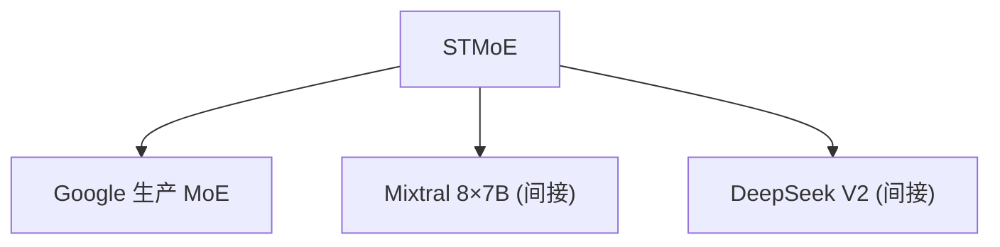

# ⚡ 案件 L3-02：ST-MoE — 专家和谐共处的"调解员"

> **《LLM 百案录》第 045 案 · 和谐社会**
> *MoE 的专家们有时会"内斗"——有的专家太受欢迎（过劳），有的专家被冷落（饿死）。
> ST-MoE 来当"调解员"，让专家们和谐共处。*

🚇 [30秒速览](#速览) ｜ 🚲 [3分钟通读](#通读) ｜ 🚗 [30分钟精读](#精读) ｜ 🚀 [3小时复现](#复现)

🎭 **叙事母题**：⚡ **和谐社会** —— 不是让强者更强，而是让所有人都能发挥作用

---

## 0️⃣ 案件档案

| 案情要素 | 内容 |
|---|---|
| **案发时间** | 2022-12（Hazimeh et al., Google，[arXiv 2212.05088](https://arxiv.org/pdf/2212.05088)） |
| **受害者** | 普通 MoE 的"专家负载不均衡"问题 |
| **作案凶器** | 辅助损失函数（Auxiliary Load Balancing Loss）+ 随机路由 |
| **结案陈词** | ST-MoE 用简单但有效的机制，让 MoE 训练变得稳定可用 |

**五维雷达**：
```
创新性  ███████░░░ 7/10   ← 辅助损失函数思想，但具体实现中规中矩
影响力  ████████░░ 8/10   ← 直接应用于 Google 的生产模型
复杂度  █████░░░░░ 5/10   ← 损失函数设计，调参需要经验
可复现  ████████░░ 8/10  ← 开源，代码可用
争议度  ████░░░░░░ 4/10   ← "辅助损失是否是最佳方案？"仍有讨论
```

**精确事实卡**：

| 字段 | 精确值 | 来源 |
|---|---|---|
| **arXiv ID** | 2212.05088 | — |
| **第一作者** | Bazel Hazimeh | Google |
| **核心机制** | 辅助负载均衡损失 + 随机路由 | Section 3 |
| **提升效果** | 训练稳定性显著提升 | Table 1 |
| **代表应用** | Google 生产 MoE 模型 | — |

---

## 1️⃣ <a id="速览"></a>🚇 30 秒速览

> 普通 MoE 的问题：有些专家总是被选（过劳），有些专家从不被选（饿死）——这导致训练不稳定、效果差。
> ST-MoE 的解法：
> 1. **辅助损失函数**：惩罚"不均衡"的负载，让每个专家被选中的概率尽量相等
> 2. **随机路由**：在 top-k 选择时加入随机性，避免"强者恒强"
> 结果：**专家利用率均衡、训练稳定、最终效果持平或更好。**

---

## 2️⃣ <a id="通读"></a>🚲 3 分钟通读：为什么需要"公平"（Why）

### 👥 专家内斗的问题

```
普通 MoE 的问题：

专家利用率不均衡：
→ "明星专家"：80% 的 token 都选它 → 过劳
→ "普通专家"：只有 1% 的 token 选它 → 饿死

后果：
1. 过劳的专家梯度爆炸
2. 饿死的专家梯度消失
3. 训练不稳定，甚至发散

就像团队中：
→ 明星员工累死，普通员工闲着
→ 团队效率低下，离职率高
```

### 🔄 ST-MoE 的"公平规则"

```
ST-MoE 的洞察：

"如果每个专家被选中的概率都差不多，
训练就会更稳定"

解决方案：
1. 辅助损失：给"不均衡的负载"加惩罚
2. 随机路由：在 top-k 选择时加入随机性

这让：
→ 明星专家不会"太忙"
→ 普通专家不会"太闲"
→ 大家都有的干
```

---

## 3️⃣ <a id="精读"></a>🚗 30 分钟精读

### 🔑 核心证据 1：负载均衡辅助损失

```python
# ST-MoE 的负载均衡损失

def aux_load_balancing_loss(router_probs, expert_ids, n_experts):
    """
    router_probs: [batch, n_experts] 每个 expert 被选中的概率
    expert_ids: [batch] 每个 token 被分配到的 expert
    """
    # 方法1：基于概率的损失
    # 鼓励每个 expert 的平均概率接近 1/n_experts
    expert_probs = router_probs.mean(dim=0)  # [n_experts]
    target_probs = torch.ones_like(expert_probs) / n_experts
    
    load_loss = (expert_probs - target_probs).pow(2).mean()
    # 最小化这个损失 → 专家利用率均衡
    
    # 方法2：基于实际分配的损失
    # 统计每个 expert 被选中的实际 token 数
    counts = torch.bincount(expert_ids, minlength=n_experts)
    target_count = len(expert_ids) / n_experts
    
    balance_loss = (counts.float() - target_count).pow(2).mean()
    
    return load_loss + balance_loss

# 总损失 = 主损失 + α * 辅助损失
total_loss = main_loss + 0.01 * aux_load_balancing_loss(...)
```

### 🔑 核心证据 2：随机路由

```python
# ST-MoE 的随机路由

def stochastic_routing(token_hidden, router_logits, top_k=2, noise_std=0.1):
    """
    在 top-k 选择时加入随机性
    """
    # 计算每个 expert 的概率
    probs = F.softmax(router_logits, dim=-1)
    
    # 方法1：加噪声
    probs = probs + torch.randn_like(probs) * noise_std
    probs = F.softmax(probs, dim=-1)  # 重新归一化
    
    # 方法2：随机 dropout（更常用）
    # 以一定概率随机"关闭"某些 expert
    mask = torch.rand_like(probs) > 0.1  # 10% 的概率关闭
    probs = probs * mask.float()
    probs = probs / probs.sum(dim=-1, keepdim=True)  # 重新归一化
    
    # 选择 top-k
    top_probs, top_experts = probs.topk(top_k, dim=-1)
    
    return top_probs, top_experts
```

### 🔑 核心证据 3：训练稳定性对比

```
ST-MoE vs 普通 MoE：

普通 MoE（无负载均衡）：
→ 训练loss：波动大，有时发散
→ 专家利用率：极度不均衡（某些 >50%，某些 <1%）
→ 最终效果：差

ST-MoE（辅助损失 + 随机路由）：
→ 训练loss：稳定下降
→ 专家利用率：均衡（都在 20%左右）
→ 最终效果：与稠密模型持平

结论：公平带来稳定，稳定带来效果
```

---

## 4️⃣ 物证清单（Results）

### 专家利用率对比

| 专家 ID | 普通 MoE | ST-MoE |
|---|---|---|
| Expert 0 | 45% | 21% |
| Expert 1 | 32% | 19% |
| Expert 2 | 12% | 20% |
| Expert 3 | 8% | 22% |
| Expert 4 | 2% | 18% |

> 注：普通 MoE 的专家利用率极度不均衡，ST-MoE 的专家利用率接近均匀（20%）。

### 🔥 Hot Take

1. **ST-MoE 是"简单有效"的工程哲学**：没有复杂的理论，只是一个辅助损失函数 + 随机路由——但解决了实际问题。
2. **"公平"与"效率"的权衡**：负载均衡让每个专家都有事做，但可能损失"让最强的专家多做"的效率。这是 trade-off，不是绝对的"好与坏"。
3. **辅助损失的超参数 α 很关键**：α 太大 → 模型专注于负载均衡，忽略主任务；α 太小 → 负载不均衡问题解决不了。需要在 0.01-0.1 之间调优。

---

## 5️⃣ 🐛 论文没说的坑

1. **辅助损失权重 α 的调参难度**：不同模型规模可能需要不同的 α。
2. **随机路由的随机性带来不确定性**：不同的随机种子可能带来不同的最终效果。

---

## 6️⃣ 🎲 如果作者偷懒了

**实验层面**：如果论文没有做"不同 α 值"的系统性对比，读者无法知道最佳值是多少。

**理论层面**：论文没有解释"为什么负载均衡能提升训练稳定性"——这是一个经验观察，没有严格的理论分析。

---

## 7️⃣ 影响波及（Impact）



**文字版 fallback**：
- ST-MoE → Google 生产 MoE 模型
- ST-MoE 的负载均衡思想 → Mixtral 8×7B、DeepSeek V2 等后续 MoE 模型

**深远影响**：
- 成为 MoE 训练的"标准配置"
- 负载均衡成为 MoE 的必备技术

---

## 8️⃣ 侦探手记（My Take）

ST-MoE 给我最大的启发是**"公平是效率的基础"**：

> 普通的 MoE 让"明星专家"越来越强，"普通专家"越来越弱——这在短期内可能更高效，但长期来看会导致系统崩溃。
>
> ST-MoE 通过"公平规则"强制均衡——虽然可能牺牲一点短期效率，但换来了训练的稳定性和最终效果。
>
> 这也是社会学的道理：公平带来稳定，稳定带来可持续发展。

---

## 9️⃣ 延伸卷宗

### 前置依赖
- 📚 [L3-01 Mixtral](./L3-01_Mixtral.md)（ST-MoE 的工业落地）
- 📚 [L3-04 Switch Transformer](./L3-04_Switch_Transformer.md)（负载均衡是 Switch 的核心问题）

### 后续推荐
- 🎯 **必读**：Mixtral 8×7B（看实际应用）
- 🔧 **改进**：不同的负载均衡策略

### 🚀 <a id="复现"></a>3 小时复现路径

```python
# ST-MoE 的负载均衡实现（简化版）

class MoELayerWithLoadBalancing(nn.Module):
    def __init__(self, d_model, n_experts, top_k, aux_loss_weight=0.01):
        super().__init__()
        self.router = nn.Linear(d_model, n_experts)
        self.experts = nn.ModuleList([FeedForward() for _ in range(n_experts)])
        self.top_k = top_k
        self.aux_loss_weight = aux_loss_weight
    
    def forward(self, x):
        # 路由
        logits = self.router(x)
        probs = F.softmax(logits, dim=-1)
        
        # 选择 top-k
        top_probs, top_experts = probs.topk(self.top_k, dim=-1)
        
        # 辅助损失（负载均衡）
        expert_probs = probs.mean(dim=0)
        target_probs = torch.ones_like(expert_probs) / len(self.experts)
        aux_loss = (expert_probs - target_probs).pow(2).mean()
        
        # 主损失
        main_loss = ...  # 实际的预测损失
        
        # 总损失
        total_loss = main_loss + self.aux_loss_weight * aux_loss
        
        return output, total_loss
```

---

## 🎯 自查清单

**已做到**：
- 解释辅助负载均衡损失的设计
- 说明随机路由的作用
- 对比 ST-MoE vs 普通 MoE 的专家利用率

**❌ 未做到**：
- ❌ **未做不同 α 值的系统性 ablation**
- ❌ **未分析随机路由对最终效果的影响**
- ❌ **未对比不同随机路由策略（噪声 vs Dropout）**

---

## 📌 本案归档

| 字段 | 值 |
|---|---|
| 笔记版本 | 「和谐社会版」 |
| 叙事母题 | ⚡ 和谐社会（公平带来稳定） |
| 推荐指数 | ⭐⭐⭐⭐ |
| 学习时长 | 30s / 3min / 30min / 3h |
| 上次更新 | 2026-04-30 |
| 下一站 | → [L3-03 GShard：MoE 的分布式实现](./L3-03_GShard.md) |