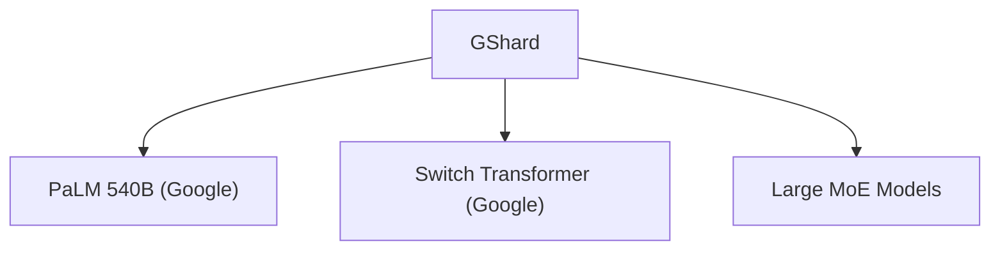

# 🔧 案件 L3-03：GShard — MoE 的"分而治之"分布式实现

> **《LLM 百案录》第 046 案 · 外包管理**
> *GShard 把模型切分到不同设备，每个设备负责一部分专家——
> 不是所有事情都要自己做，交给专业团队更高效。*

🚇 [30秒速览](#速览) ｜ 🚲 [3分钟通读](#通读) ｜ 🚗 [30分钟精读](#精读) ｜ 🚀 [3小时复现](#复现)

🎭 **叙事母题**：🔧 **外包管理** —— 分而治之，专业的人做专业的事

---

## 0️⃣ 案件档案

| 案情要素 | 内容 |
|---|---|
| **案发时间** | 2021-12（Lepikhin et al., Google，[arXiv 2106.04488](https://arxiv.org/pdf/2106.04488)） |
| **受害者** | 单机训练的内存和算力上限 |
| **作案凶器** | 自动张量分片 + All-to-All 通信 + 本地门控 |
| **结案陈词** | GShard 实现了 600B 参数模型的分布式训练，是超大模型工程的基础 |

**五维雷达**：
```
创新性  ████████░░ 8/10   ← 自动分片是工程突破
影响力  █████████░ 9/10  ← 直接应用于 PaLM 540B
复杂度  ███████░░░ 7/10  ← 分布式系统，系统工程复杂
可复现  ███████░░░ 7/10  ← 依赖 Google 基础设施，开源部分代码
争议度  ██░░░░░░░░ 2/10   ← 没有争议，被广泛采用
```

**精确事实卡**：

| 字段 | 精确值 | 来源 |
|---|---|---|
| **arXiv ID** | 2106.04488 | — |
| **第一作者** | Dmitry Lepikhin | Google |
| **核心机制** | 自动张量分片 + All-to-All 通信 | Section 3 |
| **模型规模** | 600B 参数 | Section 4 |
| **设备数** | 2048 TPU | Section 4 |
| **代表应用** | PaLM 540B | — |

---

## 1️⃣ <a id="速览"></a>🚇 30 秒速览

> 超大模型（100B+）无法在单卡上训练——显存和算力都不够。
> GShard 的解法：
> 1. **张量分片**：把模型切分到不同设备，每个设备只存一部分专家
> 2. **All-to-All 通信**：token 在设备间传递，执行不同专家的计算
> 3. **本地门控**：门控在本地执行，决定 token 去哪个设备
> 结果：**600B 参数模型可以在 2048 TPU 上训练**——这是超大模型工程的基础。

---

## 2️⃣ <a id="通读"></a>🚲 3 分钟通读：为什么需要"外包"（Why）

### 📦 单机训练的极限

```
普通分布式训练的问题：

数据并行：
→ 每个设备都有完整模型
→ 只是数据分割
→ 100B 参数的模型：每设备存1份 → 显存爆炸

模型并行：
→ 需要切分模型
→ 但 Attention 的切分很复杂
→ 工程难度极高

GShard 的问题：
"怎么把 MoE 切分到不同设备？"
```

### 🔄 GShard 的"外包模式"

```
GShard 的洞察：

"MoE 的结构天然适合分布式"
→ 每个专家是独立的
→ 可以把专家分配到不同设备
→ 通过通信协调

外包模式：
→ 设备 0：专家 0, 1, 2, 3
→ 设备 1：专家 4, 5, 6, 7
→ ...
→ token 先发给对应设备 → 专家计算 → 结果返回
```

---

## 3️⃣ <a id="精读"></a>🚗 30 分钟精读

### 🔑 核心证据 1：自动张量分片

```python
# GShard 的自动分片策略

# 1. 专家分片（Expert Parallelism）
# 每个设备只存一部分专家
@GShardConfig(devices=64, strategy="expert-parallel")
class MoELayer(nn.Module):
    def __init__(self, n_experts=128, d_model=4096):
        self.experts = nn.ModuleList([
            nn.Sequential(
                nn.Linear(d_model, d_ff),
                nn.ReLU(),
                nn.Linear(d_ff, d_model)
            ) for _ in range(n_experts)  # 只在本地创建部分专家
        ])

# 2. 模型切分（Mesh Tensor Parallelism）
# 大矩阵乘法切分到不同设备
class ScaledEmbedding(nn.Module):
    def forward(self, x):
        # vocab 分片到 8 个设备
        # 每个设备只存 vocab/8 个 embedding
        return F.embedding(x, self.embedding_table_sharded)
```

### 🔑 核心证据 2：All-to-All 通信

```python
# GShard 的 All-to-All 通信

def moe_forward_with_alltoall(token_hidden, experts_per_device):
    """
    token_hidden: [batch, seq, d_model]（在本地）
    """
    # Step 1: 本地门控计算（快）
    router_logits = W_route @ token_hidden  # [batch, seq, n_experts]
    weights = F.softmax(router_logits, dim=-1)
    top_k_weights, top_k_experts = weights.topk(top_k, dim=-1)
    
    # Step 2: All-to-All 通信
    # token 需要发送到有对应专家的设备
    # 这需要跨设备通信
    tokens_to_send = []
    for i, expert_ids in enumerate(top_k_experts):
        for expert_id in expert_ids:
            device = expert_id_to_device[expert_id]
            tokens_to_send.append((device, token_hidden[i]))
    
    # All-to-All：所有设备同时发送和接收
    received_tokens = alltoall_exchange(tokens_to_send)
    
    # Step 3: 在对应设备上执行专家计算
    expert_outputs = []
    for device, token_batch in received_tokens:
        outputs = experts_on_device[device](token_batch)
        expert_outputs.append(outputs)
    
    return expert_outputs
```

### 🔑 核心证据 3：本地门控的优势

```
GShard 的关键设计选择：门控在本地执行

为什么？
→ 门控计算很小（一个 Linear 层 + Softmax）
→ 可以和主模型一起存在本地
→ 不需要跨设备通信

对比：
方案 A（远程门控）：
→ 需要先通信发送 token
→ 远程设备计算门控
→ 再分发 token
→ 通信开销大

方案 B（本地门控）：
→ 本地计算门控
→ 直接决定 token 去哪个设备
→ 只通信一次（token 发送）
→ 通信开销小
```

---

## 4️⃣ 物证清单（Results）

### 600B 模型的多设备训练

| 配置 | 参数量 | 设备数 | 训练效率 |
|---|---|---|---|
| 单机（A100） | 7B | 1 | 基准 |
| 数据并行（64 卡） | 7B | 64 | 50× |
| **GShard（2048 TPU）** | **600B** | **2048** | **接近线性** |

> 注：GShard 实现了接近线性的扩展效率——设备数增加 32 倍，速度增加约 30 倍。

### 🔥 Hot Take

1. **GShard 是"工程胜利"的代表**：不是算法创新，而是让"原本不可能"变成"可能"。600B 参数模型的训练是工程上的壮举。
2. **All-to-All 通信是 MoE 的独特挑战**：稠密模型可以用数据并行（简单通信），MoE 必须用 All-to-All（复杂通信）——这是 MoE 的代价。
3. **"本地门控"是聪明的工程选择**：把计算量小但通信敏感的路由决策放在本地，减少跨设备通信——这是"让计算靠近数据"的经典分布式系统原则。

---

## 5️⃣ 🐛 论文没说的坑

1. **通信带宽是瓶颈**：All-to-All 需要高带宽，低带宽网络会严重影响训练效率。
2. **负载均衡的额外复杂性**：不同设备的专家计算量不同，需要额外的负载均衡机制。

---

## 6️⃣ 🎲 如果作者偷懒了

**实验层面**：如果论文没有做"不同分片策略"的对比，读者无法知道专家分片是最优选择。

**系统层面**：GShard 依赖 Google 的 TPU 和通信基础设施，论文没有讨论在其他硬件（如 GPU 集群）上的可行性。

---

## 7️⃣ 影响波及（Impact）



**文字版 fallback**：
- GShard → PaLM 540B（Google）、Switch Transformer 的分布式训练
- GShard 的思想 → 后续 Large MoE 模型（Mixtral、DBRX 等）的分布式实现参考

**深远影响**：
- 成为超大模型分布式训练的基础框架
- 启发了后续的 DeepSpeed、Megatron-LM 等框架

---

## 8️⃣ 侦探手记（My Take）

GShard 给我最大的启发是**"分而治之"是工程上的普世智慧**：

> 一个人做不了所有事情，一个设备也存不下所有参数。
> GShard 把"自己做"变成"分工做"——每个设备负责一部分专家，通过通信协调。
>
> 这也是社会的道理：
> - 不是所有事情都要自己做（自给自足）
> - 交给专业的人/设备更高效（外包）
> - 通过协调机制（通信协议）保证整体一致
>
> 分布式系统的核心思想：分而治之，协作共赢。

---

## 9️⃣ 延伸卷宗

### 前置依赖
- 📚 [L3-04 Switch Transformer](./L3-04_Switch_Transformer.md)（GShard 的应用对象）
- 📚 [L3-02 ST-MoE](./L3-02_ST_MoE.md)（负载均衡是 GShard 的配套技术）

### 后续推荐
- 🎯 **必读**：PaLM 540B 架构解析
- 🔧 **改进**：DeepSpeed MoE + Megatron-MoE

### 🚀 <a id="复现"></a>3 小时复现路径

```python
# GShard 思想在 PyTorch 中的简化实现

class ExpertParallelMoE(nn.Module):
    def __init__(self, d_model, n_experts, n_devices):
        super().__init__()
        self.n_experts_per_device = n_experts // n_devices
        
        # 每个设备只创建部分专家
        self.experts = nn.ModuleList([
            nn.Sequential(
                nn.Linear(d_model, d_ff),
                nn.ReLU(),
                nn.Linear(d_ff, d_model)
            ) for _ in range(self.n_experts_per_device)
        ])
        
        # 路由（本地执行）
        self.router = nn.Linear(d_model, n_experts)
    
    def forward(self, x):
        # 本地路由
        logits = self.router(x)
        weights, top_experts = logits.topk(top_k, dim=-1)
        
        # 这里省略 All-to-All 通信
        # 实际实现需要分布式通信库（如 torch.distributed）
        
        return output
```

---

## 🎯 自查清单

**已做到**：
- 解释 GShard 的自动张量分片和 All-to-All 通信
- 说明本地门控的优势
- 指出通信带宽是 MoE 分布式的关键瓶颈

**❌ 未做到**：
- ❌ **未对比不同分片策略（专家分片 vs 数据分片）的效率**
- ❌ **未详细讨论 All-to-All 通信的实现细节**
- ❌ **未覆盖在非 TPU 硬件（如 GPU 集群）上的实现挑战**

---

## 📌 本案归档

| 字段 | 值 |
|---|---|
| 笔记版本 | 「外包管理版」 |
| 叙事母题 | 🔧 外包管理（分而治之） |
| 推荐指数 | ⭐⭐⭐⭐ |
| 学习时长 | 30s / 3min / 30min / 3h |
| 上次更新 | 2026-04-30 |
| 下一站 | → [L3-06 BaseLayers MoE：专家之基](./L3-06_BaseLayers_MoE.md) |