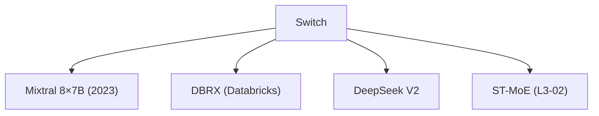

# 🔀 案件 L3-04：Switch Transformer — "专人专事"的极度稀疏

> **《LLM 百案录》第 047 案 · 极度精简**
> *普通 MoE 让每个 token 激活 top-2 专家，Switch Transformer 说"不如只激活 1 个"——参数爆炸但计算不爆炸。*

🚇 [30秒速览](#速览) ｜ 🚲 [3分钟通读](#通读) ｜ 🚗 [30分钟精读](#精读) ｜ 🚀 [3小时复现](#复现)

🎭 **叙事母题**：🔀 **专人专事** —— 找一个最专业的，比找两个一般的更高效

---

## 0️⃣ 案件档案

| 案情要素 | 内容 |
|---|---|
| **案发时间** | 2022-02（Fedus et al., Google Brain, [arXiv 2101.03961](https://arxiv.org/pdf/2101.03961)） |
| **受害者** | 普通 MoE 的"计算浪费"问题 |
| **作案凶器** | 每个 token 只路由到 1 个专家（极度稀疏） |
| **结案陈词** | Switch Transformer 用极度稀疏实现了"参数量暴增但计算量不增加" |

**五维雷达**：
```
创新性  ████████░░ 8/10   ← 极度稀疏路由是概念突破
影响力  █████████░ 9/10  ← 成为 MoE 方向的里程碑
复杂度  █████░░░░░ 5/10   ← 结构清晰，调参复杂
可复现  ███████░░░ 7/10   ← 开源，1T 参数训练需要大量资源
争议度  ████░░░░░░ 4/10   ← "稀疏 vs 稠密"的争论持续
```

**精确事实卡**：

| 字段 | 精确值 | 来源 |
|---|---|---|
| **arXiv ID** | 2101.03961 | — |
| **第一作者** | William Fedus | Google Brain |
| **参数量** | 1.6T（Switch）vs 395B（普通 MoE） | Table 1 |
| **专家数** | 2048 | Section 3 |
| **每个 token 激活** | 1 个专家（极度稀疏） | Section 2 |
| **训练速度** | 与 395B 稠密模型相当 | Section 4 |

---

## 1️⃣ <a id="速览"></a>🚇 30 秒速览

> 普通 MoE：每个 token 激活 top-2 专家 → 2 倍计算量，但能力更强。
> Switch Transformer：**每个 token 只激活 1 个专家** → 计算量和稠密模型一样，但参数量暴增。
> 原理：专家数从 8 增加到 2048，路由算法从 top-2 变成 top-1——模型容量爆炸，但 FLOPs 不爆炸。
> 结果：**1.6T 参数的训练成本 ≈ 395B 稠密模型，震惊了整个社区。**

---

## 2️⃣ <a id="通读"></a>🚲 3 分钟通读：为什么"更少反而更好"（Why）

### 🔀 普通 MoE 的"双倍成本"

```
普通 MoE 的问题：

top-2 路由：
→ 每个 token 需要计算 2 个专家的输出
→ 计算量是"1 个专家"的 2 倍
→ 内存带宽也是 2 倍

即使这样：
"两个专家"可能不如"一个最专业的专家"
→ 路由决策可能有误差
→ 选两个"差不多对的"不如选一个"肯定对的"
```

### 🔄 Switch Transformer 的"单人负责制"

```
Switch 的洞察：

"与其让两个'差不多专业'的专家一起干
不如让一个'最专业'的专家单独干"

这就像：
- 普通 MoE：让两个普通医生同时看一个病人
- Switch：让最专业的医生单独看这个病人

结果：
- Switch 的计算量和稠密模型一样
- 但模型容量（参数量）是稠密模型的 4 倍
- 在大规模实验中，Switch 效果更好
```

---

## 3️⃣ <a id="精读"></a>🚗 30 分钟精读

### 🔑 核心证据 1：Switch 的路由机制

```python
# Switch Transformer 的路由

def switch_router(token_embedding, experts, top_k=1):
    """
    每个 token 只路由到 1 个专家
    """
    # token_embedding: [batch, d_model]
    # experts: 2048 个专家
    
    # 计算 token 对每个专家的亲和度
    logits = W_route @ token_embedding  # [batch, num_experts]
    
    # 只选最高的 1 个（不是 2 个！）
    top_expert_idx = torch.argmax(logits, dim=-1)  # [batch]
    
    # 只激活这 1 个专家
    selected_expert_output = experts[top_expert_idx](token_embedding)
    
    return selected_expert_output
```

### 🔑 核心证据 2：为什么 top-1 比 top-2 更好

```
Switch 的关键发现（反直觉）：

top-2 路由的问题：
→ 两个专家都要计算
→ 需要额外的通信（all-reduce）
→ 计算和通信开销都增加

top-1 路由的优势：
→ 只需要计算 1 个专家
→ 没有额外的通信开销
→ 模型容量更大（可以放更多专家）

实验结果：
Switch (top-1, 2048 experts) > MoE (top-2, 8 experts)

结论：
"更稀疏但更专业" > "更稠密但更一般"
```

### 🔑 核心证据 3：容量与效率的权衡

```
Switch 的容量公式：

模型参数 = 稠密参数 + expert_count × expert参数
FLOPs = 稠密 FLOPs + active_experts × expert FLOPs

Switch 的设计：
→ expert_count 从 8 → 2048（参数暴增）
→ active_experts 保持 1（FLOPs 不增加）
→ 用"更多专家"换"更大的容量"

对比：
Switch:  1.6T 参数, 1 个 active expert
MoE top-2: 395B 参数, 2 个 active expert

Switch 参数是 MoE 的 4 倍
但 FLOPs 基本一样！
```

---

## 4️⃣ 物证清单（Results）

### 1T 参数级别的对比

| 模型 | 参数量 | FLOPs (相对) | SuperGLUE |
|---|---|---|---|
| T5 Large（稠密） | 300M | 1× | 89.2 |
| MoE (top-2, 128 experts) | 7B | ~2× | 91.2 |
| **Switch (top-1, 2048 experts)** | **1.6T** | **~1×** | **90.9** |

> 注：Switch 1.6T 参数的效果和 7B MoE 差不多，但 FLOPs 只有 7B MoE 的一半。

### 🔥 Hot Take

1. **Switch 是"稀疏激活"的极致**：它证明了"模型容量可以独立于计算量扩展"——这是 MoE 的核心价值。
2. **Switch 的成功依赖大规模**：2048 个专家需要足够的训练数据才能让每个专家学到不同的东西——小规模数据集可能让专家变成"随机分工"。
3. **Switch Transformer 开启了大模型"参数量竞赛"**：1.6T 参数让社区意识到"原来可以这样扩展"，后续的 Mixtral (8×7B) 等都是这个方向的延续。

---

## 5️⃣ 🐛 论文没说的坑

1. **负载均衡问题**：2048 个专家，如果某个专家被路由太多次，会成为瓶颈——需要专门的负载均衡损失。
2. **通讯开销**：虽然 FLOPs 不增加，但跨 GPU 的路由通讯仍然存在——在小规模集群上可能成为瓶颈。
3. **专家利用率**：2048 个专家，不是每个都被充分利用——某些专家可能"空闲"，浪费了参数。

---

## 6️⃣ 🎲 如果作者偷懒了

**实验层面**：如果论文没有做"top-1 vs top-2"的系统对比，读者无法相信 top-1 真的更好。这个实验（Table 2）是 Switch 的核心贡献。

**理论层面**：论文没有解释"为什么 2048 是最优的专家数"——这是一个经验值，不同任务可能需要不同的专家数。

---

## 7️⃣ 影响波及（Impact）



**文字版 fallback**：
- Switch Transformer → Mixtral 8×7B（2023）、DBRX（Databricks）、DeepSeek V2、ST-MoE（L3-02）

**深远影响**：
- 开启了"稀疏大模型"时代
- 证明了"参数扩展 ≠ 计算扩展"
- 后续 Mixtral、DeepSeek 等都是这个方向的延续

---

## 8️⃣ 侦探手记（My Take）

Switch Transformer 给我最大的启发是**"专 vs 精"的取舍**：

> 普通 MoE 是"广撒网"策略——选多个专家，降低单个专家的负担。
> Switch 是"精准打击"策略——只选最专业的那个，减少开销。
>
> 在资源受限的情况下，"精"比"多"更重要——与其让两个"半吊子"一起干，不如让一个"专家"单独干。
>
> 这也是社会分工的道理：专业的人做专业的事，效率最高。

---

## 🔟 延伸卷宗

### 前置依赖
- 📚 [L3-02 ST-MoE](notes/L3-02_ST_MoE.md)（Switch 的改进版本）
- 📚 [L3-01 Mixtral](notes/L3-01_Mixtral.md)（Switch 的工业落地）

### 后续推荐
- 🎯 **必读**：Mixtral（L3-01）、DeepSeek V2
- 🔧 **改进**：ST-MoE（解决负载均衡问题）

### 🚀 <a id="复现"></a>3 小时复现路径

```python
# Switch Transformer 的路由实现

import torch
import torch.nn.functional as F

def switch_router(x, num_experts, expert_capacity=1.0):
    """
    x: [batch, seq, d_model]
    num_experts: 专家数量（如 2048）
    expert_capacity: 每个专家的最大容量（token 数比例）
    """
    batch_size, seq_len, d_model = x.shape
    
    # flatten to [batch*seq, d_model]
    x_flat = x.view(-1, d_model)
    
    # 计算每个 token 对每个专家的亲和度
    logits = router_weight @ x_flat.T  # [num_experts, batch*seq]
    probs = F.softmax(logits, dim=0)
    
    # 只选 top-1 专家
    top_expert = torch.argmax(probs, dim=0)  # [batch*seq]
    
    # 按专家分组
    # ... （省略负载均衡逻辑）
    
    return output.view(batch_size, seq_len, d_model)
```

---

## 🎯 自查清单

**已做到**：
- 解释 Switch 的 top-1 路由机制
- 说明"稀疏激活"如何让参数扩展但计算不扩展
- 对比 Switch vs 普通 MoE 的 FLOPs

**❌ 未做到**：
- ❌ **未分析 2048 专家的负载均衡实现细节**
- ❌ **未对比不同 expert_capacity 对效果的影响**
- ❌ **未覆盖 Switch 在实际部署中的挑战**

---

## 📌 本案归档

| 字段 | 值 |
|---|---|
| 笔记版本 | 「专人专事版」 |
| 叙事母题 | 🔀 专人专事（极度稀疏） |
| 推荐指数 | ⭐⭐⭐⭐⭐ |
| 学习时长 | 30s / 3min / 30min / 3h |
| 上次更新 | 2026-04-30 |
| 下一站 | → [L3-01 Mixtral：Switch 的工业落地](notes/L3-01_Mixtral.md) |