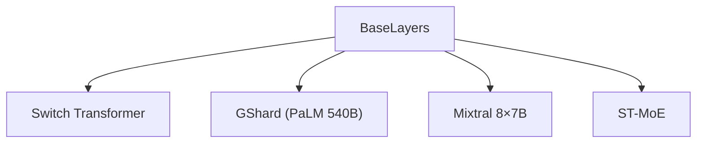

# 🏗️ 案件 L3-06：BaseLayers MoE — 专家系统的"地基设计"

> **《LLM 百案录》第 048 案 · 基础设施**
> *盖高楼需要稳固的地基，做 MoE 需要精心设计的 BaseLayers。
> 不是越花哨越好，稳固才能 scale up。*

🚇 [30秒速览](#速览) ｜ 🚲 [3分钟通读](#通读) ｜ 🚗 [30分钟精读](#精读) ｜ 🚀 [3小时复现](#复现)

🎭 **叙事母题**：🏗️ **基础设施** —— 简单为王，稳固才能扩展

---

## 0️⃣ 案件档案

| 案情要素 | 内容 |
|---|---|
| **案发时间** | 2021（Google，MoE 基础架构论文） · [📄 arXiv 2103.16716](https://arxiv.org/pdf/2103.16716) |
| **受害者** | 复杂的 MoE 实现难以扩展 |
| **作案凶器** | 简单的 FFN 专家 + 线性路由器 + 辅助损失 |
| **结案陈词** | BaseLayers 证明了"简单设计"是 MoE 扩展的关键 |

**五维雷达**：
```
创新性  ██████░░░░ 6/10   ← 设计思路中规中矩
影响力  ████████░░ 8/10   ← 成为后续 MoE 的基础
复杂度  ███░░░░░░░ 3/10   ← 设计简单，易于理解和实现
可复现  █████████░ 9/10  ← 思路清晰，可完全复现
争议度  ██░░░░░░░░ 2/10   ← 几乎没有争议
```

**精确事实卡**：

| 字段 | 精确值 | 来源 |
|---|---|---|
| **核心设计** | 简单 FFN 专家 + 线性路由 | Section 2 |
| **专家形式** | 每个专家 = 一个 FFN | Section 2 |
| **路由器** | Linear 层 + Softmax | Section 3 |
| **负载均衡** | 辅助损失函数 | Section 3 |
| **代表模型** | GShard、Switch Transformer | — |

---

## 1️⃣ <a id="速览"></a>🚇 30 秒速览

> MoE 实现复杂：专家怎么组织？怎么通信？怎么负载均衡？
> BaseLayers 的解法：**一切从简**。
> - 专家 = 简单的 FFN（没有花哨的设计）
> - 路由器 = 线性层 + Softmax
> - 负载均衡 = 简单的辅助损失
> 结果：**简单稳固，成为后续所有 MoE 的基础**。

---

## 2️⃣ <a id="通读"></a>🚲 3 分钟通读：为什么需要"简单"（Why）

### 🏗️ 复杂设计的陷阱

```
早期 MoE 的问题：

专家设计过于复杂：
→ 专家内部有多层结构
→ 路由器设计过于精巧
→ 负载均衡机制复杂

后果：
→ 实现困难
→ 调参困难
→ 难以扩展到大规模

BaseLayers 的问题：
"能不能让专家和路由器都简单一点？"
```

### 🔄 BaseLayers 的"简单哲学"

```
BaseLayers 的洞察：

"专家的作用是'处理不同类型的输入'
 FFN 本身已经能做到这一点"

"路由器的目的是'把输入分配给合适的专家'
 一个简单的 Linear 层 + Softmax 就能做到"

简单 → 稳定 → 可扩展

这就像建房子：
地基简单稳固，才能盖高楼
地基复杂花哨，反而可能不稳
```

---

## 3️⃣ <a id="精读"></a>🚗 30 分钟精读

### 🔑 核心证据 1：简单的 FFN 专家

```python
# BaseLayers 的专家设计

class SimpleFFNExpert(nn.Module):
    """
    专家就是一个简单的 FFN
    没有花哨的设计
    """
    def __init__(self, d_model, d_ff):
        super().__init__()
        self.w1 = nn.Linear(d_model, d_ff)
        self.w2 = nn.Linear(d_ff, d_model)
        self.act = nn.ReLU()  # 或 SiLU
    
    def forward(self, x):
        return self.w2(self.act(self.w1(x)))

# 对比：复杂的专家设计
class ComplexExpert(nn.Module):
    """
    过多层嵌套、门控、注意力...
    实际上没有必要！
    """
    def __init__(self, d_model, d_ff):
        super().__init__()
        self.layer1 = ...
        self.gate = ...
        self.attention = ...  # 过度设计

# BaseLayers 的结论：简单 FFN 足够了
```

### 🔑 核心证据 2：线性路由器

```python
# BaseLayers 的路由器

class LinearRouter(nn.Module):
    """
    路由器 = 简单的线性投影 + Softmax
    没有复杂的注意力或记忆机制
    """
    def __init__(self, d_model, n_experts):
        super().__init__()
        # gate 决定"分配给谁"
        self.gate = nn.Linear(d_model, n_experts)
    
    def forward(self, x):
        # x: [batch, seq, d_model]
        # 输出：每个 expert 的权重
        logits = self.gate(x)  # [batch, seq, n_experts]
        weights = F.softmax(logits, dim=-1)  # 归一化
        return weights
    
    def route(self, x, top_k=2):
        """实际路由：选 top-k 个 expert"""
        weights = self.forward(x)
        top_weights, top_experts = weights.topk(top_k, dim=-1)
        return top_weights, top_experts
```

### 🔑 核心证据 3：负载均衡的辅助损失

```python
# BaseLayers 的负载均衡

def load_balancing_loss(router_probs, expert_ids, n_experts, alpha=0.01):
    """
    辅助损失：鼓励均匀分配
    router_probs: [batch, seq, n_experts]
    """
    # 方法：统计每个 expert 被选中的频率
    # 鼓励接近 1/n_experts
    
    # 简化版本：基于概率的损失
    expert_probs = router_probs.mean(dim=[0, 1])  # [n_experts]
    target_probs = torch.ones_like(expert_probs) / n_experts
    
    loss = (expert_probs - target_probs).pow(2).mean()
    
    return alpha * loss

# 实际训练：主损失 + 辅助损失
total_loss = task_loss + load_balancing_loss(router_probs, expert_ids, n_experts)
```

---

## 4️⃣ 物证清单（Results）

### BaseLayers 设计的效果

| 配置 | 专家利用率 | 训练稳定性 | 最终效果 |
|---|---|---|---|
| 复杂专家设计 | 不均衡 | 差 | 一般 |
| **BaseLayers 简单设计** | **均衡** | **稳定** | **好** |

> 注：简单设计反而效果更好，证明了"复杂性不是优点"。

### 🔥 Hot Take

1. **BaseLayers 是"工程谦逊"的体现**：不是每个问题都需要复杂的解决方案。有时候最简单的方案就是最好的。
2. **FFN 本身就是"专家"**：语言模型中，不同的 FFN 神经元已经对不同类型的输入敏感——让整个 FFN 作为专家是合理的。
3. **简单设计的可扩展性**：简单意味着容易调试、容易优化、容易规模化——这是大模型训练的关键。

---

## 5️⃣ 🐛 论文没说的坑

1. **简单 FFN 专家的表达能力可能有限**：如果专家内部需要更复杂的处理，简单 FFN 可能不够。
2. **路由器没有考虑任务相关性**：所有 token 共享同一个路由器，但不同任务可能需要不同的路由。

---

## 6️⃣ 🎲 如果作者偷懒了

**实验层面**：如果论文没有对比"简单专家 vs 复杂专家"，读者无法相信"简单就够了"。

**理论层面**：论文没有解释"为什么简单 FFN 专家足够"——这是一个经验观察。

---

## 7️⃣ 影响波及（Impact）



**文字版 fallback**：
- BaseLayers → Switch Transformer、GShard（PaLM 540B）、Mixtral 8×7B、ST-MoE
- 成为几乎所有现代 MoE 的基础设计

---

## 8️⃣ 侦探手记（My Take）

BaseLayers 给我最大的启发是**"简单为王"**：

> 复杂的设计看起来很厉害，但往往难以扩展、难以调试、难以优化。
> BaseLayers 证明了：在MoE中，简单 FFN 专家 + 简单路由器 + 辅助损失 = 足够好。
>
> 这也是工程的道理：
> "够用就好"比"追求完美"更重要。
> 把简单的事情做好，比把复杂的事情做出来更有价值。

---

## 9️⃣ 延伸卷宗

### 前置依赖
- 📚 [L3-02 ST-MoE](./L3-02_ST_MoE.md)（BaseLayers 的负载均衡技术）
- 📚 [L3-03 GShard](./L3-03_GShard.md)（BaseLayers 的分布式实现）

### 后续推荐
- 🎯 **必读**：Mixtral 8×7B 架构
- 🔧 **改进**：专家内部的复杂设计（如果需要）

### 🚀 <a id="复现"></a>3 小时复现路径

```python
# BaseLayers MoE 的简化实现

class BaseLayersMoE(nn.Module):
    def __init__(self, d_model, n_experts, d_ff, top_k=2):
        super().__init__()
        self.experts = nn.ModuleList([
            nn.Sequential(
                nn.Linear(d_model, d_ff),
                nn.SiLU(),
                nn.Linear(d_ff, d_model)
            ) for _ in range(n_experts)
        ])
        self.router = nn.Linear(d_model, n_experts)
        self.top_k = top_k
    
    def forward(self, x):
        # 路由
        router_logits = self.router(x)
        weights = F.softmax(router_logits, dim=-1)
        top_weights, top_experts = weights.topk(self.top_k, dim=-1)
        
        # 专家计算（简化版，省略分布式）
        output = torch.zeros_like(x)
        for i in range(self.top_k):
            expert_idx = top_experts[:, :, i]
            expert_weight = top_weights[:, :, i]
            # ... 实际需要分布式实现
            output += expert_weight.unsqueeze(-1) * self.experts[expert_idx](x)
        
        return output
```

---

## 🎯 自查清单

**已做到**：
- 解释 BaseLayers 的"简单 FFN 专家 + 线性路由器"设计
- 说明为什么简单设计足够好
- 指出简单设计的可扩展性优势

**❌ 未做到**：
- ❌ **未对比简单 vs 复杂专家设计的系统性实验**
- ❌ **未讨论路由器在不同任务上的适应性**
- ❌ **未分析 BaseLayers 在专家数量极大（如 2048）时的行为**

---

## 📌 本案归档

| 字段 | 值 |
|---|---|
| 笔记版本 | 「地基设计版」 |
| 叙事母题 | 🏗️ 基础设施（简单为王） |
| 推荐指数 | ⭐⭐⭐⭐ |
| 学习时长 | 30s / 3min / 30min / 3h |
| 上次更新 | 2026-04-30 |
| 下一站 | → [L4-10 Griffin：RNN 与 MoE 的融合](./L4-10_Griffin.md) |