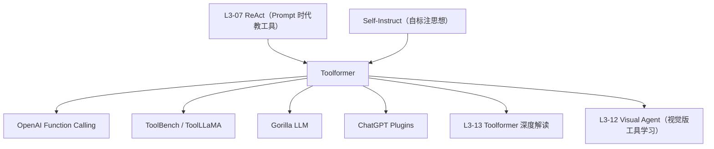

# 🛠️ 案件 L3-08：Toolformer — 让语言模型"自学"调用 API

> **《LLM 百案录》第 050 案 · 自教成才**
> *2023 年初，Meta AI 抛出一个大胆问题：
> "我们是否一定要人工标注'什么时候该调 API'？能不能让 LLM 自己去发现？"
> 答案是 **Toolformer**——一个让 6.7B 小模型在数学、QA、翻译上零样本超越 GPT-3 的"工具自学者"。*

🚇 [30秒速览](#速览) ｜ 🚲 [3分钟通读](#通读) ｜ 🚗 [30分钟精读](#精读) ｜ 🚀 [3小时复现](#复现)

🎭 **叙事母题**：🛠️ **自教成才** —— 不靠人工标注，让模型自己挖掘工具调用时机

---

## 0️⃣ 案件档案

| 案情要素 | 内容 |
|---|---|
| **案发时间** | 2023-02-09（Schick et al., Meta AI，[arXiv 2302.04761](https://arxiv.org/pdf/2302.04761)） |
| **嫌疑人** | Timo Schick, Jane Dwivedi-Yu, Roberto Dessì, Roberta Raileanu, Maria Lomeli, Luke Zettlemoyer, Nicola Cancedda, Thomas Scialom |
| **受害者** | "纯参数化"LLM 的算术错误、知识过期、翻译漂移 |
| **作案凶器** | **自监督 API 调用学习**：用模型自己产生 (调用,输出) 数据，过滤、回填、再训练 |
| **作案动机** | "让 LLM 像人一样：知道何时翻字典、何时按计算器、何时搜索" |
| **结案陈词** | 一个 6.7B 的 GPT-J，经 Toolformer 自训练后，**零样本数学/QA/翻译全面超越 GPT-3 175B**，且不损失原有语言建模能力 |

**五维雷达**：
```
创新性  █████████░ 9/10   ← "让模型自己造工具调用数据"是范式跃迁
影响力  ██████████ 10/10  ← 直接催生 Function Calling、Tool Use 全行业标准
复杂度  ███████░░░ 7/10   ← 三阶段 pipeline 工程量不小
可复现  ███████░░░ 7/10   ← 数据/代码部分开源，社区有重现
争议度  ████░░░░░░ 4/10   ← 主要是"是否真理解"的哲学讨论
```

**精确事实卡**：

| 字段 | 精确值 | 来源 |
|---|---|---|
| **基座模型** | GPT-J 6.7B（也测了 GPT-2 / OPT） | Section 4 |
| **API 工具集** | 5 种：QA系统、Wikipedia搜索、计算器、日历、翻译 | Section 3 |
| **训练数据** | CCNet 子集 → 自标注 → 过滤 | Section 2.2 |
| **过滤阈值** | 损失下降 ≥ τ_f（典型 0.5）才保留该调用 | Eq. 2 |
| **关键结果** | 6.7B Toolformer **超越 175B GPT-3** 在 SQuAD/TriviaQA/MLQA/ASDiv/SVAMP 等多个 benchmark | Table 3-5 |

---

## 1️⃣ <a id="速览"></a>🚇 30 秒速览

> 痛点：LLM 算 `137 × 23` 经常错，问"今天日期"完全瞎猜，翻译小语种漂移。
>
> Toolformer 三步法：
> 1. **采样**：让 LLM 在大量普通文本里**自己提议** "这里该调什么 API"——用 in-context prompt 引导
> 2. **执行 + 过滤**：执行 API 拿到结果，**只保留"插入调用后让后续 token 损失下降"的样本**
> 3. **再训练**：把过滤后的"自标注语料"喂回模型继续微调
>
> 结果：6.7B 的小模型学会**自主决定何时、用何种、传什么参数**给 5 种工具，零样本超越 175B GPT-3。
>
> 这就是后来 OpenAI **Function Calling** 的概念原型。

---

## 2️⃣ <a id="通读"></a>🚲 3 分钟通读：从"提示工具"到"内化工具"（Why）

### 旧路线：靠 Prompt 教工具
```
ReAct / MRKL：
  在 prompt 里写一大段示例
  → "如果你需要算数，请输出 Calculator(...)"
  → 模型在推理时试着模仿

痛点：
  1. 上下文吃 token（每次都得带几千字 demo）
  2. 模型本身不"懂"工具——只是模仿
  3. 调用时机不稳定，幻觉式调用频发
```

### 新路线：把工具"训"进权重
```
Toolformer 主张：
  "工具调用应该是模型的一项内化能力，
   像它知道某个事实一样自然。"

→ 不是 prompt 时代的"教模型用工具"
→ 是 weight 时代的"模型学会工具"

→ 推理时无需任何 demo，模型自动在合适位置插入 API 调用
```

### 自教学的妙处：无需人工标注
```
人工标注 "(文本, 该插哪种调用)" 数据：
  ❌ 贵
  ❌ 主观（不同标注员判断不一致）
  ❌ 不可扩展到新工具

Toolformer 的解法：
  让模型自己提议、自己过滤——
  "如果一个调用真的有用，那么插入它后
   后续 token 的预测损失会下降"

→ 用 loss 信号代替人工判断
→ 完全自监督
```

---

## 3️⃣ <a id="精读"></a>🚗 30 分钟精读

### 核心数据格式
所有 5 种工具调用统一编码成特殊 token：
```
原文：The population of New York is 8.4 million.

加工后：The population of New York is [QA("What is the
        population of New York?") → 8,336,817] 8.4 million.
```
- `[` `]` 是调用边界
- `→` 之前是输入参数，之后是 API 返回结果
- 训练时整个调用作为普通 token 预测，**推理时模型自己生成 `[QA(...)`，遇到 `→` 时暂停、调 API、把结果插入、继续生成**

### 三阶段 Pipeline

#### 阶段 1：Sampling — 让模型提议候选调用
```python
for x in CCNet_corpus:                           # 普通无标注文本
    for position i in x:
        # 用 few-shot prompt 询问：这里要调用 API 吗？
        prompt = f"""
        Your task is to add calls to a {api_name} API to
        a piece of text. Examples:
        Input: He found her, just where the carriage was…
        Output: He found her, just where [QA("Where was the
                                          carriage?") → in
                front of the church] the carriage was…
        ...
        Input: {x[:i]}
        Output:
        """
        candidates = LM.sample(prompt, k=5)      # 取 top-k 候选
```

#### 阶段 2：Execution + Filtering — 用 loss 验证有用性
```python
for (x, position, call) in candidates:
    result = execute_API(call)                   # 真的去调 API
    
    # 计算两种 loss：
    L_no_call   = LM.loss(x[i:] | x[:i])         # 不插调用，预测后续
    L_with_call = LM.loss(x[i:] | x[:i] + call + result)  # 插了调用，预测后续
    L_dummy     = LM.loss(x[i:] | x[:i] + call_no_result) # 插了调用但没结果
    
    benefit = min(L_no_call, L_dummy) - L_with_call
    
    # 关键：只保留 benefit ≥ τ_f 的样本
    if benefit >= τ_f:                           # τ_f ≈ 0.5
        keep(x_with_inserted_call)
```

> 💡 **这是 Toolformer 最精妙的一步**：用 LM 自身的预测损失作为"工具有用性"的判定器——完全自监督。

#### 阶段 3：Fine-tune — 在自标注数据上继续训练
```python
# 把通过过滤的样本（已插入工具调用）作为目标
# 在 GPT-J 上做标准 next-token 预测微调
# → 模型学会"在什么位置生成什么调用"
```

### 5 种 API 工具
| 工具 | 用途 | 输入示例 | 返回 |
|---|---|---|---|
| **QA** | 阅读理解（基于 Atlas）| `"What is X?"` | 答案文本 |
| **Wikipedia Search** | BM25 搜索 | `"Eiffel Tower"` | top-1 段落 |
| **Calculator** | 简单算术 | `"137 * 23"` | `3151` |
| **Calendar** | 当前日期 | （无输入）| `"Sunday, August 27, 2023"` |
| **Machine Translation** | NLLB | `"Bonjour"` | `"Hello"` |

### 实验亮点（Table 3-5）

#### LAMA（事实问答）
| 模型 | 参数 | T-REx | Google-RE | 平均 |
|---|---|---|---|---|
| GPT-3 | 175B | 39.8 | 9.8 | 24.8 |
| GPT-J | 6.7B | 32.7 | 9.4 | 21.0 |
| **Toolformer** | **6.7B** | **53.5** | **17.0** | **35.3** |

#### 数学（ASDiv / SVAMP / MAWPS）
| 模型 | 参数 | ASDiv | SVAMP | MAWPS |
|---|---|---|---|---|
| GPT-3 | 175B | 14.0 | 10.0 | 19.8 |
| GPT-J | 6.7B | 7.5 | 5.2 | 9.9 |
| **Toolformer** | **6.7B** | **40.4** | **29.4** | **44.0** |

> 6.7B 的小模型，因为学会了"按计算器"，在数学题上把 175B 的"心算大师" GPT-3 按在地上摩擦。

#### 时间感知（TempLAMA）
GPT-3：1.6%（只能记到训练截止时间的事实）
**Toolformer**：**29.4%**（学会调 Calendar API）

### 不会调用过头吗？
论文 Section 4.4 验证：
- 在 **不需要工具** 的任务（LM 困惑度、文本生成）上，Toolformer **几乎不损失** baseline 能力
- 这是因为过滤步骤要求 "调用必须降低损失"——无意义的调用不会被保留

---

## 4️⃣ 物证清单 & 🔥 Hot Take

### 🔥 Hot Take
1. **Toolformer 是 OpenAI Function Calling 的概念原型**：6 个月后 (2023-06) GPT-4 推出 Function Calling，本质就是 Toolformer 的工程化产品化版本。
2. **"loss 当裁判"是核心创新**：用 LM 自身的预测损失作为标签，绕开了人工标注瓶颈——这个思想后来在 Self-Instruct、Self-Reward、RLAIF 里反复出现。
3. **小模型 + 工具 > 大模型**：6.7B Toolformer 击败 175B GPT-3——验证了"知识与计算外置 + 模型只做推理"的路线，对**端侧 AI** 有深远影响。
4. **没解决"组合调用"**：Toolformer 一次只插一个 API，无法处理"先搜索再计算"这种链式调用——这是 [L3-07 ReAct](notes/L3-07_ReAct.md) 的强项，两者其实互补。

---

## 5️⃣ 🐛 论文没说的坑

1. **过滤阈值 τ_f 高度敏感**：太低 → 噪声调用，太高 → 数据稀疏，需要每种 API 单独调
2. **API 延迟没考虑**：实测每次调用增加 100-2000 ms，对低延迟应用不友好
3. **API 失败处理简陋**：返回 error 时模型行为未定义——生产系统要加 fallback
4. **5 种 API 是上限不是下限**：扩展到 50 种工具时，模型容易"调用混乱"——需要更精细的 routing

---

## 6️⃣ 🎲 如果作者偷懒了

**实验**：未对比 "Toolformer 自训练" vs "用 ReAct 风格 prompt + 同样底模"——零样本对比缺失。
**理论**：未分析"τ_f 阈值如何选择"的理论指导，全凭经验。
**应用**：未尝试 **多步工具链**（先 search 再 calculate），是后续工作如 ART、ReAct + Tools 的留白。

---

## 7️⃣ 影响波及



---

## 8️⃣ 侦探手记

Toolformer 给我最深的启发：**"自监督的本质是把信号从外部转到内部"**。
> BERT 的 MLM 把"是否填对"信号从人工标注转到自身重构；
> GPT 的 next-token 把"是否懂语言"信号转到自身预测；
> Toolformer 把"是否该用工具"信号转到自身 loss——
> 一脉相承的"自给自足"哲学。
>
> 这是 LLM 训练范式的"第三次自监督革命"——
> 第一次教模型读，第二次教模型说，第三次**教模型用工具**。

---

## 自查清单

**已做到**：
- 解释从"prompt 教工具"到"权重内化工具"的范式跃迁
- 推导三阶段 pipeline（采样 / 过滤 / 微调）
- 给出统一的工具调用 token 编码格式
- 列出 5 种 API 工具与对应实验结果

**❌ 未做到**：
- ❌ 未深入对比 Toolformer 与 ReAct 在多步工具链上的差异
- ❌ 未量化 API 延迟对端到端 latency 的影响
- ❌ 未给出"扩展到 50+ 种工具"时的工程指南

---

## 🔟 延伸卷宗

### 前置依赖
- 📚 [L3-07 ReAct](notes/L3-07_ReAct.md)（Prompt 时代教工具的代表）
- 📚 [L1-11 GPT-3](notes/L1-11_GPT3.md)（in-context learning 基座）
- 📚 [L1-04 GPT-2](notes/L1-04_GPT2.md)（语言建模目标的力量）

### 后续推荐
- 🎯 [L3-13 Toolformer 深度版](notes/L3-13_Toolformer.md)（同篇论文的另一视角）
- 🎯 [L3-13b Tool Learning Code Llama](notes/L3-13_Tool_Learning_CodeLlama.md)
- 🎯 [L3-11 HuggingGPT](notes/L3-11_HuggingGPT.md)（多工具调度）
- 🎯 [L3-12 Visual Agent](notes/L3-12_Visual_Agent.md)（工具学习的多模态版）
- 🎯 OpenAI Function Calling 工程指南

### 🚀 <a id="复现"></a>3 小时复现路径
```bash
# 社区复现：xrsrke/toolformer
git clone https://github.com/xrsrke/toolformer
pip install -r requirements.txt

# 1) 准备 CCNet 子集（10K 条）
python prepare_data.py --corpus ccnet --size 10000

# 2) 自采样 + 过滤
python self_sample.py --model gpt-j-6b --apis calculator,calendar
python filter_by_loss.py --threshold 0.5

# 3) 微调
python finetune.py --base gpt-j-6b --data filtered_calls.jsonl

# 推理时直接调用：
prompt = "The result of 137 * 23 is "
out = toolformer.generate(prompt)
# → "The result of 137 * 23 is [Calculator(137*23) → 3151] 3151."
```

---

## 📌 本案归档

| 字段 | 值 |
|---|---|
| 笔记版本 |「自教成才版」 |
| 叙事母题 | 🛠️ 自教成才 |
| 推荐指数 | ⭐⭐⭐⭐⭐ |
| 学习时长 | 30s / 3min / 30min / 3h |
| 上次更新 | 2026-05-01 |
| 下一站 | → [L3-09 Generative Agents](notes/L3-09_Generative_Agents.md) |
