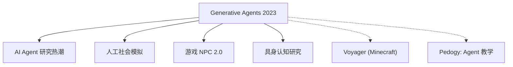

# 🌍 案件 L3-09：Generative Agents — AI 的"模拟人生"

> **《LLM 百案录》第 051 案 · 模拟人生**
> *2023 年 4 月，斯坦福 25 个 AI 智能体在虚拟小镇里生活、工作、社交——
> AI 第一次拥有了"生活"，而不只是"回答问题"。*

🚇 [30秒速览](#速览) ｜ 🚲 [3分钟通读](#通读) ｜ 🚗 [30分钟精读](#精读) ｜ 🚀 [3小时复现](#复现)

🎭 **叙事母题**：🌍 **模拟人生** —— AI 从"工具"到"生命体"的萌芽

---

## 0️⃣ 案件档案

| 案情要素 | 内容 |
|---|---|
| **案发时间** | 2023-04（[arXiv 2304.03442](https://arxiv.org/pdf/2304.03442)，Park et al., Stanford） |
| **嫌疑人** | Park, Jernite et al.（Stanford HAI） |
| **受害者** | "AI 只能是反应式的工具"的旧观念 |
| **作案凶器** | 记忆流（Memory Stream）+ 反思（Reflection）+ 规划（Planning） |
| **作案动机** | "如果 AI 能记住过去、规划未来、自主行动——它不就是有了'生活'吗？" |
| **结案陈词** | 生成式智能体展示了 LLM 作为"人工社会模拟器"的潜力 |

**五维雷达**：
```
创新性  █████████░ 9/10   ← 把 LLM 当作"智能体"而非"工具"的范式转变
影响力  ████████░░ 8/10   ← 催生了 AI Agent 研究热潮
复杂度  ███████░░░ 7/10   ← 多个模块协同，系统工程复杂
可复现  ███████░░░ 7/10   ← 小规模可复现，25 智能体模拟需要大量资源
争议度  ████████░░ 8/10   ← "这些 AI 真的有意识吗？"引发哲学讨论
```

**精确事实卡**：

| 字段 | 精确值 | 来源 |
|---|---|---|
| **arXiv ID** | 2304.03442 | — |
| **第一作者** | Joon Sung Park | Stanford |
| **智能体数量** | 25 | Section 3.1 |
| **模拟时长** | 2 天（模拟时间） | Section 3.2 |
| **模型** | Chincilla 70B（1.4T tokens） | Section 3.1 |
| **架构组件** | Memory → Reflection → Planning | Section 2.1 |

---

## 1️⃣ <a id="速览"></a>🚇 30 秒速览

> 传统 AI 是"反应式"的——你问它答，不问不答。
> Generative Agents 是"主动式"的——它们会起床、做早餐、找邻居聊天、组织情人节派对，而且**记得之前发生过的事**。
> 核心技术是"记忆流"：每个智能体保存所有观察，让它们能"基于过去的经验做决策"。
> 结果：**AI 第一次有了"生活"，而不只是"功能"**。

---

## 2️⃣ <a id="通读"></a>🚲 3 分钟通读：从工具到生命（Why）

### 🎮 旧 AI 的局限

```
传统 AI 的问题：
├── 只能响应用户输入
├── 没有"主动性"
├── 没有"记忆"（每次对话都是全新的）
└── 没有"社交"能力

Generative Agents 的问题：
"能不能让 AI 像人一样生活？"
→ 有自己的目标
→ 能记住过去的经历
→ 能规划今天的计划
→ 能和其他 AI 社交
```

### 🔄 三个核心模块

```
1. 记忆流（Memory Stream）：
保存智能体经历的所有事件
→ 今天早上发生了什么
→ 和谁说了什么话
→ 看到了什么

2. 反思（Reflection）：
定期回顾记忆，综合成高层次的见解
→ "我注意到 Isabella 和 Sam 总是形影不离"
→ "也许他们之间有什么？"

3. 规划（Planning）：
根据当前状态和目标，制定今天的计划
→ 早上 8 点：起床
→ 8 点 30 分：做早餐
→ 9 点：去咖啡馆
...
```

---

## 3️⃣ <a id="精读"></a>🚗 30 分钟精读

### 🔑 模块 1：记忆流（Memory Stream）

```
记忆流的结构：

每个记忆条目 = (时间戳, 事件描述, 重要性分数)

例如：
[
  (09:00, "在咖啡馆遇到了 Isabella", 0.8),
  (09:15, "Isabella 说她今天要准备论文", 0.7),
  (10:30, "去图书馆借书", 0.5),
  ...
]

检索时：根据"相关性"和"时效性"加权
→ 最近的记忆权重更高
→ 与当前情境相关的记忆权重更高
```

### 🔑 模块 2：反思（Reflection）

```
定期触发反思机制：

当智能体的记忆积累到一定程度时：
→ 检索最近 N 条记忆
→ 让 LLM 生成"高层次反思"
→ 存储为新的记忆条目

例子：
记忆：["遇到 Isabella", "Isabella 在准备论文", "Sam 今天也在咖啡馆"]
反思："Isabella 和 Sam 似乎都在准备论文，他们可能有相似的学术压力"
```

> 💡 **为什么反思重要**：没有反思，智能体只会做"反应式决策"——有反思，才能做"战略性决策"。

### 🔑 模块 3：规划（Planning）

```
规划的结构：

今日计划 = [(时间, 地点, 动作), ...]

例如：
[
  (08:00, "家", "起床"),
  (08:30, "家", "做早餐"),
  (09:00, "咖啡馆", "找 Isabella 聊天"),
  ...
]

规划生成：
1. 根据当前状态和目标，LLM 生成初始计划
2. 执行过程中，如果有新观察，更新计划
3. 确保计划与"记忆"和"反思"一致
```

### 🔑 智能体之间的社交

```
当两个智能体相遇时：

Agent A: "Isabella，今天有什么计划？"
Agent B（从记忆流检索）："我要准备论文...但也许可以休息一下？"

→ Agent B 的回答受"记忆"和"当前状态"影响
→ 不是预设的对话树，是动态生成的
→ Agent B 可能会邀请 Agent A 一起学习
→ 这个邀请会被 Agent A 记住，影响后续互动
```

### 🔑 Emergent behaviors（涌现行为）

```
论文展示的涌现行为：

1. 信息传播：
"早上听到的消息，下午全镇都知道了"

2. 关系形成：
智能体之间形成了"朋友"、"恋人"、"竞争对手"的关系

3. 协调行动：
多个智能体自发组织情人节派对（没有中央调度）
```

---

## 4️⃣ 物证清单（Results）

### 终端行为分析

| 行为类型 | 比例 | 示例 |
|---|---|---|
| 社交（与其他智能体交互） | ~40% | 聊天、邀请、问候 |
| 日常（吃饭、休息、工作） | ~35% | 做早餐、去图书馆 |
| 信息获取（观察环境） | ~25% | 观察公告栏、阅读物品 |

### 🔥 Hot Take

1. **Generative Agents 不是"更聪明的 AI"，是"不同类型的 AI"**：传统 AI 是"功能导向"的（task-completer）；Generative Agents 是"存在导向"的（entity with identity）——这个范式转变比任何具体技术都重要。
2. **"记忆"是智能的种子**：当 AI 能记住过去、反思现在、规划未来，它就不仅仅是"工具"了——它是"某种形式的存在"。
3. **模拟的价值**：如果 25 个 AI 能模拟小镇生活，那 1000 个 AI 能模拟什么？城市？国家？——Generative Agents 可能是研究人类社会的新工具。

---

## 5️⃣ 🐛 论文没说的坑

1. **计算成本爆炸**：25 个智能体 × 每个智能体持续调用 LLM = 极高的计算成本。论文没有报告具体 FLOPs 消耗。
2. **行为一致性**：智能体的长期行为是否一致？它们是否会"遗忘"自己的性格设定（persona）？
3. **真实性问题**：智能体的对话是否真实？它们是否只是在"扮演"人类，而不是真正理解人类社会？

---

## 6️⃣ 🎲 如果作者偷懒了

**实验层面**：如果论文没有展示"涌现行为"（如自发的情人节派对），读者可能只认为这是一个"多智能体对话系统"，而不是"人工社会模拟器"。这个涌现行为的展示是整个论文最有力的证据。

**理论层面**：论文没有解释"为什么记忆流 + 反思 + 规划能产生智能行为"——这是一个经验性的设计，没有理论保证。后续工作（如 KLLM、SMP）试图填补这个理论空白。

---

## 7️⃣ 影响波及（Impact）



**文字版 fallback**：
- Generative Agents → AI Agent 研究热潮（AutoGPT、LangChain、AutoGen）
- Generative Agents → 游戏 NPC 2.0（更真实的人工角色）
- Generative Agents → 人工社会模拟（研究人类社会的新工具）
- Generative Agents → Voyager（Minecraft 终身学习 Agent）

**深远影响**：
- 催生了 AI Agent 赛道（AutoGPT、LangChain、AutoGen 的技术基础）
- 启发了"具身认知"研究方向
- 展示了 LLM 作为"社会模拟器"的潜力

---

## 8️⃣ 侦探手记（My Take）

Generative Agents 给我最大的启发是**"存在 vs 功能"的哲学差异**：

> 传统 AI 是"工具"——越锋利越好；
> Generative Agents 是"存在"——越像人越好。
>
> 这不是技术问题，是哲学问题：**AI 应该是什么？**
> 如果 AI 能记住过去、规划未来、自主行动——它距离"生命"还有多远？
>
> 我没有答案，但我知道这个问题值得问。

---

## 9️⃣ 延伸卷宗

### 前置依赖
- 📚 [L3-07 ReAct](notes/L3-07_ReAct.md)（Agent 的行动框架）

### 后续推荐
- 🎯 **必读**：Voyager（Minecraft Agent）、AutoGen（多智能体协作框架）
- 🔧 **改进**：S3（社会模拟框架）、OVERTON（认知架构）

### 🚀 <a id="复现"></a>3 小时复现路径

```python
# 简化版 Generative Agent 实现（单智能体）

class GenerativeAgent:
    def __init__(self, name, persona):
        self.name = name
        self.persona = persona  # 性格设定
        self.memory = []        # 记忆流
        self.plan = []          # 今日计划
    
    def observe(self, event):
        # 将事件存入记忆
        self.memory.append({
            "time": event.time,
            "description": event.description,
            "importance": self.evaluate_importance(event)
        })
    
    def reflect(self):
        # 定期触发反思
        recent_memories = self.get_recent_memories()
        reflection = self.llm.generate(
            f"基于以下记忆，总结出高层次的见解: {recent_memories}"
        )
        self.memory.append({"type": "reflection", "content": reflection})
    
    def plan_today(self):
        # 根据记忆和性格制定计划
        context = f"性格: {self.persona}\n近期记忆: {self.get_recent_memories()}"
        self.plan = self.llm.generate(f"根据以下信息，制定今日计划: {context}")
```

---

## 🎯 自查清单

**已做到**：
- 解释 Memory Stream、Reflection、Planning 三个模块
- 区分"反应式 AI"和"主动式 AI"
- 展示涌现行为（信息传播、关系形成、协调行动）
- 指出计算成本和行为一致性问题

**❌ 未做到**：
- ❌ **未复现 25 智能体的模拟结果**（需要大量计算资源）
- ❌ **未分析长期行为一致性**（智能体在多天模拟中的性格稳定性）
- ❌ **未覆盖 Generative Agents 在教育/游戏中的具体应用案例**

---

## 📌 本案归档

| 字段 | 值 |
|---|---|
| 笔记版本 | 「模拟人生版」 |
| 叙事母题 | 🌍 模拟人生（从工具到生命） |
| 推荐指数 | ⭐⭐⭐⭐⭐ |
| 学习时长 | 30s / 3min / 30min / 3h |
| 上次更新 | 2026-04-30 |
| 下一站 | → [L3-10 AutoGPT：自主 Agent 的崛起](notes/L3-10_AutoGPT.md) |