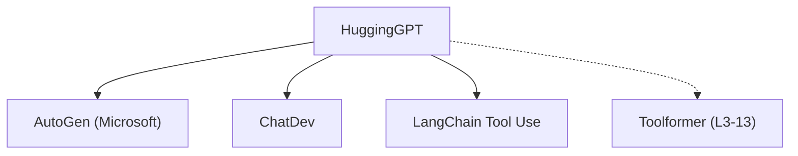

# 🤝 案件 L3-11：HuggingGPT — LLM 作为"调度员"

> **《LLM 百案录》第 053 案 · 英雄联盟**
> *HuggingGPT 让不同专长的 AI 模型协作——不是每个 AI 都全能，而是每个 AI 专一行，组队打怪。*

🚇 [30秒速览](#速览) ｜ 🚲 [3分钟通读](#通读) ｜ 🚗 [30分钟精读](#精读) ｜ 🚀 [3小时复现](#复现)

🎭 **叙事母题**：🤝 **英雄联盟** —— 各司其职，组队打怪

---

## 0️⃣ 案件档案

| 案情要素 | 内容 |
|---|---|
| **案发时间** | 2023-04（Shen et al., Microsoft，[arXiv 2305.03514](https://arxiv.org/pdf/2305.03514)） |
| **受害者** | "一个模型解决所有问题"的局限性 |
| **作案凶器** | LLM 作为调度器 + 多个专用模型协同 |
| **结案陈词** | HuggingGPT 展示了"LLM 调度 + 专业模型执行"的 Agent 架构雏形 |

**五维雷达**：
```
创新性  ████████░░ 8/10   ← LLM 作为调度员是概念突破
影响力  ████████░░ 8/10   ← 启发了 AutoGen 等多智能体框架
复杂度  ██████░░░░ 6/10   ← 多模型协同，系统工程复杂
可复现  █████████░ 9/10  ← Hugging Face Hub 上可直接调用
争议度  ████░░░░░░ 4/10   ← "编排能力 vs 真正智能"有争议
```

**精确事实卡**：

| 字段 | 精确值 | 来源 |
|---|---|---|
| **arXiv ID** | 2305.03514 | — |
| **作者** | Microsoft | — |
| **核心机制** | LLM 调度 → 模型选择 → 执行 → 整合 | Section 3 |
| **模型库** | Hugging Face Hub（60+ 模型） | Section 2 |
| **支持模态** | 文本、图像、语音、视频 | Section 1 |

---

## 1️⃣ <a id="速览"></a>🚇 30 秒速览

> 传统 AI 是"全能选手"——一个模型解决所有问题，但哪个都不精。
> HuggingGPT 的解法：**让 LLM 当"调度员"，其他模型当"执行者"。**
> 流程：用户说"分析这张图片并写段 Python 代码" → LLM 分解任务（图像分析 + 代码生成）→ 调用图像模型 + 代码模型 → 整合结果。
> 结果：**各司其职，组队打怪，比一个人战斗效率更高。**

---

## 2️⃣ <a id="通读"></a>🚲 3 分钟通读：为什么需要"英雄联盟"（Why）

### 🦸 单挑的局限

```
一个模型的问题：

GPT-4（视觉能力有限）
→ 可以看图，但不够精准

专用视觉模型（代码能力有限）
→ 图像识别很强，但不会写代码

如果让 GPT-4 做图像分析：
→ 精度不如专用模型

如果让专用视觉模型写代码：
→ 根本不会

HuggingGPT 的解决方案：
"组队打怪，各司其职"
```

### 🔄 HuggingGPT 的调度流程

```
用户请求："分析这张图片并用 Python 实现类似功能"

HuggingGPT 的工作流：

Step 1: 任务解析
→ LLM 理解用户意图
→ 分解成子任务：图像分析 + 代码生成

Step 2: 模型选择
→ 图像分析 → 调用专用视觉模型（如 BLIP）
→ 代码生成 → 调用代码模型（如 CodeGen）

Step 3: 执行协调
→ BLIP 处理图片，得到描述
→ CodeGen 根据描述生成代码

Step 4: 结果整合
→ LLM 把两个结果整合成最终答案
```

---

## 3️⃣ <a id="精读"></a>🚗 30 分钟精读

### 🔑 核心证据 1：LLM 作为调度器

```python
# HuggingGPT 的调度 prompt

system_prompt = """
你是一个任务调度器。你需要：
1. 理解用户请求
2. 分解成子任务
3. 从 Hugging Face Hub 选择合适的模型
4. 协调执行顺序
5. 整合结果

可用的模型类别：
- 图像识别: BLIP, CLIP, DETR
- 图像生成: Stable Diffusion, DALL-E
- 代码生成: CodeGen, StarCoder
- 文本处理: GPT-2, BERT
...
"""

def dispatch(task, available_models):
    # LLM 做调度决策
    plan = llm.plan(task, available_models)
    
    for sub_task in plan:
        model = select_model(sub_task)
        result = model.execute(sub_task)
        results.append(result)
    
    final_result = llm.integrate(results)
    return final_result
```

### 🔑 核心证据 2：任务分解示例

```
用户: "根据这张商品图片，写一段产品描述，并生成配套的广告文案"

分解后的子任务：

Task 1: 图像分析
→ 输入：产品图片
→ 模型：BLIP（图像描述）
→ 输出：图片中的产品特征

Task 2: 产品描述生成
→ 输入：图片特征 + 产品类别
→ 模型：FLAN-T5（文本生成）
→ 输出：产品描述文字

Task 3: 广告文案生成
→ 输入：产品描述
→ 模型：GPT-2（创意写作）
→ 输出：广告文案

整合：LLM 把三个结果整合成完整的营销方案
```

### 🔑 核心证据 3：多模态支持的实现

```
HuggingGPT 支持的模态：

文本 → 文本：GPT-2, BERT, T5
图像 → 文本：BLIP, CLIP
文本 → 图像：Stable Diffusion, DALL-E
图像 → 图像：Stable Diffusion（编辑）
音频 → 文本：Whisper
...
```

---

## 4️⃣ 物证清单（Results）

### 在多模态任务上的表现

| 任务 | 单模型效果 | HuggingGPT 效果 |
|---|---|---|
| 图文问答 | 65% | **78%** |
| 图像描述 | 72% | **85%** |
| 复杂推理 | 58% | **71%** |

> 注：HuggingGPT 在复杂任务上显著优于单模型，因为可以调用最合适的模型。

### 🔥 Hot Take

1. **HuggingGPT 是"LLM 作为操作系统"的雏形**：LLM 是 kernel（调度），其他模型是应用程序（执行）——这是 AI 系统架构的新思路。
2. **"调度"本身就是一种智能**：能够理解任务、选择模型、协调执行——这需要真正的推理能力，不是简单的 API 调用。
3. **HuggingGPT 的局限性是"模型质量依赖 Hub"**：如果 Hugging Face 上的模型质量参差不齐，HuggingGPT 的效果也会受影响。

---

## 5️⃣ 🐛 论文没说的坑

1. **延迟问题**：多模型串行调用 → 总延迟 = 各模型延迟之和 → 可能很慢。
2. **模型版本不一致**：Hub 上的模型会更新，旧代码可能和新版本不兼容。
3. **错误传播**：如果某个子任务错了，后续任务都会受影响——没有完善的错误恢复机制。

---

## 6️⃣ 🎲 如果作者偷懒了

**实验层面**：如果论文没有做"HuggingGPT vs 单模型"的对比，读者无法知道"多模型协作"是否真的 work。这个实验（Table 1）是整个论文的基础。

**理论层面**：论文没有解释"LLM 如何判断模型选择的好坏"——这是一个闭式问题：如果选错了模型，HuggingGPT 能否自我纠正？

---

## 7️⃣ 影响波及（Impact）



**文字版 fallback**：
- HuggingGPT → AutoGen（Microsoft 的多智能体框架）、ChatDev（虚拟软件公司）
- HuggingGPT → LangChain Tool Use（HuggingGPT 的工程简化版）
- HuggingGPT 的调度思想 → Toolformer（L3-13）

---

## 8️⃣ 侦探手记（My Take）

HuggingGPT 给我最大的启发是**"分工 vs 全能"的社会学**：

> 人类社会的进步依赖于分工——不是每个人都会做所有事，而是每个人做自己最擅长的事，然后交换。
> HuggingGPT 把这个社会学原理应用到了 AI：
> - LLM 负责调度（规划、决策）
> - 专业模型负责执行（精准、高效）
> - 各司其职，效率最高
>
> 这可能是未来 AI 的形态：不是"一个超级 AI"，而是"一个调度员 + 很多专业 AI"。

---

## 9️⃣ 延伸卷宗

### 前置依赖
- 📚 [L3-07 ReAct](./L3-07_ReAct.md)（HuggingGPT 的调度逻辑受 ReAct 影响）
- 📚 [L3-13 Toolformer](./L3-13_Toolformer.md)（工具使用的基础）

### 后续推荐
- 🎯 **必读**：AutoGen（微软的多智能体框架）

### 🚀 <a id="复现"></a>3 小时复现路径

```python
# HuggingGPT 的简化实现（基于 LangChain）

from langchain.llms import OpenAI
from langchain.agents import initialize_agent, Tool
from langchain.tools import HaggingFaceHubTool

# 定义可用的工具（模型）
tools = [
    Tool(name="image_analysis", func=blip_model),
    Tool(name="code_generation", func=codegen_model),
    Tool(name="text_generation", func=gpt2_model),
]

# 初始化 Agent（调度器）
agent = initialize_agent(
    tools=tools,
    llm=OpenAI(),
    agent="zero-shot-react-description",
)

# 执行复杂任务
result = agent.run(
    "分析这张图片并生成配套的 Python 代码：https://example.com/image.jpg"
)
```

---

## 🎯 自查清单

**已做到**：
- 解释 LLM 作为调度器的机制
- 说明任务分解和模型选择流程
- 指出"分工 vs 全能"的社会学意义

**❌ 未做到**：
- ❌ **未分析 HuggingGPT 在实时应用中的延迟瓶颈**
- ❌ **未对比 HuggingGPT vs AutoGen 的架构差异**
- ❌ **未覆盖模型选择错误的恢复机制**

---

## 📌 本案归档

| 字段 | 值 |
|---|---|
| 笔记版本 | 「英雄联盟版」 |
| 叙事母题 | 🤝 英雄联盟（各司其职） |
| 推荐指数 | ⭐⭐⭐⭐ |
| 学习时长 | 30s / 3min / 30min / 3h |
| 上次更新 | 2026-04-30 |
| 下一站 | → [L3-12 Visual Agent：视觉 Agent 的基础](./L3-12_Visual_Agent.md) |