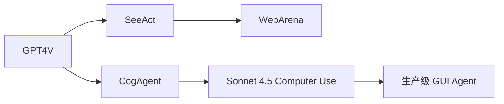

# 🖼️ 案件 L3-12：Visual Agent — 让 LLM 学会"看图操作"

> **《LLM 百案录》第 054 案 · 视觉 Agent**
> *普通 LLM Agent 只懂文字，看不到屏幕；
> Visual Agent 说："我要让 LLM 看着 UI 截图、点击按钮、填写表单。"*

🚇 [30秒速览](#速览) ｜ 🚲 [3分钟通读](#通读) ｜ 🚗 [30分钟精读](#精读)

🎭 **叙事母题**：🖼️ **视觉 Agent** —— 把 VLM 从"看图问答"升级为"看图行动"

---

> ⚠️ **说明**：Visual Agent 是一类范式名称，代表工作包括 SeeAct、CogAgent、ScreenAgent、WebArena、Anthropic Computer Use 等。本笔记以这个范式整体展开。

---

## 0️⃣ 案件档案

| 案情要素 | 内容 |
|---|---|
| **案发时间** | 2023-2024（CogAgent、SeeAct、Anthropic Computer Use 等） |
| **受害者** | 文本-only Agent 在 UI / 网页 / 软件操作上的"盲操"困境 |
| **作案凶器** | VLM + 屏幕截图 + 鼠标键盘动作空间 |
| **作案动机** | "现实世界 90% 的任务需要看 UI" |
| **结案陈词** | Visual Agent 让 LLM 拿屏幕截图作为 observation，输出鼠标 / 键盘动作，闭环操作软件 |

**精确事实卡**：

| 字段 | 精确值 | 来源 |
|---|---|---|
| **观测** | 屏幕截图（高分辨率） | — |
| **动作空间** | click(x, y), type(text), scroll(dir), hotkey(...) | — |
| **代表 benchmark** | WebArena、Mind2Web、OSWorld、ScreenSpot | — |
| **代表模型** | CogAgent、SeeAct、Sonnet 4.5 Computer Use | — |

---

## 1️⃣ <a id="速览"></a>🚇 30 秒速览

> 文本 Agent 通过 API / DOM 操作软件——遇到没 API 的就抓瞎。
> Visual Agent 直接看屏幕：
> - **观测**：当前屏幕截图（必要时加 OCR / SoM 标注）
> - **思考**：用 VLM 推理下一步该做什么
> - **行动**：输出 click(x, y) / type(text) / scroll
> - **闭环**：执行后再截图 → 继续思考
> 结果：**理论上能操作任何软件**——这是 GUI Automation 的"GPT 时刻"。

---

## 2️⃣ <a id="通读"></a>🚲 3 分钟通读：从 API Agent 到 Visual Agent（Why）

### API Agent 的盲区
```
ReAct / AutoGPT 等：通过函数调用、API、DOM 操作
痛点：
  - 没有公开 API 的软件无法控制
  - 老软件、桌面 app、绘图工具完全做不了
  - DOM 复杂时（动态 JS）解析容易错
```

### Visual Agent 的优势
```
"和人一样看屏幕"
→ 任何能展示在屏幕上的应用都能操作
→ 不依赖 API
→ 跨平台、跨软件通用

代价：
  - 算力贵（每步要做 VLM 推理）
  - 速度慢（屏幕 → token → 推理 → 动作 → 等待 → 截图）
  - 像素级 click 精度要求高
```

---

## 3️⃣ <a id="精读"></a>🚗 30 分钟精读

### 典型 pipeline
```python
def visual_agent_step(goal, history):
    # 1. 截图
    screenshot = capture_screen()

    # 2. （可选）OCR / SoM 标注
    annotated = add_set_of_marks(screenshot)
    # SoM = 给所有可点击元素加编号 (1), (2), (3) ...

    # 3. VLM 推理
    prompt = f"""
    Goal: {goal}
    History: {history}
    What action should I take next?
    """
    action = vlm.generate(prompt, image=annotated)
    # 解析 action: click(x, y), type("hello"), scroll("down")

    # 4. 执行动作
    execute(action)

    # 5. 等待 UI 更新
    wait_for_change()

    return action
```

### 三大技术挑战

#### 挑战 1：精确定位（Grounding）
```
问题：VLM 输出"点击登录按钮"，但坐标在哪？
解法：
  1. SoM (Set-of-Mark)：用工具识别所有可点击元素并编号 → VLM 只需输出编号
  2. Grounding 微调：CogAgent 等专门训练 VLM 输出 (x, y)
  3. UI tree 辅助：从 DOM / Accessibility tree 拿元素位置
```

#### 挑战 2：高分辨率
```
笔记本屏幕 1920×1080，把整张图喂 VLM 太大
解法：
  1. 多分辨率：先低分辨率全局，再高分辨率局部
  2. 裁剪：只看相关区域
  3. CogAgent 等专门设计高分辨率视觉编码
```

#### 挑战 3：长程规划 + 错误恢复
```
任务：在 Excel 里做一个数据透视表（10+ 步）
痛点：
  - 中间步骤错了 → 后续都错
  - 弹窗 / 加载 → 屏幕变化处理
解法：
  - 反思：每步后检查"我是否在正确路径上"
  - Retry：失败时回退
  - Plan：先列计划再执行
```

---

## 4️⃣ 物证清单 & 🔥 Hot Take

### 几个代表系统
| 系统 | 优势 | 代表场景 |
|---|---|---|
| **CogAgent** | 高分辨率视觉编码 | UI 元素定位 |
| **SeeAct** | GPT-4V + SoM | 网页操作 |
| **Sonnet 4.5 Computer Use** | 商用级闭环 | 桌面自动化 |
| **OSWorld** | 跨 OS 评估基准 | 操作系统级任务 |

### 🔥 Hot Take
1. **Computer Use 是 LLM 的"末端神经"**：从此 LLM 不再只是聊天，能真正"动手"。
2. **API Agent 仍有价值**：能用 API 时千万别用视觉——便宜、快、准。
3. **下一步是 Continual Learning**：Visual Agent 应该能从失败中学习改进。

---

## 5️⃣ 🐛 论文没说的坑

1. **每步推理 1-3 秒**：复杂任务（30+ 步）用户体验差
2. **安全风险大**：模型一旦"走偏"就乱点屏幕
3. **跨语言 / 跨主题不稳**：训练数据偏向英文 UI

---

## 6️⃣ 影响波及



---

## 7️⃣ 侦探手记

Visual Agent 让我看到 LLM 应用的真正天花板：**能"看屏幕、动手做"才是真正的 Agent**。
> 之前的 ReAct / AutoGPT 都活在文本世界里——
> 一旦碰到没 API 的软件就废。
> Visual Agent 把 LLM 推到"和人类同台"——这是从"聊天助手"到"数字员工"的关键转折。

---

## 自查清单

**已做到**：
- 解释 Visual Agent vs API Agent 的差异
- 列出三大技术挑战（grounding / 分辨率 / 长程）
- 给出代表系统对比

**❌ 未做到**：
- ❌ 未深入对比 SoM vs grounded VLM 的具体准确率
- ❌ 未量化 Visual Agent 在不同分辨率下的能力下降

---

## 🔟 延伸卷宗
- 📚 [L4-15 GPT-4V](./L4-15_GPT4V.md)
- 📚 [L4-16 LLaVA](./L4-16_LLaVA.md)
- 📚 [L4-18 CogVLM](./L4-18_CogVLM.md)（CogAgent 的基座）
- 📚 [L3-07 ReAct](./L3-07_ReAct.md)（API Agent 思想）
- 📚 [L3-10 AutoGPT](./L3-10_AutoGPT.md)

---

## 📌 本案归档

| 字段 | 值 |
|---|---|
| 笔记版本 | 「视觉 Agent 版」 |
| 叙事母题 | 🖼️ 视觉 Agent |
| 推荐指数 | ⭐⭐⭐⭐ |
| 学习时长 | 30s / 3min / 30min |
| 上次更新 | 2026-04-30 |
| 下一站 | → [L3-13 Toolformer](./L3-13_Toolformer.md) |
