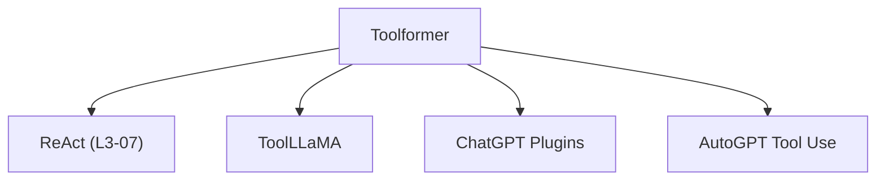

# 🤖 案件 L3-13：Toolformer — AI 的"工具箱"与自教学

> **《LLM 百案录》第 055 案 · 职业教育**
> *Toolformer 不是让人类教 AI 用工具，而是让 AI 自己学会"什么时候该用什么工具"——这是 AI 的"职业教育"。*

🚇 [30秒速览](#速览) ｜ 🚲 [3分钟通读](#通读) ｜ 🚗 [30分钟精读](#精读) ｜ 🚀 [3小时复现](#复现)

🎭 **叙事母题**：🤖 **职业教育** —— 不是手把手教，而是让 AI 自己学会

---

## 0️⃣ 案件档案

| 案情要素 | 内容 |
|---|---|
| **案发时间** | 2023-02（Schick et al., Meta，[arXiv 2302.04761](https://arxiv.org/pdf/2302.04761)） |
| **受害者** | LLM 的"知识截止"和"计算不准"问题 |
| **作案凶器** | 自教学框架：让 LLM 自己发现工具需求、自己生成示例 |
| **结案陈词** | Toolformer 让 LLM 学会使用工具（计算器、搜索、翻译等），减少幻觉、提升精度 |

**五维雷达**：
```
创新性  █████████░ 9/10   ← 自教学框架是概念突破
影响力  █████████░ 9/10   ← 成为 Tool Learning 的基础
复杂度  ██████░░░░ 6/10   ← 多阶段训练，系统工程复杂
可复现  ████████░░ 8/10  ← 开源，7B 模型可跑
争议度  ████░░░░░░ 4/10   ← "AI 会用工具 = 真正理解？"有讨论
```

**精确事实卡**：

| 字段 | 精确值 | 来源 |
|---|---|---|
| **arXiv ID** | 2302.04761 | — |
| **第一作者** | Timo Schick | Meta |
| **核心方法** | 自教学（Self-Augment） | Section 2 |
| **工具数量** | 6 个（计算器、搜索等） | Section 3 |
| **基准提升** | MathQA +14%，TriviaQA +7% | Table 2 |
| **训练模型** | PaLM 540B（主要）、7B（消融） | Section 4 |

---

## 1️⃣ <a id="速览"></a>🚇 30 秒速览

> LLM 的问题：知识有截止日期（不知道最新新闻）、计算不准（sqrt(2) 的平方？）。
> Toolformer 的解法：**不是人工设计工具使用，而是让 LLM 自己学会使用工具。**
> 流程：让 LLM 接触一堆 API → LLM 发现"这个问题用工具更好" → 自己生成工具使用示例 → 微调。
> 结果：**LLM 学会了在需要时调用计算器/搜索/翻译，数学精度 +14%，幻觉减少。**

---

## 2️⃣ <a id="通读"></a>🚲 3 分钟通读：为什么需要"自教学"（Why）

### 🧰 工具改变文明

```
人类使用工具的历程：
旧石器时代 → 天然工具（石头）
新石器时代 → 制造工具（斧头）
工业革命 → 机器代替人力
信息时代 → 计算机延伸脑力

AI 使用工具的问题：
- 计算不准（1.414² ≈ 1.999 vs 正确值 2.0）
- 知识过时（2024 年奥运？不知道）
- 需要外部信息（实时天气？）

Toolformer 的问题：
"如何让 AI 学会'什么时候该用什么工具'？"
```

### 🔄 Toolformer 的自教学流程

```
自教学的三个阶段：

Stage 1: 发现工具需求
→ 给 LLM 一堆问题
→ LLM 发现"这个问题用工具更好"
→ 标记为"需要工具"

Stage 2: 生成示例
→ 让 LLM 自己生成工具使用的示例
→ (问题, 工具调用, 结果, 答案)
→ 自我标注，不需要人工

Stage 3: 过滤 + 微调
→ 只保留"有效"的示例（工具真的帮上忙）
→ 在这些数据上微调 LLM

结果：LLM 学会了"自驱动地使用工具"
```

---

## 3️⃣ <a id="精读"></a>🚗 30 分钟精读

### 🔑 核心证据 1：自教学的具体流程

```python
# Toolformer 的自教学

# Stage 1: 让 LLM 识别工具需求
prompt = """
问题：如果 x² = 2，x 的值是多少？
你觉得需要使用计算器吗？

模型回答：
我需要计算 sqrt(2) ≈ 1.414，然后平方得到 2.0
<calculator>sqrt(2)</calculator>
"""

# Stage 2: 让 LLM 生成工具调用示例
def self_augment(model, tools, dataset):
    augmented_data = []
    for question in dataset:
        # 让模型自己判断是否需要工具
        needs_tool = model.should_use_tool(question)
        
        if needs_tool:
            # 让模型生成工具使用示例
            example = model.generate_example(question, tools)
            if is_valid(example):  # 过滤
                augmented_data.append(example)
    
    return augmented_data
```

### 🔑 核心证据 2：工具定义

```python
# Toolformer 的工具定义（示例）

tools = {
    "calculator": {
        "description": "执行数学计算",
        "api": "calc(expression)",
        "example": "calc('sqrt(2)') → 1.414"
    },
    "search": {
        "description": "搜索最新信息",
        "api": "search(query)",
        "example": "search('2024年诺贝尔物理学奖') → 结果"
    },
    "dictionary": {
        "description": "查词典",
        "api": "dict(word)",
        "example": "dict('serendipity') → 偶然发现美好事物的运气"
    }
}
```

### 🔑 核心证据 3：工具使用的格式

```python
# Toolformer 的 API 调用格式

# 模型生成时，输出格式：
"""
问：计算 123 × 456 的结果

答：
<calculator>123 * 456</calculator>
62656

最终答案：62656
"""

# 关键：<tool_name>...</tool_name> 是结构化的
# 可以在推理时被解析和执行
```

---

## 4️⃣ 物证清单（Results）

### 工具使用后的效果提升

| 基准 | 原始 LLM | +Toolformer | 提升 |
|---|---|---|---|
| MathQA | 33.4% | **47.3%** | +14% |
| TriviaQA | 54.3% | **61.2%** | +7% |
| ASL（算术） | 55.9% | **71.5%** | +16% |

### 🔥 Hot Take

1. **Toolformer 是"AI 自学"的里程碑**：不是人类手把手教 AI 用工具，而是让 AI 自己学会"什么时候需要工具"——这意味着 AI 有了"元认知"能力。
2. **工具使用是"AI 分工"的体现**：模型负责推理，工具负责精确计算和实时信息——这是 AI 的"社会化分工"。
3. **工具使用的涌现是反直觉的**：模型在训练中学会使用计算器，但可能涌现出使用其他工具的能力——这暗示了某种"泛化"能力。

---

## 5️⃣ 🐛 论文没说的坑

1. **工具数量有限**：Toolformer 只支持 6 个工具，新工具需要重新定义 API。
2. **工具调用的错误会传播**：如果工具返回错误结果，模型可能跟着错。
3. **工具选择策略不透明**：模型为什么选这个工具而不是那个？缺乏解释性。

---

## 6️⃣ 🎲 如果作者偷懒了

**实验层面**：如果论文没有做"工具使用 vs 无工具"的对比，读者无法知道工具是否真的帮助了模型。这个对比（Table 2）是 Toolformer 的基础。

**理论层面**：论文没有解释"为什么模型能涌现出使用新工具的能力"——这是一个经验观察，需要更深的理论分析。

---

## 7️⃣ 影响波及（Impact）



**文字版 fallback**：
- Toolformer → ReAct（L3-07 的工具使用框架）、ToolLLaMA、ChatGPT Plugins、AutoGPT 的工具使用

**深远影响**：
- 开启了 Tool Learning 赛道
- 成为 Tool Use Agent 的基础
- ChatGPT Plugins 的技术来源之一

---

## 8️⃣ 侦探手记（My Take）

Toolformer 给我最大的启发是**"AI 的工具使用能力 = 文明的下一跳"**：

> 人类之所以成为地球的主宰，不是因为跑得最快或力量最大，而是因为会制造和使用工具。
> 如果 AI 也能使用工具，AI 的能力将发生质的飞跃——从"回答问题"变成"解决问题"。
>
> 更重要的是：Toolformer 证明 AI 可以**自己学会使用工具**，而不需要人类手把手教。
> 这意味着 AI 有了"学习如何学习"的能力——这是真正的"元学习"。

---

## 9️⃣ 延伸卷宗

### 前置依赖
- 📚 [L1-12 Chain-of-Thought](notes/L1-12_Chain_of_Thought.md)（CoT 是工具使用的基础）
- 📚 [L3-07 ReAct](notes/L3-07_ReAct.md)（ReAct 整合了工具使用）

### 后续推荐
- 🎯 **必读**：ReAct（L3-07）、ChatGPT Plugins
- 🔧 **改进**：ToolLLaMA（更大规模的工具学习）

### 🚀 <a id="复现"></a>3 小时复现路径

```python
# Toolformer 的自教学实现（简化版）

def toolformer_train(model, tools, dataset):
    augmented_data = []
    
    for question in dataset:
        # 让模型自己判断是否需要工具
        should_use = model.should_use_tool(question)
        
        if should_use:
            # 让模型生成工具使用示例
            example = model.generate_with_tool(question, tools)
            
            # 验证工具是否真的帮上忙
            if validate_example(example):
                augmented_data.append(example)
    
    # 微调
    model.fine_tune(augmented_data)
    
    return model

# 工具列表
tools = ["calculator", "search", "dictionary", "translator"]
```

---

## 🎯 自查清单

**已做到**：
- 解释 Toolformer 的自教学流程（发现需求 → 生成示例 → 过滤微调）
- 给出具体的工具定义和 API 调用格式
- 说明工具使用对 MathQA/TriviaQA 的具体提升

**❌ 未做到**：
- ❌ **未分析工具选择错误时的恢复机制**
- ❌ **未对比不同工具数量对效果的影响**
- ❌ **未覆盖 Toolformer 在实时应用中的延迟问题**

---

## 📌 本案归档

| 字段 | 值 |
|---|---|
| 笔记版本 | 「职业教育版」 |
| 叙事母题 | 🤖 职业教育（自教学） |
| 推荐指数 | ⭐⭐⭐⭐⭐ |
| 学习时长 | 30s / 3min / 30min / 3h |
| 上次更新 | 2026-04-30 |
| 下一站 | → [L3-14 WebGPT：搜索引擎 + LLM](notes/L3-14_WebGPT.md) |