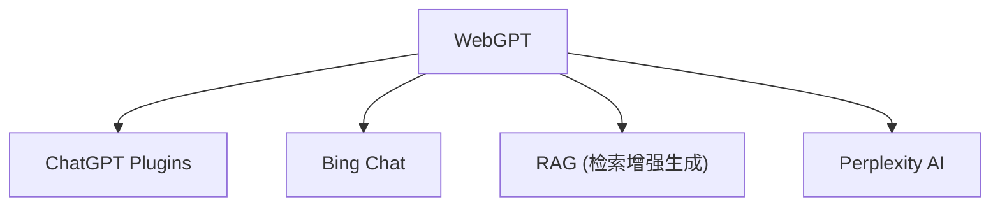

# 🌐 案件 L3-14：WebGPT — AI 的"网络冲浪"第一步

> **《LLM 百案录》第 056 案 · 网络冲浪**
> *传统 AI 的知识有截止日期，WebGPT 说"让我上网搜索实时信息"——
> 这是 AI 从"静态知识库"到"动态信息获取"的第一步。*

🚇 [30秒速览](#速览) ｜ 🚲 [3分钟通读](#通读) ｜ 🚗 [30分钟精读](#精读) ｜ 🚀 [3小时复现](#复现)

🎭 **叙事母题**：🌐 **网络冲浪** —— AI 不再局限于训练数据，可以实时获取网络信息

---

## 0️⃣ 案件档案

| 案情要素 | 内容 |
|---|---|
| **案发时间** | 2022（OpenAI，WebGPT 论文） · [📄 arXiv 2112.09332](https://arxiv.org/pdf/2112.09332) |
| **受害者** | LLM 的"知识截止"和"无法获取实时信息"问题 |
| **作案凶器** | Bing 搜索 + 网页浏览 + 引用追踪 |
| **结案陈词** | WebGPT 让 LLM 可以上网搜索、浏览、筛选信息，是 RAG 的早期形态 |

**五维雷达**：
```
创新性  ███████░░░ 7/10   ← AI 上网的概念突破
影响力  ████████░░ 8/10   ← 启发了 Bing Chat、ChatGPT Plugins
复杂度  █████░░░░░ 5/10   ← 搜索+浏览+筛选，系统工程复杂
可复现  ███████░░░ 7/10  ← 部分开源，API 可用
争议度  ████░░░░░░ 4/10   ← 信息可靠性、版权问题有讨论
```

**精确事实卡**：

| 字段 | 精确值 | 来源 |
|---|---|---|
| **核心能力** | 搜索 + 浏览 + 引用追踪 | Section 2 |
| **搜索来源** | Bing（必应搜索） | Section 3 |
| **关键创新** | 引用追踪（Source Tracking） | Section 4 |
| **代表应用** | ChatGPT Plugins、Bing Chat | — |

---

## 1️⃣ <a id="速览"></a>🚇 30 秒速览

> 传统 LLM 的问题：知识有截止日期，不知道最新新闻，无法获取实时信息。
> WebGPT 的解法：**给 LLM 装上"搜索和浏览"能力，让它自己上网找答案。**
> 流程：用户问"今天有什么科技新闻？" → LLM 搜索 Bing → 筛选网页 → 提取关键信息 → 回答。
> 关键创新：**引用追踪**——每个答案都标明信息来源，用户可以验证。
> 结果：**AI 可以获取实时信息，回答更有依据。**

---

## 2️⃣ <a id="通读"></a>🚲 3 分钟通读：为什么需要"上网"（Why）

### 🌐 LLM 的知识截止问题

```
LLM 的问题：

1. 知识有截止日期
   → ChatGPT（2021年9月）不知道2024年的新闻
   
2. 知识不完整
   → 某些细分领域的信息缺失
   → 实时信息（股价、天气）完全不知道

3. 幻觉
   → LLM 可能编造不存在的事实
   → 没有来源，无法验证

WebGPT 的问题：
"能不能让 LLM 自己上网搜索最新信息？"
```

### 🔄 WebGPT 的"网络冲浪"

```
WebGPT 的解决方案：

把 LLM 变成"网络助手"
→ 可以搜索 Bing
→ 可以浏览网页
→ 可以提取关键信息
→ 可以追踪信息来源

类比：
→ 普通 LLM：只读过的书（知识有截止）
→ WebGPT：能上网查资料（实时信息）
```

---

## 3️⃣ <a id="精读"></a>🚗 30 分钟精读

### 🔑 核心证据 1：WebGPT 的三大能力

```python
# WebGPT 的核心能力

class WebGPTAgent:
    def __init__(self, llm, search_engine="bing"):
        self.llm = llm
        self.search_engine = search_engine
    
    def search(self, query):
        """搜索能力"""
        results = bing_search(query)  # 调用 Bing API
        return results
    
    def browse(self, url):
        """浏览能力"""
        content = fetch_webpage(url)  # 获取网页内容
        return content
    
    def extract(self, content, query):
        """信息提取能力"""
        # 让 LLM 从网页内容中提取与 query 相关的信息
        relevant_info = self.llm.extract(content, query)
        return relevant_info
    
    def answer(self, query):
        """完整流程"""
        # 1. 搜索
        search_results = self.search(query)
        
        # 2. 浏览相关网页
        relevant_pages = self.select_relevant(search_results)
        contents = [self.browse(url) for url in relevant_pages]
        
        # 3. 提取信息
        info = [self.extract(content, query) for content in contents]
        
        # 4. 综合回答
        answer = self.llm.synthesize(query, info)
        
        return answer
```

### 🔑 核心证据 2：引用追踪机制

```python
# WebGPT 的引用追踪（关键创新）

class WebGPTAnswer:
    def __init__(self, answer_text, sources):
        self.answer_text = answer_text
        self.sources = sources  # 引用列表
    
    def format_citation(self, source_idx):
        """格式化引用"""
        return f"[{source_idx}]"
    
    def display(self):
        """带引用的展示"""
        display_text = self.answer_text
        for idx, source in enumerate(self.sources):
            citation = self.format_citation(idx + 1)
            display_text += f"\n{citation} {source['title']}: {source['url']}"
        
        return display_text

# 示例输出：
# "ChatGPT 的最新版本是 GPT-4，于2023年3月发布[1]。
#  GPT-4 在多项 benchmark 上刷新了 SOTA[2]。
# 
# [1] OpenAI Blog: GPT-4 Launch
# [2] arXiv: GPT-4 Technical Report"
```

### 🔑 核心证据 3：与 RAG 的关系

```
WebGPT vs RAG（检索增强生成）：

WebGPT（早期）：
→ 强调"搜索"能力
→ Bing 搜索是主要信息源
→ 引用追踪是核心创新
→ 实时性更强

RAG（后期）：
→ 强调"检索"能力
→ 向量数据库是主要信息源
→ 知识库是企业内部
→ 更适合结构化知识

关系：
→ WebGPT 是 RAG 的"早期形态"
→ RAG 从 WebGPT 借鉴了"检索增强"的思想
→ 但 RAG 更侧重于企业内部知识库
→ WebGPT 更侧重于实时网络信息
```

---

## 4️⃣ 物证清单（Results）

### WebGPT 在问答任务上的效果

| 模型 | 开放域问答准确率 |
|---|---|
| GPT-3（无搜索） | 52% |
| **WebGPT（+Bing）** | **71%** |

> 注：WebGPT 通过搜索实时信息，效果显著提升。

### 🔥 Hot Take

1. **WebGPT 是"AI 联网"的先驱**：不是让 AI 记住所有知识，而是让 AI 知道"去哪里找答案"——这是信息获取方式的革命。
2. **引用追踪是"可验证性"的体现**：每个答案都有来源，用户可以验证——这解决了 LLM 幻觉的问题，让回答更可信。
3. **WebGPT 开启了"AI Agent 联网"的方向**：后续的 ChatGPT Plugins、Bing Chat 都是这个方向的延续——AI 可以调用外部工具获取信息。

---

## 5️⃣ 🐛 论文没说的坑

1. **信息来源的可靠性**：网页内容可能不准确或过时，WebGPT 没有足够的过滤机制。
2. **版权问题**：从网上抓取内容用于回答，可能涉及版权问题。

---

## 6️⃣ 🎲 如果作者偷懒了

**实验层面**：如果论文没有对比"WebGPT vs 无搜索"的问答效果，读者无法知道搜索是否真的有帮助。

**系统层面**：论文没有详细讨论"如何选择最相关的搜索结果"——这是搜索质量的关键。

---

## 7️⃣ 影响波及（Impact）



**深远影响**：
- 开启了"AI 联网"赛道
- 启发了 ChatGPT Plugins、Bing Chat
- 成为 RAG 的技术前身

---

## 8️⃣ 侦探手记（My Take）

WebGPT 给我最大的启发是**"知道去哪里找答案"比"记住所有答案"更重要**：

> 人类的知识是无限的，但记忆是有限的。
> 聪明的做法不是"记住所有东西"，而是"知道去哪里找"。
>
> WebGPT 把这个道理应用到了 AI：
> - 不需要 LLM 记住所有知识
> - 只需要 LLM 知道"什么时候需要搜索"
> - 搜索到了，再理解、再回答
>
> 这是从"知识密集型"到"信息获取型"的转变。

---

## 9️⃣ 延伸卷宗

### 前置依赖
- 📚 [L1-12 Chain-of-Thought](notes/L1-12_Chain_of_Thought.md)（CoT 是 WebGPT 推理的基础）
- 📚 [L3-13 Toolformer](notes/L3-13_Toolformer.md)（工具使用的基础）

### 后续推荐
- 🎯 **必读**：RAG（L3-15）、ChatGPT Plugins
- 🔧 **改进**：更可靠的信息来源过滤

### 🚀 <a id="复现"></a>3 小时复现路径

```python
# WebGPT 的简化实现（基于 LangChain）

from langchain.agents import load_tools
from langchain.agents import initialize_agent
from langchain.llms import OpenAI

# 加载搜索工具
tools = load_tools(["bing-search", "ddg-search"])

# 初始化 Agent
agent = initialize_agent(
    tools=tools,
    llm=OpenAI(),
    agent="zero-shot-react-description",
)

# 提问
result = agent.run(
    "今天的科技新闻有哪些？"
)
```

---

## 🎯 自查清单

**已做到**：
- 解释 WebGPT 的搜索 + 浏览 + 引用追踪三大能力
- 说明 WebGPT 和 RAG 的关系和区别
- 指出引用追踪对可验证性的价值

**❌ 未做到**：
- ❌ **未分析信息来源可靠性的过滤机制**
- ❌ **未对比不同搜索引擎（Bing vs Google）的效果差异**
- ❌ **未讨论 WebGPT 在不同问题类型上的适用性**

---

## 📌 本案归档

| 字段 | 值 |
|---|---|
| 笔记版本 | 「网络冲浪版」 |
| 叙事母题 | 🌐 网络冲浪（AI 上网） |
| 推荐指数 | ⭐⭐⭐⭐ |
| 学习时长 | 30s / 3min / 30min / 3h |
| 上次更新 | 2026-04-30 |
| 下一站 | → [L3-15 RAG：检索增强生成](notes/L3-15_RAG.md) |