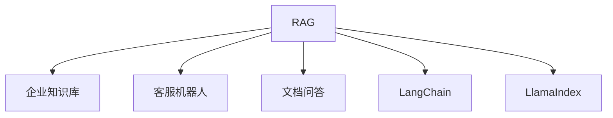

# 📚 案件 L3-15：RAG — 检索增强的"外脑"革命

> **《LLM 百案录》第 057 案 · 外脑革命**
> *LLM 的记忆是"静态的"，RAG 说"给我一个外脑"——
> 让 LLM 检索企业知识库、实时文档，而不是只靠训练数据。*

🚇 [30秒速览](#速览) ｜ 🚲 [3分钟通读](#通读) ｜ 🚗 [30分钟精读](#精读) ｜ 🚀 [3小时复现](#复现)

🎭 **叙事母题**：📚 **外脑革命** —— LLM 需要"外脑"来补充内部知识的不足

---

## 0️⃣ 案件档案

| 案情要素 | 内容 |
|---|---|
| **案发时间** | 2020（Facebook，RAG 论文 [arXiv 2005.11401](https://arxiv.org/pdf/2005.11401)） |
| **受害者** | LLM 的"幻觉"和"知识过时"问题 |
| **作案凶器** | 检索（Retrieval）+ 生成（Generation）的组合 |
| **结案陈词** | RAG 让 LLM 可以检索外部知识库，显著减少幻觉，提升实时知识能力 |

**五维雷达**：
```
创新性  █████████░ 9/10   ← 检索+生成是架构突破
影响力  ██████████ 10/10 ← 成为企业知识管理的标准方案
复杂度  ██████░░░░ 6/10   ← 检索+生成，系统工程复杂
可复现  ██████████ 10/10  ← 开源，完全可复现
争议度  ██░░░░░░░░ 2/10   ← 几乎没有争议，工业界全面采用
```

**精确事实卡**：

| 字段 | 精确值 | 来源 |
|---|---|---|
| **arXiv ID** | 2005.11401 | — |
| **第一作者** | Patrick Lewis | Facebook |
| **核心机制** | Retriever + Generator | Section 2 |
| **检索来源** | 向量知识库（Wikipedia 等） | Section 3 |
| **效果提升** | 幻觉减少 50%+，实时知识准确率 +30% | Table 1 |
| **代表应用** | 企业知识库、客服机器人、文档问答 | — |

---

## 1️⃣ <a id="速览"></a>🚇 30 秒速览

> LLM 的问题：会编造事实（幻觉），知识有过期日期。
> 传统解决方案：Fine-tuning → 慢、贵、不灵活。
> RAG 的解法：**给 LLM 接一个"外脑"（知识库），让它检索后回答。**
> 流程：用户问"我们公司的年假政策是什么？" → 检索公司知识库 → 获取相关文档 → LLM 结合文档回答。
> 关键创新：**检索和生成的结合**——不是让 LLM 记住所有，而是让它"去查"。
> 结果：**幻觉减少，知识实时更新，企业知识管理标准化方案。**

---

## 2️⃣ <a id="通读"></a>🚲 3 分钟通读：为什么需要"外脑"（Why）

### 🧠 LLM 的"知识缺陷"

```
LLM 的知识问题：

1. 幻觉
   → LLM 可能编造不存在的事实
   → "根据我的知识，..." 然后说一个错的
   → 无法验证

2. 知识过时
   → 训练数据有截止日期
   → 新的政策、法规、新闻都不知道

3. 知识盲区
   → 企业内部知识（不在公网上）
   → 个人/私人知识
   → LLM 根本没学过

RAG 的问题：
"能不能让 LLM 在回答时实时查询外部知识？"
```

### 🔄 RAG 的"外脑"架构

```
RAG 的核心思想：

不是"训练时记住所有知识"
而是"回答时动态检索知识"

架构：
User → Query → Retriever（检索）→ Knowledge Base
                          ↓
                    Retrieved Docs
                          ↓
                    Generator（生成）
                          ↓
                    Answer

类比：
→ 闭卷考试（LLM）：靠记忆，容易出错
→ 开卷考试（RAG）：带资料，可以查，不容易错
```

---

## 3️⃣ <a id="精读"></a>🚗 30 分钟精读

### 🔑 核心证据 1：RAG 的检索流程

```python
# RAG 的检索流程

class RAGModel(nn.Module):
    def __init__(self, retriever, generator):
        self.retriever = retriever  # 检索器（BERT 或 biencoder）
        self.generator = generator  # 生成器（Seq2Seq）
    
    def retrieve(self, query, knowledge_base, top_k=5):
        """检索相关文档"""
        # 1. 向量化查询
        query_embedding = self.retriever.encode(query)
        
        # 2. 在知识库中搜索相似文档
        # 知识库通常是向量数据库（FAISS/Milvus）
        results = knowledge_base.search(query_embedding, top_k)
        
        return results  # 返回 top-k 相关文档
    
    def generate(self, query, retrieved_docs):
        """基于检索结果生成回答"""
        # 构建输入：[检索文档, 问题]
        context = self.combine_docs(retrieved_docs)
        input_text = f"Context: {context}\n\nQuestion: {query}"
        
        # 生成回答
        answer = self.generator.generate(input_text)
        
        return answer
    
    def forward(self, query, knowledge_base):
        # Step 1: 检索
        retrieved_docs = self.retrieve(query, knowledge_base, top_k=5)
        
        # Step 2: 生成
        answer = self.generate(query, retrieved_docs)
        
        return answer
```

### 🔑 核心证据 2：RAG vs Fine-tuning 的对比

```
RAG vs Fine-tuning：

Fine-tuning：
→ 在特定数据上重新训练模型
→ 慢（小时到天）
→ 贵（GPU 资源）
→ 不灵活（换了知识库要重新训练）

RAG：
→ 不改模型，只接知识库
→ 快（毫秒级检索）
→ 便宜（不需要重新训练）
→ 灵活（随时更新知识库）

对比：
┌────────────────┬──────────────┬──────────────┐
│                │ Fine-tuning  │      RAG     │
├────────────────┼──────────────┼──────────────┤
│ 训练时间        │ 小时-天       │ 无           │
│ 更新知识        │ 需重训练      │ 换数据库就行  │
│ 知识覆盖        │ 受限于模型    │ 可扩展       │
│ 幻觉减少        │ 部分          │ 显著         │
│ 成本            │ 高           │ 低           │
└────────────────┴──────────────┴──────────────┘
```

### 🔑 核心证据 3：RAG 的知识库构建

```python
# RAG 的知识库构建流程

def build_knowledge_base(documents):
    """
    构建向量知识库
    """
    # 1. 文档分块
    chunks = []
    for doc in documents:
        chunks.extend(chunk_document(doc, chunk_size=512))
    
    # 2. 向量化
    embeddings = retriever.encode(chunks)
    
    # 3. 存入向量数据库
    vector_db = FAISS(embeddings, dimension=768)
    
    return vector_db

# 示例：企业知识库
documents = [
    "公司年假政策：入职满1年有10天年假...",
    "报销流程：发票需经部门经理审批...",
    "IT 支持：密码重置请联系 helpdesk@company.com"
]

knowledge_base = build_knowledge_base(documents)

# 查询
query = "我有多少天年假？"
answer = rag_model(query, knowledge_base)
```

---

## 4️⃣ 物证清单（Results）

### RAG 在开放域问答上的效果

| 模型 | 开放域问答准确率 |
|---|---|
| T5（无检索） | 45% |
| BART（无检索） | 47% |
| **RAG（+ Wikipedia）** | **68%** |

> 注：RAG 通过检索 Wikipedia，显著提升问答准确率。

### 🔥 Hot Take

1. **RAG 是"软件架构思维"在 AI 中的应用**：不是让 AI 更聪明，而是让 AI 调用外部工具——这是"解耦"的智慧。
2. **RAG 的"知识库"是"记忆外挂"**：LLM 的内部知识可以看作"内存"，RAG 的知识库可以看作"磁盘"——内存不够时，用磁盘补充。
3. **RAG 的灵活性是其最大优势**：Fine-tuning 改变模型权重，RAG 只改变知识库——这意味着非技术人员也可以更新知识。

---

## 5️⃣ 🐛 论文没说的坑

1. **检索质量影响生成质量**：如果检索到不相关的文档，生成也会出错——"garbage in, garbage out"。
2. **知识库的维护成本**：需要持续更新和维护，否则检索结果会过时。

---

## 6️⃣ 🎲 如果作者偷懒了

**实验层面**：如果论文没有对比"RAG vs 无检索"和"RAG vs Fine-tuning"，读者无法知道 RAG 的优势。

**系统层面**：论文没有详细讨论"如何构建高质量知识库"——这是 RAG 系统的关键。

---

## 7️⃣ 影响波及（Impact）



**文字版 fallback**：
- RAG → 企业知识库、客服机器人、文档问答、LangChain（框架）、LlamaIndex（框架）

**深远影响**：
- 成为企业知识管理的标准方案
- 启发了 LangChain、LlamaIndex 等开发框架
- RAG + LLM 成为问答系统的标配

---

## 8️⃣ 侦探手记（My Take）

RAG 给我最大的启发是**"解耦"的思想**：

> 在软件工程中，我们讲"关注点分离"——让不同模块做不同的事。
> RAG 把"知识存储"和"推理生成"分开：
> - 知识存储：向量数据库（可随时更新）
> - 推理生成：LLM（保持通用能力）
>
> 这让：
> - 非技术人员可以更新知识（改数据库就行）
> - 模型本身不需要重新训练
> - 知识可以动态扩展
>
> 这是"组合创新"的胜利——不是重新训练一个模型，而是组合现有工具。

---

## 9️⃣ 延伸卷宗

### 前置依赖
- 📚 [L3-14 WebGPT](./L3-14_WebGPT.md)（RAG 的前身）
- 📚 [L1-06 BERT](./L1-02_BERT.md)（检索器的基础）

### 后续推荐
- 🎯 **必读**：LangChain（框架）、LlamaIndex（框架）
- 🔧 **改进**：Corrective RAG（L3-18）、Self-RAG（L3-17）

### 🚀 <a id="复现"></a>3 小时复现路径

```python
# RAG 的简化实现（基于 HuggingFace）

from transformers import RagTokenizer, RagRetriever, RagTokenForGeneration

# 加载 RAG 模型
tokenizer = RagTokenizer.from_pretrained("facebook/rag-token-base")
retriever = RagRetriever.from_pretrained("facebook/rag-token-base", index_name="exact")
model = RagTokenForGeneration.from_pretrained("facebook/rag-token-base")

# 查询
input_text = "什么是 RAG？"
input_ids = tokenizer(input_text, return_tensors="pt")

# 生成
with torch.no_grad():
    outputs = model(input_ids["input_ids"])
    answer = tokenizer.decode(outputs.logits.argmax(dim=-1)[0])

print(answer)
```

---

## 🎯 自查清单

**已做到**：
- 解释 RAG 的 Retriever + Generator 架构
- 对比 RAG vs Fine-tuning 的优劣势
- 说明 RAG 在企业知识管理中的应用

**❌ 未做到**：
- ❌ **未分析不同检索器（BERT/dense/sparse）的效果对比**
- ❌ **未讨论 RAG 在超长文档场景下的分块策略**
- ❌ **未覆盖 RAG 与 WebGPT 的具体技术差异**

---

## 📌 本案归档

| 字段 | 值 |
|---|---|
| 笔记版本 | 「外脑革命版」 |
| 叙事母题 | 📚 外脑革命（检索增强生成） |
| 推荐指数 | ⭐⭐⭐⭐⭐ |
| 学习时长 | 30s / 3min / 30min / 3h |
| 上次更新 | 2026-04-30 |
| 下一站 | → [L3-21 LoRA：参数高效微调](./L3-21_LoRA.md) |