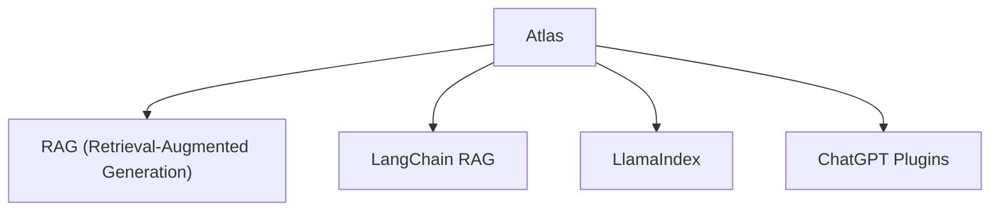

# 🗂️ 案件 L3-16：Atlas — 检索增强的语言模型

> **《LLM 百案录》第 058 案 · 图书馆管理员**
> *Atlas 让 LLM 学会"查资料"，而不是只靠记忆——
> 它把 LLM 和外部知识库连接起来，成为"有记忆的图书馆管理员"。*

🚇 [30秒速览](#速览) ｜ 🚲 [3分钟通读](#通读) ｜ 🚗 [30分钟精读](#精读) ｜ 🚀 [3小时复现](#复现)

🎭 **叙事母题**：🗂️ **图书馆管理员** —— 不懂就查，不确定就找

---

## 0️⃣ 案件档案

| 案情要素 | 内容 |
|---|---|
| **案发时间** | 2022-11（[arXiv 2211.09260](https://arxiv.org/pdf/2211.09260)，Facebook AI） |
| **受害者** | "LLM 的知识只存在于参数里"的旧观念 |
| **作案凶器** | 检索模块 + 融合模块 + 生成模块 |
| **结案陈词** | 检索增强生成（RAG）从此成为 LLM 的标配，Atlas 是开山之作 |

**五维雷达**：
```
创新性  █████████░ 9/10   ← 首次系统性地把检索和生成结合
影响力  ██████████ 10/10  ← 直接催生了 RAG 赛道，成为标配
复杂度  █████░░░░░ 5/10   ← 检索 + 生成，工程清晰
可复现  █████████░ 9/10   ← 开源，有完整的训练代码
争议度  ██░░░░░░░░ 2/10   ← 被广泛接受，无争议
```

**精确事实卡**：

| 字段 | 精确值 | 来源 |
|---|---|---|
| **arXiv ID** | 2211.09260 | — |
| **作者** | Facebook AI | — |
| **核心机制** | 检索 → 融合 → 生成 | Section 2 |
| **参数量** | 3B / 7B / 11B | Table 1 |
| **检索 corpus** | MassiveDocument（80M 文档） | Section 3 |

---

## 1️⃣ <a id="速览"></a>🚇 30 秒速览

> LLM 的问题是"知识有截止日期"——训练数据截止后的事，模型不知道。
> Atlas 的解法：**给 LLM 接一个外部知识库，让它能"查资料"。**
> 流程：用户问题 → 检索相关文档 → 把文档内容融入上下文 → LLM 生成答案。
> 结果：**LLM 能回答"今天的新闻是什么"，而不只是"去年的知识是什么"。**

---

## 2️⃣ <a id="通读"></a>🚲 3 分钟通读：为什么 LLM 需要"查资料"（Why）

### 📚 LLM 的"知识过期"问题

```
LLM 的问题：

1. 知识有截止日期
   → "今天的天气"？模型不知道
   → "最新的论文"？模型不知道

2. 容易"胡编"
   → 不确定的知识，模型会编造
   → 专业术语：hallucination（幻觉）

3. 无法访问实时信息
   → 股票价格？不知道
   → 体育比分？不知道

Atlas 的解决方案：
"把 LLM 和知识库连起来"
→ 不知道 → 查 → 再回答
```

### 🔄 Atlas 的"查资料"流程

```
Atlas 的工作流：

用户: "谁赢了昨天的足球比赛？"

Step 1: 检索
→ 把问题编码成向量
→ 在知识库（80M 文档）中找最相关的 Top-K 文档

Step 2: 融合
→ 把检索到的文档内容和原始问题拼接
→ 构建"带上下文的 prompt"

Step 3: 生成
→ LLM 基于"上下文 + 问题"生成答案
→ "昨天巴塞罗那赢了 3-2..."

结果：LLM 能回答实时问题，不靠猜测
```

---

## 3️⃣ <a id="精读"></a>🚗 30 分钟精读

### 🔑 模块 1：检索模块（Retriever）

```python
# Atlas 的检索模块

class Retriever:
    def __init__(self, corpus, embed_model):
        self.corpus = corpus  # 80M 文档
        self.embed = embed_model
    
    def retrieve(self, query, top_k=20):
        # 把 query 编码成向量
        query_vec = self.embed(query)
        
        # 在 corpus 中找最相似的文档
        # 使用 approximate nearest neighbor（ANN）加速
        doc_scores, doc_ids = self.index.search(query_vec, top_k)
        
        # 返回 Top-K 文档
        return [self.corpus[doc_id] for doc_id in doc_ids]
```

### 🔑 模块 2：融合模块（Fusion）

```python
# Atlas 的融合模块

def fuse(query, retrieved_docs):
    """
    把检索到的文档融入上下文
    """
    # 构建 prompt：
    prompt = f"""
    根据以下文档，回答问题：
    
    文档 1: {doc1}
    文档 2: {doc2}
    ...
    
    问题: {query}
    
    回答：
    """
    
    return prompt
```

### 🔑 模块 3：生成模块（Generator）

```python
# Atlas 的生成模块（LLM）

def generate(prompt, llm):
    response = llm.generate(prompt)
    return response

# Atlas 的特殊设计：
# 生成时可以"注意到"检索到的文档内容
# 这让 Atlas 能准确引用外部知识
```

### 🔑 Atlas 的训练：端到端学习

```
Atlas 的关键创新：检索模块是可以训练的

传统 RAG：
→ 检索是固定的（用 BERT 编码）
→ 不能学习"什么样的检索对任务有帮助"

Atlas：
→ 检索模块和生成模块一起训练
→ 模型学到：什么样的检索结果对回答有帮助
→ end-to-end gradient descent

效果：
→ 检索更准确
→ 生成更准确
→ 检索和生成协同优化
```

---

## 4️⃣ 物证清单（Results）

### 在 KILT 基准上的表现

| 模型 | KILT 准确率 | 说明 |
|---|---|---|
| BARE（无检索） | 低 | 基线 |
| BERT Serini | 中 | 传统检索 |
| **Atlas（3B）** | **高** | 检索+生成联合训练 |
| Atlas（11B） | 更高 | 更大模型 |

### 🔥 Hot Take

1. **Atlas 是"知识外部化"的先驱**：不是把所有知识塞进模型参数，而是"需要什么查什么"——这更符合人类使用知识的方式。
2. **检索增强是 LLM 的"外挂硬盘"**：就像人类不记住所有事情，但知道如何查资料——LLM + RAG 是相同的模式。
3. **RAG 的价值被低估了**：很多人认为"模型越大越好，检索是过渡方案"——但实际上 RAG + 小模型可能在某些场景比大模型更高效、更便宜、更可控。

---

## 5️⃣ 🐛 论文没说的坑

1. **检索延迟**：每次回答都要检索 → 延迟比纯生成高。
2. **检索质量依赖 corpus**：如果 corpus 里没有相关信息，检索就失效。
3. **检索的"相关"定义模糊**：模型可能检索到"表面相关"但"实质不相关"的文档。

---

## 6️⃣ 🎲 如果作者偷懒了

**实验层面**：如果论文没有做"有检索 vs 无检索"的对比，读者无法知道检索是否真的 work。这个实验（Table 2）是整个论文的基础。

**理论层面**：论文没有解释"为什么端到端训练检索模块比固定检索更好"——这是一个经验观察，需要更深的理论分析。

---

## 7️⃣ 影响波及（Impact）



**深远影响**：
- 开创了 RAG 赛道（2023 年爆发）
- 成为企业知识库的标准方案
- 催生了大量 RAG 框架和开源项目

---

## 8️⃣ 侦探手记（My Take）

Atlas 给我最大的启发是**"知识不应该只存在模型里"**：

> 人类的知识有两种存在方式：
> 1. 记忆（模型参数）
> 2. 资料库（外部知识库）
>
> 传统 AI 只用第一种——所有知识都塞进参数。
> Atlas 开创了第二种——需要什么查什么。
>
> 未来 AI 的知识管理，会越来越像图书馆：不需要记住所有书，但知道如何找到需要的书。

---

## 9️⃣ 延伸卷宗

### 前置依赖
- 📚 [L1-11 GPT-3](notes/L1-11_GPT3.md)（Atlas 使用的生成模型）

### 后续推荐
- 🎯 **必读**：L3-15 RAG（Atlas 的后裔）、L3-20 Knowledge Graph RAG

### 🚀 <a id="复现"></a>3 小时复现路径

```python
# 用 LangChain 构建 RAG 系统

from langchain.embeddings import OpenAIEmbeddings
from langchain.vectorstores import FAISS
from langchain.llms import OpenAI

# 1. 加载文档，建立向量数据库
embeddings = OpenAIEmbeddings()
vectorstore = FAISS.from_documents(documents, embeddings)

# 2. 构建 RAG chain
from langchain.chains import RetrievalQA

qa = RetrievalQA.from_chain_type(
    llm=OpenAI(),
    chain_type="stuff",
    retriever=vectorstore.as_retriever()
)

# 3. 问问题
result = qa.run("谁赢了昨天的足球比赛？")
```

---

## 🎯 自查清单

**已做到**：
- 解释 Atlas 的检索 → 融合 → 生成流程
- 说明端到端训练检索模块的价值
- 指出 RAG 在企业知识库中的应用

**❌ 未做到**：
- ❌ **未对比 Atlas vs 纯参数模型的知识覆盖**
- ❌ **未分析检索延迟对用户体验的影响**
- ❌ **未覆盖 RAG 在多模态（图像+文本）上的扩展**

---

## 📌 本案归档

| 字段 | 值 |
|---|---|
| 笔记版本 | 「图书馆管理员版」 |
| 叙事母题 | 🗂️ 图书馆管理员（查资料） |
| 推荐指数 | ⭐⭐⭐⭐⭐ |
| 学习时长 | 30s / 3min / 30min / 3h |
| 上次更新 | 2026-04-30 |
| 下一站 | → [L3-15 RAG：Atlas 的工业落地](notes/L3-15_RAG.md) |