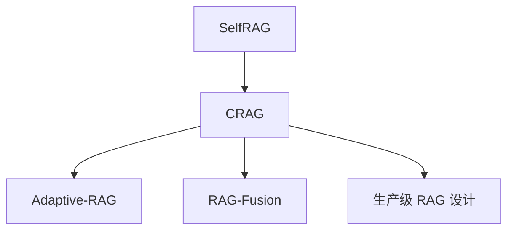

# 🔧 案件 L3-18：Corrective RAG — RAG 的"自我纠错"

> **《LLM 百案录》第 060 案 · 纠错机制**
> *Self-RAG 让模型评估检索好不好，CRAG 更进一步：检索差就重来一次。*

🚇 [30秒速览](#速览) ｜ 🚲 [3分钟通读](#通读) ｜ 🚗 [30分钟精读](#精读) ｜ 🚀 [3小时复现](#复现)

🎭 **叙事母题**：🔧 **纠错机制** —— 检索是否可信，可信则用、不行就重做

---

## 0️⃣ 案件档案

| 案情要素 | 内容 |
|---|---|
| **案发时间** | 2024-01（Yan et al., Renmin University） |
| **受害者** | 检索器召回的"低质量文档"对 RAG 的污染 |
| **作案凶器** | 轻量级 retrieval evaluator + 三档分流（Correct / Incorrect / Ambiguous） |
| **作案动机** | "检索器本身有偏差，必须有第二道防线" |
| **结案陈词** | CRAG 用一个 T5-large 评估器对每篇检索文档打分，按"对/错/模糊"采取不同策略 |

**精确事实卡**：

| 字段 | 精确值 | 来源 |
|---|---|---|
| **评估器** | T5-large fine-tuned | Section 3.2 |
| **三档分流** | Correct → 直接用；Incorrect → 走 Web 搜索；Ambiguous → 两者都用 | Section 3.3 |
| **知识精炼** | "decompose-then-recompose"（先分解再重组） | Section 3.4 |
| **数据集提升** | PopQA、Biography、PubHealth 显著提升 | Table 2 |

---

## 1️⃣ <a id="速览"></a>🚇 30 秒速览

> 检索器（如 BM25、Contriever）有时召回毫不相关的文档——直接塞进 prompt 会污染答案。
> CRAG 的解法：
> 1. 训练一个**轻量评估器**给每篇文档打分
> 2. 分三档：相关、无关、不确定
> 3. **无关时调用 Web 搜索**作为兜底，**不确定时两者结合**
> 4. **知识精炼**：把检索内容拆成 strip → 过滤 → 重组
> 结果：**几乎所有 QA benchmark 上 +5～10 点。**

---

## 2️⃣ <a id="通读"></a>🚲 3 分钟通读：与 Self-RAG 的差异（Why）

| 维度 | Self-RAG | CRAG |
|---|---|---|
| 评估方式 | 大模型自带 reflection tokens | 外挂小模型 evaluator |
| 训练成本 | 大模型微调 + GPT-4 蒸馏 | 仅训练评估器（T5-large） |
| 错误处理 | 选择丢弃 / 加权 | **重检索（Web）+ 知识精炼** |
| 适配性 | 必须重训生成器 | **可挂载在任何 LLM 之上** |

> CRAG 的杀手锏：**生成器零改动**——已有 LLM 不用动，只加一个评估器和精炼模块。

---

## 3️⃣ <a id="精读"></a>🚗 30 分钟精读

### Step 1：Retrieval Evaluator
```python
# 输入：(query, retrieved_doc)
# 输出：score ∈ [-1, 1]，分三档
score = T5_eval(query, doc)
if score > 0.59:
    label = "Correct"
elif score < -0.99:
    label = "Incorrect"
else:
    label = "Ambiguous"
```

### Step 2：分流策略
```
Correct  → 仅用本地检索内容
Incorrect → 抛弃本地，调用 Web Search API（Google）重新检索
Ambiguous → 本地 + Web 两路检索结果合并
```

### Step 3：Knowledge Refinement（关键创新）
```
对每篇文档（无论本地还是 Web 来）：
1. Decompose：把文档拆成短的 "knowledge strip"（每条 1-2 句）
2. Filter：用同一个评估器给每个 strip 打分
3. Recompose：保留高分 strip，按相关性顺序拼接
```

### 完整 pipeline
```
query
  ↓
Retriever → docs
  ↓
Evaluator 给每篇打分 → 分流
  ├── Correct → docs → Refine → final_context
  ├── Incorrect → Web Search → docs → Refine → final_context
  └── Ambiguous → 两者都做 → 合并 → Refine → final_context
  ↓
LLM Generate (with final_context)
```

---

## 4️⃣ 物证清单

| 方法 | PopQA | Biography | PubHealth |
|---|---|---|---|
| LLaMA-2 13B + Standard RAG | 50.7 | 51.3 | 36.0 |
| Self-RAG 13B | 55.8 | 81.2 | 75.5 |
| **CRAG (LLaMA-2 13B)** | **59.8** | **86.8** | **80.0** |

### 🔥 Hot Take
1. **轻量 + 即插即用**：CRAG 不动 LLM，只加 T5-large（700M）评估器，工程友好。
2. **Web 搜索作为兜底**：承认本地知识库永远不够，主动调用外部搜索。
3. **Decompose-Recompose 是隐藏宝藏**：拆 strip → 过滤 → 重组，比直接截断好得多。

---

## 5️⃣ 🐛 论文没说的坑

1. **评估器域内/域外性能差**：T5-large 在 PopQA 训练，跑医学/法律 QA 准确率会掉
2. **Web Search 时延高**：单次调 Google API 增加 1-3 秒
3. **三档阈值难调**：0.59 / -0.99 是 PopQA 调出来的，换数据集要重调

---

## 6️⃣ 🎲 如果作者偷懒了

**实验**：未对比"先 Web 搜后本地" vs "先本地后 Web"——是否能直接砍掉本地？
**理论**：评估器训练数据全自动标注，未分析 label 噪声对评估器性能上限的影响

---

## 7️⃣ 影响波及



---

## 8️⃣ 侦探手记

CRAG 给我的核心启发：**模块化是 RAG 的未来**。
> Self-RAG 把检索决策"焊"进大模型——好处是优雅，坏处是要重训整个 LLM。
> CRAG 把检索决策"挂"在外面——稍微糙一点，但任何 LLM 立刻能用，工业部署友好。
> 在工程上，**可拔插的小组件 > 重训的大模型**——这是 LangChain / LlamaIndex 流派的胜利。

---

## 自查清单

**已做到**：
- 推导 CRAG 的三档分流策略
- 解释 Knowledge Refinement 的 decompose-recompose
- 对比 Self-RAG vs CRAG

**❌ 未做到**：
- ❌ 未量化 Web 搜索带来的延迟开销
- ❌ 未分析评估器在跨领域的鲁棒性

---

## 🔟 延伸卷宗
- 📚 [L3-15 RAG](./L3-15_RAG.md)
- 📚 [L3-17 Self-RAG](./L3-17_Self_RAG.md)
- 📚 [L3-19 Query Augmentation](./L3-19_RAG_Query_Augmentation.md)

### 🚀 <a id="复现"></a>3 小时复现路径
- 论文：[arxiv.org/abs/2401.15884](https://arxiv.org/abs/2401.15884)
- 评估器训练比较快（T5-large LoRA），数据见论文附录

---

## 📌 本案归档

| 字段 | 值 |
|---|---|
| 笔记版本 | 「纠错机制版」 |
| 叙事母题 | 🔧 纠错机制 |
| 推荐指数 | ⭐⭐⭐⭐ |
| 学习时长 | 30s / 3min / 30min / 3h |
| 上次更新 | 2026-04-30 |
| 下一站 | → [L3-19 Query Augmentation](./L3-19_RAG_Query_Augmentation.md) |
