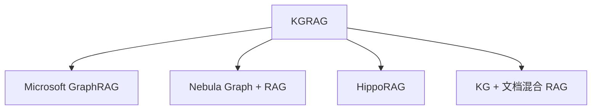

# 🕸️ 案件 L3-20：Knowledge Graph RAG — 从"文档检索"到"关系检索"

> **《LLM 百案录》第 062 案 · 结构化检索**
> *"乔布斯的女儿是谁？"——文档 RAG 检索一堆乔布斯的传记，找答案靠运气；
> KG-RAG 直接查"乔布斯-(父女)->Lisa Brennan-Jobs"，秒解。*

🚇 [30秒速览](#速览) ｜ 🚲 [3分钟通读](#通读) ｜ 🚗 [30分钟精读](#精读)

🎭 **叙事母题**：🕸️ **结构化检索** —— 实体与关系比文档片段更精确

---

## 0️⃣ 案件档案

| 案情要素 | 内容 |
|---|---|
| **案发时间** | 2024（GraphRAG by Microsoft、KG-RAG 等多个工作） |
| **受害者** | 文档级 RAG 在"多跳推理 / 关系问答"上的失灵 |
| **作案凶器** | LLM 抽取实体关系 → 构图 → 图查询 + 子图扩展 |
| **作案动机** | "结构化知识 + 文档 = 更好的检索单元" |
| **结案陈词** | KG-RAG 把语料抽象成知识图谱，检索时返回子图，让 LLM 在结构化关系上推理 |

**精确事实卡**：

| 字段 | 精确值 | 来源 |
|---|---|---|
| **代表工作** | Microsoft GraphRAG（2024.04） | github.com/microsoft/graphrag |
| **核心步骤** | 实体抽取 → 关系抽取 → Community Detection → 摘要 | Section 3 |
| **优势场景** | 多跳推理、全局摘要、实体关系问答 | Table 1 |

---

## 1️⃣ <a id="速览"></a>🚇 30 秒速览

> 普通 RAG 检索的是"文档片段"——回答"乔布斯有几个孩子？"得读一堆传记。
> KG-RAG 检索的是"实体子图"——一条 SPARQL 查询直接得到精确答案。
> 现代 KG-RAG 的关键创新：**用 LLM 自动建图**，不再需要人工 schema。

---

## 2️⃣ <a id="通读"></a>🚲 3 分钟通读：为什么图比文档强（Why）

### 文档 RAG 的失灵案例
```
Q: "微软的 CEO 之前在哪里工作？"

文档 RAG：检索"微软 CEO Satya Nadella"相关段落
        → 多数文档讲他在微软的事
        → 找不到"在加入微软之前"的信息

KG-RAG：
  1. 找到实体节点：Satya Nadella
  2. 沿 "previous_employer" 边走
  3. 直接得到答案：Sun Microsystems
```

### 三大优势
1. **多跳推理**：文档 RAG 跳一次就丢上下文，图自然支持多跳
2. **关系明确**：实体之间的关系是命名的边，不是隐藏在自然语言里
3. **全局摘要**：通过 community detection 可以做"整本书讲了什么"这类全局问题

---

## 3️⃣ <a id="精读"></a>🚗 30 分钟精读

### Microsoft GraphRAG 的 Pipeline

#### Indexing 阶段
```
原始文档
  ↓ chunk
文本块
  ↓ LLM 抽取
(实体, 关系, 实体) 三元组
  ↓ 聚合相同实体
知识图谱
  ↓ Leiden 算法
社区（Communities，层次化）
  ↓ LLM 给每个社区写摘要
分级 community summaries
```

#### Query 阶段（两种模式）
**Local Search**：聚焦实体周围
```
query → 实体识别 → 找子图 → 用子图 + 相关 chunk 喂 LLM
```

**Global Search**：跨社区聚合
```
query → 在所有 community summary 上分别 reason
        → 收集 partial answers
        → 用 LLM reduce 成最终答案
```

### 实体关系抽取 prompt 示例
```
Extract entities and relationships from the text:
TEXT: ...
Output format:
("entity"|<name>|<type>|<description>)
("relationship"|<source>|<target>|<description>|<strength>)
```

### Community 检测的意义
```
图上的节点很多 → 直接喂 LLM 太长
用 Leiden 算法分簇 → 每簇 = 一个主题
对每簇用 LLM 写摘要 → 摘要级层次结构
```

---

## 4️⃣ 物证清单 & 🔥 Hot Take

| 任务类型 | 文档 RAG | **KG-RAG** |
|---|---|---|
| 简单事实问答 | 强 | 强（无明显优势） |
| 多跳推理 | 弱 | **强** |
| 全局摘要（"这本书讲了啥"） | 弱 | **强** |
| 关系问答 | 弱 | **强** |

### 🔥 Hot Take
1. **建图成本高但摊销划算**：indexing 需要 LLM 调用很多次，但建好之后查询便宜。
2. **Microsoft GraphRAG 是分水岭**：之前 KG-RAG 需要人工 schema，现在 LLM 全自动建图。
3. **混合 RAG 是未来**：单纯 KG-RAG 在事实细节上仍弱于文档 RAG，主流方案是 KG + 文档双路。

---

## 5️⃣ 🐛 论文没说的坑

1. **建图费钱**：1MB 文本可能要花几美元的 GPT-4 调用做抽取
2. **抽取质量直接决定上限**：实体歧义（"Apple" 公司还是水果？）会污染图
3. **图维护难**：原始数据更新后，图怎么增量更新？目前方案多是重新建图

---

## 6️⃣ 🎲 如果作者偷懒了

GraphRAG 论文未对比"建图成本 vs 直接用更长上下文" 在 cost-effectiveness 上的取舍。

---

## 7️⃣ 影响波及



---

## 8️⃣ 侦探手记

KG-RAG 让我重新理解"知识"的存储形式。
> 文档 = 知识的"纸面表达"，模糊但易得；
> 图 = 知识的"内部结构"，精确但难抽。
> 过去做 KG 的痛点是"建图全靠人工"——LLM 时代终于把这个瓶颈打破，
> 所以 KG-RAG 不是"老技术回潮"，而是"老问题被新技术救活"。

---

## 自查清单

**已做到**：
- 解释 KG-RAG vs 文档 RAG 的优劣场景
- 推导 GraphRAG 的 Indexing-Query 双阶段
- 说明 community detection 的作用

**❌ 未做到**：
- ❌ 未量化分析建图成本 vs 文档 RAG 的成本对比
- ❌ 未讨论中文实体抽取的特殊问题（分词、别名）

---

## 🔟 延伸卷宗
- 📚 [L3-15 RAG](./L3-15_RAG.md)
- 📚 [L3-17 Self-RAG](./L3-17_Self_RAG.md)
- 📚 [L3-18 Corrective RAG](./L3-18_Corrective_RAG.md)
- 📚 [L3-19 Query Augmentation](./L3-19_RAG_Query_Augmentation.md)

### 🚀 实践入口
- Microsoft GraphRAG: [github.com/microsoft/graphrag](https://github.com/microsoft/graphrag)
- LlamaIndex `KnowledgeGraphIndex`

---

## 📌 本案归档

| 字段 | 值 |
|---|---|
| 笔记版本 | 「结构化检索版」 |
| 叙事母题 | 🕸️ 结构化检索 |
| 推荐指数 | ⭐⭐⭐⭐ |
| 学习时长 | 30s / 3min / 30min |
| 上次更新 | 2026-04-30 |
| 下一站 | → [L3-21 LoRA](./L3-21_LoRA.md) |
