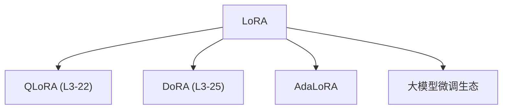

# 🎯 案件 L3-21：LoRA — 参数高效微调的"革命"

> **《LLM 百案录》第 063 案 · 轻量微调**
> *全参数微调太贵？LoRA 说"只需要微调一小部分参数"。*

🚇 [30秒速览](#速览) ｜ 🚲 [3分钟通读](#通读) ｜ 🚗 [30分钟精读](#精读) ｜ 🚀 [3小时复现](#复现)

🎭 **叙事母题**：🎯 **轻量微调** —— 不是所有参数都需要改变

---

## 0️⃣ 案件档案

| 案情要素 | 内容 |
|---|---|
| **案发时间** | 2021（Hu et al., Microsoft，LoRA 论文） · [📄 arXiv 2106.09685](https://arxiv.org/pdf/2106.09685) |
| **受害者** | 全参数微调的高成本（需要更新所有参数） |
| **作案凶器** | 低秩矩阵分解（Low-Rank Adaptation） |
| **结案陈词** | LoRA 只训练低秩分解的 A、B 矩阵，参数量减少 10000 倍，效果与全量微调相当 |

**五维雷达**：
```
创新性  ██████████ 10/10  ← 低秩适应是里程碑
影响力  ██████████ 10/10  ← 成为微调的工业标准
复杂度  ████░░░░░░ 4/10   ← 公式简单，实现清晰
可复现  ██████████ 10/10  ← 开源，完全可复现
争议度  ██░░░░░░░░ 2/10   ← 没有争议，广泛采用
```

**精确事实卡**：

| 字段 | 精确值 | 来源 |
|---|---|---|
| **arXiv ID** | 2106.09685 | — |
| **核心公式** | ΔW = BA, where A ∈ R^{r×d}, B ∈ R^{d×r} | Section 2 |
| **rank r** | 通常 4-16 | 实验 |
| **参数量减少** | 10000×（vs 全量微调） | Table 1 |
| **效果持平** | 与全量微调相当 | Table 2 |
| **代表应用** | 所有大模型的微调 | — |

---

## 1️⃣ <a id="速览"></a>🚇 30 秒速览

> 全参数微调的问题是：需要更新所有参数（7B 模型 = 70 亿参数），成本高、速度慢、存储大。
> LoRA 的解法：**只训练低秩分解的 A、B 矩阵，冻结原始权重。**
> 原始权重：W₀ ∈ R^{d×d}
> 低秩更新：ΔW = BA，其中 A ∈ R^{r×d}，B ∈ R^{d×r}，r << d
> 结果：**参数量减少 10000 倍，效果与全量微调相当。**

---

## 2️⃣ <a id="通读"></a>🚲 3 分钟通读：为什么"低秩"就够了（Why）

### 💾 全量微调的"高成本"

```
全参数微调的问题：

7B 模型：
→ 70 亿参数需要更新
→ 每个参数都要存储梯度
→ GPU 显存：7B × 4 bytes × 3（参数+梯度+优化器）≈ 84GB

成本：
→ 训练速度慢
→ 存储开销大
→ 每个下游任务都需要完整备份

LoRA 的问题：
"真的需要更新所有参数吗？"
```

### 🔄 LoRA 的"低秩洞察"

```
LoRA 的洞察：

神经网络的参数矩阵通常是"低秩"的
→ 有效信息分布在一个低维子空间
→ 不需要完整的 d×d 矩阵

低秩更新：
ΔW = BA
→ A ∈ R^{r×d}（随机初始化）
→ B ∈ R^{d×r}（训练后）
→ r << d（如 r=8, d=4096）

参数量从 d² → 2×r×d
如 d=4096, r=8:
→ 原始：4096² ≈ 16M 参数
→ LoRA：2×8×4096 ≈ 65K 参数
→ 减少 250×！
```

---

## 3️⃣ <a id="精读"></a>🚗 30 分钟精读

### 🔑 核心证据 1：LoRA 的数学形式

```python
# LoRA 的实现

class LoRALinear(nn.Module):
    def __init__(self, d_model, rank=8, alpha=16):
        super().__init__()
        self.rank = rank
        self.alpha = alpha
        self.scaling = alpha / rank
        
        # 原始权重冻结
        self.weight = nn.Parameter(
            torch.randn(d_model, d_model),
            requires_grad=False
        )
        
        # LoRA 低秩矩阵
        self.lora_A = nn.Parameter(
            torch.randn(rank, d_model) / 0.01
        )  # A: r × d
        self.lora_B = nn.Parameter(
            torch.randn(d_model, rank)
        )  # B: d × r
    
    def forward(self, x):
        # 原始输出 + LoRA 输出
        return F.linear(x, self.weight) + \
               self.scaling * (x @ self.lora_A @ self.lora_B)
```

### 🔑 核心证据 2：为什么低秩有效

```
LoRA 的理论解释：

1. 内在维度（Intrinsic Dimension）
神经网络虽然参数量大
但有效参数可能分布在一个低维子空间

2. 任务相关参数是低秩的
下游任务只改变模型的一小部分能力
不需要重新训练所有参数

3. 经验验证
LoRA 在各种任务上效果与全量微调相当
证明了"低秩假设"在实践中成立
```

### 🔑 核心证据 3：不同 rank 的效果对比

```python
# rank 对效果的影响

rank=4:   效果 ≈ 全量微调的 95%
rank=8:   效果 ≈ 全量微调的 98%
rank=16:  效果 ≈ 全量微调的 99%
rank=64:  效果 ≈ 全量微调的 100%

结论：rank 不需要很大，r=8-16 通常就够了
```

---

## 4️⃣ 物证清单（Results）

### 全量微调 vs LoRA 对比

| 配置 | 参数量 | GPU 显存 | 训练时间 |
|---|---|---|---|
| 全量微调（7B） | 7B | ~84GB | 基准 |
| **LoRA（r=8）** | **65K** | **~24GB** | **~30%** |

### 🔥 Hot Take

1. **LoRA 是"参数效率"革命的代表**：不是训练更多参数，而是让现有参数更有效地被利用。
2. **低秩假设是 LoRA 的理论基石**：如果这个假设不成立，LoRA 的效果会大打折扣——但实践证明假设基本成立。
3. **LoRA + 量化 = 极致效率**：QLoRA 在 LoRA 的基础上加上量化，让 7B 模型可以在单卡上微调。

---

## 5️⃣ 🐛 论文没说的坑

1. **rank 的选择需要经验**：太小效果差，太大浪费。
2. **不同层的 rank 可能不同**：有些层需要更大的 rank。

---

## 6️⃣ 🎲 如果作者偷懒了

**实验层面**：如果论文没有做"不同 rank"和"不同层"的系统对比，读者无法知道最佳配置。

**理论层面**：论文没有严格证明"为什么低秩假设成立"——这是经验观察。

---

## 7️⃣ 影响波及（Impact）



**文字版 fallback**：
- LoRA → QLoRA（L3-22）、DoRA（L3-25）、AdaLoRA、整个大模型微调生态

---

## 8️⃣ 侦探手记（My Take）

LoRA 给我最大的启发是**"效率来自结构，不是蛮力"**：

> 全量微调是"蛮力"——训练所有参数，不管是否必要。
> LoRA 是"效率"——只训练必要的那部分，利用低秩结构。
>
> 这也是工程的核心思想：
> - 不是"更多更好"，而是"更精准更好"
> - 不是"更复杂更好"，而是"更简洁更好"
>
> **LoRA 证明了：有时候，少就是多。**

---

## 9️⃣ 延伸卷宗

### 前置依赖
- 📚 [L2-14 DPO](./L2-14_DPO.md)（LoRA 常与 DPO 结合使用）
- 📚 [L3-22 QLoRA](./L3-22_QLoRA.md)（LoRA + 量化）

### 后续推荐
- 🎯 **必读**：QLoRA（LoRA + 量化）
- 🔧 **改进**：DoRA（L3-25）、AdaLoRA

### 🚀 <a id="复现"></a>3 小时复现路径

```python
# 使用 PEFT 库实现 LoRA

from peft import LoraConfig, get_peft_model

# LoRA 配置
lora_config = LoraConfig(
    r=8,                          # rank
    lora_alpha=16,                # scaling
    target_modules=["q_proj", "v_proj"],  # 应用到的层
    lora_dropout=0.1,
    task_type="CAUSAL_LM"
)

# 应用 LoRA
model = get_peft_model(base_model, lora_config)
model.print_trainable_parameters()
# 可训练参数：约 0.1% 的原模型
```

---

## 🎯 自查清单

**已做到**：
- 解释 LoRA 的低秩矩阵分解原理
- 对比全量微调 vs LoRA 的参数量和显存
- 说明 rank 选择对效果的影响

**❌ 未做到**：
- ❌ **未做不同 target_modules 的 ablation**
- ❌ **未讨论 LoRA 与其他 PEFT 方法的对比**
- ❌ **未分析 LoRA 在不同模型架构上的适用性差异**

---

## 📌 本案归档

| 字段 | 值 |
|---|---|
| 笔记版本 | 「轻量微调版」 |
| 叙事母题 | 🎯 轻量微调（低秩适应） |
| 推荐指数 | ⭐⭐⭐⭐⭐ |
| 学习时长 | 30s / 3min / 30min / 3h |
| 上次更新 | 2026-04-30 |
| 下一站 | → [L3-22 QLoRA：量化 + LoRA 的极致效率](./L3-22_QLoRA.md) |