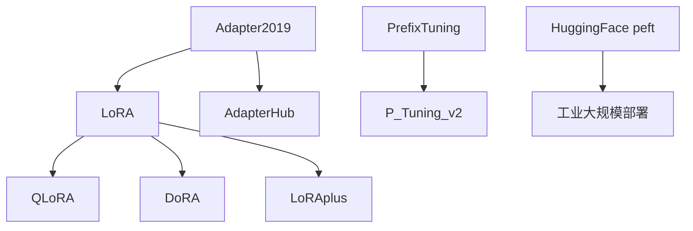

# 📚 案件 L3-23：PEFT — 参数高效微调的"全景图"

> **《LLM 百案录》第 065 案 · 全景**
> *LoRA 是 PEFT 的明星，但 PEFT 还有 Adapter、Prefix Tuning、IA³、(IA)³ 等一票成员——这是它们的全家福。*

🚇 [30秒速览](#速览) ｜ 🚲 [3分钟通读](#通读) ｜ 🚗 [30分钟精读](#精读)

🎭 **叙事母题**：📚 **全景** —— 不是单个论文，而是一类范式

---

## 0️⃣ 案件档案

| 案情要素 | 内容 |
|---|---|
| **案发时间** | 2019-2024（连续多个工作累积形成） · [📄 arXiv 2403.14608](https://arxiv.org/pdf/2403.14608) |
| **受害者** | "全参数微调"在大模型时代的不可承受 |
| **作案凶器** | 几十种"只动小部分参数"的微调技术 |
| **结案陈词** | PEFT = 在保持基础模型冻结的前提下，仅训练少量参数（< 1%）就达到接近全参数微调的效果 |

**精确事实卡**：

| 字段 | 精确值 | 来源 |
|---|---|---|
| **代表 Survey** | "Parameter-Efficient Transfer Learning for NLP" (Houlsby 2019) | Adapter 鼻祖 |
| **HuggingFace 库** | `peft`（统一封装 LoRA、Prefix Tuning、IA³ 等） | github.com/huggingface/peft |
| **可训参数比** | 0.01% - 1%（取决于方法） | Various |

---

## 1️⃣ <a id="速览"></a>🚇 30 秒速览

> 7B 模型全参数微调要 70+ GB 显存，LoRA 只要 8GB——这就是 PEFT。
> PEFT 包含三大流派：
> 1. **加结构**（Adapter / LoRA / DoRA）：在原模型外加少量新参数
> 2. **加输入**（Prefix Tuning / P-Tuning v2）：在输入端加可学习的"虚拟 token"
> 3. **改激活**（IA³）：在中间激活上做轻量缩放
> 选型口诀：**通用首选 LoRA / QLoRA，超轻量选 IA³，多任务复用选 Adapter**。

---

## 2️⃣ <a id="通读"></a>🚲 3 分钟通读：三大流派详解（Why）

### 1. 加结构（Add）
```
原模型权重冻结
    ↓
插入新模块（LoRA 矩阵 / Adapter 残差块 / DoRA 方向幅度）
    ↓
只训练新模块
```
代表：LoRA、QLoRA、Adapter、DoRA、AdapterFusion

### 2. 加输入（Soft Prompt）
```
冻结整个模型
    ↓
在输入序列前加 N 个可学习的 token embedding
    ↓
只训练这些 token
```
代表：Prefix Tuning、P-Tuning v2、Prompt Tuning

### 3. 改激活（Scale）
```
冻结所有权重
    ↓
在 K, V, FFN 输出上乘以可学习的标量
    ↓
只训练这些标量
```
代表：IA³（Infused Adapter via Inhibiting and Amplifying activations）

---

## 3️⃣ <a id="精读"></a>🚗 30 分钟精读

### 横向对比表

| 方法 | 可训参数比 | 推理时延 | 多任务复用 | 典型效果 (GLUE) |
|---|---|---|---|---|
| Full FT | 100% | base | 难（每任务一份模型） | 100% (baseline) |
| **LoRA** | 0.1% | 0（merged） | 中 | 99% |
| **QLoRA** | 0.1% + 4-bit base | 慢 5-10% | 中 | 99% |
| Adapter | 0.5-3% | 慢 3-5% | 易（多 Adapter 切换） | 99% |
| Prefix Tuning | 0.1% | 慢（prefix 占 KV cache） | 易 | 96% |
| P-Tuning v2 | 0.1% | 慢 | 易 | 98% |
| **IA³** | **0.01%** | 极小 | 易 | 97% |
| DoRA | 0.1% | 0 | 中 | 99.5% |

### 核心选型决策树
```
显存够吗？
├── 是 → 想要最稳？ → 用 LoRA
│        想要最强？ → 用 DoRA
└── 否 → 4-bit 量化基础模型？
         ├── 是 → 用 QLoRA
         └── 否 → 用 IA³（极致轻量）

需要多任务部署？
├── 是 → Adapter（每任务一份 Adapter，按需加载）
└── 否 → LoRA（最后可以 merge 回基础权重，零延迟）

只能调输入端（不允许动模型）？
├── 简单任务 → Prefix Tuning
└── 复杂任务 → P-Tuning v2（每层都加，更强）
```

### 数学统一视角（LoRA 派 vs IA³ 派）
```
LoRA:  W' = W + α/r · B·A          (rank-r 低秩添加)
DoRA:  W' = m · (W + ΔW) / ||W + ΔW||   (拆解方向 + 幅度)
IA³:   h' = h ⊙ s                   (元素级缩放)
Prefix: 在每层 KV 前 prepend P_k, P_v
```

---

## 4️⃣ 物证清单 & 🔥 Hot Take

### 🔥 Hot Take
1. **LoRA 不是"最好"——是"最实用"**：DoRA、ReFT 在某些任务上更强，但 LoRA 的工具链最成熟。
2. **PEFT 是"民主化"的关键**：LLaMA 时代第一次有大量普通开发者能微调 7B+ 模型。
3. **"加结构"派比"加输入"派笑到了最后**：LoRA 的最大优势是 merge 后零推理延迟。

---

## 5️⃣ 🐛 选型坑

1. **LoRA rank 过小**：r=4 会损失能力，建议 r=16~64
2. **Prefix Tuning 占 KV cache**：长 prefix 会让 inference 显著变慢
3. **Adapter 推理延迟**：每层多算一次小矩阵，high-throughput 服务慎用

---

## 6️⃣ 影响波及



---

## 7️⃣ 侦探手记

PEFT 给我最大的启发是**"没有银弹"**：
> 不同 PEFT 方法有不同的权衡——没有绝对最优。
> 这也是工程的核心：理解问题，选择合适的工具。
> 但如果只让我选一个："**普通任务用 LoRA，显存紧张用 QLoRA**"，能覆盖 90% 的需求。

---

## 自查清单

**已做到**：
- 列举 PEFT 三大流派
- 给出选型决策树
- 用统一数学视角对比方法

**❌ 未做到**：
- ❌ 未深入分析每种方法的具体 hyperparameter 推荐
- ❌ 未涉及 PEFT 与 RLHF 的组合（PEFT-RLHF 的特殊问题）

---

## 🔟 延伸卷宗
- 📚 [L3-21 LoRA](notes/L3-21_LoRA.md)
- 📚 [L3-22 QLoRA](notes/L3-22_QLoRA.md)
- 📚 [L3-24 LoRA+](notes/L3-24_LoRA_plus.md)
- 📚 [L3-25 DoRA](notes/L3-25_DoRA.md)
- 📚 [L3-26 AdapterHub](notes/L3-26_AdapterHub.md)
- 📚 [L3-27 Prefix Tuning](notes/L3-27_Prefix_Tuning.md)
- 📚 [L3-28 P-Tuning v2](notes/L3-28_P_Tuning_v2.md)
- 📚 [L3-29 IA³](notes/L3-29_IA3.md)

### 🚀 实践入口
```bash
pip install peft
```
```python
from peft import LoraConfig, IA3Config, PrefixTuningConfig, get_peft_model
# 任何 PEFT 方法都是这个统一接口
```

---

## 📌 本案归档

| 字段 | 值 |
|---|---|
| 笔记版本 | 「全景版」 |
| 叙事母题 | 📚 全景 |
| 推荐指数 | ⭐⭐⭐⭐ |
| 学习时长 | 30s / 3min / 30min |
| 上次更新 | 2026-04-30 |
| 下一站 | → [L3-24 LoRA+](notes/L3-24_LoRA_plus.md) |
