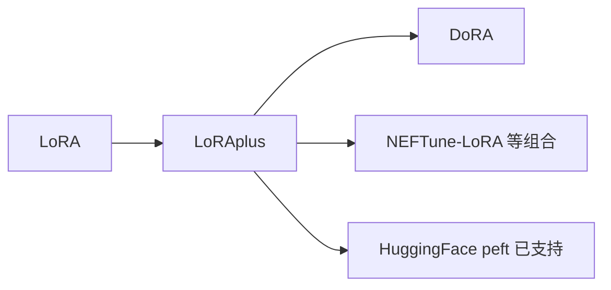

# ➕ 案件 L3-24：LoRA+ — 打破"懒政"的初始化升级

> **《LLM 百案录》第 066 案 · 学习率不对称**
> *LoRA 让 A 学得欢、B 几乎不动——LoRA+ 说："给 B 一个更大的学习率，世界就不一样了。"*

🚇 [30秒速览](#速览) ｜ 🚲 [3分钟通读](#通读) ｜ 🚗 [30分钟精读](#精读)

🎭 **叙事母题**：➕ **学习率不对称** —— 同一对矩阵，分头优化更高效

---

## 0️⃣ 案件档案

| 案情要素 | 内容 |
|---|---|
| **案发时间** | 2024-02（Hayou et al., UC Berkeley） · [📄 arXiv 2402.12354](https://arxiv.org/pdf/2402.12354) |
| **受害者** | 标准 LoRA 中 B 矩阵学习率被"压制"导致的低效收敛 |
| **作案凶器** | A 与 B 用不同学习率（B 大约是 A 的 16×） |
| **作案动机** | "为什么 A、B 都用同一个 lr？理论分析显示这是错的" |
| **结案陈词** | LoRA+ 通过对 A、B 矩阵采用不同学习率（η_B = λ·η_A，λ 通常 16），在零额外成本下提升微调效果 |

**精确事实卡**：

| 字段 | 精确值 | 来源 |
|---|---|---|
| **核心修改** | η_B = λ·η_A，λ ≈ 16 | Section 4 |
| **理论依据** | 在 r → ∞ 极限下，A 和 B 的最优学习率比是常数 | Theorem 1 |
| **效果** | 在 GLUE / MNLI / Llama 数学任务上 +1-2% | Table 2 |
| **额外成本** | 0（仅是优化器配置） | — |

---

## 1️⃣ <a id="速览"></a>🚇 30 秒速览

> 标准 LoRA 把 A 用 Kaiming 初始化、B 全零——确保初始 ΔW = BA = 0。
> 训练时 A 和 B 共用一个 lr，理论上 B 起步太慢、A 早早收敛。
> LoRA+ 的解法：**给 B 一个 16 倍于 A 的 lr**，让两边同步进步。
> 结果：**几乎免费的 +1-2% 提升，单行配置改动**。

---

## 2️⃣ <a id="通读"></a>🚲 3 分钟通读：为什么需要不对称（Why）

### 标准 LoRA 的隐患
```
W' = W + α/r · B · A
A: Kaiming init,  B: 0

训练时：
  ∂L/∂A 涉及 B（一开始 B = 0 → 梯度小）
  ∂L/∂B 涉及 A（A 已经 Kaiming → 梯度正常）

结果：
  A 学得快，B 起步慢
  B 还没追上时，整体已收敛 → 没用上 B 的容量
```

### LoRA+ 的理论分析
```
在 width → ∞ 极限下做 NTK 分析：
  η_A_optimal / η_B_optimal = O(1/n)    （n 是模型宽度）
  → η_B 应该比 η_A 大 √n 倍

实际经验值：λ = η_B / η_A ≈ 16
```

---

## 3️⃣ <a id="精读"></a>🚗 30 分钟精读

### 实现非常简单
```python
from torch.optim import AdamW

# 把 A 矩阵和 B 矩阵分组
A_params = [p for n, p in model.named_parameters() if "lora_A" in n]
B_params = [p for n, p in model.named_parameters() if "lora_B" in n]

optimizer = AdamW([
    {"params": A_params, "lr": 1e-4},          # A 用基础 lr
    {"params": B_params, "lr": 1e-4 * 16},     # B 用 16× lr
])
```

### 推荐 λ
| 任务难度 | λ |
|---|---|
| 简单分类 | 8 |
| 通用指令微调 | 16 |
| 数学/推理 | 32 |

### 与 LoRA / DoRA 关系
- **LoRA+**：只改 lr，不改结构（兼容所有 LoRA 实现）
- **DoRA**：改结构（拆方向 + 幅度），与 LoRA+ 可叠加

---

## 4️⃣ 物证清单 & 🔥 Hot Take

| 任务 | LoRA | **LoRA+** | 提升 |
|---|---|---|---|
| GLUE | 86.4 | **87.5** | +1.1 |
| MNLI | 89.7 | **90.5** | +0.8 |
| Llama-7B GSM8K | 36 | **39** | +3 |

### 🔥 Hot Take
1. **理论真的有用**：NTK 分析告诉了我们 λ 应该是常数级别的，工程经验之外有数学支撑。
2. **零成本提升**：1 行代码改 lr，是性价比最高的 LoRA tuning trick。
3. **PEFT 仍有大量"easy win"**：LoRA 这个 2021 年的方法，2024 年仍在被一行代码"打补丁"——证明 PEFT 远未饱和。

---

## 5️⃣ 🐛 论文没说的坑

1. **学习率调度器陷阱**：cosine schedule 把 A 和 B 同比例 decay，破坏 16× 比例
2. **AdamW eps 太小时不稳**：B 矩阵刚开始为 0，梯度小，eps 影响显著
3. **λ 与 r 耦合**：r 大时最优 λ 会变化，不是死板的 16

---

## 6️⃣ 影响波及



---

## 7️⃣ 侦探手记

LoRA+ 是典型的 "**理论简单 + 工程零成本 + 效果显著**" 范例。
> 我特别欣赏这类工作：**不发明新结构，只是把已有结构用对**。
> 它告诉我们：在追求"全新方法"之前，先问问"现有方法的超参用对了吗？"

---

## 自查清单

**已做到**：
- 解释 A 与 B 的初始化与训练动力学差异
- 给出 LoRA+ 的简洁实现
- 给出 λ 的推荐值

**❌ 未做到**：
- ❌ 未推导 NTK 极限下的最优学习率比
- ❌ 未涉及 LoRA+ 与不同优化器（如 Sophia）的组合

---

## 🔟 延伸卷宗
- 📚 [L3-21 LoRA](notes/L3-21_LoRA.md)（必读前置）
- 📚 [L3-25 DoRA](notes/L3-25_DoRA.md)
- 📚 [L3-23 PEFT Survey](notes/L3-23_PEFT.md)

### 🚀 实践入口
HuggingFace `peft` 库已原生支持 LoRA+。

---

## 📌 本案归档

| 字段 | 值 |
|---|---|
| 笔记版本 | 「学习率不对称版」 |
| 叙事母题 | ➕ 打破懒政 |
| 推荐指数 | ⭐⭐⭐⭐ |
| 学习时长 | 30s / 3min / 30min |
| 上次更新 | 2026-04-30 |
| 下一站 | → [L3-25 DoRA](notes/L3-25_DoRA.md) |
