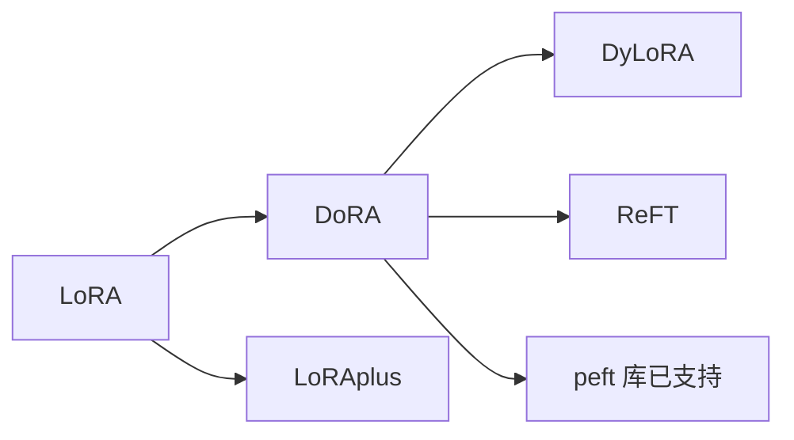

# ⚖️ 案件 L3-25：DoRA — 把 LoRA 拆成"方向 + 幅度"

> **《LLM 百案录》第 067 案 · 解剖学**
> *LoRA 把 ΔW 当一个整体——DoRA 说："把它拆成方向变化和幅度变化，分别学。"*

🚇 [30秒速览](#速览) ｜ 🚲 [3分钟通读](#通读) ｜ 🚗 [30分钟精读](#精读)

🎭 **叙事母题**：⚖️ **解剖学** —— 不仅看整体，还要分解成可解释分量

---

## 0️⃣ 案件档案

| 案情要素 | 内容 |
|---|---|
| **案发时间** | 2024-02（Liu et al., NVIDIA & MIT） |
| **受害者** | LoRA 与全量微调的"学习模式差异"——LoRA 偏向同时改变 magnitude 和 direction，FT 倾向直接调方向 |
| **作案凶器** | Weight decomposition：W = magnitude × direction，分别用全量 + LoRA 处理 |
| **作案动机** | "让 LoRA 的学习模式更接近全量微调" |
| **结案陈词** | DoRA 把权重拆为列范数 m（直接训）和方向 V（用 LoRA）两部分，效果普遍好于 LoRA，与全量微调更接近 |

**精确事实卡**：

| 字段 | 精确值 | 来源 |
|---|---|---|
| **分解** | W = m · V/||V||_c（列归一化） | Section 3.1 |
| **可训部分** | m（向量）+ LoRA 用于 V | Section 3.2 |
| **效果** | 在 LLaMA / VL-BART / 视觉任务上普遍 +0.5-2% | Table 2 |
| **额外参数** | 微小（仅 m 是 d-dim 向量） | — |

---

## 1️⃣ <a id="速览"></a>🚇 30 秒速览

> 作者发现：**LoRA 学到的 ΔW 和全参数微调的 ΔW 在"方向 vs 幅度"的相关性上完全不同**——
> LoRA 倾向同时改变两者，FT 倾向只改方向。
> DoRA 的解法：把 W 显式拆成 m（幅度）和 V（方向），m 直接训练，V 用 LoRA 训练。
> 结果：**学习模式更接近 FT，所有任务都比 LoRA 强一档**。

---

## 2️⃣ <a id="通读"></a>🚲 3 分钟通读：方向 vs 幅度的洞察（Why）

### 关键观察
```
对 LoRA 训出的 W' 和 FT 训出的 W'：
  分别看每列向量的 (norm 变化, 角度变化)
  绘制散点图 → 两者分布显著不同

LoRA：norm 变 + angle 变 高度相关
FT：可以独立变化（很多列只改 angle 不改 norm）
```

### DoRA 的设计动机
```
让 LoRA 拥有 FT 的灵活性：
  m（每列的 norm）：单独可训，与方向无关
  V（每列的方向）：用 LoRA 来更新

W = m · V/||V||_col

→ m 改变只影响幅度
→ LoRA 改变 V 主要影响方向
→ 两者解耦，更接近 FT 的学习模式
```

---

## 3️⃣ <a id="精读"></a>🚗 30 分钟精读

### 数学定义
对于权重矩阵 W ∈ R^{d×k}：
- m ∈ R^{1×k}：每列的 norm（标量向量）
- V ∈ R^{d×k}：方向矩阵
- $W = m \cdot \frac{V}{||V||_c}$，其中 $||V||_c$ 是按列归一化

### 训练流程
```python
# 初始化时
W_pretrained = ...  # 预训练权重
m = torch.norm(W_pretrained, dim=0, keepdim=True)  # 列范数
V = W_pretrained                                    # 方向

# 训练时
m: 直接是可学习参数（d 维向量，开销极小）
V: V' = V_frozen + LoRA(B·A)（用 LoRA 更新方向部分）

# Forward
V_normed = V_frozen + B·A
V_normed = V_normed / ||V_normed||_c
W_effective = m * V_normed
output = x @ W_effective.T
```

### 推理时是否能 merge？
```
理论上 W_effective 是一个完整矩阵，可以提前算出来再合并
→ 但 m 的存在让"merge 回基础权重"略复杂
→ 实践中要么留着 m / V 分开计算，要么近似 merge
```

---

## 4️⃣ 物证清单 & 🔥 Hot Take

| 任务 | LoRA | **DoRA** | 提升 |
|---|---|---|---|
| Llama-7B 常识问答 | 78.5 | **80.4** | +1.9 |
| Llama-13B 常识问答 | 81.7 | **82.7** | +1.0 |
| VL-BART 视觉问答 | 65.2 | **66.4** | +1.2 |
| 图像分类（ViT） | 88.0 | **89.1** | +1.1 |

### 🔥 Hot Take
1. **理论先行的胜利**：先观察 LoRA 与 FT 的差异 → 假设差异在 magnitude/direction → 设计 DoRA → 实测验证。
2. **小修改大影响**：仅多一个 d 维向量，效果普遍好于 LoRA。
3. **未来 PEFT 都会"分解结构"**：可能继续拆成 magnitude/direction/sparsity 等更多分量。

---

## 5️⃣ 🐛 论文没说的坑

1. **梯度计算复杂度**：每次 forward 要做列归一化，速度比 LoRA 慢 5-10%
2. **对 batch size 敏感**：列归一化在 small batch 下噪声大
3. **Merge 复杂**：不像 LoRA 可以零成本 merge

---

## 6️⃣ 影响波及



---

## 7️⃣ 侦探手记

DoRA 给我的启发：**"把整体拆成可解释分量"是科研的基本功**。
> 牛顿把"运动"拆成"位置 + 速度 + 加速度"；
> DoRA 把"权重更新"拆成"方向 + 幅度"。
> 拆分不是为了好看，而是为了**给每个分量配最合适的学习方式**——这才是设计的精髓。

---

## 自查清单

**已做到**：
- 解释 LoRA 与 FT 的"方向/幅度"差异
- 推导 DoRA 的 W = m·V/||V||_c 分解
- 给出实测对比

**❌ 未做到**：
- ❌ 未深入分析为什么 FT 倾向"只改方向"
- ❌ 未对比 DoRA 与 ReFT、PiSSA 等更新方法

---

## 🔟 延伸卷宗
- 📚 [L3-21 LoRA](./L3-21_LoRA.md)
- 📚 [L3-24 LoRA+](./L3-24_LoRA_plus.md)
- 📚 [L3-23 PEFT Survey](./L3-23_PEFT.md)

### 🚀 实践入口
HuggingFace `peft` 库 (>=0.10) 已支持 `LoraConfig(use_dora=True)`。

---

## 📌 本案归档

| 字段 | 值 |
|---|---|
| 笔记版本 | 「解剖学版」 |
| 叙事母题 | ⚖️ 解剖学 |
| 推荐指数 | ⭐⭐⭐⭐ |
| 学习时长 | 30s / 3min / 30min |
| 上次更新 | 2026-04-30 |
| 下一站 | → [L3-26 AdapterHub](./L3-26_AdapterHub.md) |
