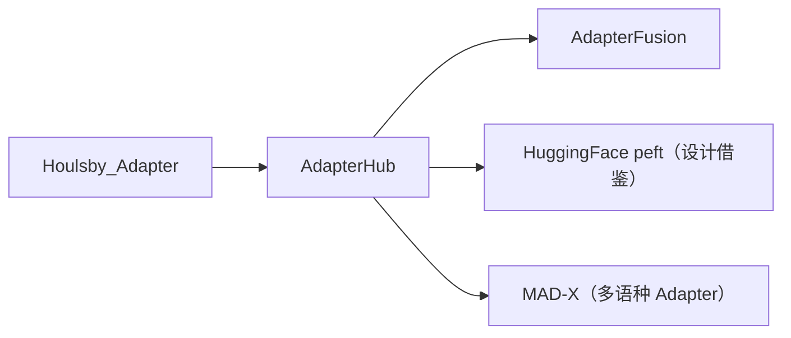

# 🔌 案件 L3-26：AdapterHub — Adapter 的"USB 协议"

> **《LLM 百案录》第 068 案 · 标准化**
> *研究界的 Adapter 各家一份，互不相通——AdapterHub 说："我来给所有人做 USB 接口。"*

🚇 [30秒速览](#速览) ｜ 🚲 [3分钟通读](#通读) ｜ 🚗 [30分钟精读](#精读)

🎭 **叙事母题**：🔌 **标准化** —— 接口统一才能生态繁荣

---

## 0️⃣ 案件档案

| 案情要素 | 内容 |
|---|---|
| **案发时间** | 2020（Pfeiffer et al., AdapterHub.ml） · [📄 arXiv 2007.07779](https://arxiv.org/pdf/2007.07779) |
| **受害者** | "每个团队一种 Adapter 实现"的混乱 |
| **作案凶器** | 统一的 Adapter 接口 + AdapterHub.ml 模型仓库 + 多种 composition 方法 |
| **结案陈词** | AdapterHub 把 Adapter 标准化成可下载、可组合、可堆叠的模块化组件 |

**精确事实卡**：

| 字段 | 精确值 | 来源 |
|---|---|---|
| **核心库** | `adapter-transformers`（fork of HuggingFace） | github.com/adapter-hub |
| **Composition** | Stack / Fuse / Split / BatchSplit / Parallel | Section 3 |
| **AdapterFusion** | 训练阶段 1 学多个任务 Adapter，阶段 2 学如何融合 | Companion paper |

---

## 1️⃣ <a id="速览"></a>🚇 30 秒速览

> Adapter（Houlsby 2019）思想很好：每层插入一个小残差块，只训这部分。
> 但每个研究团队有自己的实现——超参不同、接口不同、不能互换。
> AdapterHub 的解法：
> 1. **统一接口**：把 Adapter 包装成 `AdapterConfig`，HuggingFace 风格
> 2. **AdapterHub.ml**：建立 model hub，可下载预训练好的 task adapter
> 3. **Composition primitives**：定义 Stack、Fuse、Parallel 等组合方式
> 结果：**Adapter 的"基础设施"齐了，AdapterFusion 等高阶应用得以爆发。**

---

## 2️⃣ <a id="通读"></a>🚲 3 分钟通读：为什么标准很重要（Why）

### 标准化前的痛
```
Houlsby Adapter   位置/激活函数/初始化方式 A
Pfeiffer Adapter  位置/激活函数/初始化方式 B
Compacter         结构 C
HyperAdapter      结构 D

→ 想对比？要重新实现 4 套
→ 想组合？接口不通
→ 想分享？没地方上传
```

### AdapterHub 的三件套
```
1. 统一接口：所有 Adapter 都实现 AdapterConfig
2. Model Hub：可上传可下载（类似 HuggingFace Hub）
3. Composition：声明式组合多个 Adapter
```

---

## 3️⃣ <a id="精读"></a>🚗 30 分钟精读

### 5 种组合原语

| 原语 | 作用 | 用例 |
|---|---|---|
| **Stack** | A → B 串联 | language adapter → task adapter（跨语言迁移） |
| **Fuse** | 多 Adapter 加权融合（attention） | AdapterFusion：多任务知识融合 |
| **Split** | 输入按位置切分给不同 Adapter | 多语种混合输入 |
| **BatchSplit** | 同一 batch 内不同 sample 走不同 Adapter | 多任务联合推理 |
| **Parallel** | 同时跑多个 Adapter，输出可选 | A/B 测试 |

### AdapterFusion 双阶段流程
```
阶段 1：分别训练多个 task adapter（每个任务一份）
  Task A → adapter_A
  Task B → adapter_B
  Task C → adapter_C

阶段 2：训练 fusion 层，学会如何组合 A/B/C 的输出
  在新任务 D 上：固定 adapter_A/B/C，只训 fusion 层
  fusion = softmax(Q_D · [K_A, K_B, K_C]) · [V_A, V_B, V_C]
```

### 实操示例
```python
from transformers.adapters import LoRAConfig, BnConfig

model.add_adapter("squad_lora", config=LoRAConfig(r=8))
model.add_adapter("mnli_bottleneck", config=BnConfig(reduction_factor=16))

# 串联使用
model.active_adapters = Stack("mnli_bottleneck", "squad_lora")

# Fusion
model.add_adapter_fusion(["squad_lora", "mnli_bottleneck", "snli_lora"])
model.train_adapter_fusion(["squad_lora", "mnli_bottleneck", "snli_lora"])
```

---

## 4️⃣ 物证清单 & 🔥 Hot Take

### AdapterHub.ml 上的资源
- 数百个预训练 task adapter（GLUE、SQuAD、各语种 MLM 等）
- 一行代码加载：`model.load_adapter("squad/lora")`

### 🔥 Hot Take
1. **基础设施 > 单一论文**：AdapterHub 本身没引入新算法，但提供的工具链让 Adapter 派系受惠至今。
2. **Composition primitives 是真创新**：Stack/Fuse/Split 这套语言比"实现一个 Adapter"重要得多。
3. **后被 HuggingFace `peft` 部分吸收**：LoRA 等流派的统一也借鉴了 AdapterHub 的思路。

---

## 5️⃣ 🐛 论文没说的坑

1. **adapter-transformers 与主线 transformers 偶有版本冲突**
2. **AdapterHub 的预训练 adapter 多基于 BERT/RoBERTa，LLaMA 时代还在跟进**
3. **Fusion 训练成本高**：要保留所有 adapter + 训 fusion 层

---

## 6️⃣ 影响波及



---

## 7️⃣ 侦探手记

AdapterHub 让我相信：**软件工程的胜利往往比算法本身更深远**。
> Pytorch 之于深度学习，HuggingFace Transformers 之于 NLP，都是"接口"决定生态——
> AdapterHub 在 PEFT 圈做的事一脉相承：**让大家说同一种语言，社区才能积累。**

---

## 自查清单

**已做到**：
- 解释 AdapterHub 三大组件
- 列出 5 种 Composition 原语
- 描述 AdapterFusion 双阶段训练

**❌ 未做到**：
- ❌ 未深入对比 adapter-transformers 与 peft 的设计差异
- ❌ 未量化 AdapterFusion 在多任务设置下的边际效益

---

## 🔟 延伸卷宗
- 📚 [L3-23 PEFT Survey](./L3-23_PEFT.md)
- 📚 [L3-21 LoRA](./L3-21_LoRA.md)
- 📚 [L3-27 Prefix Tuning](./L3-27_Prefix_Tuning.md)

### 🚀 实践入口
[adapterhub.ml](https://adapterhub.ml/) 模型库 + `pip install adapter-transformers`。

---

## 📌 本案归档

| 字段 | 值 |
|---|---|
| 笔记版本 | 「USB 协议版」 |
| 叙事母题 | 🔌 标准化 |
| 推荐指数 | ⭐⭐⭐⭐ |
| 学习时长 | 30s / 3min / 30min |
| 上次更新 | 2026-04-30 |
| 下一站 | → [L3-27 Prefix Tuning](./L3-27_Prefix_Tuning.md) |
