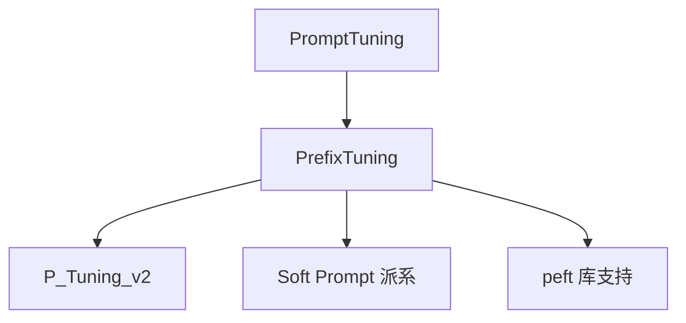

# 🎪 案件 L3-27：Prefix Tuning — 在输入前加"虚拟主持人"

> **《LLM 百案录》第 069 案 · 软提示**
> *Prompt 工程靠人写文字，Prefix Tuning 说："让我学一段连续向量当 prompt。"*

🚇 [30秒速览](#速览) ｜ 🚲 [3分钟通读](#通读) ｜ 🚗 [30分钟精读](#精读)

🎭 **叙事母题**：🎪 **软提示** —— 提示可以是数字而非文字

---

## 0️⃣ 案件档案

| 案情要素 | 内容 |
|---|---|
| **案发时间** | 2021-01（Li & Liang, Stanford） · [📄 arXiv 2101.00190](https://arxiv.org/pdf/2101.00190) |
| **受害者** | 全参数微调的高成本 + Prompt 工程的"碰运气" |
| **作案凶器** | 在每层 attention 的 K/V 之前 prepend 可学习的 prefix vectors |
| **作案动机** | "Prompt 是有效的，但离散 token 优化困难——直接学连续向量" |
| **结案陈词** | Prefix Tuning 冻结整个模型，只学习每层的 prefix（约 0.1% 参数），就能逼近全量微调效果 |

**精确事实卡**：

| 字段 | 精确值 | 来源 |
|---|---|---|
| **位置** | 每层 self-attention 的 K, V 前 prepend | Section 3 |
| **参数量** | prefix_length × n_layers × d_model × 2 | Section 3 |
| **重参数化** | 用一个 small MLP 生成 prefix（避免直接训不稳） | Section 3.4 |
| **效果** | 表格摘要、E2E 等任务上接近全微调 | Table 2 |

---

## 1️⃣ <a id="速览"></a>🚇 30 秒速览

> Prompt 工程：写"请总结以下文章："这种自然语言指令——离散，难优化。
> Prefix Tuning：每层 attention 前面插入一组**可学习的 K/V 向量**——连续，可梯度优化。
> 训练时：模型完全冻结，只学这些 prefix。
> 结果：**仅 0.1% 参数训练，在生成任务上接近全微调。**

---

## 2️⃣ <a id="通读"></a>🚲 3 分钟通读：从离散 prompt 到连续 prefix（Why）

### 离散 Prompt 的痛
```
"请翻译以下英文："  vs  "Translate the following English to Chinese:"
不同表述效果差很多 → 但在离散 token 空间难以梯度搜索
```

### Prefix 的连续优化空间
```
不写"请翻译"，而是直接给 K, V 各 prepend 一段可训练向量

每层 attention：
  K' = [P_k; K_input]  ← 前面是 prefix（可训），后面是真实输入
  V' = [P_v; V_input]
  Q 不变（用真实输入算 attention）

→ Q 在 attend 真实 token 时也会 attend 到 prefix
→ Prefix 的内容由梯度决定，比人写 prompt 强
```

---

## 3️⃣ <a id="精读"></a>🚗 30 分钟精读

### 参数量计算
```
prefix_length = L_p（典型 10-200）
hidden_size = d
n_layers = N

每层每个 head 都有 P_k, P_v
参数总量 = L_p × N × d × 2
        ≈ 0.1% × 全模型参数（典型）
```

### 重参数化技巧（关键）
```
直接学习 P_k, P_v ∈ R^{L_p × d}
→ 训练不稳定（梯度方差大）

解法：
  让 P_k, P_v 由一个共享小 MLP 生成
  P = MLP(p_emb)，p_emb ∈ R^{L_p × d_small}

训练时学 p_emb 和 MLP（更稳定）
推理时把 P_k, P_v "烧"出来用，丢掉 MLP
```

### Forward 时如何融合
```python
# 标准 attention
Q, K, V = proj(x)
out = softmax(Q @ K.T) @ V

# Prefix Tuning
Q, K, V = proj(x)
K_full = concat([P_k, K], dim=seq)
V_full = concat([P_v, V], dim=seq)
out = softmax(Q @ K_full.T) @ V_full
```

---

## 4️⃣ 物证清单 & 🔥 Hot Take

| 任务 | Full FT | **Prefix Tuning** |
|---|---|---|
| E2E（表→文） | 70.8 | **70.4** |
| WebNLG | 53.0 | **51.5** |
| DART | 47.3 | **45.8** |

> 在生成任务上，Prefix Tuning ≈ 全微调；但在分类任务上偏弱。

### 🔥 Hot Take
1. **"软提示"是 PEFT 的另一支**：与 LoRA 派（加结构）平行的"加输入"派。
2. **每层都加是关键**：只在输入层加（Prompt Tuning）效果差很多——因为 prefix 信号要随层数注入。
3. **占用 KV cache**：prefix 会占用推理时的 KV cache 长度——对长 context 推理是负担。

---

## 5️⃣ 🐛 论文没说的坑

1. **训练敏感**：不用重参数化几乎调不出来
2. **任务迁移性差**：在 task A 上训的 prefix 用到 task B 上效果差
3. **KV cache 占用**：prefix_length 越长，推理时显存越大

---

## 6️⃣ 影响波及



---

## 7️⃣ 侦探手记

Prefix Tuning 让我意识到：**"提示"本来就不必是文字**。
> 模型内部本就用向量思考——人类把它包装成文字 prompt 是为了便于操作。
> 直接在向量空间优化 prompt，绕过离散化瓶颈，是更"原生"的做法。

---

## 自查清单

**已做到**：
- 解释 Prefix Tuning vs Prompt Tuning 的差异（每层 vs 仅输入层）
- 推导参数量与重参数化的作用
- 给出生成 vs 分类任务的效果差异

**❌ 未做到**：
- ❌ 未深入分析 prefix_length 的最优选择
- ❌ 未对比 Prefix Tuning 与 P-Tuning v2 的细节差异

---

## 🔟 延伸卷宗
- 📚 [L3-28 P-Tuning v2](notes/L3-28_P_Tuning_v2.md)（增强版）
- 📚 [L3-23 PEFT Survey](notes/L3-23_PEFT.md)
- 📚 [L3-21 LoRA](notes/L3-21_LoRA.md)（"加结构"派对比）

### 🚀 实践入口
HuggingFace `peft` 库 `PrefixTuningConfig`。

---

## 📌 本案归档

| 字段 | 值 |
|---|---|
| 笔记版本 | 「软提示版」 |
| 叙事母题 | 🎪 软提示 |
| 推荐指数 | ⭐⭐⭐⭐ |
| 学习时长 | 30s / 3min / 30min |
| 上次更新 | 2026-04-30 |
| 下一站 | → [L3-28 P-Tuning v2](notes/L3-28_P_Tuning_v2.md) |
