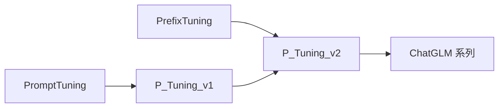

# 🎯 案件 L3-28：P-Tuning v2 — 软提示的"全栈深化"

> **《LLM 百案录》第 070 案 · 深层引导**
> *P-Tuning 只在输入层加 soft prompt，效果不稳——P-Tuning v2 说："每一层都加，并去掉繁文缛节。"*

🚇 [30秒速览](#速览) ｜ 🚲 [3分钟通读](#通读) ｜ 🚗 [30分钟精读](#精读)

🎭 **叙事母题**：🎯 **深层引导** —— 提示信号要贯穿所有层

---

## 0️⃣ 案件档案

| 案情要素 | 内容 |
|---|---|
| **案发时间** | 2022（Liu et al., 清华） · [📄 arXiv 2110.07602](https://arxiv.org/pdf/2110.07602) |
| **受害者** | P-Tuning v1 / Prompt Tuning 在中小模型与困难任务上的不稳定 |
| **作案凶器** | 每层都加 prefix（实质上是 Prefix Tuning 重新包装）+ 去掉重参数化 + 去掉 verbalizer |
| **作案动机** | "Prompt Tuning 在 10B+ 模型上有效，10B 以下要每层都加才行" |
| **结案陈词** | P-Tuning v2 = Prefix Tuning + 简化的训练管线，在中等模型（< 10B）上首次让"加输入"派稳定可用 |

**精确事实卡**：

| 字段 | 精确值 | 来源 |
|---|---|---|
| **关键差异 vs v1** | 每层都加 + 不需要 verbalizer | Section 3 |
| **关键差异 vs Prefix Tuning** | 直接训练，不用 reparametrization | Section 3 |
| **目标场景** | 100M - 10B 中等规模模型 | Section 1 |
| **效果** | 在 SuperGLUE / NER 等任务上达到 FT 水平 | Table 1 |

---

## 1️⃣ <a id="速览"></a>🚇 30 秒速览

> Prompt Tuning（v1）只在输入层加 soft prompt——在 1B 以下模型上几乎不能用。
> P-Tuning v2 的主要改动：
> 1. **每层都加 prefix**（本质 = Prefix Tuning）
> 2. **直接训练**，不用 MLP 重参数化（实测够用且更简单）
> 3. **classification head 直接用 [CLS]**，丢掉 verbalizer / cloze 范式
> 结果：**在 100M-10B 这个"中等规模"区间，PEFT 终于追平 Full FT。**

---

## 2️⃣ <a id="通读"></a>🚲 3 分钟通读：v1 的失败与 v2 的修补（Why）

### v1（Prompt Tuning）的局限
```
仅在输入层 prepend soft prompt
→ 浅层信号被深层稀释
→ 中小模型容量不够，Prompt 影响传不到顶层
→ 实测：< 10B 时几乎不工作
```

### v2 的三个修补
```
1. 每层都加 prefix（解决信号稀释）
2. 不用 verbalizer（cloze 模式 → 直接分类，避免设计 prompt 模板）
3. 不用 MLP 重参数化（实测发现并非必须）
```

---

## 3️⃣ <a id="精读"></a>🚗 30 分钟精读

### 与 Prefix Tuning 的关系
> P-Tuning v2 在结构上**几乎等价于 Prefix Tuning**——都是每层加 prefix。
> 主要差别：v2 的目标场景是 NLU（理解/分类），Prefix Tuning 主要是 NLG（生成）；v2 不用重参数化。

### 公式
```
每层 self-attention：
  K_l = [P_l^K ; K_input]
  V_l = [P_l^V ; V_input]

l = 1, ..., L 都加 → 每层都注入信号

Loss：
  分类任务：CE([CLS] hidden state, label)
  不需要 cloze + verbalizer 那套
```

### v1 vs v2 vs Full FT
| 维度 | v1 | **v2** | Full FT |
|---|---|---|---|
| Prompt 位置 | 仅输入层 | **每层** | — |
| 可训参数 | 0.01% | 0.1-3% | 100% |
| 中小模型可用 | ❌ | **✅** | ✅ |
| 大模型 (>10B) 可用 | ✅ | ✅ | ✅ |

---

## 4️⃣ 物证清单 & 🔥 Hot Take

| 任务（BERT-large） | Full FT | v1 | **v2** |
|---|---|---|---|
| BoolQ | 76.7 | 67.2 | **76.6** |
| RTE | 76.5 | 64.6 | **78.3** |
| CoNLL03 NER | 92.5 | 81.7 | **92.0** |

### 🔥 Hot Take
1. **"v2"主要是落地工程改进**：从研究价值上是 Prefix Tuning 的特例；从工程价值上让中等模型 PEFT 真正可用。
2. **去掉 verbalizer 是简化的胜利**：verbalizer 设计依赖人工，v2 用标准 [CLS] 分类反而更稳定。
3. **GLM 系列默认采用 P-Tuning v2**：清华自家的 GLM 模型把它做成生产级方案。

---

## 5️⃣ 🐛 论文没说的坑

1. **prefix_length 调参敏感**：长度太短无效，太长占 KV cache
2. **某些任务表现仍弱**：复杂多跳推理上不如 LoRA
3. **与 LoRA 很难叠加**：两者都改 attention，混用会冲突

---

## 6️⃣ 影响波及



---

## 7️⃣ 侦探手记

P-Tuning v2 是 PEFT 历史上一个有趣的"清算论文"：
> 它没引入新结构（基本就是 Prefix Tuning），但通过工程化改进把"加输入"派从 academic novelty 推到 production ready。
> 这类工作往往被低估——但在工业界比"花哨的新方法"实用十倍。

---

## 自查清单

**已做到**：
- 解释 v1 → v2 的三大改动
- 与 Prefix Tuning 的等价性分析
- 给出 BERT-large 上的实测数据

**❌ 未做到**：
- ❌ 未量化 prefix_length 在不同模型规模下的最佳值
- ❌ 未深入对比 ChatGLM 中具体落地细节

---

## 🔟 延伸卷宗
- 📚 [L3-27 Prefix Tuning](./L3-27_Prefix_Tuning.md)（结构等价物）
- 📚 [L3-23 PEFT Survey](./L3-23_PEFT.md)
- 📚 [L3-21 LoRA](./L3-21_LoRA.md)

### 🚀 实践入口
HuggingFace `peft` 库 `PromptEncoderConfig`、`PrefixTuningConfig`。

---

## 📌 本案归档

| 字段 | 值 |
|---|---|
| 笔记版本 | 「深层引导版」 |
| 叙事母题 | 🎯 深层引导 |
| 推荐指数 | ⭐⭐⭐⭐ |
| 学习时长 | 30s / 3min / 30min |
| 上次更新 | 2026-04-30 |
| 下一站 | → [L3-29 IA³](./L3-29_IA3.md) |
