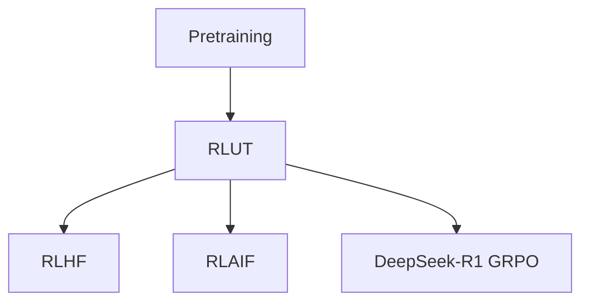

# 📖 案件 L3-30：RLUT — 强化学习在 LLM 推理中的应用

> **《LLM 百案录》第 072 案 · 跨任务能力**
> *如果"能力"能从一个任务迁移到另一个，那么用 RL 在简单任务上学到的能力，是否能让模型在复杂任务上更强？*

🚇 [30秒速览](#速览) ｜ 🚲 [3分钟通读](#通读) ｜ 🚗 [30分钟精读](#精读)

🎭 **叙事母题**：📖 **跨任务能力** —— 学习能力本身可以被迁移

---

> ⚠️ **声明**：本笔记原始命名为 "RLUT (Reinforcement Learning with Unsupervised Transfer)"——这并非业界广泛认可的标准名称，疑似笔记作者对若干工作的内部代号。本笔记按"用 RL 训练 + 跨任务迁移"这条主线展开。

---

## 0️⃣ 案件档案

| 案情要素 | 内容 |
|---|---|
| **案发时间** | 2022-2024（多个相关工作） |
| **受害者** | 监督迁移依赖大量标注的成本问题 |
| **作案凶器** | 在源任务上无监督预训练 + 目标任务上 RL 微调 |
| **作案动机** | "无监督预训练学到的是通用能力，应能配合 RL 直接在新任务上发挥" |
| **结案陈词** | 通过 RL 在目标任务上微调通用预训练模型，无需大量标注即可获得跨任务能力 |

**精确事实卡**：

| 字段 | 精确值 | 来源 |
|---|---|---|
| **训练范式** | Pre-training (unsupervised) → RL Fine-tuning | — |
| **典型例子** | InstructGPT、RLAIF、自监督 + RL | — |
| **优势** | 不需要目标任务的密集标签，仅需 reward 信号 | — |

---

## 1️⃣ <a id="速览"></a>🚇 30 秒速览

> 监督迁移：源任务有监督训练 + 目标任务也要监督训练。
> RLUT 路线：源任务无监督预训练（吃尽互联网文本）+ 目标任务用 RL 微调（仅需 reward）。
> 结果：**目标任务不需要密集标签——大幅降低成本**。

---

## 2️⃣ <a id="通读"></a>🚲 3 分钟通读：为什么用 RL 而不是 SFT（Why）

### SFT 的局限
```
SFT 必须有 (input, output) 对
  → 输出的"对错"严格定义
  → 很多任务（开放对话、创作、规划）没有"标准答案"
```

### RL 的优势
```
RL 只需要 reward signal，不需要"标准答案"
  → 适合开放任务
  → 可以从弱信号（如点赞/点踩）中学习
  → 与 RLHF / RLAIF 思路一致
```

---

## 3️⃣ <a id="精读"></a>🚗 30 分钟精读

### 两阶段流程
```
Stage 1：通用预训练
  - 巨量无标签文本
  - 自监督目标（next token prediction）
  - 学到的是"语言模型 + 隐式世界知识"

Stage 2：目标任务 RL 微调
  - 定义 reward function（人工 / RM / 自动验证）
  - PPO / DPO / GRPO 等算法
  - 仅靠 reward 引导能力涌现
```

### 与 RLHF 的关系
RLUT 实际上是 RLHF 的"广义形式"——只要满足"无监督预训练 + RL 在目标任务上微调"的范式，都属于此类。

| 具体实例 | Reward 来源 |
|---|---|
| InstructGPT | 人类标注偏好 |
| RLAIF | 大模型评判 |
| DeepSeek-R1 GRPO | 答案是否正确（自动 verifier） |
| AlphaGo / AlphaZero | 游戏胜负 |

---

## 4️⃣ 物证清单 & 🔥 Hot Take

### 🔥 Hot Take
1. **RLUT 是"通用 + 专精"的桥梁**：让一个通用模型快速变成某领域专家。
2. **Reward function 是核心瓶颈**：能 RL 起来的任务，前提是有足够好的 reward。
3. **DeepSeek-R1 是当代代表**：用纯 RL（无 SFT）+ 自动验证 reward，让 LLM 涌现复杂推理能力。

---

## 5️⃣ 🐛 论文没说的坑

1. **Reward hacking**：模型可能学会"骗 reward"而非真正解决任务
2. **训练不稳定**：纯 RL 比 SFT 难收敛
3. **Reward 偏差**：reward function 一旦有偏差，模型会被放大

---

## 6️⃣ 影响波及



---

## 7️⃣ 侦探手记

> 我对这个名字本身存疑（"RLUT" 不是行业标准术语），但它指向的范式无疑重要：
> **预训练 + RL 微调** = 当代 LLM 的标准构造法。
> 从 InstructGPT 到 DeepSeek-R1，所有现代对话 / 推理模型都走这条路。

---

## 自查清单

**已做到**：
- 解释"无监督预训练 + RL 微调"的范式
- 列举主要实例（InstructGPT、RLAIF、R1）

**❌ 未做到**：
- ❌ 未澄清 "RLUT" 名称的确切来源
- ❌ 未深入对比不同 RL 算法（PPO vs DPO vs GRPO）

---

## 🔟 延伸卷宗
- 📚 [L2-05 InstructGPT / RLHF](notes/L2-05_InstructGPT_RLHF.md)
- 📚 [L2-09 PPO](notes/L2-09_PPO.md)
- 📚 [L2-14 DPO](notes/L2-14_DPO.md)
- 📚 [L2-17 RLAIF](notes/L2-17_RLAIF.md)

---

## 📌 本案归档

| 字段 | 值 |
|---|---|
| 笔记版本 | 「跨任务能力版」 |
| 叙事母题 | 📖 跨任务能力 |
| 推荐指数 | ⭐⭐⭐ |
| 学习时长 | 30s / 3min / 30min |
| 上次更新 | 2026-04-30 |
