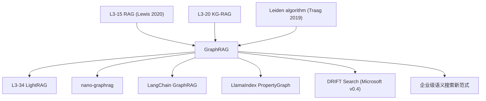

# 🕸️ 案件 L3-32：GraphRAG — 把语料织成知识图谱再做"宏观"问答

> **《LLM 百案录》第 132 案 · 编织世界**
> *2024 年 4 月，微软发布 GraphRAG：
> *"传统 RAG 找不到全局问题的答案——'这个文档库讲的整体是什么主题？'你 chunk 检索能找到吗？"*
> 答案是：**先把所有文档抽成实体-关系图，再用社区检测算法把图分簇，最后在簇级别上做摘要**。
> 提问"全局问题"时，先在簇级摘要上推理；问"局部问题"时再下钻到具体 chunk。
> 这就是 **Query-Focused Summarization (QFS) 时代的 RAG** —— 不是"检索增强"，是"地图增强"。*

🚇 [30秒速览](#速览) ｜ 🚲 [3分钟通读](#通读) ｜ 🚗 [30分钟精读](#精读) ｜ 🚀 [3小时复现](#复现)

🎭 **叙事母题**：🕸️ **编织世界** —— 先把语料编成图谱，再在图谱上推理

---

## 0️⃣ 案件档案

| 案情要素 | 内容 |
|---|---|
| **案发时间** | 2024-04-24（Edge et al., Microsoft Research，[arXiv 2404.16130](https://arxiv.org/abs/2404.16130)） |
| **嫌疑人** | Darren Edge, Ha Trinh, Newman Cheng, Joshua Bradley, Alex Chao, Apurva Mody, Steven Truitt, Jonathan Larson |
| **受害者** | 传统 chunk-based RAG 在"全局问题"（global sensemaking）上的彻底失效 |
| **作案凶器** | LLM 抽取实体/关系 → 构图 → Leiden 社区检测 → 多层级摘要 → Map-Reduce 推理 |
| **作案动机** | "RAG 只能找局部 chunk 答案——'这个语料整体讨论了什么？'就答不出" |
| **结案陈词** | GraphRAG 在全局问题上 **comprehensiveness +72%、diversity +83%**，而 token 成本只是 LLM-context-stuff 的零头 |

**五维雷达**：
```
创新性  █████████░ 9/10   ← 把图算法 + LLM 摘要拧到一起，思路新颖
影响力  █████████░ 9/10   ← 微软 OSS 后 LangChain/LlamaIndex 全跟进
复杂度  ████████░░ 8/10   ← 索引阶段贵，pipeline 复杂
可复现  ████████░░ 8/10   ← 微软全开源，有完整 Python 库
争议度  ██████░░░░ 6/10   ← "构图成本是否值得"持续辩论
```

**精确事实卡**：

| 字段 | 精确值 | 来源 |
|---|---|---|
| **核心创新** | 实体-关系图 + 多层级社区摘要 | Section 2 |
| **图算法** | Leiden（改进的 Louvain）社区检测 | Section 2.3 |
| **抽取 LLM** | GPT-4 Turbo（也支持其他）| Section 4 |
| **数据集** | Podcast 转录 + 新闻文章（每个 ~1M tokens） | Section 3 |
| **关键指标** | comprehensiveness / diversity / empowerment / directness | Section 3.4 |
| **vs Naive RAG** | 全局问题胜率 **72-83%** | Table 1 |
| **License** | MIT（[microsoft/graphrag](https://github.com/microsoft/graphrag)） | GitHub |

---

## 1️⃣ <a id="速览"></a>🚇 30 秒速览

> **传统 RAG 的盲区**：
> - 适合"局部问题"：*"X 公司 2023 财报多少？"*（chunk 里有答案）
> - **不适合"全局问题"**：*"这个语料整体讨论了哪些主题？"*（答案分散在所有 chunk 里）
>
> **GraphRAG 两阶段**：
>
> **🔨 索引阶段（一次性，贵）**：
> 1. 用 LLM 从每个 chunk 抽取 (实体, 关系) 三元组 → 构图
> 2. 用 **Leiden 算法** 把图分成社区（不同抽象层级，C0/C1/C2）
> 3. 对每个社区生成摘要（"这个社区讨论了 X、Y、Z..."）
>
> **🔍 查询阶段（便宜）**：
> 1. 全局查询 → 在所有顶层社区摘要上做 Map-Reduce
> 2. 局部查询 → 走传统 RAG（chunk 检索）
>
> **结果**：在 LiveQA 全局问题上，GraphRAG **击败 baseline 72-83%**。

---

## 2️⃣ <a id="通读"></a>🚲 3 分钟通读：为什么 chunk RAG 答不了全局问题（Why）

### 局部问题 vs 全局问题
```
局部问题（Naive RAG 强）：
  Q: "Tesla 2023 营收多少?"
  A: 在某个 chunk 里：「...Tesla 2023 revenue was $96.8B...」
  → top-k 检索就够

全局问题（Naive RAG 废）：
  Q: "这份语料整体讨论了哪些主题？"
  A: 没有任何 chunk 单独包含答案
  → 答案是"所有 chunk 综合后的抽象摘要"
  → top-k 检索只能给你一些 chunk 的拼贴
  → LLM 拿到这些 chunk 也答不全
```

### 一种"暴力解法"及其代价
```
Solution: 把所有文档塞进 LLM context
  → 1M tokens 进 Claude 200K context = 装不下
  → 即使装得下：
    - 100 万 token × $3/M = $3 单查询
    - 长 context 容易 lost-in-the-middle
    - 多次查询完全不可扩展
```

### GraphRAG 的"地图思维"
```
启发：人类是怎么回答全局问题的？
  1. 先看目录（顶层抽象）
  2. 不够就看章节摘要（中层抽象）
  3. 还不够才下钻到具体段落

GraphRAG 把这个过程结构化：
  - 实体-关系图 → 文档的"骨架"
  - 社区检测 → 自动发现"主题簇"
  - 多层级摘要 → 对应"目录 / 章节 / 段落"

→ 全局问题：在"目录"层推理（成本低）
→ 局部问题：下钻到"段落"层（保留 RAG 优势）
```

---

## 3️⃣ <a id="精读"></a>🚗 30 分钟精读

### 阶段 1：图构造（Indexing）

#### Step 1.1：实体-关系抽取
对每个 chunk（300-500 tokens），用 LLM prompt：
```
Extract entities (people, organizations, locations, concepts)
and relationships from the following text.

Return as JSON:
{
  "entities": [{"name": ..., "type": ..., "description": ...}],
  "relationships": [
    {"source": ..., "target": ..., "description": ..., "weight": ...}
  ]
}
```
**典型输出**：
```json
{
  "entities": [
    {"name": "Tesla", "type": "ORG", "description": "EV company"},
    {"name": "Elon Musk", "type": "PERSON", "description": "CEO of Tesla"}
  ],
  "relationships": [
    {"source": "Elon Musk", "target": "Tesla",
     "description": "is CEO of", "weight": 0.9}
  ]
}
```

#### Step 1.2：实体合并（去重）
不同 chunk 可能抽出"Tesla", "TESLA", "Tesla Motors"——用嵌入相似度 + LLM 判断合并。

#### Step 1.3：构建图
```
节点 = 实体
边 = 关系
边权重 = 共现次数 / LLM 给的 weight
```

### 阶段 2：社区检测

#### Leiden 算法
Louvain 的改进版，迭代地：
1. 把每个节点分到能提升 modularity 的社区
2. 把社区合并成"超节点"
3. 重复，得到层级化的社区结构（C0 → C1 → C2 ...）

```
C0: 最细粒度的社区（可能 100 个节点）
C1: 中层社区（10 个节点级别）
C2: 顶层（3-5 个超大主题）
```

> 💡 **为什么是 Leiden 而不是 Louvain**：Leiden 保证社区"良构性"（well-connectedness），不会出现碎片化簇。

### 阶段 3：多层级社区摘要
对每一层的每个社区，把社区内所有 chunks + 实体 + 关系送给 LLM：
```
Generate a comprehensive summary of this community.
Include:
  - Main topic
  - Key entities and their roles
  - Important relationships
  - Notable findings/events

Community contents: [C_i 内的所有信息]
```
得到分层摘要：`C0_summary[i]`、`C1_summary[i]`、`C2_summary[i]`...

### 阶段 4：查询时 Map-Reduce

#### 全局查询（Global Query）
```python
def global_query(query, level=2):
    # Map：在 level 这一层的每个社区摘要上独立生成局部答案
    partial_answers = []
    for c in communities[level]:
        partial = LLM(f"Given community summary: {c.summary}\n"
                      f"Question: {query}\n"
                      f"Generate partial answer:")
        partial_answers.append(partial)

    # Reduce：把所有局部答案聚合
    final = LLM(f"Combine these partial answers into a final response:\n"
                f"{partial_answers}\n"
                f"Question: {query}")
    return final
```

#### 局部查询（Local Query）
```python
def local_query(query):
    # 1. 找最相关的实体（向量检索）
    seeds = top_k_entities(query, k=10)
    # 2. 在图上 1-2 跳邻居扩展
    context = neighbors_within(seeds, hops=2)
    # 3. 收集相关的 chunks + 实体 + 关系
    chunks = associated_chunks(context)
    # 4. 喂给 LLM 回答
    return LLM(query, context=chunks)
```

### 评估方法（Section 3.4）
传统 RAG 评估用 ROUGE / BLEU 不适合开放性回答。GraphRAG 提出 **LLM-as-judge head-to-head**：
```
给评委 LLM 两份回答 A 和 B，问 4 个维度：
  1. Comprehensiveness（全面性）
  2. Diversity（多样性）
  3. Empowerment（启发性，"读完后我懂得多了吗"）
  4. Directness（直接性）
```

---

## 4️⃣ 物证清单（Results）& 🔥 Hot Take

### 关键数据（Table 1）
全局问题胜率（GraphRAG vs 各种 baseline）：
| Baseline | Comprehensiveness | Diversity | Empowerment |
|---|---|---|---|
| Naive RAG (top-k chunks) | **72%** | **83%** | **66%** |
| Hierarchical Summarization | 65% | 60% | 56% |
| Source Text (full context) | 51% | 50% | 47% |

> **GraphRAG 击败把所有原文全塞进 context 的 baseline**——这是因为图谱结构帮助 LLM 更系统地组织答案。

### Token 成本（Section 3.5）
| 方法 | Indexing tokens | Per-query tokens |
|---|---|---|
| Naive RAG | 0 | 4K |
| Source Text | 0 | **600K** |
| **GraphRAG（C2 层）** | 600K | **20K** |

> **Indexing 一次贵，查询多次便宜**——这是 GraphRAG 的核心 ROI 模型。

### 🔥 Hot Take
1. **GraphRAG 是 RAG 的"哥白尼时刻"**：从"找答案"转向"组织知识"——这是 RAG 工程哲学的根本转变。
2. **LLM 抽取 + 图算法 + LLM 摘要 = 三明治架构**：开创了"用 LLM 当数据预处理 worker"的新范式。
3. **索引成本是真槽点**：1M token 文档抽实体大约要 $200-500，对小公司还是贵。LightRAG (L3-34) 就是为减少这个成本而生。
4. **不能完全替代 Naive RAG**：局部问题上 chunk RAG 仍然更快更便宜——GraphRAG 应该是**补充**，不是**替代**。
5. **DRIFT search 是 v0.4 的关键扩展**：原始 GraphRAG 不能边检索边推理，DRIFT 把 reasoning loop 加进来——这是 2025 主流。

---

## 5️⃣ 🐛 论文没说的坑

1. **抽取质量决定一切**：GPT-4 抽实体效果好，换成 Llama-3 实体合并率下降——LLM 成本被低估
2. **更新成本高**：新文档来了要重新跑 Leiden + 重生摘要——增量更新还是难题
3. **多语言不友好**：中文实体合并比英文困难得多（"上海" / "上海市" / "魔都" 怎么合？）
4. **图过大时 Leiden 慢**：百万节点的图分簇要小时级——大语料库不太能扛
5. **社区摘要的"幻觉传播"**：底层 chunk 的错误会被层级摘要放大——溯源困难

---

## 6️⃣ 🎲 如果作者偷懒了

**实验**：
- 没在 medical / legal 等专业域评估——GraphRAG 在通用 podcast 上 work，专业域呢？
- 没对比"不同图分辨率（社区粒度）"对最终质量的影响曲线

**理论**：
- 没分析"社区检测的最优层数"——3 层是经验值
- 没解释"为什么 LLM 评估在全局问题上偏好 GraphRAG"——可能有自己被自己评判的偏好性

**应用**：
- 没尝试**多模态语料**（PDF + 图）
- 没尝试**实时更新**（流式新闻）

---

## 7️⃣ 影响波及



---

## 8️⃣ 侦探手记

GraphRAG 给我最大的启发：**"找"和"理解"是两回事**。

> Naive RAG 的关键词是"找"——找到最相关的 chunks。
> 但有些问题不是"找"出来的，而是"看清全貌"：
> *"这个项目的整体架构是什么？"*
> *"我们公司过去一年关注的核心议题有哪些？"*
>
> GraphRAG 把"找"升级到"理解"：
> 1. 先把信息**结构化**（实体-关系图）
> 2. 再**抽象**（社区检测）
> 3. 再**总结**（多层摘要）
> 4. 最后才**回答**
>
> 这是从"信息检索"到"知识组织"的范式跃迁。

更深一层：**GraphRAG 暗示了"未来的搜索引擎"形态**——
> Google 给你 10 条蓝链，靠你自己拼凑全貌。
> Perplexity 给你一段简短答案，但回答全局问题时也很挣扎。
> 真正的下一代搜索：**先理解全网，再回答你**——这就是 GraphRAG 思路放大到 web 级。

---

## 自查清单

**已做到**：
- 解释局部问题 vs 全局问题的本质差异
- 推导四阶段 pipeline（抽取 → 构图 → 分簇 → 多层摘要）
- 给出 Leiden / Map-Reduce 的具体使用方式
- 列出 comprehensiveness / diversity 等评估指标

**❌ 未做到**：
- ❌ 未深入对比 GraphRAG vs LightRAG 的索引成本
- ❌ 未量化"实体抽取 LLM 等级"对最终性能的影响
- ❌ 未给出"何时 GraphRAG 不如 Naive RAG" 的决策表

---

## 🔟 延伸卷宗

### 前置依赖
- 📚 [L3-15 RAG](./L3-15_RAG.md)（必读基础）
- 📚 [L3-20 Knowledge Graph RAG](./L3-20_Knowledge_Graph_RAG.md)（前身思想）
- 📚 [L3-17 Self-RAG](./L3-17_Self_RAG.md)（自反思 RAG）

### 后续推荐
- 🎯 [L3-34 LightRAG](./PDFs/L3-34_LightRAG.pdf)（精简成本版）
- 🎯 [L3-33 RAFT](./PDFs/L3-33_RAFT.pdf)（域适应 RAG）
- 🎯 DRIFT Search（GraphRAG v0.4 扩展）
- 🎯 PathRAG / HippoRAG（其他图增强 RAG）

### 🚀 <a id="复现"></a>3 小时复现路径

```bash
# 微软官方 graphrag Python 库
pip install graphrag

# 1) 准备数据
mkdir ./input
# 把你的 .txt 文档放进 ./input/

# 2) 初始化项目（生成 settings.yaml）
python -m graphrag.index --init --root ./

# 3) 配置 OpenAI key in settings.yaml

# 4) 跑索引（耗时取决于文档数）
python -m graphrag.index --root ./

# 5) 全局查询
python -m graphrag.query --root ./ --method global \
  "What are the main themes in this dataset?"

# 6) 局部查询
python -m graphrag.query --root ./ --method local \
  "Who is Elon Musk?"
```

精简版社区实现：
- [gusye1234/nano-graphrag](https://github.com/gusye1234/nano-graphrag) — 800 行实现核心逻辑
- [HKUDS/LightRAG](https://github.com/HKUDS/LightRAG) — GraphRAG 的成本精简版

---

## 📌 本案归档

| 字段 | 值 |
|---|---|
| 笔记版本 |「编织世界版」 |
| 叙事母题 | 🕸️ 编织世界 |
| 推荐指数 | ⭐⭐⭐⭐⭐ |
| 学习时长 | 30s / 3min / 30min / 3h |
| 上次更新 | 2026-05-01 |
| 下一站 | → [L3-33 RAFT](./PDFs/L3-33_RAFT.pdf) |
