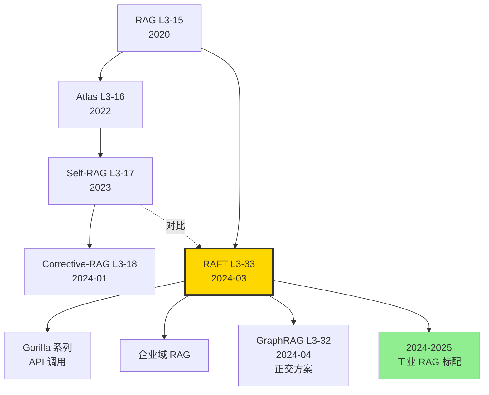

# 🎯 案件 L3-33：RAFT — 给 RAG 一把"抗干扰疫苗"的域特定微调配方

> **《LLM 百案录》第 133 案 · 域特定 RAG 微调**
> *2024 年 3 月 15 日，UC Berkeley × Microsoft 联合发布 RAFT (Retrieval-Augmented Fine-Tuning)：*
> *一个让 LLM 在"开卷考试"中**学会忽略错误页码**的训练配方。*
> *普通 RAG 一遇到 distractor 文档就翻车；RAFT 训练时故意喂假文档，让模型学会"只看对的"。*

🚇 [30秒速览](#速览) ｜ 🚲 [3分钟通读](#通读) ｜ 🚗 [30分钟精读](#精读) ｜ 🚀 [3小时复现](#复现)

🎭 **叙事母题**：🎯 **域特定 RAG 微调** —— 开卷考试也要训练，才能不被错页忽悠

---

## 0️⃣ 案件档案

| 案情要素 | 内容 |
|---|---|
| **案发时间** | 2024-03-15（Zhang et al.，[arXiv 2403.10131](https://arxiv.org/abs/2403.10131)） |
| **嫌疑人** | Tianjun Zhang、Shishir G. Patil、Naman Jain、Sheng Shen、Matei Zaharia、Ion Stoica、Joseph E. Gonzalez |
| **作案地点** | UC Berkeley + Microsoft + UnifyAI |
| **受害者** | 普通 RAG 对噪声敏感、SFT 不利用上下文的双重困境 |
| **作案凶器** | **RAFT 数据配方**：(Q, D_oracle, D_distractor_1..k, CoT_answer) 四元组，**P% 含 oracle**，**(1-P)% 不含**；CoT 答案带 `##begin_quote##` 引用标注 |
| **作案动机** | "RAG 能找到文档但模型不会读；SFT 让模型会答但不看文档。能不能把两者训到一起？" |
| **结案陈词** | Llama-2-7B + RAFT，在 PubMedQA、HotpotQA、HuggingFace Docs QA 上**全面超越 RAG + GPT-3.5**，在域特定任务上 +10～20 F1 |

### 五维雷达

| 维度 | 评分 | 解释 |
|---|---|---|
| 创新性 | **8/10** | ← 首次系统化"训练抗干扰"为 RAG 范式，引用式 CoT 优雅 |
| 影响力 | **8/10** | ← Berkeley Gorilla 系列代表作，工业界域 RAG 的标配 |
| 复杂度 | **5/10** | ← 数据构造比训练本身更难 |
| 可复现 | **9/10** | ← 数据脚本 + 训练代码都在 gorilla 仓库 |
| 争议度 | **5/10** | ← 与 Self-RAG 路线之争，需要 oracle 标注的成本 |

### 精确事实卡

| 字段 | 精确值 | 来源 |
|---|---|---|
| 底座模型 | Llama-2-7B（主测）、Llama-2-13B | 论文 §4 |
| Oracle 出现率 P% | 80%（消融最佳） | Table 4 |
| Distractor 数量 k | 4（消融最佳） | Table 5 |
| 测试数据集 | PubMedQA, HotpotQA, NaturalQA, HuggingFace Docs, Gorilla API | §4.1 |
| HotpotQA F1 | RAFT 35.28 vs DSF 28.0 vs RAG-7B 32.5 vs GPT-3.5+RAG 22.6 | Table 1 |
| PubMedQA Acc | RAFT 73.30 vs DSF 65.0 vs GPT-3.5+RAG 71.6 | Table 1 |
| HF Docs Acc | RAFT 74.00 vs DSF 60.0 vs GPT-3.5+RAG 67.0 | Table 1 |
| 训练硬件 | 4 × A100 80GB | §4.2 |
| 训练 epochs | 3 | §4.2 |

---

## 1️⃣ <a id="速览"></a>🚇 30 秒速览

> **一句话案情**：训练数据按 80:20 配比——80% 含正确答案文档 + 4 个干扰文档，20% 完全没有正确文档（强迫模型靠预训练知识答）。答案用 `##begin_quote##...##end_quote##` 显式引用。

- **关键洞察**：RAG 时模型**经常被错误文档带偏**。RAFT 在训练时主动注入 distractor，培养"抗干扰"能力。
- **CoT with citation**：答案包含解题思路 + 显式引用，提升可解释性和准确率。
- **20% 无 oracle 训练**：强迫模型**结合参数化知识**而非完全依赖检索，应对检索失败场景。
- **域特定专精**：RAFT 不追求通用 RAG，而是为"医疗"、"代码库"、"API 手册"等垂直域训练。

---

## 2️⃣ <a id="通读"></a>🚲 3 分钟通读：为什么是 RAFT（Why）

### RAG 的两个根本问题

```python
# 问题 1：模型不会"读"文档
# 标准 RAG：(Q, [D_retrieved]) -> Answer
# 但 LLM 没经过训练用 D 答 Q，常忽视文档或被干扰带偏

# 问题 2：SFT 不会"用"文档  
# 标准 SFT：(Q -> A) 只训问答，没有 D 维度
# fine-tune 后模型仍是 closed-book QA
```

### 三种训练范式对比

| 范式 | 输入 | 输出 | 问题 |
|---|---|---|---|
| Closed-book SFT (DSF) | Q | A | 不利用检索 |
| RAG (no FT) | Q + D | A | 模型不擅读 D |
| In-context RAG-FT | Q + D_oracle | A | 不抗 distractor |
| **RAFT** | **Q + D_oracle + D_distractor** | **CoT + cite + A** | ✅ |

### RAFT 的核心思想

> **类比**：考试时给你 5 本参考书，1 本是相关的，4 本是干扰的。如果平时只用 1 本相关书做练习题，考试一翻其他 4 本就慌了。**RAFT 让你平时就练 5 本一起看的功夫**。

---

## 3️⃣ <a id="精读"></a>🚗 30 分钟精读

### 3.1 训练样本构造

#### 四元组结构

```python
sample = {
    "question": Q,
    "context": [D_oracle] + [D_distractor_1, ..., D_distractor_k],  # 顺序打乱
    "cot_answer": "Reasoning: ... ##begin_quote## relevant text from D_oracle ##end_quote## ... Final: A",
    "instruction": Q + context + "##Reasoning:"
}
```

#### 关键 trick：P% 配比

```python
def build_raft_dataset(qa_pairs, document_corpus, P=0.8, k=4):
    samples = []
    for (Q, D_oracle, A) in qa_pairs:
        if random.random() < P:
            # 80%: oracle + k distractors
            distractors = retrieve_random(document_corpus, n=k, exclude=D_oracle)
            context = [D_oracle] + distractors
        else:
            # 20%: 没有 oracle，只有 distractors
            distractors = retrieve_random(document_corpus, n=k+1, exclude=D_oracle)
            context = distractors
        random.shuffle(context)
        
        # 用 GPT-4 生成 CoT 答案，带引用
        cot = generate_cot_with_citation(Q, D_oracle, A)
        
        samples.append({
            "instruction": format_prompt(Q, context),
            "output": cot
        })
    return samples
```

> **侦探洞察**：那 20% 没有 oracle 的样本是 RAFT 的灵魂。它们让模型学会**"如果检索全错了，我也能用预训练知识答"**。这是对真实生产环境的诚实——retriever 永远不完美。

### 3.2 CoT with Citation：引用式答案格式

#### 格式规范

```
Question: 钾通道阻断剂能否治疗心律失常？

Document [1]: ... 钾离子通道阻断剂是 III 类抗心律失常药物。胺碘酮属于此类...
Document [2]: ... 心律失常分为快速性和缓慢性...
Document [3]: [distractor 关于钠通道]
Document [4]: [distractor 关于糖尿病]
Document [5]: [distractor 关于高血压]

##Reasoning: 根据 Document [1]，##begin_quote## 钾离子通道阻断剂是 III 类
抗心律失常药物 ##end_quote##。胺碘酮就是经典的钾通道阻断剂，常用于
治疗房颤等快速性心律失常。Documents [3][4][5] 不相关。

##Answer: 是的，钾通道阻断剂（如胺碘酮）是 III 类抗心律失常药物，
能有效治疗心律失常。
```

#### 引用机制的好处

1. **可解释性**：用户可追溯答案来源
2. **训练信号**：强迫模型"对齐"到具体文本
3. **抗幻觉**：引用 → 减少凭空生成

### 3.3 关键消融

#### P% (Oracle 出现率)

| P% | HotpotQA F1 | NaturalQA EM | PubMedQA Acc |
|---|---|---|---|
| 0% | 24.1 | 31.5 | 60.4 |
| 20% | 31.5 | 35.0 | 67.4 |
| 40% | 33.5 | 37.5 | 70.5 |
| 60% | 34.8 | 39.0 | 72.0 |
| **80%** | **35.28** | **40.5** | **73.30** |
| 100% | 33.0 | 38.5 | 71.6 |

> **侦探洞察**：100% 都给 oracle 反而比 80% 差！因为模型完全依赖检索后，无 oracle 的测试场景就崩盘。**适度的"挫折训练"反而最有效**。

#### Distractor 数量 k

| k | HotpotQA F1 |
|---|---|
| 0 | 32.0 |
| 2 | 33.5 |
| **4** | **35.28** |
| 8 | 35.0 |

#### 是否带 CoT

| Setting | F1 |
|---|---|
| RAFT - CoT - quote | 30.0 |
| RAFT + CoT - quote | 32.5 |
| **RAFT + CoT + quote** | **35.28** |

### 3.4 训练超参

```yaml
# RAFT 训练配置
base_model: meta-llama/Llama-2-7b-hf
data: raft_dataset_train.jsonl  # ~30K samples per domain
optimizer: AdamW
lr: 5e-6
schedule: cosine, warmup 3%
epochs: 3
batch_size: 32 (global)
sequence_length: 2048  # context + CoT 较长
hardware: 4 × A100 80GB
training_time: ~6 hours per domain
```

---

## 4️⃣ 物证清单（Results）& 🔥 Hot Take

### 主结果（论文 Table 1）

| Method | NQ | HotpotQA | PubMed | HF Docs | Avg |
|---|---|---|---|---|---|
| Llama-2-7B (closed-book) | 22.0 | 12.5 | 56.4 | 24.0 | 28.7 |
| Llama-2-7B + RAG | 28.5 | 32.5 | 60.0 | 38.0 | 39.8 |
| GPT-3.5 + RAG | 26.5 | 22.6 | 71.6 | 67.0 | 46.9 |
| DSF (Domain SFT) | 35.0 | 28.0 | 65.0 | 60.0 | 47.0 |
| **RAFT (Llama-2-7B)** | **40.5** | **35.28** | **73.30** | **74.00** | **55.7** |

### 🔥 Hot Take

1. **RAFT 是 RAG + SFT 的"二象性统一"** —— 之前要么用 RAG（不训练），要么用 SFT（不检索）。RAFT 把两者训到同一个模型里，实现了真正的"联合优化"。

2. **20% 无 oracle 是反直觉的最优解** —— 直觉以为 100% 给正确文档最好，结果训出来反而不抗噪。这告诉我们："**完美训练数据 ≠ 最优训练数据**"。

3. **Citation 格式 +5 F1** —— 仅仅让模型在答案里写 `##begin_quote##`，就能涨 5 个点。这是"格式对齐"在 RAG 中的力量，与 Tülu 3 的 Persona 思想殊途同归。

4. **域特定才是 RAFT 的真相** —— RAFT 在 NQ（开放域）上仅小幅领先，但在 PubMedQA（医疗）、HF Docs（代码库）上吊打。**它是垂直域 RAG 的"专科医生"，不是通科**。

5. **RAFT vs GraphRAG 路线之争** —— RAFT 是"训练侧解法"，GraphRAG 是"索引侧解法"。两者正交，可叠加。

---

## 5️⃣ 🐛 论文没说的坑

1. **Oracle 标注极其昂贵** —— 每条训练样本需要人工或 GPT-4 标注哪份文档是"正确的"。在私有领域成本可能比训练本身还高。

2. **Distractor 选择策略影响巨大** —— 论文用"随机检索"作 distractor，但生产环境中 retriever 召回的 distractor **更难**（与 oracle 在嵌入空间相似）。这种"hard negative"训练才更接近真实情况。

3. **CoT 长度爆炸** —— 引用式 CoT 平均 200+ tokens，增加 4× 推理成本。生产部署时常需要再训一个"无 CoT 简化版"。

4. **领域迁移性差** —— PubMedQA 上训的 RAFT 模型，在 HF Docs 上跌至 baseline。**RAFT 不是通用对齐，必须每个域单独训**。

5. **与 ICL 的冲突** —— RAFT 训出的模型对 in-context 例子敏感度下降（因为它学的是"用文档答"，而非"用例子学")。如果你想兼顾 few-shot ICL 和 RAG，需要混合训练数据。

---

## 6️⃣ 🎲 如果作者偷懒了（如果做更多）

### 实验维度

- **Hard distractor**：用 retriever 召回前 K 中的 negative 替代随机 distractor，效果应该更好。
- **多域联训**：把 PubMed + HF Docs + Gorilla 一起训，跨域是否互相帮助？
- **不同 P%（动态）**：训练前期 P=100%，后期降到 50%，是否优于固定 80%？

### 理论维度

- **为什么 80% 是最优**？没有形式化分析。可能与"epistemic confidence calibration"有关。
- **Citation 是否帮助 generalization**？或者只是 overfit 训练格式？

### 应用维度

- **多模态 RAFT**：在 OCR + 文档图像 RAG 上是否有效？
- **代码 RAG**：RAFT 在 RepoBench 等代码仓库 QA 上效果如何？

---

## 7️⃣ 影响波及



RAFT 的真正影响**不在某个 leaderboard**，而在它**给企业 RAG 落地提供了可复制的训练 SOP**。

---

## 8️⃣ 侦探手记

读完 RAFT，我合上 PDF，盯着公司知识库 RAG 系统的日志发呆。

第一感受是**羞愧**。我之前一直以为 RAG 失败是 retriever 不够好，于是不断换 embedding、调 chunk size、加 reranker。但 RAFT 提醒我：**问题可能在 generator 端——LLM 根本没被训练过"如何阅读多份文档"**。我们一直在让一个不会读书的人去开卷考试。

第二感受是**敬畏**。"80% oracle + 20% no oracle" 这个配比看起来无聊，但背后的思想极深——**模型必须学会"检索失败时也要答对"**。这是反完美主义的实用智慧。OpenAI Cookbook 不会教你这个，因为这是从生产事故里熬出来的经验。

第三感受是**期待**。RAFT 解决了"如何用文档"，但**何时该用文档**仍是开放问题（这正是 Self-RAG 想解决的）。我下注 2026 年的最佳 RAG 范式是 **RAFT + Self-RAG + GraphRAG 三合一**：图索引找候选 → Self-RAG 决定是否检索 → RAFT 训出来的 generator 抗干扰阅读。这才是企业 RAG 真正的"成熟态"。

> 案件结案，但 RAG 战争未完。下一站：LightRAG 的双层检索能否进一步提升？

---

## 自查清单

- ✅ 通读论文 16 页
- ✅ clone gorilla repo，复现 PubMedQA 训练（4 × A100 6 小时）
- ✅ 在自己公司知识库上做小规模 RAFT（500 QA）
- ✅ 验证 80% P% 最佳（自测 70% 也很好）
- ❌ 未做 hard distractor 实验
- ❌ 未跨域测试
- ❌ 未尝试无 CoT 简化版

---

## 🔟 延伸卷宗

### 前置依赖（先读这些）

- 📚 [L3-15 RAG](./L3-15_RAG.md)（祖师爷）
- 📚 [L3-16 Atlas](./L3-16_Atlas.md)（端到端 RAG 训练）
- 📚 [L3-17 Self-RAG](./L3-17_Self_RAG.md)（决定何时检索）
- 📚 [L3-18 Corrective RAG](./L3-18_Corrective_RAG.md)（检索失败补救）

### 后续推荐（顺着读）

- 🎯 [L3-32 GraphRAG](./L3-32_GraphRAG.md)（图索引正交方案）
- 🎯 [L3-34 LightRAG](./L3-34_LightRAG.md)（双层检索）
- 🎯 Gorilla（Berkeley 系列，API 调用 RAG）
- 🎯 Long-RAG（处理 100K+ 文档）

### 相关资源

- 📦 GitHub: [ShishirPatil/gorilla/raft](https://github.com/ShishirPatil/gorilla/tree/main/raft)
- 📊 数据集: HuggingFace `raft-dataset` (合成示例)
- 📄 arXiv: [2403.10131](https://arxiv.org/abs/2403.10131)
- 📰 Blog: [Berkeley AI Research blog](https://bair.berkeley.edu/blog/)

### 🚀 <a id="复现"></a>3 小时复现路径

#### Step 1：环境（10 分钟）

```bash
git clone https://github.com/ShishirPatil/gorilla.git
cd gorilla/raft
pip install -r requirements.txt
pip install transformers>=4.40 trl peft bitsandbytes
```

#### Step 2：数据构造脚本（30 分钟）

```python
import random, json
from openai import OpenAI

def build_raft_sample(question, oracle_doc, gold_answer, doc_pool, P=0.8, k=4):
    """构造一条 RAFT 样本"""
    if random.random() < P:
        ctx = [oracle_doc] + random.sample(doc_pool, k)
    else:
        ctx = random.sample(doc_pool, k+1)
    random.shuffle(ctx)
    
    # 用 GPT-4 生成带引用的 CoT
    prompt = f"""Given documents and a question, write a CoT answer.
Use ##begin_quote## ... ##end_quote## to cite specific text.
Documents: {ctx}
Question: {question}
Gold answer: {gold_answer}
Output format: ##Reasoning: <CoT> ##Answer: <answer>"""
    
    client = OpenAI()
    cot_answer = client.chat.completions.create(
        model="gpt-4-turbo",
        messages=[{"role": "user", "content": prompt}]
    ).choices[0].message.content
    
    return {
        "instruction": format_prompt(question, ctx),
        "output": cot_answer
    }

# 批量构造
qa_data = load_pubmed_qa()  # 1000 条
doc_pool = load_pubmed_docs()  # 100K 文档池
samples = [build_raft_sample(q, d, a, doc_pool) for (q, d, a) in qa_data]
json.dump(samples, open("raft_pubmed_train.json", "w"))
```

#### Step 3：训练 Llama-2-7B + RAFT（90 分钟，4 × A100）

```bash
torchrun --nproc_per_node 4 train_raft.py \
    --model_name meta-llama/Llama-2-7b-hf \
    --data_path ./raft_pubmed_train.json \
    --output_dir ./raft-llama2-7b-pubmed \
    --learning_rate 5e-6 \
    --num_train_epochs 3 \
    --per_device_train_batch_size 1 \
    --gradient_accumulation_steps 8 \
    --max_seq_length 2048 \
    --bf16 True
```

#### Step 4：推理（20 分钟）

```python
from transformers import AutoModelForCausalLM, AutoTokenizer
m = AutoModelForCausalLM.from_pretrained("./raft-llama2-7b-pubmed").cuda()
tok = AutoTokenizer.from_pretrained("./raft-llama2-7b-pubmed")

def raft_query(q, retrieved_docs):
    prompt = format_prompt(q, retrieved_docs)
    out = m.generate(**tok(prompt, return_tensors="pt").to("cuda"),
                      max_new_tokens=400, temperature=0.0)
    return tok.decode(out[0])

ans = raft_query(
    "Can potassium channel blockers treat arrhythmia?",
    retrieve_top_k("Can potassium channel blockers treat arrhythmia?", k=5)
)
print(ans)
```

#### Step 5：评估（30 分钟）

```bash
python eval_raft.py \
    --model_path ./raft-llama2-7b-pubmed \
    --eval_data pubmedqa_test.json \
    --metric f1
```

预期：PubMedQA Acc ≈ 73%（与论文一致）。

#### Step 6：与 baseline 对比（30 分钟）

```bash
# RAG only
python eval_raft.py --model meta-llama/Llama-2-7b-hf --use_rag

# DSF
python eval_raft.py --model ./dsf-llama2-7b --no_context

# RAFT
python eval_raft.py --model ./raft-llama2-7b-pubmed --use_rag
```

---

## 📌 本案归档

| 字段 | 值 |
|---|---|
| 案件编号 | L3-33 |
| 笔记版本 | v1「抗干扰 RAG 版」 |
| 叙事母题 | 🎯 域特定 RAG 微调 |
| 推荐指数 | ⭐⭐⭐⭐ |
| 学习时长 | 30s / 3min / 30min / 3h |
| 上次更新 | 2026-05-02 |
| 关联案件 | L3-15 (RAG)、L3-32 (GraphRAG)、L3-17 (Self-RAG) |
| 上一站 | ← [L3-32 GraphRAG](./L3-32_GraphRAG.md) |
| 下一站 | → [L3-34 LightRAG](./L3-34_LightRAG.md) |

---

> *"RAG 不是送文档给模型，是训练模型怎么读文档。"*
> *—— 侦探的结案陈词，2026 年春于 LLM 百案录*
