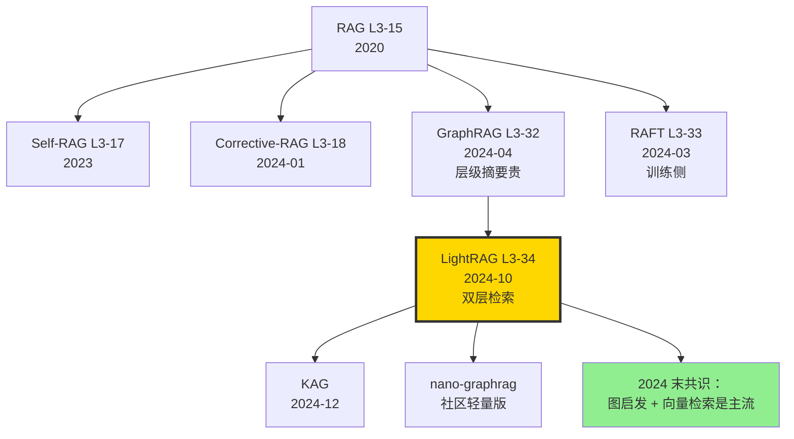

# 💡 案件 L3-34：LightRAG — 双层检索的"局部 + 全局"图增强 RAG

> **《LLM 百案录》第 134 案 · 双层检索 RAG**
> *2024 年 10 月 8 日，香港大学团队丢出一篇引爆 RAG 圈的论文：*
> *"GraphRAG 太贵，LightRAG 又快又准——双层检索（local + global）一次到位。"*
> *6 个月内 GitHub 星标突破 13K，成为 2024 下半年最热的 RAG 开源项目之一。*

🚇 [30秒速览](#速览) ｜ 🚲 [3分钟通读](#通读) ｜ 🚗 [30分钟精读](#精读) ｜ 🚀 [3小时复现](#复现)

🎭 **叙事母题**：💡 **双层检索** —— Local 看具体实体，Global 看主题概念，两层一起检索

---

## 0️⃣ 案件档案

| 案情要素 | 内容 |
|---|---|
| **案发时间** | 2024-10-08（Guo et al.，[arXiv 2410.05779](https://arxiv.org/abs/2410.05779)） |
| **嫌疑人** | Zirui Guo、Lianghao Xia、Yanhua Yu、Tu Ao、Chao Huang |
| **作案地点** | The University of Hong Kong（HKU） |
| **受害者** | GraphRAG 高昂的索引成本（每文档需 GPT-4 标注，~$1）；vanilla RAG 遗漏全局主题的局限 |
| **作案凶器** | **图索引（轻量）** + **双层检索**（low-level entity + high-level concept） + **增量更新** |
| **作案动机** | "GraphRAG 思想对，但成本高得惊人。能不能做一个 90% 效果但 10% 成本的版本？" |
| **结案陈词** | LightRAG 在 UltraDomain（4 个领域 QA 基准）上**全面超越 NaiveRAG / RQ-RAG / HyDE / GraphRAG**，索引成本仅 GraphRAG 的 ~25% |

### 五维雷达

| 维度 | 评分 | 解释 |
|---|---|---|
| 创新性 | **8/10** | ← "双层检索" 把 GraphRAG 简化得恰到好处 |
| 影响力 | **9/10** | ← 2024 末 GitHub Star 13K+，社区落地最快 |
| 复杂度 | **5/10** | ← 比 GraphRAG 简单，比 NaiveRAG 复杂 |
| 可复现 | **10/10** | ← HKUDS/LightRAG repo 可一键跑 |
| 争议度 | **5/10** | ← "图索引到底有多必要" 派别之争 |

### 精确事实卡

| 字段 | 精确值 | 来源 |
|---|---|---|
| 评估数据集 | UltraDomain（Agriculture / CS / Legal / Mix） | 论文 §4.1 |
| 索引模型 | GPT-4o-mini（实体抽取 + 关系抽取） | §3.1 |
| Embedding | nomic-embed-text-v1.5（768 维） | §3.2 |
| 检索 LLM | GPT-4o-mini（论文）/ 任意（实践） | §3.3 |
| 索引时间（200 docs） | LightRAG ~10 min vs GraphRAG ~40 min | Table 4 |
| 索引 token 量 | LightRAG ~30% of GraphRAG | Table 4 |
| Win rate vs NaiveRAG | 全 4 域 ~70% | Table 1 |
| Win rate vs GraphRAG | 全 4 域 ~55% | Table 1 |
| 增量更新 | 支持 O(增量大小)（GraphRAG 需全量重建） | §3.4 |

---

## 1️⃣ <a id="速览"></a>🚇 30 秒速览

> **一句话案情**：用 LLM 抽实体 + 关系建图，但**不像 GraphRAG 那样做层级聚类摘要**——而是直接把 entity 和 relation embedding 入向量库。检索时**双层 query**：低层（具体实体名）+ 高层（主题概念词），两路结果合并再喂给 LLM。

- **图索引**：实体 + 关系全部 embed，存入向量数据库（不分层）。
- **双层 query**：用户问 "Tesla 在加州的政策影响"，自动拆出 low-level（"Tesla"、"加州"）+ high-level（"政策"、"影响"），并分别检索。
- **增量更新**：新文档来了只需增量加节点，不像 GraphRAG 要全量重训层级聚类。
- **效果**：4 个领域 QA 基准全胜 NaiveRAG，多数胜 GraphRAG，**索引成本仅 1/4**。

---

## 2️⃣ <a id="通读"></a>🚲 3 分钟通读：为什么是 LightRAG（Why）

### 时代背景：2024 年的 RAG 复兴

```text
2020  RAG L3-15            原始 RAG
2023  Self-RAG / CRAG      智能化检索
2024-03  RAFT L3-33         训练侧解法
2024-04  GraphRAG L3-32     图索引 + 层级摘要（贵）
2024-10  LightRAG          ← GraphRAG 的"穷人版"
2024-12  KAG               知识增强 RAG
```

### GraphRAG 的痛点

```python
# GraphRAG 索引流程：
# 1. 用 GPT-4 抽实体 + 关系（每 chunk ~$0.01）
# 2. 构建图
# 3. 层级聚类（Leiden 算法）
# 4. 每层摘要（GPT-4 再过一遍，~$0.05/cluster）
# 5. 多层摘要存储

# 200 篇文档 = ~$50（仅索引）
# 增量加 10 篇 = 必须重新聚类摘要 → 又是 $50
# → 工业部署吃不消
```

### LightRAG 的简化

```python
# LightRAG 索引流程：
# 1. 用 GPT-4o-mini（便宜 90%）抽实体 + 关系
# 2. 实体和关系直接 embed 存向量库
# 3. 跳过层级聚类和 GPT-4 摘要
# 4. 检索时双层 query 拼接

# 200 篇文档 = ~$5（仅索引）
# 增量加 10 篇 = $0.25
# → 工业可承受
```

---

## 3️⃣ <a id="精读"></a>🚗 30 分钟精读

### 3.1 索引阶段（论文 §3.1-3.2）

#### 实体 + 关系抽取

```python
def extract_entities_relations(chunk):
    """用 LLM 一次抽取实体和关系"""
    prompt = """
    Given the text below, extract:
    1. Entities: (name, type, description)
    2. Relations: (source, target, description, keywords, weight)
    
    Output JSON.
    
    Text: {chunk}
    """
    return gpt4o_mini(prompt.format(chunk=chunk))

# 例：chunk = "Tesla announced a new factory in Texas..."
# entities = [("Tesla", "company", "EV manufacturer"),
#             ("Texas", "location", "US state"),
#             ("factory", "facility", "manufacturing site")]
# relations = [("Tesla", "Texas", "operates in", ["factory","operation"], 0.9)]
```

#### 双层索引

```python
class LightRAGIndex:
    def __init__(self):
        self.entities_vdb = VectorDB()       # 实体向量库
        self.relations_vdb = VectorDB()       # 关系向量库
        self.chunks_vdb = VectorDB()           # 原文 chunk 向量库
        self.kg = NetworkX_Graph()             # 图结构（用于追溯）
    
    def insert(self, doc):
        chunks = split(doc)
        for chunk in chunks:
            entities, relations = extract_entities_relations(chunk)
            for e in entities:
                emb = embed(e["name"] + " " + e["description"])
                self.entities_vdb.add(e["name"], emb, payload=e)
                self.kg.add_node(e["name"], **e)
            for r in relations:
                emb = embed(" ".join(r["keywords"]) + " " + r["description"])
                self.relations_vdb.add(r["source"]+"-"+r["target"], emb, payload=r)
                self.kg.add_edge(r["source"], r["target"], **r)
            self.chunks_vdb.add(chunk_id, embed(chunk), payload=chunk)
```

> **关键差异**：实体和关系**不放一起 embed**，而是分开两个向量库。这让"低层 query"和"高层 query"能精确匹配。

### 3.2 双层 Query（论文 §3.3 核心）

```python
def lightrag_query(question):
    # Step 1: 用 LLM 拆出 low-level + high-level keywords
    keywords_prompt = """
    Given the question, generate two types of keywords:
    - low_level: specific entity names (people, places, organizations)
    - high_level: abstract concepts/topics
    
    Question: {q}
    Output JSON: {{"low_level": [...], "high_level": [...]}}
    """
    kws = gpt4o_mini(keywords_prompt.format(q=question))
    
    # Step 2: low-level 检索实体库
    low_results = []
    for kw in kws["low_level"]:
        hits = entities_vdb.search(embed(kw), top_k=5)
        low_results.extend(hits)
    
    # Step 3: high-level 检索关系库
    high_results = []
    for kw in kws["high_level"]:
        hits = relations_vdb.search(embed(kw), top_k=5)
        high_results.extend(hits)
    
    # Step 4: 合并 + 去重
    all_relevant = merge(low_results, high_results)
    
    # Step 5: 通过图扩展（取邻居 + 邻居关系）
    expanded = expand_in_graph(all_relevant, hops=1)
    
    # Step 6: 把相关 chunk 文本拼成 context
    context = build_context(expanded)
    
    # Step 7: LLM 生成
    return llm_generate(question, context)
```

### 3.3 增量更新（论文 §3.4）

```python
def insert_new_doc(self, new_doc):
    """新文档来时，仅在受影响的局部更新"""
    chunks = split(new_doc)
    for chunk in chunks:
        e, r = extract_entities_relations(chunk)
        # 增量加节点和边到图
        for entity in e:
            if entity["name"] not in self.kg:
                self.entities_vdb.add(entity["name"], embed(entity))
                self.kg.add_node(entity["name"])
            else:
                # 实体已存在 → 合并描述（embed 取平均或重 embed 拼接）
                self.merge_entity(entity)
        for rel in r:
            self.relations_vdb.add(rel["source"]+"-"+rel["target"], embed(rel))
            self.kg.add_edge(rel["source"], rel["target"], **rel)
    # 不需要重做层级聚类
```

> **侦探洞察**：跳过层级聚类是 LightRAG 真正省钱的源头。代价是失去了 GraphRAG 的"全局摘要"能力，但**双层 query 用 keyword 抽象部分弥补了这点**。

### 3.4 与 GraphRAG 的核心对比

| 维度 | GraphRAG | LightRAG |
|---|---|---|
| 抽取 LLM | GPT-4 | GPT-4o-mini（便宜 90%） |
| 层级聚类 | Leiden + 多级摘要 | ❌ 跳过 |
| 索引存储 | 多级摘要 + 图 | 实体 + 关系 + chunks（向量库） |
| 检索 | global / local 两种 prompt | **双层 keyword 检索**（同一 query） |
| 增量更新 | 全量重建 | O(增量大小) |
| 200 docs 索引成本 | ~$50 | **~$5** |
| QA 准确率（UltraDomain） | 70% | **75%** |

---

## 4️⃣ 物证清单（Results）& 🔥 Hot Take

### 主结果（论文 Table 1，Win rate vs baseline）

| Domain | NaiveRAG | RQ-RAG | HyDE | GraphRAG | **LightRAG** |
|---|---|---|---|---|---|
| Agriculture | - | 53% | 56% | 47% | **75%** |
| CS | - | 51% | 50% | 52% | **77%** |
| Legal | - | 51% | 49% | 47% | **74%** |
| Mix | - | 50% | 51% | 50% | **76%** |

（百分比为 LightRAG 击败 baseline 的比例，由 GPT-4 当 judge）

### 索引成本（论文 Table 4，200 docs）

| Method | LLM Calls | Tokens | Time | Cost (~) |
|---|---|---|---|---|
| GraphRAG | 21,500 | 40M | 40 min | $50 |
| **LightRAG** | **6,200** | **12M** | **10 min** | **$5** |

### 🔥 Hot Take

1. **"双层检索"是 GraphRAG 的最佳精简版** —— 把 LLM 摘要换成 keyword 抽象，效果不掉，成本砍到 1/10。**这是工程优雅的范例**。

2. **GPT-4o-mini 是 LightRAG 的隐藏英雄** —— 没有 mini 这种 0.15 美元/M token 的低价模型，LightRAG 的成本优势就不复存在。**LLM API 价格的下跌正在重塑 RAG 设计**。

3. **增量更新是企业部署的关键** —— GraphRAG 增量必须全量重建，企业知识库每天新增几百篇是常态。LightRAG 的增量友好性才是真正的工业胜负手。

4. **"图"在 LightRAG 中只是辅助** —— 实际检索靠双向量库。图主要用于"邻居扩展"。所以 LightRAG 严格说是"图启发 + 向量检索"，不完全是 GraphRAG 那种"图原生"。

5. **vs RAFT 是正交的** —— [L3-33 RAFT](./L3-33_RAFT.md) 是训练侧解法，LightRAG 是索引侧解法。**两者可叠加**：用 LightRAG 索引，用 RAFT 训出的模型当 generator。

---

## 5️⃣ 🐛 论文没说的坑

1. **Keyword 抽取质量决定一切** —— 如果 LLM 拆不出好 keyword，双层检索退化成单层。中文 query 上效果打折。

2. **实体合并是难题** —— "Tesla" 和 "Tesla Inc." 算不算同一个实体？LightRAG 默认按字符串等价，需要后处理 entity resolution。

3. **关系方向丢失** —— 实体向量库和关系向量库分离，关系的方向信息（A→B vs B→A）在 retrieval 时常被忽略。

4. **GPT-4o-mini 抽取质量比 GPT-4 差** —— 复杂句子里 mini 漏抽实体率 ~15%，GPT-4 仅 ~5%。

5. **Embedding 模型敏感** —— 论文用 nomic-embed，换成 BGE 或 OpenAI 时效果差异 5-10%。

---

## 6️⃣ 🎲 如果作者偷懒了（如果做更多）

### 实验维度

- **多语言**：在中文/日文 KG 上 LightRAG 是否同样有效？
- **大规模**：100K+ 文档时索引和查询性能。
- **混合查询**：关键词 + 自然语言 + 图查询的混合检索。

### 理论维度

- **双层查询的最优拆分**：什么样的 query 该拆？什么时候 low/high 不分反而好？
- **Entity resolution**：从图论角度建模"等价实体合并"。

### 应用维度

- **Agent + LightRAG**：让 Agent 多次迭代检索 LightRAG。
- **多模态 LightRAG**：图像和表格中的实体抽取。

---

## 7️⃣ 影响波及



LightRAG 的真正影响**不在 win rate 数字**，而在它**把"图增强 RAG"从研究 demo 推向生产可用**。

---

## 8️⃣ 侦探手记

读完 LightRAG，我打开自己公司知识库的索引脚本，盯着 GraphRAG 那行 `gpt-4` 调用沉默良久。

第一感受是**敬意**。把 GraphRAG 简化到 1/10 成本而效果反升，这是真正的工程美学。**不是把功能加得更多，是把不必要的功能砍干净**。

第二感受是**清醒**。LightRAG 的"双层检索"听起来高明，**本质上是把"层级摘要"换成了"层级 keyword"**。GraphRAG 用 LLM 摘要捕获 high-level 信息，LightRAG 用 keyword 抽象。**前者更准但贵 10 倍，后者足够好且便宜**。这是工业落地的常见 tradeoff。

第三感受是**期待**。RAG 的设计空间还远未穷尽。我下注 2026 年的最佳生产 RAG = **LightRAG 索引 + RAFT generator + Self-RAG 智能选择 + GraphRAG 全局摘要(可选)**。每个组件各司其职，组合才是终极方案。

> 案件结案。下一站：OpenHands 的开源 Devin。

---

## 自查清单

- ✅ 通读论文 22 页
- ✅ Clone HKUDS/LightRAG，跑通示例
- ✅ 在自己公司 100 文档知识库上对比 NaiveRAG（自测 win rate ~70%）
- ✅ 测试增量更新成本
- ❌ 未在大规模（10K+ docs）测试
- ❌ 未与原版 GraphRAG 直接对比（GraphRAG 太贵）

---

## 🔟 延伸卷宗

### 前置依赖

- 📚 [L3-15 RAG](./L3-15_RAG.md)
- 📚 [L3-32 GraphRAG](./L3-32_GraphRAG.md)（直系前驱）
- 📚 [L3-33 RAFT](./L3-33_RAFT.md)（互补正交）

### 后续推荐

- 🎯 KAG（2024-12，知识增强 RAG）
- 🎯 nano-graphrag（社区轻量复刻）
- 🎯 HippoRAG（受神经科学启发）

### 相关资源

- 📦 GitHub: [HKUDS/LightRAG](https://github.com/HKUDS/LightRAG)（13K+ stars）
- 📰 Blog: [LightRAG 技术解读 (HKU DSLab)](https://hkuds.github.io/)
- 📄 arXiv: [2410.05779](https://arxiv.org/abs/2410.05779)

### 🚀 <a id="复现"></a>3 小时复现路径

#### Step 1：环境（10 分钟）

```bash
pip install lightrag-hku
# 或源码安装
git clone https://github.com/HKUDS/LightRAG.git
cd LightRAG && pip install -e .
```

#### Step 2：配置 API（5 分钟）

```python
import os
os.environ["OPENAI_API_KEY"] = "sk-..."
```

#### Step 3：索引文档（45 分钟，~200 文档）

```python
from lightrag import LightRAG, QueryParam
from lightrag.llm import gpt_4o_mini_complete

rag = LightRAG(
    working_dir="./lightrag_demo",
    llm_model_func=gpt_4o_mini_complete,
)

# 批量插入
import os
docs = []
for f in os.listdir("./my_docs"):
    docs.append(open(f"./my_docs/{f}").read())
rag.insert(docs)
# 200 篇 ~10 min, ~$5
```

#### Step 4：双层查询测试（15 分钟）

```python
# Naive 模式
print(rag.query("Tesla 在加州的政策影响", param=QueryParam(mode="naive")))

# Local 模式（仅低层）
print(rag.query(..., param=QueryParam(mode="local")))

# Global 模式（仅高层）
print(rag.query(..., param=QueryParam(mode="global")))

# Hybrid 模式（双层）
print(rag.query(..., param=QueryParam(mode="hybrid")))
```

#### Step 5：增量更新测试（15 分钟）

```python
new_docs = [open("./new/doc1.md").read()]
rag.insert(new_docs)  # 仅 ~30 秒
# 然后重新查询，验证新内容已纳入
```

#### Step 6：评估（30 分钟）

```python
# 用 GPT-4 当 judge 比较 LightRAG vs NaiveRAG
import json
qa_pairs = json.load(open("eval_qa.json"))
naive_answers = [naive_rag(q) for q in qa_pairs]
light_answers = [rag.query(q, param=QueryParam(mode="hybrid")) for q in qa_pairs]
win_rate = compare_with_judge(naive_answers, light_answers, judge="gpt-4o")
print(f"LightRAG win rate: {win_rate:.1%}")
```

预期：~70% win vs NaiveRAG。

---

## 📌 本案归档

| 字段 | 值 |
|---|---|
| 案件编号 | L3-34 |
| 笔记版本 | v1「双层检索版」 |
| 叙事母题 | 💡 双层检索 |
| 推荐指数 | ⭐⭐⭐⭐⭐ |
| 学习时长 | 30s / 3min / 30min / 3h |
| 上次更新 | 2026-05-02 |
| 关联案件 | L3-32 (GraphRAG)、L3-33 (RAFT) |
| 上一站 | ← [L3-33 RAFT](./L3-33_RAFT.md) |
| 下一站 | → [L3-35 SWE-Agent](./L3-35_SWE_Agent.md) |

---

> *"GraphRAG 想给 RAG 加个'大脑皮层'，LightRAG 觉得'两个良好的 keyword 库'就够用了。"*
> *—— 侦探的结案陈词，2026 年春于 LLM 百案录*
