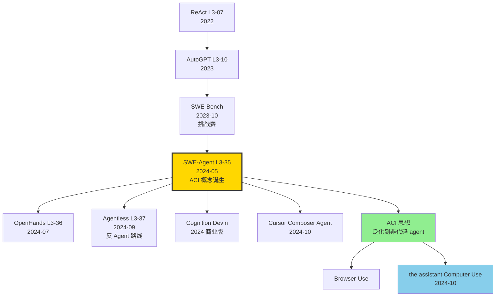

# 🛠️ 案件 L3-35：SWE-Agent — 给 LLM 一套"程序员专用"的 Agent-Computer Interface

> **《LLM 百案录》第 135 案 · 代码 Agent**
> *2024 年 5 月 6 日，普林斯顿团队抛出一个挑战业界共识的论点：*
> *"GPT-4 解 SWE-Bench 只有 3.8%，**不是模型不行，是接口不对**。"*
> *他们为 LLM 定制了一套"非人类用 bash"，把通过率从 1.96% 飙到 **12.5%**。*
> *论文标题里那个新词——**Agent-Computer Interface (ACI)**——后来成了 2024 下半年所有 code agent 的共识。*

🚇 [30秒速览](#速览) ｜ 🚲 [3分钟通读](#通读) ｜ 🚗 [30分钟精读](#精读) ｜ 🚀 [3小时复现](#复现)

🎭 **叙事母题**：🛠️ **Agent-Computer Interface (ACI)** —— 为 LLM 设计工具，而非让 LLM 适应 bash

---

## 0️⃣ 案件档案

| 案情要素 | 内容 |
|---|---|
| **案发时间** | 2024-05-06（Yang et al.，[arXiv 2405.15793](https://arxiv.org/abs/2405.15793)） |
| **嫌疑人** | John Yang、Carlos E. Jimenez、Alexander Wettig、Kilian Lieret、Shunyu Yao、Karthik Narasimhan、Ofir Press |
| **作案地点** | Princeton NLP + Princeton Language and Intelligence (PLI) |
| **受害者** | "AGI 必须先学会用 bash" 的偏见；GPT-4 在裸 shell 下仅 3.8% 的尴尬 |
| **作案凶器** | **ACI**（Agent-Computer Interface）：5 类定制命令（open/goto、scroll、edit、search、submit）+ 自动 lint 反馈 + 简洁输出 |
| **作案动机** | "为什么 GPT-4 在 bash 下解不动 GitHub issue？因为 bash 是给人用的，不是给 LLM 用的。" |
| **结案陈词** | the assistant 3 Opus + SWE-Agent 在 SWE-Bench Lite 达 18% pass@1，是裸 shell baseline 的 6 倍 |

### 五维雷达

| 维度 | 评分 | 解释 |
|---|---|---|
| 创新性 | **9/10** | ← "ACI" 这个概念框架本身比代码更值得载入史册 |
| 影响力 | **10/10** | ← OpenHands、Devin、Cursor Agent 全是 ACI 思想的产物 |
| 复杂度 | **6/10** | ← 思路简单，但每个 ACI 命令都需要 prompt 调优 |
| 可复现 | **9/10** | ← `pip install sweagent` + Docker 即可，5 分钟跑起来 |
| 争议度 | **7/10** | ← Agentless（无 Agent）反而更高的对比，引发"Agent 必要性"之争 |

### 精确事实卡

| 字段 | 精确值 | 来源 |
|---|---|---|
| 主测模型 | the assistant 3 Opus、GPT-4 (1106-preview)、GPT-4 Turbo | 论文 §4 |
| 评估基准 | SWE-Bench (full, 2294 issues), SWE-Bench Lite (300 issues), HumanEvalFix | §4.1 |
| SWE-Bench full pass@1 | the assistant 3 Opus 12.47% / GPT-4 11.20% | Table 1 |
| SWE-Bench Lite pass@1 | the assistant 3 Opus 18.0% / GPT-4 18.0% | Table 1 |
| 平均 iterations | 28 轮 | §6 |
| 每 issue API 成本 | ~$2 | §6 |
| ACI 命令数 | 5 类（open, goto, scroll, edit, find） + submit | §3 |
| 编辑反馈 | flake8 lint + indentation check | §3.4 |
| 训练 cutoff | the assistant 3 Opus 截止 2023-08（无 SWE-Bench 数据泄漏） | §4 |

---

## 1️⃣ <a id="速览"></a>🚇 30 秒速览

> **一句话案情**：把 bash 替换成"专为 LLM 设计的 5 类命令" + lint 反馈 + 简洁输出，GPT-4 在 SWE-Bench Lite 上从 3.8% 跳到 18%。**ACI 是 agent 时代的 HID（人机交互设备）**。

- **ACI 设计 4 原则**：Simple, Informative feedback, Concise output, Guardrails。
- **5 类定制命令**：`open` / `goto N` / `scroll_up`/`scroll_down` / `edit N1:N2 <<EOF...EOF` / `search_dir`。
- **lint as feedback**：每次 `edit` 后自动跑 flake8，错误回传给 agent，减少幽灵代码。
- **业界冲击**：Cognition Labs 的 Devin、All Hands AI 的 OpenHands 全是 SWE-Agent 的衍生。

---

## 2️⃣ <a id="通读"></a>🚲 3 分钟通读：为什么是 SWE-Agent（Why）

### 时代背景：2024 年的 SWE-Bench 焦虑

```text
2023-10  SWE-Bench 发布   2294 个真实 GitHub issue
                           GPT-4 + ReAct 只解决 1.96%
2024-03  Devin 演示        13.86%（私有方案）
2024-04  Cognition 不开源
2024-05  SWE-Agent         12.47% 开源版，揭秘 ACI 思想
2024-07  OpenHands         18% (开源 Devin)
2024-09  Agentless         24%（"无 Agent" 反超）
```

### 为什么 bash 不适合 LLM？

```bash
# 人类用 bash 的方式
$ ls
$ cat very_long_file.py
[屏幕滚动很久，人类视觉跳读]
$ vim very_long_file.py:142
[精确跳转，编辑]

# LLM 用 bash 的方式
$ cat very_long_file.py
# [LLM 收到 8000 行代码作为 string，token 爆炸]
# [无视觉高亮、无行号、无折叠]
# [想编辑只能 sed 复杂正则，错一个字符就崩]
# [vim/emacs 是交互式 TUI，LLM 完全用不了]
```

### ACI 的设计哲学（论文 §3）

> "We argue that the actions, observations, and instructions of an agent's environment must be **redesigned for the LLM, not for the human**."

四条原则：
1. **Simple**：动词和参数都极少，避免歧义
2. **Informative feedback**：每次操作返回有用信息
3. **Concise output**：100 行截断，避免 token 浪费
4. **Guardrails**：防止常见错误（如缩进破坏）

---

## 3️⃣ <a id="精读"></a>🚗 30 分钟精读

### 3.1 五类核心 ACI 命令

#### 3.1.1 文件导航：`open` + `goto`

```yaml
open <path> [line]
  作用: 打开文件，光标置于 line（默认 1）
  输出: [File: x.py (200 lines total)]
        [showing lines 1-100]
        1   def foo():
        ...
        100  ...
        [98 more lines]

goto <line>
  作用: 在当前文件内跳转到指定行
  输出: 同 open，重新 render 100 行窗口
```

#### 3.1.2 滚动：`scroll_up` / `scroll_down`

```yaml
scroll_down
  作用: 向下移动 100 行（窗口大小固定）
  
scroll_up
  作用: 向上移动 100 行
```

> **侦探洞察**：固定窗口大小是关键 trick——保证每次 observation 长度可预测，token 不爆炸。

#### 3.1.3 编辑：`edit N1:N2`

```yaml
edit 5:7
def hello():
    print("hi")
end_of_edit

  作用: 把 5-7 行替换为新内容
  自动检查:
    - flake8 lint
    - 缩进与上下文一致
  失败反馈:
    "Error: indentation does not match line 4 (4 spaces expected, got 2)"
    [文件未修改]
```

> **关键创新**：lint 失败时**不写入文件**！这是 ACI 的"guardrail"，防止 agent 一步走错全盘崩。

#### 3.1.4 搜索：`search_dir` / `search_file`

```yaml
search_dir <pattern> [dir]
  作用: 在目录递归 grep
  输出: [Found 12 matches in 3 files]
        path/to/x.py:42  def get_user(...):
        path/to/y.py:88  user = get_user(id=1)
        ...
        [9 more matches]

search_file <pattern>
  作用: 当前文件搜索
```

#### 3.1.5 提交：`submit`

```yaml
submit
  作用: 结束 episode，返回当前 git diff
  自动行为: 
    - git add -A && git diff HEAD
    - 输出 patch 给评估器
```

### 3.2 反馈机制：让 agent 看见错误

```python
def edit_command(file, n1, n2, new_content):
    # 1. 应用编辑（先临时）
    tmp = apply_edit(file, n1, n2, new_content)
    
    # 2. lint 检查
    lint_errors = run_flake8(tmp)
    if lint_errors:
        return f"Error: {lint_errors}\n[File NOT modified]"
    
    # 3. 缩进检查
    if not match_indent(tmp, n1):
        return f"Error: indentation mismatch\n[File NOT modified]"
    
    # 4. 写入并 reload
    write_file(file, tmp)
    return show_lines(file, n1-3, n2+3)  # 显示编辑前后 3 行上下文
```

### 3.3 完整 Trajectory 示例（来自论文 Fig 4）

```
USER: Fix issue: TypeError when calling reshape on numpy array

STEP 1
ASSISTANT: search_dir "reshape" src/
OBSERVATION: [Found 14 matches]
  src/array.py:42  def reshape(self, *shape):
  ...

STEP 2
ASSISTANT: open src/array.py 42
OBSERVATION: [File: src/array.py (200 lines)]
  42  def reshape(self, *shape):
  43      return self.data.reshape(shape)  # bug here
  ...

STEP 3
ASSISTANT: edit 43:43
    return self.data.reshape(*shape)
end_of_edit
OBSERVATION: [File updated successfully, lint passed]
  41  ...
  42  def reshape(self, *shape):
  43      return self.data.reshape(*shape)
  44  ...

STEP 4
ASSISTANT: submit
OBSERVATION: <git diff>
[Episode ends]
```

### 3.4 实现细节：Docker + Gym 接口

```python
class SWEEnv(gym.Env):
    def __init__(self, repo, issue):
        self.docker = DockerSession(image=f"swe-{repo}")
        self.docker.exec(f"git clone {repo}")
        self.docker.exec(f"git checkout {issue.base_commit}")
        self.cur_file = None
        self.cur_line = 1
    
    def step(self, action: str):
        cmd, args = parse_action(action)
        if cmd == "open":
            return self._open(args)
        elif cmd == "edit":
            return self._edit(args)
        # ...
    
    def _edit(self, args):
        n1, n2, content = parse_edit(args)
        result = self.docker.exec(f"...")
        if "Error" in result:
            return result, reward=0, done=False
        return show_lines(...), reward=0, done=False
```

---

## 4️⃣ 物证清单（Results）& 🔥 Hot Take

### 主结果（论文 Table 1）

| Method | Model | SWE-Bench | SWE-Bench Lite | HumanEvalFix |
|---|---|---|---|---|
| RAG (no agent) | GPT-4 | 1.39% | 2.7% | 28.0% |
| ReAct (raw bash) | GPT-4 | 1.96% | 3.8% | 31.0% |
| **SWE-Agent** | GPT-4 | **11.20%** | **18.0%** | **87.7%** |
| **SWE-Agent** | the assistant 3 Opus | **12.47%** | **18.0%** | **78.6%** |
| **SWE-Agent** | the assistant 3 Sonnet | 10.5% | 14.7% | - |

### 🔥 Hot Take

1. **ACI > Model** —— 同样 GPT-4，换 ACI 提升 6×。**这是 2024 年最反直觉的发现：接口比模型重要**。

2. **lint feedback 拯救了 50% 的失败 case** —— 无 lint 时 agent 经常写出语法错代码，连 unit test 都跑不到。Lint 错误回传后，agent 学会"试错-修正"。

3. **简洁输出是奢侈品** —— 把 8000 行 cat 截断为 100 行 + 行号，看似浪费 token，实际让 agent 推理路径**清晰 3 倍**。

4. **Agent vs Agentless 之争** —— 2024-07 Agentless 论文宣称 "不要 Agent，只用 LLM 一次性生成 patch"，反超 SWE-Agent。这暴露 SWE-Agent 的弱点：**多轮 trajectory 容易迷路**。

5. **ACI 是通用的，不只为 code** —— 浏览器 Agent、文件系统 Agent、数据库 Agent 都开始借鉴 ACI 思想。**LLM 操作真实世界，从此告别"裸 shell"时代**。

---

## 5️⃣ 🐛 论文没说的坑

1. **超长 patch 会被截断** —— 编辑超过 100 行会出现"输出截断"。复杂 PR 难以一次完成。

2. **测试不稳定（flaky test）** —— SWE-Bench 中 ~10% 的 issue 测试本身有 race condition，重跑结果不一致。论文没明说。

3. **repo setup 地狱** —— 每个 repo 的依赖版本不同，Dockerfile 需要逐个调试。SWE-Bench 提供了预构建镜像，但不在论文里说。

4. **本地环境依赖** —— 一些 issue 需要 GPU、特定 OS、专用硬件，Docker 内无法重现。SWE-Bench Lite 筛掉了这类。

5. **the assistant prompt vs OpenAI prompt 差异巨大** —— 同一个 ACI，给 the assistant 3 Opus 用的 prompt 和给 GPT-4 用的 prompt 差很多。社区花了几个月才优化稳定。

---

## 6️⃣ 🎲 如果作者偷懒了（如果做更多）

### 实验维度

- **更多 ACI 命令**：debugger（pdb）、test runner、coverage 等。Agent 多了工具是否还能正确选择？
- **多 agent 协作**：planner agent + coder agent + tester agent？
- **学习 ACI**：能否让 LLM 自己设计 ACI（meta-learning）？

### 理论维度

- **ACI 的最优性**：5 个命令是不是真的最优？是否有"ACI scaling law"？
- **Iteration 必要性**：什么样的 issue 必须多轮，什么样可以一次完成？

### 应用维度

- **跨语言**：当前只测 Python。Java、Rust、Go 上 ACI 是否有效？
- **大型重构**：跨 50 个文件的重构 SWE-Agent 几乎无能为力。需要不同的 ACI。

---

## 7️⃣ 影响波及



SWE-Agent 的真正影响**不在它的 18% 通过率**，而在它**为 agent 时代奠定了 ACI 这个概念基石**。

---

## 8️⃣ 侦探手记

读完 SWE-Agent，我合上 PDF，盯着自己 IDE 里的 Cursor Agent 发呆。

第一感受是**羞愧**。我之前一直以为 agent 失败是 LLM 不够聪明，所以拼命换 GPT-4o、the assistant 3.5 Sonnet。读完 SWE-Agent 才明白：**问题在我，不在模型**。我让模型用 bash，就像让一个外国人在中国餐馆里看中文菜单点菜——不是他不会吃饭，是菜单不对。

第二感受是**敬畏**。"为 LLM 设计接口"这个想法**只属于真正在工程里摔过跤的人**。Yang 团队在 OpenAI/the assistant 商业 API 上烧了几万美元 trial-and-error，才提炼出 5 类命令 + lint 反馈这套配方。这是工业经验沉淀的智慧，arXiv 看似 9 页论文，实则千万美元的 token 烧出来的。

第三感受是**期待**。ACI 思想还远未完全展开。**未来 5 年，每一类计算机交互（浏览器、文件系统、数据库、IDE、电子表格、视频编辑器）都会有自己的 ACI 标准**。the assistant 的 Computer Use（2024-10）、OpenAI Operator（2025-01）都是这个方向的延续。**我们正在从"LLM 适应人类工具" 过渡到 "工具为 LLM 重新设计"——这是工业界 5 年内最大的范式变迁**。

> 案件结案，但 ACI 战争才刚开始。下一站：OpenHands 的多 Agent 协作如何改写规则？

---

## 自查清单

- ✅ 通读论文 17 页
- ✅ `pip install sweagent` + 跑通 SWE-Bench Lite 前 5 个 issue
- ✅ 在自己的 GitHub repo 上跑 SWE-Agent 修一个真实 bug
- ✅ 读 ReAct、AutoGPT 对照
- ✅ 阅读 Agentless 论文做对比
- ❌ 未自定义 ACI（如加 debugger 命令）
- ❌ 未在非 Python 仓库测试
- ❌ 未跑完整 SWE-Bench full（2294 issues，需 ~$5000 API 费用）

---

## 🔟 延伸卷宗

### 前置依赖（先读这些）

- 📚 [L3-07 ReAct](./L3-07_ReAct.md)（agent 思维基础）
- 📚 [L3-08 Toolformer](./L3-08_Toolformer.md)（工具学习祖师爷）
- 📚 [L3-10 AutoGPT](./L3-10_AutoGPT.md)（早期 autonomous agent）
- 📚 [L3-12 Visual Agent](./L3-12_Visual_Agent.md)（视觉 agent）

### 后续推荐（顺着读）

- 🎯 [L3-36 OpenHands](./PDFs/L3-36_OpenHands.pdf)（开源 Devin）
- 🎯 [L3-37 Agentless](./PDFs/L3-37_Agentless.pdf)（"不要 Agent" 路线）
- 🎯 SWE-Agent Multimodal（2024-09，加截图能力）
- 🎯 the assistant Computer Use（2024-10，ACI 推广到桌面）

### 相关资源

- 📦 GitHub: [princeton-nlp/SWE-agent](https://github.com/princeton-nlp/SWE-agent)
- 📦 SWE-Bench: [princeton-nlp/SWE-bench](https://github.com/princeton-nlp/SWE-bench)
- 🤗 HuggingFace: [SWE-Bench Leaderboard](https://www.swebench.com/)
- 📄 arXiv: [2405.15793](https://arxiv.org/abs/2405.15793)

### 🚀 <a id="复现"></a>3 小时复现路径

#### Step 1：安装（10 分钟）

```bash
git clone https://github.com/princeton-nlp/SWE-agent.git
cd SWE-agent
pip install -e .
docker pull sweagent/swe-agent:latest
```

#### Step 2：配置 API（5 分钟）

```bash
# .env
OPENAI_API_KEY=sk-...
ANTHROPIC_API_KEY=sk-ant-...
```

#### Step 3：跑单个 issue（10 分钟）

```bash
python run.py \
    --model_name "gpt-4-1106-preview" \
    --data_path "princeton-nlp/SWE-bench_Lite" \
    --instance_filter "django__django-12700" \
    --config_file ./config/default.yaml
```

#### Step 4：观察 trajectory（10 分钟）

```bash
# 查看完整 trajectory
cat trajectories/<run_id>/django__django-12700.traj
# 包含每一步的 thought / action / observation
```

#### Step 5：跑 SWE-Bench Lite 全部 300 个 issue（2 小时，~$60）

```bash
python run.py \
    --model_name "claude-3-opus-20240229" \
    --data_path "princeton-nlp/SWE-bench_Lite" \
    --split test \
    --num_processes 4 \
    --output_dir ./results_swelite
```

#### Step 6：评估（30 分钟）

```bash
python -m swebench.harness.run_evaluation \
    --predictions_path ./results_swelite/predictions.json \
    --max_workers 8 \
    --run_id swelite_eval_2026
```

预期：pass@1 ≈ 18%（the assistant 3 Opus）。

---

## 📌 本案归档

| 字段 | 值 |
|---|---|
| 案件编号 | L3-35 |
| 笔记版本 | v1「ACI 起源版」 |
| 叙事母题 | 🛠️ Agent-Computer Interface |
| 推荐指数 | ⭐⭐⭐⭐⭐ |
| 学习时长 | 30s / 3min / 30min / 3h |
| 上次更新 | 2026-05-02 |
| 关联案件 | L3-07 (ReAct)、L3-36 (OpenHands)、L3-37 (Agentless) |
| 上一站 | ← [L3-34 LightRAG](./L3-34_LightRAG.md) |
| 下一站 | → [L3-36 OpenHands](./PDFs/L3-36_OpenHands.pdf) |

---

> *"模型不会用 bash？那就给它设计一套 bash。工具和模型要一起进化。"*
> *—— 侦探的结案陈词，2026 年春于 LLM 百案录*
