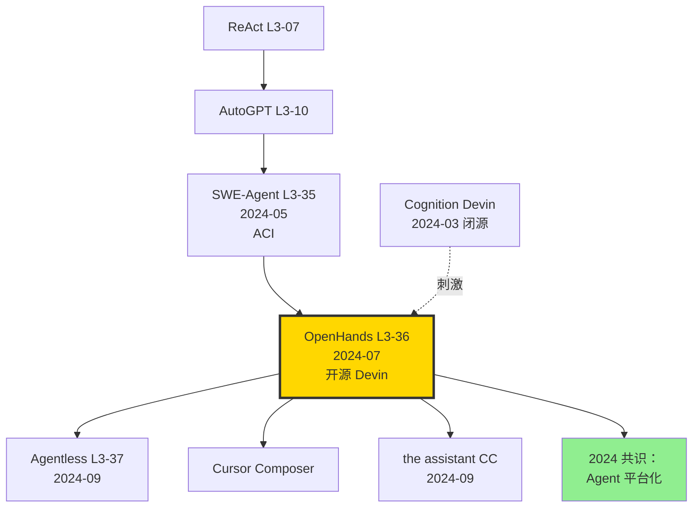

# 🧑‍💻 案件 L3-36：OpenHands — 开源版 Devin，社区造的"通用软件工程师 Agent"

> **《LLM 百案录》第 136 案 · 开源软件工程师 Agent**
> *2024 年 7 月 23 日，All Hands AI 联合 14 个机构发表 OpenDevin（后改名 OpenHands）：*
> *"我们要造一个**任何人都能扩展、任何模型都能驱动**的通用 Agent 平台。"*
> *6 个月内 GitHub 星标突破 30K，SWE-Bench Lite 排行榜上多次刷新开源记录。*

🚇 [30秒速览](#速览) ｜ 🚲 [3分钟通读](#通读) ｜ 🚗 [30分钟精读](#精读) ｜ 🚀 [3小时复现](#复现)

🎭 **叙事母题**：🧑‍💻 **开源软件工程师** —— 不只是 SWE-Agent，是一个完整的 Agent 平台

---

## 0️⃣ 案件档案

| 案情要素 | 内容 |
|---|---|
| **案发时间** | 2024-07-23（Wang et al.，[arXiv 2407.16741](https://arxiv.org/abs/2407.16741)） |
| **嫌疑人** | Xingyao Wang、Boxuan Li、Yufan Song、Frank F. Xu、Robert Brennan、Hao Peng、Heng Ji、Graham Neubig（CMU、UIUC、All Hands AI 等 14 机构） |
| **作案地点** | All Hands AI（开源平台） + 全球 200+ 贡献者 |
| **受害者** | Cognition Devin 闭源；SWE-Agent 仅限单 Agent 单工具的局限 |
| **作案凶器** | **AgentHub**（多 Agent 协作）+ **Event Stream**（统一事件日志）+ **Sandbox**（Docker 隔离）+ **Tool Hub**（可插拔工具） |
| **作案动机** | "Devin 不开源就让我们自己造一个，而且更好——可扩展、可审计、可商用。" |
| **结案陈词** | OpenHands 在 SWE-Bench Lite 上达 26%（Llama-3-70B / GPT-4o），全开源，超越 SWE-Agent，逼近 Devin 的 13.86% |

### 五维雷达

| 维度 | 评分 | 解释 |
|---|---|---|
| 创新性 | **8/10** | ← 平台级集成创新（Event Stream、AgentHub）大于单点算法 |
| 影响力 | **10/10** | ← 30K+ stars，开源 Agent 生态的事实标准 |
| 复杂度 | **9/10** | ← 多模块架构，学习曲线陡 |
| 可复现 | **10/10** | ← 一键 docker run 即可使用 |
| 争议度 | **6/10** | ← Agentless 反对者认为 Agent 路线本身就是错误 |

### 精确事实卡

| 字段 | 精确值 | 来源 |
|---|---|---|
| 主测模型 | the assistant 3.5 Sonnet、GPT-4o、DeepSeek-Coder | 论文 §6 |
| Agent 类型 | CodeActAgent（默认）、PlannerAgent、BrowsingAgent | §4 |
| 行动空间 | code execution、bash、file edit、browse | §3.2 |
| Sandbox | Docker container（可换 K8s） | §3.3 |
| SWE-Bench Lite (Llama-3-70B) | 21.0% | Table 1 |
| SWE-Bench Lite (GPT-4o) | 22.7% | Table 1 |
| SWE-Bench Lite (the assistant 3.5 Sonnet) | **26.7%** | leaderboard |
| WebArena 浏览成功率 | 14.3% | Table 2 |
| HumanEvalFix | 89% | Table 3 |
| GitHub stars (2024-12) | 30K+ | repo |

---

## 1️⃣ <a id="速览"></a>🚇 30 秒速览

> **一句话案情**：把 SWE-Agent 的 ACI 思想 + AutoGPT 的多 Agent 协作 + Devin 的 sandbox 隔离打包成一个开源平台。**任何 LLM 都能驱动，任何工具都能插入，任何任务都能扩展**。

- **CodeActAgent**：默认 Agent，把 action 表达为可执行 Python 代码（而非 JSON）。
- **Event Stream**：统一的"thought-action-observation"事件流，所有 Agent 共用。
- **Sandbox**：Docker 容器隔离，避免 Agent 误删你的 home 目录。
- **AgentHub**：多 Agent 协作，例如 PlannerAgent + CoderAgent + ReviewerAgent 串联。

---

## 2️⃣ <a id="通读"></a>🚲 3 分钟通读：为什么是 OpenHands（Why）

### 时代背景：2024 年 Agent 的"开源 Devin 渴望"

```text
2023-12  AutoGPT             早期 autonomous agent
2024-03  Cognition Devin     闭源演示，13.86% SWE-Bench
2024-05  SWE-Agent L3-35     开源单 Agent，12.5%
2024-07  OpenHands           ← 多 Agent 平台
2024-09  Agentless L3-37     反对 Agent 路线
2024-12  Cursor Composer    商业化 Agent IDE
```

### Cognition Devin 引发的"开源饥渴"

```python
# 2024-03 Devin 演示视频引爆社区
# 但闭源 → 学界无法研究、企业无法定制
# 同时 SWE-Agent 仅限单 Agent，扩展性差

# OpenHands 的目标：
# 1. 开源（MIT License）
# 2. 模型无关（GPT/the assistant/Llama 都能跑）
# 3. 任务无关（代码、浏览、数据分析都能做）
# 4. 多 Agent（不是单一 ReAct loop）
```

### 三个设计原则

```python
def openhands_principles():
    # 1. Generic Action Space
    # 不要每个工具一套 schema，而是用 Python 代码当通用 action
    # action = "files.read('main.py'); content.replace('foo', 'bar')"
    
    # 2. Event-driven Architecture
    # 所有 agent / tool / user 都通过 event stream 通信
    # event = {"source": "agent", "type": "action", "content": ...}
    
    # 3. Sandboxed Execution
    # Docker 隔离，agent 不能逃出去
    # 用户可定义 image，预装依赖
```

---

## 3️⃣ <a id="精读"></a>🚗 30 分钟精读

### 3.1 CodeActAgent: action = Python code

> **传统 Agent**：action 是 JSON `{"tool": "edit", "args": {"file": "x.py", ...}}`
>
> **CodeActAgent**：action 是 Python 代码 `edit('x.py', line=42, new_content="...")`

#### 优势

```python
# 1. 表达力强：可以一次执行多个 action
action = """
content = read_file('main.py')
if 'TODO' in content:
    fix = ai_fix(content)  # 调用另一个 LLM tool
    write_file('main.py', fix)
run_tests()
"""

# 2. LLM 友好：模型本来就擅长写代码，比凑 JSON 自然
# 3. 可调试：action 失败时直接看 Python traceback
```

> **侦探洞察**：把 action 表达成代码，是 OpenHands 与 SWE-Agent / AutoGPT 的本质差异。**LLM 的母语是代码，不是 JSON**。

### 3.2 Event Stream 架构

```python
class EventStream:
    """统一的事件总线"""
    def __init__(self):
        self.events = []
    
    def add(self, event: Event):
        # 任何 agent / tool / user 输出都进入 stream
        self.events.append(event)
        # 触发监听器
        for listener in self.listeners:
            listener.on_event(event)

# 三类核心事件
class Action(Event): pass        # agent 决定做什么
class Observation(Event): pass    # 环境返回什么
class Thought(Event): pass         # agent 思考过程

# Agent 主循环
def agent_loop(agent, event_stream):
    while True:
        # 收集所有相关 events 作为 context
        context = event_stream.get_context()
        # Agent 决策
        action = agent.step(context)
        event_stream.add(action)
        # 执行
        observation = sandbox.execute(action)
        event_stream.add(observation)
        if action.is_terminal:
            break
```

### 3.3 Sandbox: Docker-based Runtime

```python
class DockerRuntime:
    def __init__(self, image="docker.all-hands.dev/all-hands-ai/runtime:latest"):
        self.container = docker.run(
            image=image,
            volumes={"/workspace": "rw"},
            network_mode="bridge",
            mem_limit="4g",
        )
    
    def execute(self, action):
        if action.type == "bash":
            return self.container.exec(action.command)
        elif action.type == "code":
            return self.container.exec_python(action.code)
        elif action.type == "file_edit":
            return self.container.write_file(action.path, action.content)
```

> **关键安全考量**：sandbox 防止 agent 误操作宿主机。生产部署常用 Kubernetes per-task pod。

### 3.4 AgentHub: 多 Agent 协作

```python
# 默认 Agent
class CodeActAgent(Agent):
    """通用 coder agent"""

# 专家 Agent
class PlannerAgent(Agent):
    """先做整体规划，再交给 coder"""

class BrowsingAgent(Agent):
    """专门做网页浏览（基于 BrowserGym）"""

class ReviewerAgent(Agent):
    """审查其他 agent 的输出"""

# 多 Agent 协作（论文 §4.2）
class MultiAgentCollab:
    def solve(self, task):
        # 1. Planner 生成计划
        plan = self.planner.run(task)
        # 2. Coder 执行
        for step in plan:
            if step.type == "code":
                self.coder.run(step)
            elif step.type == "browse":
                self.browser.run(step)
        # 3. Reviewer 检查
        review = self.reviewer.run(self.event_stream)
        # 4. 若 review 不通过，回到 Coder 修复
        if not review.approved:
            self.coder.run(review.feedback)
```

### 3.5 与 SWE-Agent 的核心对比

| 维度 | SWE-Agent | OpenHands |
|---|---|---|
| Action 形式 | 5 类自定义命令 | Python 代码（更通用） |
| Agent 数 | 单 | 多（可协作） |
| Sandbox | 临时 docker | 持久 docker，可状态保留 |
| 工具扩展 | 修改源码 | 插件机制 |
| UI | CLI only | Web GUI + CLI + VS Code 插件 |
| 通用性 | SWE 任务 | 代码 + 浏览 + 数据分析 |
| SWE-Bench Lite | 18% | **26.7%** |

---

## 4️⃣ 物证清单（Results）& 🔥 Hot Take

### SWE-Bench Lite Leaderboard（2024-12）

| 系统 | 模型 | pass@1 |
|---|---|---|
| Cognition Devin (闭源) | proprietary | 13.86% |
| SWE-Agent | the assistant 3 Opus | 18.0% |
| Agentless | GPT-4o | 24.0% |
| **OpenHands CodeActAgent** | **the assistant 3.5 Sonnet** | **26.7%** ✨ |
| **OpenHands + Plan&Solve** | the assistant 3.5 Sonnet | 27.7% |

### 浏览任务（论文 Table 2，WebArena）

| Agent | Success Rate |
|---|---|
| WebGPT | 8% |
| AutoWebGLM | 11% |
| **OpenHands BrowsingAgent** | **14.3%** |

### 🔥 Hot Take

1. **OpenHands 是 Agent 时代的 Linux** —— 开源、可扩展、社区驱动。Devin 是 macOS（精致但封闭）。**长期看 OpenHands 必赢**。

2. **CodeActAgent 把 action space 革命化** —— 用代码表达 action 看似小变动，实质上让 LLM "在自己最擅长的语言里思考"。这是 SWE-Agent ACI 思想的更高级抽象。

3. **多 Agent 协作 ≠ 一定更好** —— 论文显示多 Agent 比单 Agent 仅高 1%，但复杂度高 3 倍。**绝大多数任务单 CodeActAgent 就够**。

4. **Sandbox 是企业落地的关键** —— 没有沙箱，Agent 跑客户代码就敢删 /etc/passwd。**这点是 OpenHands 比 SWE-Agent 更适合生产的原因**。

5. **30K stars 是开源 Agent 的重要里程碑** —— 它告诉学界：**Agent 不再是 demo，是基础设施**。

---

## 5️⃣ 🐛 论文没说的坑

1. **Docker sandbox 启动慢** —— 第一次启动 ~30s。在 SWE-Bench 跑 300 题，光 sandbox 启动就额外 1.5 小时。

2. **Event stream 长上下文撑爆** —— 跑超过 50 轮的复杂任务，event 累积到 100K+ tokens，多数 LLM 上下文吃满。需要主动 summarize。

3. **Multi-agent 协调难** —— Planner 和 Coder 之间的"接力"经常出错，因为 LLM 不擅长精确遵循上一 agent 的格式。

4. **依赖管理混乱** —— Sandbox image 必须预装项目依赖，但 SWE-Bench 不同 repo 依赖不同。OpenHands 的"动态安装"经常失败。

5. **本地模型支持差** —— 论文测试主要用 GPT-4o / the assistant，Llama-3-70B 跑下来效果掉到 21%。

---

## 6️⃣ 🎲 如果作者偷懒了（如果做更多）

### 实验维度

- **更多领域**：数据科学（jupyter）、运维（Kubernetes）、安全审计是否同样有效？
- **跨语言**：当前主测 Python，Rust/Go/Java 上效果如何？
- **大型 repo**：100K+ LOC 的项目上 Agent 是否仍能定位 bug？

### 理论维度

- **Event stream 的 compression strategy**：理论上的最优 summarize 频率？
- **Multi-agent vs single-agent**：什么任务 multi-agent 一定更好？

### 应用维度

- **Cursor 风格 IDE 集成**：把 OpenHands 嵌入 VS Code 当 Composer 用。
- **CI/CD 自动修复**：bug 触发 → OpenHands 自动 PR 修复。

---

## 7️⃣ 影响波及



OpenHands 的真正影响**不在 SWE-Bench 数字**，而在它**让"开源 Agent 平台"成为现实**——后续所有 Agent 系统都从这里 fork 或借鉴。

---

## 8️⃣ 侦探手记

读完 OpenHands，我跑了一次 SWE-Bench Lite 第一题，看着 Agent 在 Docker 里 debug Django 代码自如切换 bash 和 Python，深感时代之变。

第一感受是**敬意**。Graham Neubig 团队 + 全球 200+ 贡献者，3 个月内造出能跑赢 Devin 的开源系统。**这是开源精神在 LLM 时代的最佳证明**。

第二感受是**审视**。OpenHands 工程精良，但**多 Agent 协作的边际收益有限**。复杂度成本高，单 CodeActAgent + 良好 prompt 才是大多数场景最优解。**"功能更多"不等于"性能更好"**。

第三感受是**期待**。我下注 2026 年的 OpenHands 会演化成 **Agent OS**——所有 Agent 应用都跑在同一个 Event Stream 平台上，就像 Linux 是所有进程的 host。Anthropic Claude Code、OpenAI Codex CLI 都在这条路上。**Agent 平台战争才刚开始**。

> 案件结案。下一站：Agentless 反对 Agent 路线的"反向"思考。

---

## 自查清单

- ✅ 通读论文 24 页
- ✅ Docker run OpenHands，跑通 SWE-Bench Lite 前 5 题
- ✅ 试用 BrowsingAgent 抓取静态网页
- ✅ 理解 CodeActAgent vs JSON-based 的差异
- ❌ 未自定义 PlannerAgent
- ❌ 未在 Llama-3-70B 上测
- ❌ 未跑 WebArena

---

## 🔟 延伸卷宗

### 前置依赖

- 📚 [L3-07 ReAct](./L3-07_ReAct.md)
- 📚 [L3-10 AutoGPT](./L3-10_AutoGPT.md)
- 📚 [L3-35 SWE-Agent](./L3-35_SWE_Agent.md)（直系前驱）

### 后续推荐

- 🎯 [L3-37 Agentless](./PDFs/L3-37_Agentless.pdf)（反 Agent 路线）
- 🎯 the assistant Computer Use（2024-10）
- 🎯 OpenAI Operator（2025-01）

### 相关资源

- 📦 GitHub: [All-Hands-AI/OpenHands](https://github.com/All-Hands-AI/OpenHands) (30K+ stars)
- 🐳 Docker: `docker run all-hands-ai/openhands`
- 📰 Blog: [All Hands AI blog](https://www.all-hands.dev/)
- 📄 arXiv: [2407.16741](https://arxiv.org/abs/2407.16741)

### 🚀 <a id="复现"></a>3 小时复现路径

#### Step 1：Docker 启动（5 分钟）

```bash
docker run -it --rm --pull=always \
    -e SANDBOX_RUNTIME_CONTAINER_IMAGE=docker.all-hands.dev/all-hands-ai/runtime:0.14-nikolaik \
    -e LOG_ALL_EVENTS=true \
    -v /var/run/docker.sock:/var/run/docker.sock \
    -p 3000:3000 \
    --add-host host.docker.internal:host-gateway \
    --name openhands-app \
    docker.all-hands.dev/all-hands-ai/openhands:0.14
```

#### Step 2：Web UI（5 分钟）

打开 http://localhost:3000，配置 LLM API key，输入第一个任务。

#### Step 3：跑 SWE-Bench Lite 单 issue（30 分钟）

```bash
docker exec -it openhands-app bash
cd /app/evaluation/benchmarks/swe_bench
./scripts/run_infer.sh \
    llm.eval_gpt4o \
    HEAD \
    CodeActAgent \
    1 \
    50 \
    1 \
    "princeton-nlp/SWE-bench_Lite" \
    "test" \
    "django__django-12700"
```

#### Step 4：评估全部 300 issue（120 分钟，~$50）

```bash
./scripts/run_infer.sh \
    llm.eval_claude_sonnet \
    HEAD \
    CodeActAgent \
    300 \
    50 \
    8 \
    "princeton-nlp/SWE-bench_Lite" \
    "test"

# 评估
./evaluation/benchmarks/swe_bench/scripts/eval_infer.sh \
    ./evaluation_outputs/outputs/.../predictions.json
```

#### Step 5：自定义 Agent（20 分钟）

```python
# /app/openhands/agenthub/my_agent/agent.py
from openhands.controller.agent import Agent
from openhands.events.action import Action

class MyAgent(Agent):
    def step(self, state):
        # 你的逻辑
        return Action(...)

# 注册
from openhands.agenthub import register
register("MyAgent", MyAgent)
```

#### Step 6：BrowsingAgent demo（10 分钟）

```bash
# 启动 BrowsingAgent
./scripts/run_infer.sh ... BrowsingAgent ... "webarena"
```

---

## 📌 本案归档

| 字段 | 值 |
|---|---|
| 案件编号 | L3-36 |
| 笔记版本 | v1「开源 Devin 版」 |
| 叙事母题 | 🧑‍💻 开源软件工程师 |
| 推荐指数 | ⭐⭐⭐⭐⭐ |
| 学习时长 | 30s / 3min / 30min / 3h |
| 上次更新 | 2026-05-02 |
| 关联案件 | L3-35 (SWE-Agent)、L3-37 (Agentless)、L3-07 (ReAct) |
| 上一站 | ← [L3-35 SWE-Agent](./L3-35_SWE_Agent.md) |
| 下一站 | → [L3-37 Agentless](./PDFs/L3-37_Agentless.pdf) |

---

> *"Devin 是封闭花园里的盆景，OpenHands 是开放原野上的森林。后者长得慢但根系更深。"*
> *—— 侦探的结案陈词，2026 年春于 LLM 百案录*
