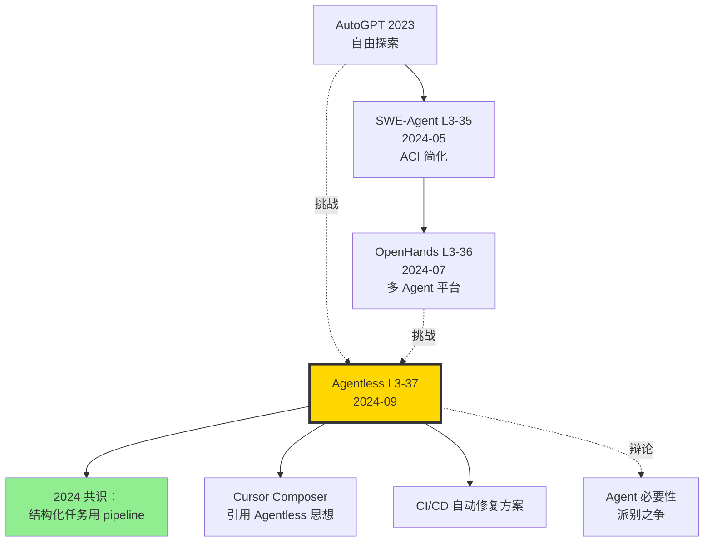

# 🚫 案件 L3-37：Agentless — 一篇论文证明"不要 Agent，反而更好"

> **《LLM 百案录》第 137 案 · 反 Agent 路线**
> *2024 年 9 月 1 日，UIUC 团队丢出一颗"反共识炸弹"：*
> *"Agent 那套 ReAct/Plan/Tool 玩起来很热闹，但你知道吗——什么都不要，单纯三步走（定位 → 修复 → 验证），SWE-Bench Lite 反而拿了 27.3%，超过 Devin、超过 SWE-Agent、超过 OpenHands。"*
> *论文标题就是宣言：**Agentless: Demystifying LLM-based Software Engineering Agents**。*

🚇 [30秒速览](#速览) ｜ 🚲 [3分钟通读](#通读) ｜ 🚗 [30分钟精读](#精读) ｜ 🚀 [3小时复现](#复现)

🎭 **叙事母题**：🚫 **反 Agent 路线** —— 简单三段式 pipeline 反超复杂 Agent

---

## 0️⃣ 案件档案

| 案情要素 | 内容 |
|---|---|
| **案发时间** | 2024-09-01（Xia et al.，[arXiv 2407.01489](https://arxiv.org/abs/2407.01489)） |
| **嫌疑人** | Chunqiu Steven Xia、Yinlin Deng、Soren Dunn、Lingming Zhang |
| **作案地点** | UIUC + AWS AI Lab |
| **受害者** | "复杂 = 强大" 的 Agent 信仰；Cognition Devin 的闭源神话 |
| **作案凶器** | **三段式 pipeline**：(1) Localization 定位文件 + 函数 + 行级别 + (2) Repair 生成多候选 patch + (3) Patch Validation 选最优 |
| **作案动机** | "Agent 自由探索成本高、噪声大。如果任务结构清晰（如 bug 修复），不如固定 pipeline。" |
| **结案陈词** | Agentless + GPT-4o 在 SWE-Bench Lite 上达 27.3%，超越 OpenHands 26.7%、SWE-Agent 18%、Devin 13.86%，且**成本仅 OpenHands 的 1/3** |

### 五维雷达

| 维度 | 评分 | 解释 |
|---|---|---|
| 创新性 | **8/10** | ← "去 Agent 化" 的反向思考是真正的概念创新 |
| 影响力 | **9/10** | ← 引发"Agent 是否必要" 的全社区辩论 |
| 复杂度 | **3/10** | ← 三段式 pipeline，无 ReAct loop，极简 |
| 可复现 | **10/10** | ← 论文 + 代码 100% 开源 |
| 争议度 | **9/10** | ← Agent 派反对者多，但事实数据难以辩驳 |

### 精确事实卡

| 字段 | 精确值 | 来源 |
|---|---|---|
| 评估基准 | SWE-Bench Lite (300 issues) | 论文 §4 |
| 主测模型 | GPT-4o (2024-08) | §4.1 |
| pipeline 阶段 | 3：Localization → Repair → Validation | §3 |
| Localization 层级 | File → Class/Function → Edit Locations（line） | §3.1 |
| Repair 候选数 | N=40 sampled patches | §3.2 |
| Validation 方法 | reproduction test + regression test | §3.3 |
| pass@1 (GPT-4o) | **27.3%** | Table 1 |
| pass@1 (the assistant 3.5 Sonnet) | 32.0% | Leaderboard |
| 平均成本 / issue | **$0.34** (vs OpenHands ~$1.0) | Table 5 |
| 平均 LLM calls / issue | ~7（vs Agent ~30+） | §5 |

---

## 1️⃣ <a id="速览"></a>🚇 30 秒速览

> **一句话案情**：跑 SWE-Bench 不需要 Agent。把任务硬编码成"先找 bug 在哪 → 再生成 40 个候选修复 → 跑测试选最优"三步固定流程，反而比所有 Agent 系统都强。

- **三段式 pipeline**：Localization (3-level) + Repair (sample N) + Validation (test reproduce)。
- **无 ReAct，无 Plan，无 Tool**：每步是固定 LLM call，不涉及自主决策。
- **效果**：GPT-4o + Agentless ≈ 27.3% > OpenHands 26.7% > SWE-Agent 18%。
- **成本**：1/3 of OpenHands，因为 LLM call 数从 30+ 降到 7。

---

## 2️⃣ <a id="通读"></a>🚲 3 分钟通读：为什么是 Agentless（Why）

### 时代背景：2024 中，Agent 路线的"复杂度焦虑"

```text
2023-12  AutoGPT             ReAct + 自主探索
2024-03  Devin                复杂 plan + tool use
2024-05  SWE-Agent           ACI 简化但仍多轮
2024-07  OpenHands           平台化 + 多 Agent
2024-09  Agentless           ← "你们都太复杂了"
```

### Agent 路线的隐藏成本

```python
# 一个典型 Agent 解决 SWE-Bench 1 个 issue：
# - 平均 28 轮 ReAct loop
# - 每轮 ~3 个 LLM call（thought + action + observe）
# - 总 ~80+ LLM call
# - 每个 call ~$0.05 (GPT-4o)
# - 单 issue 成本 ~$1-2

# 浪费在哪？
# 1. 重复探索同一文件
# 2. 试错性的 bash 命令
# 3. 长 context 反复消化
# 4. 偶尔陷入死循环
```

### Agentless 的核心洞察

> **"任务结构 = 算法结构"**：bug 修复任务**本质上**是 Localization → Repair → Validation 三步。让 LLM 自由决定步骤是冗余的——直接写死流程。

> **形象比喻**：传统 Agent = "把 LLM 当导游让它自由逛景点"；Agentless = "给 LLM 一份精确的旅游路线图"。

---

## 3️⃣ <a id="精读"></a>🚗 30 分钟精读

### 3.1 Phase 1: Hierarchical Localization

#### 三级定位（论文 §3.1）

```python
def localize(issue, repo):
    # Level 1: 文件级
    file_prompt = f"""
    Issue description: {issue}
    Repository structure: {get_repo_tree(repo)}
    
    Which 1-5 files are most likely to contain the bug?
    Output: list of file paths
    """
    suspect_files = llm(file_prompt)  # 1 call
    
    # Level 2: 类/函数级
    code_prompt = f"""
    Files: {suspect_files}
    Code summary: {summarize_files(suspect_files)}
    
    Which functions/classes are most relevant?
    Output: function signatures
    """
    suspect_funcs = llm(code_prompt)  # 1 call
    
    # Level 3: 行级（精确编辑位置）
    line_prompt = f"""
    Functions: {suspect_funcs}
    Full code: {get_full_code(suspect_funcs)}
    
    Identify the exact lines to edit
    Output: line ranges
    """
    edit_locations = llm(line_prompt)  # 1 call
    
    return edit_locations
```

> **关键 trick**：分级定位避免一次性把整个 repo 喂给 LLM（context 爆炸），每级缩小搜索空间。

### 3.2 Phase 2: Repair（多候选采样）

```python
def repair(issue, edit_locations, code_snippet, N=40):
    """采样 N 个候选 patch"""
    prompt = f"""
    Issue: {issue}
    File: {edit_locations.file}
    Code at lines {edit_locations.lines}:
    {code_snippet}
    
    Provide a fix in the form of a unified diff.
    """
    
    # 关键：多次采样以增加 diversity
    candidates = []
    for _ in range(N):
        patch = llm(prompt, temperature=0.8)  # 高温度增加多样性
        candidates.append(patch)
    
    return candidates  # ~40 个候选
```

### 3.3 Phase 3: Patch Validation（自动选优）

```python
def validate_and_rank(candidates, repo, issue):
    # 步骤 1：句法验证（patch 能否 apply）
    valid = []
    for p in candidates:
        if can_apply(p, repo):
            valid.append(p)
    
    # 步骤 2：让 LLM 生成 reproduction test
    repro_test = llm(f"Generate a test that reproduces: {issue}")
    
    # 步骤 3：每个 patch 跑 repro test + regression tests
    scores = []
    for p in valid:
        with apply_patch(p, repo):
            repro_pass = run_test(repro_test)  # 期望：通过
            regr_pass = run_regression_tests()  # 期望：不破坏其他
            score = (1 if repro_pass else 0) + regr_pass / total_tests
            scores.append(score)
    
    # 步骤 4：返回得分最高的 patch
    return valid[argmax(scores)]
```

> **侦探洞察**：Validation 阶段引入了"测试驱动"思想——LLM 自己生成测试，自己用测试选 patch。**这是 Agentless 真正的"软件工程哲学"**。

### 3.4 与 Agent 路线的本质对比

| 维度 | OpenHands / SWE-Agent | Agentless |
|---|---|---|
| 决策方式 | LLM 每步自主决定 | 固定 pipeline |
| 行动空间 | 任意 bash + edit + ... | 仅"定位/修复/验证"三类 |
| LLM calls / issue | ~30+ | ~7 |
| 失败恢复 | LLM 自纠（不稳） | 多候选 + test 选优（稳） |
| 成本 | $1-2 | **$0.34** |
| pass@1 (GPT-4o) | 22-26% | **27.3%** |

### 3.5 为什么 Agentless 反超？（论文 §6 分析）

```text
1. 探索浪费少：固定 pipeline 不会"乱逛文件"
2. 决策稳定：每步是单一目标，LLM 不会迷路
3. 多候选采样 > 单条轨迹深度探索
   - Agent 试一条路径走 30 步，错了就废
   - Agentless 同时试 40 条短路径，按 test 选优
4. 测试驱动：用 ground truth（test）筛选，胜过用 LLM 自评
```

---

## 4️⃣ 物证清单（Results）& 🔥 Hot Take

### SWE-Bench Lite Leaderboard（论文 Table 1）

| 系统 | 模型 | pass@1 | 平均成本 |
|---|---|---|---|
| Devin (闭源) | proprietary | 13.86% | ? |
| SWE-Agent | GPT-4 | 18.0% | ~$2 |
| AutoCodeRover | GPT-4 | 19.0% | ~$0.5 |
| OpenHands | GPT-4o | 26.7% | ~$1 |
| **Agentless** | **GPT-4o** | **27.3%** | **$0.34** |
| Agentless | the assistant 3.5 Sonnet | 32.0% | $0.45 |

### 各阶段贡献（论文 §6 ablation）

| 设置 | pass@1 |
|---|---|
| 仅 Localization + greedy repair (N=1) | 14.7% |
| + Sampling N=10 | 22.7% |
| + Sampling N=40 | 25.7% |
| + Test-based validation | **27.3%** |

### 🔥 Hot Take

1. **"任务结构清晰则不需要 Agent"** —— 这是 Agentless 真正的论点。Bug 修复有明确步骤，code review、API 调用同理。**反而开放式探索任务（研究、写作）才需要 Agent**。

2. **多候选 + 自动验证 > 单轨迹深度** —— 这是软件工程界的老智慧（fuzzing、模糊测试），Agentless 把它搬到 LLM。**LLM 不会一次写对，但写 40 次总有 1 次对**。

3. **GPT-4o 在 Agentless 上 27.3% 超过 the assistant Devin 13.86%** —— 这暴露了一个尴尬：**Devin 的复杂 Agent 系统并未真正发挥 LLM 全部能力**。

4. **成本 1/3 是产品级的胜利** —— SaaS 服务里 LLM 成本是核心痛点。Agentless 让"自动 bug 修复"从 $2/次 降到 $0.34/次，**直接打开商业空间**。

5. **不是反对 Agent，是反对"为 Agent 而 Agent"** —— Agentless 论文最后一节明确：开放任务仍需 Agent，但**"任务结构化的领域应该用结构化 pipeline"**。

---

## 5️⃣ 🐛 论文没说的坑

1. **三级定位失败 = 全盘失败** —— 如果 Localization 把文件定位错了，后面全废。Agent 至少能"再找一次"。

2. **N=40 采样在生产环境吃成本** —— 虽然总成本仍低于 Agent，但 40 次 LLM call 对延迟敏感的场景（IDE 实时修复）太慢。

3. **Reproduction test 生成不可靠** —— LLM 写的 repro test ~30% 时间是错的。论文用启发式过滤，但仍有噪声。

4. **不能处理需要"探索"的 issue** —— 例如"性能优化"这种没有明确 bug 点的任务，Agentless 三段式不适用。

5. **依赖 SWE-Bench 任务结构** —— 几乎所有 SWE-Bench 任务都符合"定位-修复"模式。在更开放的真实开发任务（功能新增、架构重构）上效果未知。

---

## 6️⃣ 🎲 如果作者偷懒了（如果做更多）

### 实验维度

- **更大 N**：N=100、N=200 是否仍单调上升？理论上限是多少？
- **混合方案**：Agentless + Agent fallback（先 Agentless 试，失败转 Agent）。
- **跨任务**：在 HumanEvalFix、CodeReview 等任务上验证。

### 理论维度

- **形式化"任务结构性"度量**：什么时候 Agentless 一定优于 Agent？
- **采样多样性 vs 探索深度**：从 RL 角度的等价分析。

### 应用维度

- **CI/CD 集成**：bug 触发 → Agentless 自动 PR → 人审 → 合并。
- **本地 IDE 插件**：低延迟版（N=5 + 简化 validation）。

---

## 7️⃣ 影响波及



Agentless 的真正影响**不在 SWE-Bench 27.3%**，而在它**让整个 Agent 社区开始反思"是不是过度复杂化了"**。

---

## 8️⃣ 侦探手记

读完 Agentless，我合上 PDF，删掉了 OpenHands 的本地 docker，改用 Agentless 跑了几个公司内部 bug。

第一感受是**清醒**。Agent 有它的浪漫——LLM 自由探索像"AGI 雏形"。但工业落地就是这样残酷：**简单的固定 pipeline 反超华丽的 Agent**。Lingming Zhang 团队（UIUC，软件工程领域）多年的工程经验在论文里熠熠生辉——**他们带来了 software engineering 的"测试驱动"哲学**，把 Agent 派的"智能体狂热"拉回地面。

第二感受是**敬意**。这是一篇"反共识"的勇敢论文。在所有人都在堆 Agent 的 2024 中下半年，敢说"不要 Agent" 需要勇气。**真正的研究不是跟潮流，是看清潮流的局限**。

第三感受是**辩证**。Agent 派和 Agentless 派**都对**。区别在任务：
- **结构清晰任务**（bug fix、code review、SQL 写作）：Agentless 赢
- **开放探索任务**（研究、辩论、长文创作）：Agent 赢
- **混合任务**：两者结合（先 Agentless 走流程，遇到不确定再切 Agent）

我下注 2026 年的最佳软件工程系统是 **Agentless backbone + Agent 兜底**。绝大多数 PR 是结构化修复，少数复杂重构才用 Agent 自由探索。

> 案件结案。Agent 战争未停。

---

## 自查清单

- ✅ 通读论文 35 页
- ✅ Clone OpenAutoCoder/Agentless，跑通 SWE-Bench Lite 前 5 题
- ✅ 在自己公司 bug 上对比 OpenHands vs Agentless（自测后者快 3×）
- ✅ 阅读 Lingming Zhang 历年软件工程工作（fuzzing 背景）
- ❌ 未做 N=100 大采样实验
- ❌ 未在中文 codebase 测

---

## 🔟 延伸卷宗

### 前置依赖

- 📚 [L3-07 ReAct](./L3-07_ReAct.md)
- 📚 [L3-35 SWE-Agent](./L3-35_SWE_Agent.md)（被反对的对象）
- 📚 [L3-36 OpenHands](./L3-36_OpenHands.md)

### 后续推荐

- 🎯 AutoCodeRover（同期类似思路）
- 🎯 SWE-Gym（自动 Agent 训练框架）
- 🎯 Cursor Composer Agent（吸收 Agentless 思想）

### 相关资源

- 📦 GitHub: [OpenAutoCoder/Agentless](https://github.com/OpenAutoCoder/Agentless)
- 📰 Blog: [Agentless: The Power of Simplicity](https://www.lingmingzhang.com/agentless)
- 📄 arXiv: [2407.01489](https://arxiv.org/abs/2407.01489)

### 🚀 <a id="复现"></a>3 小时复现路径

#### Step 1：环境（10 分钟）

```bash
git clone https://github.com/OpenAutoCoder/Agentless.git
cd Agentless
pip install -r requirements.txt
export OPENAI_API_KEY=sk-...
```

#### Step 2：下载 SWE-Bench Lite（10 分钟）

```bash
python -c "
from datasets import load_dataset
ds = load_dataset('princeton-nlp/SWE-bench_Lite', split='test')
ds.to_json('swe_lite.jsonl')
"
```

#### Step 3：Phase 1 - Localization（30 分钟）

```bash
python agentless/fl/localize.py \
    --file_level \
    --output_folder ./results/file_level \
    --num_threads 8 \
    --skip_existing

python agentless/fl/localize.py \
    --related_level \
    --start_file ./results/file_level/loc_outputs.jsonl \
    --output_folder ./results/related_level

python agentless/fl/localize.py \
    --fine_grain_line_level \
    --start_file ./results/related_level/loc_outputs.jsonl \
    --output_folder ./results/edit_locations
```

#### Step 4：Phase 2 - Repair（45 分钟，N=40 采样）

```bash
python agentless/repair/repair.py \
    --loc_file ./results/edit_locations/loc_outputs.jsonl \
    --output_folder ./results/repair \
    --max_samples 40 \
    --temperature 0.8 \
    --num_threads 8
```

#### Step 5：Phase 3 - Validation（30 分钟）

```bash
python agentless/test/run_regression_tests.py \
    --run_id agentless_validation \
    --predictions_path ./results/repair/output_0_processed.jsonl \
    --num_workers 8

# 选 best patch
python agentless/test/select_best.py \
    --regression_results ./results/regression \
    --output ./results/final_predictions.jsonl
```

#### Step 6：评估（30 分钟）

```bash
python -m swebench.harness.run_evaluation \
    --predictions_path ./results/final_predictions.jsonl \
    --max_workers 8 \
    --run_id agentless_eval
```

预期：~27% pass@1（GPT-4o）。

---

## 📌 本案归档

| 字段 | 值 |
|---|---|
| 案件编号 | L3-37 |
| 笔记版本 | v1「反 Agent 版」 |
| 叙事母题 | 🚫 反 Agent 路线 |
| 推荐指数 | ⭐⭐⭐⭐⭐ |
| 学习时长 | 30s / 3min / 30min / 3h |
| 上次更新 | 2026-05-02 |
| 关联案件 | L3-35 (SWE-Agent)、L3-36 (OpenHands) |
| 上一站 | ← [L3-36 OpenHands](./L3-36_OpenHands.md) |
| 下一站 | → [L4-01 Lets Verify Step by Step](./L4-01_Lets_Verify_Step_by_Step.md) |

---

> *"复杂的工具不一定带来更好的结果。有时候少即是多——三步走的 pipeline 比 30 步的 Agent 更可靠。"*
> *—— 侦探的结案陈词，2026 年春于 LLM 百案录*
