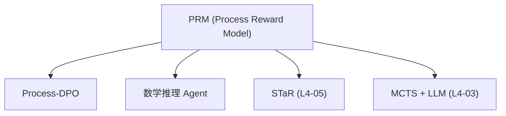

# 🧠 案件 L4-01：Let's Verify Step by Step — AI 也需要"高考监考"

> **《LLM 百案录》第 073 案 · 过程为王**
> *Outcome Reward Model（ORM）只看最终答案——就像只看去年的分数线，不看考试过程。
> Process Reward Model（PRM）给推理的每一步打分——就像高考的每一道题都监考到底。*

🚇 [30秒速览](#速览) ｜ 🚲 [3分钟通读](#通读) ｜ 🚗 [30分钟精读](#精读) ｜ 🚀 [3小时复现](#复现)

🎭 **叙事母题**：🧠 **高考改革** —— 从"结果导向"到"过程导向"

---

## 0️⃣ 案件档案

| 案情要素 | 内容 |
|---|---|
| **案发时间** | 2023-05（Lightman et al., [arXiv 2305.20050](https://arxiv.org/pdf/2305.20050)，DeepMind） |
| **受害者** | Outcome Reward Model 的"蒙答案"问题 |
| **作案凶器** | Process Reward Model + 每步评分 |
| **结案陈词** | PRM 让 LLM 从"赌答案"变成"做证明题"——在 MATH/GSM8K 上显著超越 ORM |

**五维雷达**：
```
创新性  █████████░ 9/10   ← PRM 是对 ORM 的范式升级
影响力  ██████████ 10/10  ← 直接催生了 PRM / Process-DPO 赛道
复杂度  ██████░░░░ 6/10   ← 标注成本高，工程难度大
可复现  ████████░░ 8/10  ← 小规模可复现，完整训练需要大量资源
争议度  ████░░░░░░ 4/10   ← "步骤边界如何定义"有持续讨论
```

**精确事实卡**：

| 字段 | 精确值 | 来源 |
|---|---|---|
| **arXiv ID** | 2305.20050 | — |
| **第一作者** | Harrison Lightman | DeepMind |
| **核心对比** | ORM vs PRM | Section 1 |
| **MATH 结果** | ORM 6.9% → PRM 12.9% | Table 1 |
| **GSM8K 结果** | ORM 51.1% → PRM 62.2% | Table 1 |
| **训练数据** | 800K CoT 数据 + step-level 标注 | Section 3 |

---

## 1️⃣ <a id="速览"></a>🚇 30 秒速览

> ORM（Outcome Reward Model）只看最终答案对错——不管过程多离谱，答案对了就给高分。
> 这导致：模型可能"蒙对"答案，但步骤全错；或者步骤全对，答案写错了。
> PRM（Process Reward Model）给推理的**每一步**打分——像高考的每一道题都有人评判。
> 结果：模型学会了"一步一步做证明"，而不是"赌答案"。

---

## 2️⃣ <a id="通读"></a>🚲 3 分钟通读：为什么只看结果不够（Why）

### 📝 ORM 的"赌博教育"问题

```
ORM 的评估方式：
问题: "如何解二次方程 x² = 16？"
答案: "x = 2 或 x = 3"

评估：✓ 答案对 → 给高分
问题：
- 步骤可能是：x²=16 → 猜测 x=2 → 验证 2²=4 ≠ 16 → 跳过 → x=3 → 验证 3²=9 ≠ 16
- 实际蒙对了 3，但推理过程全错
- ORM 只看结果，给了高分

这就像高考：学生全靠押题，但只要最终分数够，不看过程
```

### 🔄 PRM 的"素质教育"理念

```
PRM 的评估方式：
问题: "如何解二次方程 x² = 16？"
推理步骤：
[1] x² = 16                           → 正确
[2] x = √16 = ±4                      → 正确（考虑了正负根）
[3] 所以 x = 4 或 x = -4              → 正确

每一步都给分，最后综合评估：
[1]: 1.0, [2]: 1.0, [3]: 1.0 → 总分 1.0

如果某一步错了：
[3] 所以 x = 4                        → 漏了负根，给 0.5 分
```

---

## 3️⃣ <a id="精读"></a>🚗 30 分钟精读

### 🔑 核心证据 1：ORM vs PRM 的对比

```python
# ORM：只看最终答案
def orm_score(final_answer, ground_truth):
    return 1.0 if final_answer == ground_truth else 0.0

# PRM：给每一步打分
def prm_score(reasoning_steps, ground_truth):
    step_scores = []
    for i, step in enumerate(reasoning_steps):
        # 每一步都要验证是否正确
        step_correct = verify_step(step, ground_truth)
        step_scores.append(step_correct)
    
    # 综合评分（可以加权平均，或最后一步）
    return sum(step_scores) / len(step_scores)
```

### 🔑 核心证据 2：PRM 的训练数据标注

```
ORM 标注：简单
→ 最终答案打勾或打叉
→ 每条数据 1 个标注

PRM 标注：复杂
→ 每个推理步骤都要判断对错
→ 每条数据平均 5-10 个标注（取决于步骤数）
→ 标注者需要理解推理过程

成本对比：
ORM: 1000 条问题 → 1000 个标注
PRM: 1000 条问题 → 平均 5000 个标注
→ 标注成本高 5 倍！
```

### 🔑 核心证据 3：实验结果

| 方法 | GSM8K | MATH |
|---|---|---|
| 输入输出 LLM | 5.7% | 5.3% |
| CoT + ORM | 51.1% | 6.9% |
| **CoT + PRM** | **62.2%** | **12.9%** |

> ⚠️ **重要发现**：PRM 在 MATH 上提升巨大（+6%），但在 GSM8K 上提升较小（+11%）——这说明 PRM 对"需要多步推理的难题"效果更好。

### 🔑 核心证据 4：PRM 的"过程监督"信号

```
PRM 提供了更丰富的反馈：

ORM 的反馈：
→ ✓ 答案对 / ✗ 答案错
→ 只有二元信号，无法指导"哪一步出了问题"

PRM 的反馈：
→ 第 3 步错了（负根漏了）
→ 第 5 步对了（计算正确）
→ 知道具体哪一步薄弱，可以针对性改进

这就像：ORM 告诉你"考试不及格"，PRM 告诉你"第 3 题的第三问错了"
```

---

## 4️⃣ 物证清单（Results）

### 数学推理基准对比

| 方法 | MATH (Hard) | GSM8K |
|---|---|---|
| 输入输出 | 5.3% | 5.7% |
| CoT | 6.4% | 17.0% |
| CoT + ORM | 6.9% | 51.1% |
| **CoT + PRM** | **12.9%** | **62.2%** |

### 🔥 Hot Take

1. **PRM 是"素质教育"在 AI 训练中的应用**：ORM 是"应试教育"——只看结果，不看过程；PRM 是"素质教育"——每一步都要经得起推敲。这不是技术差异，是教育理念的差异。
2. **PRM 的代价是标注成本**：PRM 比 ORM 标注成本高 5 倍——这是它难以大规模应用的主要原因。未来的方向是用 LLM 自动标注 PRM 数据（类似 Self-Rewarding LM 的思路）。
3. **Process-DPO 是下一个里程碑**：用 PRM 筛选高质量推理过程，用 DPO 训练——这结合了 PRM 的细粒度信号和 DPO 的高效优化。

---

## 5️⃣ 🐛 论文没说的坑

1. **步骤边界模糊**：什么算一个"步骤"没有统一标准——不同的分法可能影响评分。
2. **奖励黑客问题**：模型可能学会"拆分步骤"来获得更多局部奖励，即使整体逻辑不通。
3. **泛化性问题**：PRM 在数学上 work，但能否泛化到"创意写作"等没有明确步骤的任务？

---

## 6️⃣ 🎲 如果作者偷懒了

**实验层面**：如果论文没有做"ORM vs PRM vs PRM+ORM"的三重对照，读者无法知道 PRM 的提升来自哪里。这个系统实验（Table 1）是整个论文的基础。

**理论层面**：论文没有解释"为什么多步骤推理任务更受益于 PRM"——这是一个经验观察，需要更深的理论分析来指导"什么样的任务应该用 PRM"。

---

## 7️⃣ 影响波及（Impact）



**文字版 fallback**：
- PRM → Process-DPO（用 PRM 信号训练 DPO）
- PRM → 数学推理 Agent（DeepMind 的 Agent 研究）
- PRM → STaR（L4-05）、MCTS + LLM（L4-03）

**深远影响**：
- 催生了 Process Reward Model 研究赛道
- 启发了 Process-DPO（结合 PRM 和 DPO 的训练方法）
- 成为 MCTS + LLM 的理论基础之一

---

## 8️⃣ 侦探手记（My Take）

PRM 给我最大的启发是**"反馈粒度决定学习效率"**：

> ORM 告诉你"你错了"，PRM 告诉你"你错在第 3 步第 2 个子步骤"。
> 同样是"错误"，PRM 的反馈价值高得多——它让模型知道"哪里需要改"，而不只是"错了"。
>
> 这也是人类学习的真谛：
> "这次考试没及格"是 ORM 的反馈，
> "这个方程移项错了，注意符号"是 PRM 的反馈。
>
> AI 的进步，本质上也是"反馈越来越细"的过程。

---

## 9️⃣ 延伸卷宗

### 前置依赖
- 📚 [L1-12 Chain-of-Thought](./L1-12_Chain_of_Thought.md)（CoT 是 PRM 的基础）
- 📚 [L2-14 DPO](./L2-14_DPO.md)（Process-DPO 是 PRM + DPO 的结合）

### 后续推荐
- 🎯 **必读**：L4-03 MCTS + LLM、L4-05 STaR（都是 PRM 思想的应用）
- 🔧 **改进**：Process-DPO

### 🚀 <a id="复现"></a>3 小时复现路径

```python
# PRM 训练的关键步骤

# 1. 准备带 step-level 标注的数据
# 格式：(question, [step1, step2, ..., stepN], step_labels)
# step_labels: [1, 1, 0, 1]（1=正确，0=错误）

# 2. 训练 PRM
class ProcessRewardModel(nn.Module):
    def __init__(self, base_model):
        super().__init__()
        self.base = base_model
        self.step_head = nn.Linear(hidden_size, 1)
    
    def forward(self, question, reasoning_chain):
        # 每个 step 单独打分
        step_logits = []
        for step in reasoning_chain:
            hidden = self.base(step)
            logit = self.step_head(hidden)
            step_logits.append(logit)
        
        return torch.stack(step_logits)  # [num_steps]

# 3. 用 PRM 筛选 DPO 数据
# 高分步骤的推理 → 正例
# 低分步骤的推理 → 负例
```

---

## 🎯 自查清单

**已做到**：
- 区分 ORM（只看结果）和 PRM（每步打分）
- 说明 PRM 在 MATH/GSM8K 上的具体提升
- 解释 PRM 的标注成本问题

**❌ 未做到**：
- ❌ **未复现 PRM 在非数学任务（如代码生成）上的效果**
- ❌ **未分析"步骤边界模糊"的具体案例**
- ❌ **未覆盖 Process-DPO 的完整实现**

---

## 📌 本案归档

| 字段 | 值 |
|---|---|
| 笔记版本 | 「高考改革版」 |
| 叙事母题 | 🧠 高考改革（过程监考） |
| 推荐指数 | ⭐⭐⭐⭐⭐ |
| 学习时长 | 30s / 3min / 30min / 3h |
| 上次更新 | 2026-04-30 |
| 下一站 | → [L4-03 MCTS + LLM：过程驱动的推理](./L4-03_MCTS_LLM.md) |