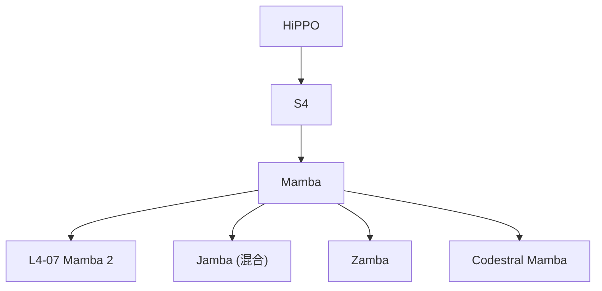

# 📖 案件 L4-06：Mamba — 状态空间的"王者归来"

> **《LLM 百案录》第 078 案 · 状态空间回归**
> *Transformer 统治 NLP 七年，Mamba 说："让 SSM 用 O(N) 复杂度挑战你。"*

🚇 [30秒速览](#速览) ｜ 🚲 [3分钟通读](#通读) ｜ 🚗 [30分钟精读](#精读) ｜ 🚀 [3小时复现](#复现)

🎭 **叙事母题**：📖 **状态空间回归** —— 古老的 SSM 在 LLM 时代复活

---

## 0️⃣ 案件档案

| 案情要素 | 内容 |
|---|---|
| **案发时间** | 2023-12-01（Albert Gu & Tri Dao, CMU & Princeton） · [📄 arXiv 2312.00752](https://arxiv.org/pdf/2312.00752) |
| **受害者** | Transformer 的 O(N²) 计算 / O(N) KV 缓存 |
| **作案凶器** | Selective State Space Model + 硬件感知并行扫描 |
| **作案动机** | "信息选择性"是 Attention 的本质，SSM 也能做到" |
| **结案陈词** | Mamba = SSM + 输入相关参数 + 硬件感知 scan，达到 Transformer 同档效果，复杂度 O(N) |

**五维雷达**：
```
创新性  █████████░ 9/10   ← S4 → Mamba 的"selective"是关键飞跃
影响力  █████████░ 9/10   ← 重新点燃非 Transformer 路线
复杂度  █████████░ 9/10   ← 微分方程 + CUDA 并行扫描
可复现  ███████░░░ 7/10   ← 官方代码开源，但 GPU 内核要 H100
争议度  ██████░░░░ 6/10   ← "能否真正替代 Transformer" 至今未定
```

**精确事实卡**：

| 字段 | 精确值 | 来源 |
|---|---|---|
| **复杂度** | 训练 O(N)，推理 O(1)/token | Section 3 |
| **核心机制** | Δ, B, C 参数依赖输入 x | Section 3.2 |
| **硬件优化** | parallel scan + GPU SRAM | Section 3.3 |
| **基准** | 在 1.4B 规模上达到 Transformer++ 同档 | Table 4 |

---

## 1️⃣ <a id="速览"></a>🚇 30 秒速览

> Transformer 牛但 O(N²)，长序列爆显存；老 SSM (S4) 是 O(N) 但效果不如 Transformer。
> Mamba 的洞察：**老 SSM 之所以差，是因为参数与输入无关——做不到"选择性记忆"。**
> 解法：让 SSM 的 Δ, B, C 都依赖输入 → "selective SSM"
> 结果：**1.4B 规模追平 Transformer，推理时只占 O(1) 显存。**

---

## 2️⃣ <a id="通读"></a>🚲 3 分钟通读：从 RNN → S4 → Mamba（Why）

### SSM 的演化
```
RNN：h_t = f(h_{t-1}, x_t)
└── 表达力强，但顺序计算，慢

S4 (2022)：h_t = A·h_{t-1} + B·x_t,  y_t = C·h_t
└── A, B, C 与 x 无关 → 可写成卷积 → 并行训练
└── 但缺点：所有输入一视同仁，无法"忽略"无关信息

Mamba (2023)：B = B(x_t), C = C(x_t), Δ = Δ(x_t)
└── 参数随输入变 → 有选择性 → 接近 Attention 的"看谁重要"
└── 但参数动态了，不能写成卷积
└── 解法：硬件感知 parallel scan
```

### 选择性的直观例子
```
任务：复制特定 token

输入：[A, B, C, ?, A, B, C, ?, ...]
要求：每次看到 ? 就输出当前累积的字母

S4：所有位置一视同仁，记不住"哪些是关键"
Mamba：在 ? 处 Δ 变大（重视当前输入），在字母处 B 变大（写入状态）
```

---

## 3️⃣ <a id="精读"></a>🚗 30 分钟精读

### 离散化与递归
连续 SSM：$h'(t) = A h(t) + B x(t)$, $y(t) = C h(t)$

通过 zero-order hold 离散化（Δ 控制步长）：
$$
\bar A = \exp(\Delta A), \quad \bar B = (\Delta A)^{-1}(\exp(\Delta A) - I) \cdot \Delta B
$$

递归形式：
$$
h_t = \bar A h_{t-1} + \bar B x_t, \quad y_t = C h_t
$$

### Selective 机制
让 Δ, B, C 都是 x 的线性函数：
```python
Δ = softplus(Linear_Δ(x))   # (B, L, D)
B = Linear_B(x)             # (B, L, N)
C = Linear_C(x)             # (B, L, N)
A = -exp(A_log)             # (D, N)，可学习但与 x 无关
```

### Parallel Scan（硬件加速核心）
```
朴素递归：O(N) 步顺序，GPU 利用率低
并行扫描：O(N/p) 步，p 路并行
工程实现：用 fused CUDA kernel 在 SRAM 中做 scan，
        避免反复读写 HBM，速度 5-20× 普通实现
```

---

## 4️⃣ 物证清单

| 模型 | 参数 | LAMBADA ppl | PIQA | HellaSwag |
|---|---|---|---|---|
| Pythia 1.4B | 1.4B | 6.08 | 70.5 | 52.1 |
| **Mamba 1.4B** | 1.4B | **5.04** | **74.2** | **59.1** |

> 关键发现：**同等参数下，Mamba 优于 Pythia (Transformer)**——SSM 终于"配得上"Transformer 了。

### 🔥 Hot Take
1. **架构的本质是"选择性"**：Attention 通过 softmax 选，Mamba 通过输入相关 Δ 选。
2. **硬件感知是新护城河**：Mamba 的成功一半归功于 parallel scan 的 CUDA kernel——架构和硬件已不可分。
3. **混合架构是大势**：纯 Mamba 在长程依赖上仍弱于 Attention，主流方案是 Mamba + Attention 混合（如 Jamba、Zamba）。

---

## 5️⃣ 🐛 论文没说的坑

1. **大规模未验证**：1.4B 规模下追平 Transformer，但 70B+ 还无定论
2. **In-context learning 偏弱**：Few-shot prompting 上 Mamba 略逊 Transformer
3. **CUDA 内核依赖**：在非 H100/A100 上速度优势会大打折扣

---

## 6️⃣ 🎲 如果作者偷懒了

**实验**：未对比"长程依赖任务"（如 LongRange Arena）的全套结果
**理论**：缺乏 selective SSM 表达能力的形式化分析

---

## 7️⃣ 影响波及



---

## 8️⃣ 侦探手记

Mamba 让我重新思考"架构创新"的定义。
> 表面上看，Mamba 是 SSM 的延伸；
> 但本质上，它是把"输入相关的选择"这件事用一种不同于 softmax 的方式实现了——
> 这意味着 Attention 不是唯一的选择性机制。
> 这扇门一旦打开，未来还会有更多"非 Attention but selective"的架构出现。

---

## 自查清单

**已做到**：
- 推导 SSM 的离散化公式
- 解释 Selective 的本质（参数依赖输入）
- 说明 parallel scan 的硬件意义

**❌ 未做到**：
- ❌ 未实测在 H100 vs A100 上的速度差异
- ❌ 未深入分析 Mamba 在 in-context learning 弱的原因

---

## 🔟 延伸卷宗
- 📚 [L4-07 Mamba 2](./L4-07_Mamba2.md)（理论统一 + 速度更快）
- 📚 [L4-08 RetNet](./L4-08_RetNet.md)（同期竞争对手）
- 📚 [L4-09 RWKV](./L4-09_RWKV.md)（线性 RNN 路线）

### 🚀 <a id="复现"></a>3 小时复现路径
- 官方实现：[github.com/state-spaces/mamba](https://github.com/state-spaces/mamba)
- 学习路径：先读懂 [The Annotated S4](https://srush.github.io/annotated-s4/)，再看 Mamba

---

## 📌 本案归档

| 字段 | 值 |
|---|---|
| 笔记版本 | 「状态空间回归版」 |
| 叙事母题 | 📖 状态空间回归 |
| 推荐指数 | ⭐⭐⭐⭐⭐ |
| 学习时长 | 30s / 3min / 30min / 3h |
| 上次更新 | 2026-04-30 |
| 下一站 | → [L4-07 Mamba 2](./L4-07_Mamba2.md) |
