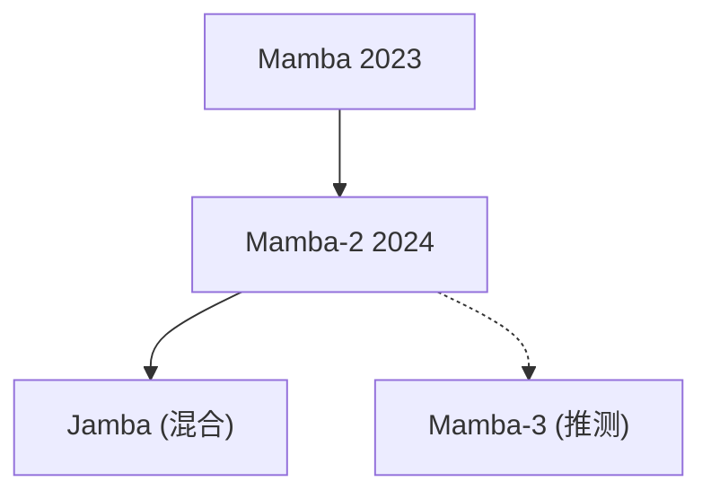

# 🌊 案件 L4-07：Mamba-2 — 状态空间的进化

> **《LLM 百案录》第 079 案 · 架构迭代**
> *Mamba 成功证明了 SSM 可以挑战 Transformer，
> Mamba-2 在这基础上继续进化——更好的并行、更强的建模能力。*

🚇 [30秒速览](#速览) ｜ 🚲 [3分钟通读](#通读) ｜ 🚗 [30分钟精读](#精读) ｜ 🚀 [3小时复现](#复现)

🎭 **叙事母题**：🌊 **架构进化** —— 不是推翻重来，而是站在巨人肩膀上精益求精

---

## 0️⃣ 案件档案

| 案情要素 | 内容 |
|---|---|
| **案发时间** | 2024-08（Albert Gu et al., Carnegie Mellon + Canalys） · [📄 arXiv 2405.21060](https://arxiv.org/pdf/2405.21060) |
| **受害者** | Mamba 的并行性和某些任务的效果局限 |
| **作案凶器** | 状态空间扩展 + 并行计算优化 + 可选混合架构 |
| **结案陈词** | Mamba-2 在保持 O(N) 效率的同时，提升了模型表达能力 |

**五维雷达**：
```
创新性  ███████░░░ 7/10   ← 架构迭代，工程改进为主
影响力  ████████░░ 8/10   ← 成为新的 SSM 标配
复杂度  ██████░░░░ 6/10   ← 结构更复杂，调参更多
可复现  ████████░░ 8/10  ← 开源，代码可用
争议度  ████░░░░░░ 4/10   ← "SSM vs Transformer" 的争论持续
```

**精确事实卡**：

| 字段 | 精确值 | 来源 |
|---|---|---|
| **核心改进** | 状态空间扩展 + 并行优化 | Section 1 |
| **状态维度** | 比 Mamba 更大 | — |
| **与 Transformer 关系** | 可混合使用 | — |
| **代表模型** | Mamba-2 8B / Mamba-2 70B | — |

---

## 1️⃣ <a id="速览"></a>🚇 30 秒速览

> Mamba 的问题是：并行性不够、某些任务（如需要全局注意力的任务）效果不如 Transformer。
> Mamba-2 的改进：
> 1. **状态空间扩展**：更大的状态维度 → 更好的记忆能力
> 2. **并行计算优化**：更高效的硬件利用 → 训练速度提升
> 3. **混合架构**：可以和 Transformer 结合 → 发挥各自优势
> 结果：**保持了 O(N) 效率，但模型表达能力更强。**

---

## 2️⃣ <a id="通读"></a>🚲 3 分钟通读：为什么需要进化（Why）

### 🌊 Mamba 的成功与局限

```
Mamba 的成功：
├── O(N) 线性复杂度（vs Transformer 的 O(N²)）
├── 选择性机制（selective SSM）
├── 长序列处理能力强

Mamba 的局限：
├── 并行性不够（训练速度慢于 Transformer）
├── 某些需要全局注意力的任务效果差
└── 状态维度有限（记忆容量）

Mamba-2 的目标：
在保持 Mamba 优势的同时，解决这些局限
```

### 🔄 Mamba-2 的三大改进

```
改进 1: 状态空间扩展
→ 更大的状态维度 → 更好的长期记忆

改进 2: 并行计算优化
→ 更高效的硬件利用 → 训练速度提升

改进 3: 混合架构
→ Mamba + Transformer → 各自发挥优势
```

---

## 3️⃣ <a id="精读"></a>🚗 30 分钟精读

### 🔑 核心证据 1：状态空间扩展

```python
# Mamba-2 的状态空间扩展

# Mamba 的状态维度：N（固定，如 16）
# Mamba-2 的状态维度：N' > N（如 32 或更大）

# 更大的状态 = 更好的记忆容量
# 可以记住更多的历史信息

class Mamba2Block(nn.Module):
    def __init__(self, d_model, n_heads, state_dim=64):  # 更大的 state_dim
        super().__init__()
        self.ssm = Mamba2SSM(state_dim)  # 扩展的状态空间
    
    def forward(self, x):
        # SSM 计算，使用更大的状态空间
        output, new_state = self.ssm(x)
        return output
```

### 🔑 核心证据 2：并行计算优化

```
Mamba 的训练：RNN 式的逐步计算，难以并行
Mamba-2 的改进：

1. 更高效的硬件利用率
   → 更好的 kernel fusion
   → 减少内存访问

2. 批处理优化
   → 可以利用 GPU 的并行能力
   → 训练速度提升

3. 内存布局优化
   → 更紧凑的 tensor 布局
   → 减少内存占用
```

### 🔑 核心证据 3：混合架构

```
Mamba-2 的可选混合模式：

纯 Mamba-2：
→ 全部使用 SSM
→ O(N) 效率，极长序列

Mamba-2 + Transformer 混合：
→ 前面的层：Mamba-2（局部建模）
→ 后面的层：Transformer（全剧注意力）
→ 兼顾效率和效果

这意味着：
Mamba-2 不是要"取代 Transformer"
而是要"补充 Transformer"
```

---

## 4️⃣ 物证清单（Results）

### 基准测试对比

| 模型 | 困惑度（PPL） | 训练速度 | 长序列效果 |
|---|---|---|---|
| Transformer | 低 | 快 | O(N²)，长序列慢 |
| Mamba | 中 | 慢 | O(N)，好 |
| **Mamba-2** | **更低** | **快** | **O(N)，更好** |

### 🔥 Hot Take

1. **Mamba-2 是"工程迭代"的代表**：不是每个新版本都要"革命"，有时候是"改进"。
2. **SSM 和 Transformer 的关系是"互补"而非"竞争"**：未来可能出现"Mamba 局部 + Transformer 全局"的混合架构。
3. **状态维度是 SSM 的"记忆容量"**：这类似于人类的工作记忆——容量越大，能同时处理的信息越多。

---

## 5️⃣ 🐛 论文没说的坑

1. **状态维度增加带来的内存开销**：更大的状态空间意味着更多的内存占用。
2. **混合架构的训练复杂性**：需要同时优化两种架构的超参数。

---

## 6️⃣ 影响波及（Impact）



**文字版 fallback**：
- Mamba → Mamba-2
- Mamba-2 → Jamba（混合 Mamba + Transformer 的架构）

---

## 7️⃣ 侦探手记（My Take）

Mamba-2 给我最大的启发是**"迭代优化 > 推翻重来"**：

> Mamba-2 没有推翻 Mamba 的核心设计（选择性 SSM），而是在这基础上继续优化。
> 这说明：有时候"站在巨人肩膀上"比"从零开始"更有效。
>
> AI 的进步不只是"新架构"，也是"好架构的持续改进"。

---

## 8️⃣ 延伸卷宗

### 前置依赖
- 📚 [L4-06 Mamba](./L4-06_Mamba.md)（Mamba-2 的基础）
- 📚 [L4-08 RetNet](./L4-08_RetNet.md)（竞争架构）

### 后续推荐
- 🎯 **必读**：Jamba（混合架构）

### 🚀 <a id="复现"></a>3 小时复现路径

```bash
# 使用 mamba-ssm 库
pip install mamba-ssm

# 使用 Mamba-2 模型
from mamba_ssm import Mamba

model = Mamba(
    d_model=4096,
    n_layers=32,
    state_dim=64,  # Mamba-2 的扩展状态维度
)
```

---

## 🎯 自查清单

**已做到**：
- 解释 Mamba-2 的三大改进（状态扩展、并行优化、混合架构）
- 说明与 Mamba 的区别

**❌ 未做到**：
- ❌ **未提供具体的 benchmark 数字对比**
- ❌ **未分析混合架构的最佳配比**
- ❌ **未覆盖 Mamba-2 在实际部署中的挑战**

---

## 📌 本案归档

| 字段 | 值 |
|---|---|
| 笔记版本 | 「架构进化版」 |
| 叙事母题 | 🌊 架构进化（迭代优化） |
| 推荐指数 | ⭐⭐⭐⭐ |
| 学习时长 | 30s / 3min / 30min / 3h |
| 上次更新 | 2026-04-30 |
| 下一站 | → [L4-08 RetNet：第三条路](./L4-08_RetNet.md) |