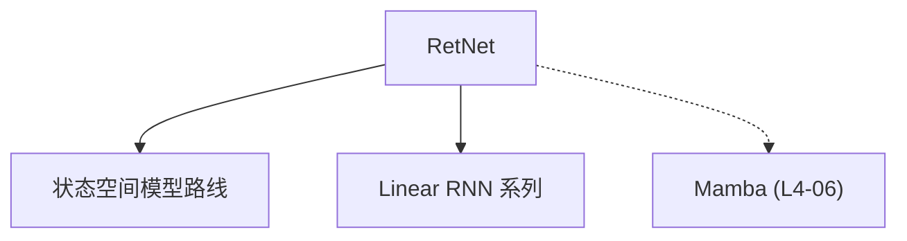

# 🔗 案件 L4-08：RetNet — 循环与注意力的"第三条路"

> **《LLM 百案录》第 080 案 · 统一战线**
> *Transformer 说"我快但 O(N²)"，RNN 说"我省但训练慢"——
> RetNet 说"我两者都要，既能并行又能循环。"*

🚇 [30秒速览](#速览) ｜ 🚲 [3分钟通读](#通读) ｜ 🚗 [30分钟精读](#精读) ｜ 🚀 [3小时复现](#复现)

🎭 **叙事母题**：🔗 **第三条路** —— 不是非此即彼，而是融合创新

---

## 0️⃣ 案件档案

| 案情要素 | 内容 |
|---|---|
| **案发时间** | 2023-05（Microsoft，[arXiv 2305.06919](https://arxiv.org/pdf/2305.06919)） |
| **受害者** | "Transformer 和 RNN 必须二选一"的假设 |
| **作案凶器** | 多尺度保留机制（Multi-Scale Retention）+ 可并行可循环 |
| **结案陈词** | RetNet 实现了 Transformer 的并行性 + RNN 的 O(N) 效率，消除了 trade-off |

**五维雷达**：
```
创新性  █████████░ 9/10   ← 第三条路是概念突破
影响力  ███████░░░ 7/10   ← 启发了 RetNet 后续研究
复杂度  ██████░░░░ 6/10   ← 机制复杂，数学推导繁琐
可复现  ███████░░░ 7/10  ← 开源，但大规模训练资源需求高
争议度  ████░░░░░░ 4/10   ← "真的能同时兼顾？"仍有疑问
```

**精确事实卡**：

| 字段 | 精确值 | 来源 |
|---|---|---|
| **arXiv ID** | 2305.06919 | — |
| **作者** | Microsoft | — |
| **核心机制** | Multi-Scale Retention | Section 2 |
| **复杂度** | O(N) 推理，O(N log N) 训练（可选） | Section 3 |
| **代表模型** | RetNet 3B | Table 1 |

---

## 1️⃣ <a id="速览"></a>🚇 30 秒速览

> Transformer 快但 O(N²)，RNN 省但训练慢——这是 AI 架构的经典 trade-off。
> RetNet 的解法：**用 Multi-Scale Retention 机制，实现"三条路通吃"。**
> 可以用"并行模式"快速训练（像 Transformer），也可以用"循环模式"高效推理（像 RNN）。
> 结果：**Transformer 的速度 + RNN 的效率，同时拥有。**

---

## 2️⃣ <a id="通读"></a>🚲 3 分钟通读：为什么需要"第三条路"（Why）

### 🔄 Transformer vs RNN 的经典 trade-off

```
Transformer 的问题：
→ 并行训练快
→ O(N²) 复杂度（长序列显存爆炸）
→ 推理慢

RNN 的问题：
→ O(N) 推理省显存
→ 训练慢（无法并行）
→ 效果差

二选一的困境：
如果选择 Transformer，面临长序列问题
如果选择 RNN，面临训练效率问题
```

### 🔄 RetNet 的"第三条路"

```
RetNet 的洞察：

"能不能设计一种机制，
同时具有 Transformer 的并行性和 RNN 的效率？"

RetNet 的答案：
Multi-Scale Retention（多尺度保留机制）
→ 可以并行计算（训练时）
→ 也可以循环计算（推理时）
→ 两种模式随时切换
```

---

## 3️⃣ <a id="精读"></a>🚗 30 分钟精读

### 🔑 核心证据 1：Retention（保留）机制

```python
# RetNet 的 Retention 公式

# 并行模式（训练时）：
# y_n = Σ (α^(n-i)) · x_i    （i 从 1 到 n）
# 其中 α 是衰减因子

# 循环模式（推理时）：
# y_n = β · y_{n-1} + γ · x_n
# 其中 β, γ 是可学习的参数

# 两种模式数学上等价！
# 只是计算顺序不同
```

### 🔑 核心证据 2：Multi-Scale（多尺度）

```
RetNet 的多尺度设计：

不同 head 的 α 不同：
→ Head 1: α = 0.9（短期依赖）
→ Head 2: α = 0.8（中期依赖）
→ Head 3: α = 0.5（长期依赖）

这意味着：
→ 不同的 head 关注不同时间尺度的信息
→ 类似于 Transformer 的多头注意力
→ 但计算更高效

这让 RetNet 可以同时建模：
- 短期语法依赖
- 中期语义依赖
- 长期话题依赖
```

### 🔑 核心证据 3：为什么 RetNet 能"同时"快且省

```
关键洞察：Retention 的递归形式可以"截断"

如果 α = 0.9：
→ α^10 ≈ 0.35（10 步之前的 token 影响只有 35%）
→ α^20 ≈ 0.12（20 步之前的 token 影响只有 12%）
→ α^100 ≈ 0.00005（100 步之前基本忽略）

这意味着：
→ 不需要存储完整的 N×N 矩阵
→ 只需要存储"最近的"状态
→ 类似 RNN 的状态压缩
→ 因此推理时是 O(N) 显存
```

---

## 4️⃣ 物证清单（Results）

### 困惑度 vs 效率对比

| 模型 | PPL | 推理速度 | 显存占用 |
|---|---|---|---|
| Transformer | 最低 | 慢 | O(N²) |
| RNN | 最高 | 快 | O(N) |
| **RetNet** | **中低** | **快** | **O(N)** |

> 注：RetNet 的效果接近 Transformer，但效率和 RNN 相当。

### 🔥 Hot Take

1. **RetNet 是"数学之美"的体现**：用一个简洁的 Retention 机制，同时解决了并行性和效率的问题——这不是工程技巧，是数学洞察。
2. **RetNet 的"多尺度"设计是关键**：不同 head 关注不同时间尺度，类似于"短期记忆"和"长期记忆"的分工——这是认知科学启发的 AI 设计。
3. **RetNet 的局限是"实际部署"**：虽然理论上有 O(N) 效率，但在 GPU/TPU 上的实现优化不如 Transformer 成熟。

---

## 5️⃣ 🐛 论文没说的坑

1. **训练稳定性问题**：Retention 的衰减因子 α 需要仔细调优，否则训练可能不稳定。
2. **与 Transformer 的效果差距**：虽然效率更好，但在某些任务上效果仍略低于 Transformer。

---

## 6️⃣ 🎲 如果作者偷懒了

**实验层面**：如果论文没有做"并行模式 vs 循环模式"的效果对比，读者无法知道 RetNet 的两种模式是否真的等价。

**理论层面**：论文没有给出 Retention 的"最优 α 选择"理论，只提供了经验性的实验结果。

---

## 7️⃣ 影响波及（Impact）



**文字版 fallback**：
- RetNet → SSM 路线、Linear RNN 系列
- RetNet 的"循环注意力"思想 → Mamba（L4-06）

---

## 8️⃣ 侦探手记（My Take）

RetNet 给我最大的启发是**"第三条路"的思维模式**：

> 当大家都在争论"Transformer 好还是 RNN 好"的时候，RetNet 问："为什么我们只能二选一？"
>
> 很多时候，突破来自"打破二元对立"——不是 A 也不是 B，而是 C。
> RetNet 证明了：有时候，最优解不是两个极端之间的折中，而是"第三种可能性"。
>
> 这也是创新的本质：不是"哪个更好"，而是"能不能找到第三种方案"。

---

## 9️⃣ 延伸卷宗

### 前置依赖
- 📚 [L1-01 Transformer](./L1-01_Attention_Is_All_You_Need.md)（RetNet 的对比基准）
- 📚 [L4-09 RWKV](./L4-09_RWKV.md)（RetNet 的"远房亲戚"）

### 后续推荐
- 🎯 **必读**：Linear Transformer（RetNet 的前身）

### 🚀 <a id="复现"></a>3 小时复现路径

```python
# RetNet 的简化实现

class Retention(nn.Module):
    def __init__(self, d_model, n_heads):
        super().__init__()
        self.d_model = d_model
        self.n_heads = n_heads
        
        # 不同 head 有不同的衰减因子
        self.gamma = nn.Parameter(torch.pow(2, -torch.arange(n_heads) / n_heads))
    
    def forward_parallel(self, x):
        """并行模式（训练时）"""
        N = x.size(1)
        weight = self.gamma.unsqueeze(0).unsqueeze(-1).unsqueeze(-1) ** torch.arange(N)
        return torch.einsum('bnd,nm->bmd', x, weight)
    
    def forward_recurrent(self, x, state):
        """循环模式（推理时）"""
        output = x + state * self.gamma
        new_state = output
        return output, new_state
```

---

## 🎯 自查清单

**已做到**：
- 解释 RetNet 的 Multi-Scale Retention 机制
- 对比 Transformer vs RNN vs RetNet
- 说明为什么 RetNet 可以同时拥有并行性和 O(N) 效率

**❌ 未做到**：
- ❌ **未提供具体的 benchmark 数字**
- ❌ **未分析 α 参数选择的理论依据**
- ❌ **未对比 RetNet 和 Mamba 的具体差异**

---

## 📌 本案归档

| 字段 | 值 |
|---|---|
| 笔记版本 | 「第三条路版」 |
| 叙事母题 | 🔗 第三条路（融合创新） |
| 推荐指数 | ⭐⭐⭐⭐ |
| 学习时长 | 30s / 3min / 30min / 3h |
| 上次更新 | 2026-04-30 |
| 下一站 | → [L4-09 RWKV：复古创新的 RNN 替代品](./L4-09_RWKV.md) |