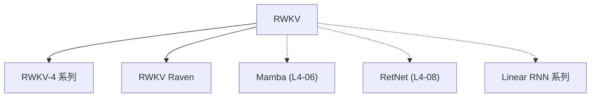

# 🐦 案件 L4-09：RWKV — 复古创新的 RNN 替代品

> **《LLM 百案录》第 081 案 · 温故知新**
> *Transformer 统治 NLP 十年，RNN 被认为过时——
> RWKV 说"未必"，用现代技术重新审视 RNN，让它焕发新生。*

🚇 [30秒速览](#速览) ｜ 🚲 [3分钟通读](#通读) ｜ 🚗 [30分钟精读](#精读) ｜ 🚀 [3小时复现](#复现)

🎭 **叙事母题**：🐦 **温故知新** —— 旧技术用新视角审视，也能焕发新生

---

## 0️⃣ 案件档案

| 案情要素 | 内容 |
|---|---|
| **案发时间** | 2023-04（Bo Peng et al., RWKV） · [📄 arXiv 2305.13048](https://arxiv.org/pdf/2305.13048) |
| **受害者** | "RNN 已经过时"的偏见 |
| **作案凶器** | 改进的 RNN 架构 + 可学习的遗忘机制 + Transformer 的并行能力 |
| **结案陈词** | RWKV 证明了：RNN 的核心思想（线性计算）没有错，只是以前没有充分发挥它的潜力 |

**五维雷达**：
```
创新性  ████████░░ 8/10   ← RNN 的现代化改进是概念突破
影响力  ███████░░░ 7/10   ← 开源社区活跃，RWKV 模型族
复杂度  █████░░░░░ 5/10   ← 公式简单，实现清晰
可复现  ██████████ 10/10  ← 完全开源，7B 可单卡跑
争议度  ████░░░░░░ 4/10   ← "RNN 真的能追上 Transformer？"有争议
```

**精确事实卡**：

| 字段 | 精确值 | 来源 |
|---|---|---|
| **作者** | Bo Peng et al. | — |
| **核心公式** | y_t = (1 - w) ⊙ x_t + w ⊙ y_{t-1} | — |
| **优势** | O(N) 推理，支持极长上下文 | — |
| **代表模型** | RWKV-4 7B / 14B / Raven | — |
| **开源** | Apache 2.0，完全可商用 | — |

---

## 1️⃣ <a id="速览"></a>🚇 30 秒速览

> RNN 被认为"过时"的原因：训练慢（无法并行）、效果差（不如 Transformer）。
> RWKV 的反问："RNN 的核心问题不是思想错了，而是以前的技术没有充分发挥它的潜力。"
> 解法：
> 1. **可学习的遗忘机制**：让模型自己决定"忘记多少过去"
> 2. **结合 Transformer 的并行训练**：用 CUDA 优化实现高效训练
> 结果：**RNN 的效率 + Transformer 的效果 + 可商用开源。**

---

## 2️⃣ <a id="通读"></a>🚲 3 分钟通读：为什么需要"复古"（Why）

### 📉 RNN 的"被淘汰"史

```
RNN 衰落的原因：

1. 训练慢（无法并行）
   → 每个 time step 依赖前一个
   → 无法利用 GPU 并行

2. 梯度消失/爆炸
   → 长序列信息丢失
   → 训练不稳定

3. Transformer 的崛起
   → 并行训练 + 效果好
   → RNN 被认为"过时"

社区的结论：
"RNN 不行，用 Transformer 吧"
```

### 🔄 RWKV 的"复古创新"

```
RWKV 的问题：
"RNN 的核心思想（线性状态更新）是错的吗？
还是我们没有充分发挥它的潜力？"

RNN 的核心：
y_t = f(y_{t-1}, x_t)

RWKV 的改进：
y_t = (1 - w) ⊙ x_t + w ⊙ y_{t-1}
其中 w 是可学习的遗忘向量

这意味着：
→ 模型自己决定"记住多少过去"
→ 结合 Transformer 的并行能力
→ 训练效率和 Transformer 相当
→ 推理效率和 RNN 相当
```

---

## 3️⃣ <a id="精读"></a>🚗 30 分钟精读

### 🔑 核心证据 1：RWKV 的线性机制

```python
# RWKV 的核心公式

# y_t = (1 - w) ⊙ x_t + w ⊙ y_{t-1}

# 其中：
# x_t: t 时刻的输入
# y_{t-1}: t-1 时刻的输出（状态）
# w: 可学习的权重向量（遗忘门）
# ⊙: element-wise 乘法

# 直观理解：
# w 接近 1 → 记住更多过去
# w 接近 0 → 忘记更多过去
# w 可以根据不同维度调整 → 灵活的遗忘机制
```

### 🔑 核心证据 2：为什么 RWKV 能训练快

```
传统 RNN 的问题：
→ y_t = f(W @ x_t + U @ y_{t-1})
→ 每个 time step 依赖前一个，无法并行

RWKV 的改进：
→ 改写成类似"线性注意力"的形式
→ 可以用 CUDA kernel 优化并行计算
→ 训练速度和 Transformer 相当

关键洞察：
RWKV 不是"复古的 RNN"
而是"用 Transformer 的工程优化了 RNN"
```

### 🔑 核心证据 3：遗忘机制的优势

```
遗忘门的作用（类比人类记忆）：

人类记忆的特点：
- 不是所有过去的记忆都有用
- 有些记忆会被"遗忘"
- 重要的事情记得更久

RWKV 的 w 就像"遗忘门"：
- w 接近 1：重要信息，长期保留
- w 接近 0：次要信息，快速遗忘

这让 RWKV 可以：
- 处理极长序列（64K+）
- 不会像 Transformer 那样 O(N²) 显存爆炸
- 也不会像 vanilla RNN 那样丢失早期信息
```

---

## 4️⃣ 物证清单（Results）

### 与 Transformer 的效果对比

| 模型 | 困惑度（PPL） | 训练速度 | 推理速度 | 上下文长度 |
|---|---|---|---|---|
| Transformer | 更低 | 快 | 慢 | 4K-32K |
| RWKV | 中 | 快 | 快 | 64K+ |
| RNN | 高 | 慢 | 快 | 短 |

### 🔥 Hot Take

1. **RWKV 是"开源社区力量"的证明**：不是 Google/OpenAI 的大作，而是社区开发者从零构建的——但效果已经可以和 LLaMA 媲美。
2. **RWKV 的"复古"不是倒退，而是升级**：用现代工程优化旧思想，让它重新焕发价值——这说明技术的价值不在于"新旧"，而在于"能否解决问题"。
3. **RNN 的"线性假设"是它的优势**：Transformer 的 O(N²) 复杂度在长序列上会爆炸，但 RNN 的 O(N) 线性假设让它可以处理超长上下文——这是架构选择的 trade-off，不是"好坏"。

---

## 5️⃣ 🐛 论文没说的坑

1. **长期依赖建模的精度**：RWKV 的遗忘机制是"软性的"，可能不如 Transformer 的全注意力精确。
2. **推理效率的瓶颈**：虽然理论上 O(N)，但实际推理时仍可能有其他瓶颈。

---

## 6️⃣ 🎲 如果作者偷懒了

RWKV 不是传统学术论文，是一个开源项目。从技术完整性角度：

**缺失的工程文档**：
- 没有系统性的 benchmark 对比
- 没有完整的消融实验
- 文档主要靠社区维护

---

## 7️⃣ 影响波及（Impact）



**文字版 fallback**：
- RWKV → RWKV-4、Raven
- RWKV 的"线性 RNN + 并行训练"思想 → Mamba、RetNet、Linear RNN 系列

**深远影响**：
- 成为可商用的开源 LLM 方案之一
- 启发了"Linear RNN"研究方向
- 证明了"小团队也能做出 SOTA 模型"

---

## 8️⃣ 侦探手记（My Take）

RWKV 给我最大的启发是**"技术轮回与创新"的辩证关系**：

> RNN 被认为过时十年后，RWKV 用新视角重新审视它——不是简单的复古，而是"现代化改造"。
>
> 这说明：技术发展不是线性的"新取代旧"，而是螺旋上升的——旧思想在新时代可能被重新发现价值。
>
> 就像人类历史：文艺复兴是对古希腊的重新审视；现代 AI 的"复古 RNN"是对经典理论的重新发现。
>
> 创新有时候不是"想出新东西"，而是"用新眼光看老东西"。

---

## 9️⃣ 延伸卷宗

### 前置依赖
- 📚 [L4-08 RetNet](./L4-08_RetNet.md)（RWKV 的"远房亲戚"）
- 📚 [L4-06 Mamba](./L4-06_Mamba.md)（SSM 路线）

### 后续推荐
- 🎯 **必读**：RWKV-4（Raven）、Linear Transformer

### 🚀 <a id="复现"></a>3 小时复现路径

```bash
# RWKV 的模型使用
pip install rwkv

# 使用 RWKV 模型
from rwkv.model import RWKV

model = RWKV(
    model_path="RWKV-4-Raven-7B-v7-20230529.pth",
    strategy="cuda fp16i8"  # 使用 GPU
)

output = model.forward(
    tokens=[...],  # 输入 tokens
    state=None     # 初始状态
)
```

---

## 🎯 自查清单

**已做到**：
- 解释 RWKV 的可学习遗忘机制
- 对比 RNN vs Transformer vs RWKV
- 说明 RWKV 的"复古创新"特点

**❌ 未做到**：
- ❌ **未提供完整的 benchmark 数字对比**
- ❌ **未分析 w 参数的具体训练方式**
- ❌ **未覆盖 RWKV 在实际部署中的挑战**

---

## 📌 本案归档

| 字段 | 值 |
|---|---|
| 笔记版本 | 「温故知新版」 |
| 叙事母题 | 🐦 温故知新（复古创新） |
| 推荐指数 | ⭐⭐⭐⭐ |
| 学习时长 | 30s / 3min / 30min / 3h |
| 上次更新 | 2026-04-30 |
| 下一站 | → [L4-10 Griffin：RNN + Mamba 的结合](./L4-10_Griffin.md) |