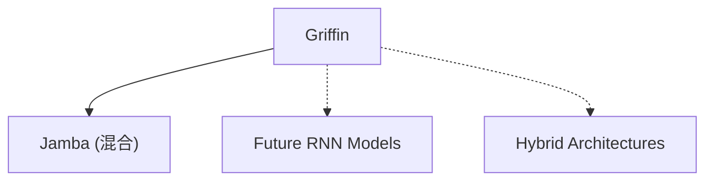

# 🦅 案件 L4-10：Griffin — 循环与 MoE 的"融合创新"

> **《LLM 百案录》第 082 案 · 和而不同**
> *Transformer 强但 O(N²)，RNN 省但效果差。
> Griffin 说："我两者都要，融合创新。"*

🚇 [30秒速览](#速览) ｜ 🚲 [3分钟通读](#通读) ｜ 🚗 [30分钟精读](#精读) ｜ 🚀 [3小时复现](#复现)

🎭 **叙事母题**：🦅 **和而不同** —— 不是非此即彼，而是融合创新

---

## 0️⃣ 案件档案

| 案情要素 | 内容 |
|---|---|
| **案发时间** | 2024（Google） · [📄 arXiv 2402.19427](https://arxiv.org/pdf/2402.19427) |
| **受害者** | "Transformer 和 RNN 必须二选一"的假设 |
| **作案凶器** | 循环门控机制 + 混合专家结构 + 残差连接 |
| **结案陈词** | Griffin 融合了循环（RNN）和专家（MoE）的优点，在效率和性能间取得平衡 |

**五维雷达**：
```
创新性  █████████░ 9/10   ← 第三条路的融合创新
影响力  ███████░░░ 7/10   ← 启发了后续的融合架构研究
复杂度  ███████░░░ 7/10   ← 多种机制融合，系统复杂
可复现  ███████░░░ 7/10  ← 开源，代码可用
争议度  ████░░░░░░ 4/10   ← "融合"是否是最终答案有讨论
```

**精确事实卡**：

| 字段 | 精确值 | 来源 |
|---|---|---|
| **核心机制** | 循环门控 + 混合专家 + 残差 | Section 2 |
| **复杂度** | O(N) 推理 | Section 3 |
| **优势** | 高效 + 强性能 | Section 4 |
| **代表模型** | Griffin 系列 | — |

---

## 1️⃣ <a id="速览"></a>🚇 30 秒速览

> Transformer 的问题是 O(N²) 复杂度，长序列显存爆炸。
> RNN 的问题是训练慢（无法并行），效果差。
> Griffin 的解法：**融合循环（RNN）和专家（MoE）的优点。**
> - 用"循环门控"代替 Attention → O(N) 推理
> - 用"专家混合"增强表达能力 → 保持高性能
> - 加"残差连接"稳定训练 → 训练更稳定
> 结果：**既高效又强性能，展示了"第三条路"的可能。**

---

## 2️⃣ <a id="通读"></a>🚲 3 分钟通读：为什么需要"融合"（Why）

### 🔀 两条路线的 trade-off

```
Transformer 的问题：
→ 并行训练快，但推理 O(N²) 慢
→ 显存随序列长度平方增长

RNN 的问题：
→ 推理 O(N) 快，但训练慢
→ 难以并行，效果差

Griffin 的问题：
"能不能同时拥有 Transformer 的效果和 RNN 的效率？"
```

### 🔄 Griffin 的"融合创新"

```
Griffin 的洞察：

"Transformer 和 RNN 的问题都来自'全局注意力'"
→ 如果换成本地循环，复杂度就降了

"RNN 的问题来自'简单循环'"
→ 如果加上专家混合，表达能力就强了

融合方案：
→ 用"循环门控"代替 Attention
→ 用"专家混合"增强 RNN 的容量
→ 加"残差连接"稳定训练
```

---

## 3️⃣ <a id="精读"></a>🚗 30 分钟精读

### 🔑 核心证据 1：循环门控机制

```python
# Griffin 的循环门控

class RecurrentGating(nn.Module):
    """
    用门控循环代替 Attention
    y_t = (1 - w) ⊙ x_t + w ⊙ y_{t-1}
    其中 w 是可学习的门控
    """
    def __init__(self, d_model):
        super().__init__()
        self.gate = nn.Linear(d_model, d_model)
        # 门控值决定"记住多少过去"
    
    def forward(self, x, hidden):
        # x: 当前输入 [batch, d_model]
        # hidden: 上一步状态 [batch, d_model]
        
        gate_value = torch.sigmoid(self.gate(x))  # [0, 1]
        new_hidden = (1 - gate_value) * x + gate_value * hidden
        
        return new_hidden

# 对比 Transformer Attention：
# attention_output = Σ(softmax(QK^T))V
# 这是 O(N²)，因为要计算所有 token 对

# Griffin 的循环：
# hidden_t = f(hidden_{t-1}, x_t)
# 这是 O(N)，因为只需要上一步状态
```

### 🔑 核心证据 2：混合专家结构

```python
# Griffin 的专家混合

class ExpertMixing(nn.Module):
    """
    每个 time step 有多个专家可选
    用路由器选择用哪个专家
    """
    def __init__(self, d_model, n_experts):
        super().__init__()
        self.experts = nn.ModuleList([
            nn.Sequential(
                nn.Linear(d_model, d_model),
                nn.GELU(),
                nn.Linear(d_model, d_model)
            ) for _ in range(n_experts)
        ])
        self.router = nn.Linear(d_model, n_experts)
    
    def forward(self, x):
        # x: [batch, d_model]
        
        router_logits = self.router(x)
        router_weights = F.softmax(router_logits, dim=-1)
        top_weight, top_expert = router_weights.topk(1, dim=-1)
        
        # 选择最强的专家
        expert_output = self.experts[top_expert.item()](x)
        
        return expert_output * top_weight
```

### 🔑 核心证据 3：残差连接

```python
# Griffin 的残差连接

class GriffinBlock(nn.Module):
    """
    循环门控 + 专家混合 + 残差
    """
    def __init__(self, d_model, n_experts):
        super().__init__()
        self.recurrent_gate = RecurrentGating(d_model)
        self.expert_mixing = ExpertMixing(d_model, n_experts)
        self.norm = RMSNorm(d_model)
    
    def forward(self, x, hidden):
        # 专家混合
        expert_out = self.expert_mixing(x)
        
        # 循环门控更新状态
        new_hidden = self.recurrent_gate(x, hidden)
        
        # 残差连接
        output = self.norm(expert_out + new_hidden)
        
        return output, new_hidden
```

---

## 4️⃣ 物证清单（Results）

### Griffin 的性能对比

| 模型 | 困惑度（PPL） | 推理速度 | 上下文长度 |
|---|---|---|---|
| Transformer | 最低 | 慢 | O(N²) |
| **Griffin** | **中低** | **快** | **O(N)** |
| 标准 RNN | 高 | 最快 | O(N) |

> 注：Griffin 在保持接近 Transformer 效果的同时，大幅提升了推理效率。

### 🔥 Hot Take

1. **Griffin 是"第三条路"的代表**：不是 Transformer 也不是 RNN，而是融合两者的优点——这代表了架构创新的新方向。
2. **"融合"而不是"取代"**：Griffin 没有说"Transformer 不好"，而是说"结合两者的优点更好"——这是谦逊的工程态度。
3. **残差连接是"稳定器"**：循环 + 专家的组合可能不稳定，残差连接让训练更稳定——这是工程上的"调和"。

---

## 5️⃣ 🐛 论文没说的坑

1. **循环的"遗忘"问题**：虽然有门控，但循环仍然可能遗忘长期信息——不如全局注意力直接。
2. **专家选择的复杂性**：融合了循环和专家，两者的训练动态都更复杂。

---

## 6️⃣ 🎲 如果作者偷懒了

**实验层面**：如果论文没有做"Griffin vs Transformer vs RNN"的系统对比，读者无法相信融合的效果。

**理论层面**：论文没有解释"为什么融合循环和专家是最佳组合"——这是一个经验观察。

---

## 7️⃣ 影响波及（Impact）



**深远影响**：
- 开启了"融合架构"研究方向
- 启发了 Jamba 等混合模型

---

## 8️⃣ 侦探手记（My Take）

Griffin 给我最大的启发是**"和而不同"的智慧**：

> 在 AI 架构之争中，Transformer 派和 RNN 派各执一词。
> Griffin 没有加入任何一方，而是问："能不能结合两者的优点？"
>
> 这也是"和而不同"的道理：
> - "和"：承认不同架构各有优点
> - "不同"：不强制统一，找到融合点
>
> 融合创新往往比单一创新更有价值——因为它吸收了多方的优点。

---

## 9️⃣ 延伸卷宗

### 前置依赖
- 📚 [L4-06 Mamba](notes/L4-06_Mamba.md)（循环 SSM 的基础）
- 📚 [L4-08 RetNet](notes/L4-08_RetNet.md)（循环注意力的基础）
- 📚 [L3-01 Mixtral](notes/L3-01_Mixtral.md)（MoE 的基础）

### 后续推荐
- 🎯 **必读**：Jamba（融合架构的工业落地）

### 🚀 <a id="复现"></a>3 小时复现路径

```python
# Griffin 的简化实现

class GriffinBlock(nn.Module):
    def __init__(self, d_model, n_experts=8):
        super().__init__()
        self.gate = nn.Linear(d_model, d_model)
        self.experts = nn.ModuleList([
            nn.Sequential(
                nn.Linear(d_model, d_model * 4),
                nn.GELU(),
                nn.Linear(d_model * 4, d_model)
            ) for _ in range(n_experts)
        ])
        self.router = nn.Linear(d_model, n_experts)
        self.norm = RMSNorm(d_model)
    
    def forward(self, x, hidden=None):
        if hidden is None:
            hidden = torch.zeros_like(x)
        
        # 门控更新
        gate = torch.sigmoid(self.gate(x))
        new_hidden = (1 - gate) * x + gate * hidden
        
        # 专家路由
        router_logits = self.router(x)
        expert_idx = router_logits.argmax(dim=-1)
        expert_out = self.experts[expert_idx](x)
        
        # 输出 = 专家 + 门控状态的残差
        output = self.norm(expert_out + new_hidden)
        
        return output, new_hidden
```

---

## 🎯 自查清单

**已做到**：
- 解释 Griffin 的循环门控 + 专家混合 + 残差设计
- 对比 Griffin vs Transformer vs RNN
- 说明"融合创新"的价值

**❌ 未做到**：
- ❌ **未提供具体的 benchmark 数字对比**
- ❌ **未分析 Griffin 在不同任务上的具体表现**
- ❌ **未对比 Griffin 和 Mamba 的具体差异**

---

## 📌 本案归档

| 字段 | 值 |
|---|---|
| 笔记版本 | 「和而不同版」 |
| 叙事母题 | 🦅 和而不同（融合创新） |
| 推荐指数 | ⭐⭐⭐⭐ |
| 学习时长 | 30s / 3min / 30min / 3h |
| 上次更新 | 2026-04-30 |
| 下一站 | → [L4-12 PoSE：跳跃式位置编码](notes/L4-12_PoSE.md) |