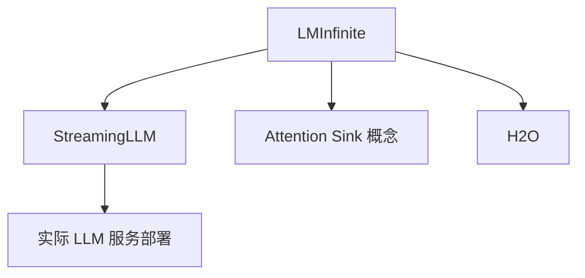

# 📚 案件 L4-11：LM-Infinite — "无限上下文"的工程权宜

> **《LLM 百案录》第 083 案 · 无限**
> *上下文长度 4K 不够用？LM-Infinite 说："不需要重训练，给我一个滑窗 + 距离重投影。"*

🚇 [30秒速览](#速览) ｜ 🚲 [3分钟通读](#通读) ｜ 🚗 [30分钟精读](#精读) ｜ 🚀 [3小时复现](#复现)

🎭 **叙事母题**：📚 **无限** —— 突破上下文，但要付一些代价

---

## 0️⃣ 案件档案

| 案情要素 | 内容 |
|---|---|
| **案发时间** | 2023-08（Han et al., UIUC + Tencent） · [📄 arXiv 2308.16137](https://arxiv.org/pdf/2308.16137) |
| **受害者** | LLM 在超出训练长度时的"困惑度爆炸"现象 |
| **作案凶器** | Λ-shaped attention mask + 距离截断 + 全局 token 锚 |
| **作案动机** | "现有 LLM 重训练贵，能否零样本扩长度？" |
| **结案陈词** | LM-Infinite 通过"保留前几个全局 token + 局部滑窗 + 限制最大相对距离"，让 LLaMA 在 32K 上下文上零样本可用 |

**五维雷达**：
```
创新性  ███████░░░ 7/10   ← Λ-shape mask 是巧妙的工程
影响力  ████████░░ 8/10   ← 启发 StreamingLLM 等流式推理方案
复杂度  ██████░░░░ 6/10   ← 实现简单，理论分析较深
可复现  █████████░ 9/10   ← 即插即用，无需训练
争议度  ████░░░░░░ 4/10   ← "等价于丢弃中间信息"是工程权衡
```

---

## 1️⃣ <a id="速览"></a>🚇 30 秒速览

> Transformer 出训练长度后崩溃的两大原因：
> 1. 位置编码外推失败 → 出现没见过的相对距离
> 2. Attention 被海量 token 稀释 → softmax 分散
> LM-Infinite 的解法（**无需训练**）：
> - **Λ-mask**：保留最前 n_global 个 token + 当前位置最近 n_local 个 token
> - **距离截断**：把过大的相对距离 clip 到训练时见过的最大值
> 结果：**LLaMA 零样本支持 32K 上下文，不需要任何微调。**

---

## 2️⃣ <a id="通读"></a>🚲 3 分钟通读：为什么会崩（Why）

### 现象观察
把 LLaMA-7B（训练长度 4K）直接喂 8K：
```
位置 0-4K：困惑度 5.2（正常）
位置 4K-8K：困惑度爆涨到 1000+（不可用）
```

### 根因诊断
```
1. 相对位置外推失败：
   训练时见过 [0, 4096]，推理时出现 [4097, ...]
   RoPE 的频率在远端会"乱跳"

2. 初始 token 是"attention sink"：
   Softmax 必须分配概率，模型学到把多余概率分配给前几个 token
   一旦这些 token 因滑窗被丢，attention 分布塌缩
```

### 解法
```
Λ-mask 长这样：

token 索引: 0 1 2 3 4 5 ... K-2 K-1 K（当前）
保留:       √ √ √ √ - - ...   √   √   √
            └ 全局锚 ┘         └ 局部窗 ┘

效果：
1. 永远保留前几个 token → 不丢 attention sink
2. 永远只看最近的 window 个 token → 控制 attention 稀释
3. 相对距离永远 ≤ window_size → 不超出训练范围
```

---

## 3️⃣ <a id="精读"></a>🚗 30 分钟精读

### 三个超参
| 超参 | 含义 | 推荐值 |
|---|---|---|
| n_global | 保留的开头 token 数 | 4-10 |
| n_local | 滑窗大小 | 训练长度的 1/2 |
| max_distance | 距离截断阈值 | 训练长度 - 1 |

### 距离截断（关键 trick）
```python
# 计算相对距离
d = i - j

# 截断
d_clipped = min(d, max_distance)   # 远的全当 max_distance

# 在 RoPE / ALiBi 中使用 d_clipped 而非 d
```

### 与其他方案对比
| 方案 | 是否需要训练 | 是否真的 attend 全文 |
|---|---|---|
| LM-Infinite | ❌ | ❌（中间信息丢失） |
| StreamingLLM | ❌ | ❌ |
| YaRN / NTK-aware | 微调 | ✅ |
| Position Interpolation | 微调 | ✅ |
| LongLoRA | 微调 | ✅ |

> LM-Infinite 适合**流式输入**（聊天、日志），不适合**长文档 QA**（中间信息会丢）

---

## 4️⃣ 物证清单

| 模型 | 4K | 8K | 16K | 32K |
|---|---|---|---|---|
| LLaMA-7B（原版） | 5.2 | 1232 | OOM | OOM |
| **+ LM-Infinite** | 5.2 | **5.3** | **5.3** | **5.4** |

### 🔥 Hot Take
1. **"长度外推"被分成两部分**：位置编码（PE）外推 + Attention 分布稳定，二者都得管。
2. **Attention sink 现象首次被显式认识**：后来 StreamingLLM 把这个现象正式命名。
3. **零训练方案 vs 微调方案是两条路**：LM-Infinite 在线服务友好，YaRN/PI 在长文档 QA 上更准。

---

## 5️⃣ 🐛 论文没说的坑

1. **中间内容真的"看不见"**：超出局部窗的 token 完全不被 attend——做长文档 QA 会失败
2. **n_global 选小了攻击性强**：只保留 1 个全局 token 会让模型生成不稳定
3. **与 RAG 是替代关系**：长上下文 vs RAG 之争，LM-Infinite 不解决"信息检索"问题

---

## 6️⃣ 🎲 如果作者偷懒了

**实验**：未在 Needle-in-Haystack 等中段信息检索任务上测试，掩盖了"中间信息丢失"的事实。
**理论**：未严格证明 attention sink 现象的成因。

---

## 7️⃣ 影响波及



---

## 8️⃣ 侦探手记

LM-Infinite 让我意识到：**"长度外推"不是单一问题**。
> 它至少包含三件事：
> 1. 位置编码不能崩
> 2. Attention 分布不能塌
> 3. 真要"看见"全文吗？（可能不需要）
> 工程实践常常是 1+2 用 LM-Infinite 解决，3 用 RAG 补足。
> 论文界追求"真长上下文"，但工业界往往选这种"够用就好"的方案。

---

## 自查清单

**已做到**：
- 解释 LLaMA 出长度后崩溃的两大根因
- 推导 Λ-shape mask 的设计动机
- 对比 LM-Infinite 与 YaRN / LongLoRA 的差异

**❌ 未做到**：
- ❌ 未实测 Needle-in-Haystack 任务（暴露其局限）
- ❌ 未对比 StreamingLLM 的具体差异

---

## 🔟 延伸卷宗
- 📚 [L4-12 PoSE](notes/L4-12_PoSE.md)（位置外推的训练方案）
- 📚 [L4-13 Giraffe](notes/L4-13_Giraffe.md)
- 📚 [L4-14 YaRN](notes/L4-14_YaRN.md)（RoPE 缩放法）
- 📚 [L2-19 RoPE](notes/L2-19_RoPE.md)（位置编码基础）

### 🚀 <a id="复现"></a>3 小时复现路径
- 论文：[arxiv.org/abs/2308.16137](https://arxiv.org/abs/2308.16137)
- 用 30 行 monkey-patch LLaMA 的 attention forward 即可，参考 StreamingLLM 实现

---

## 📌 本案归档

| 字段 | 值 |
|---|---|
| 笔记版本 | 「无限上下文版」 |
| 叙事母题 | 📚 无限 |
| 推荐指数 | ⭐⭐⭐ |
| 学习时长 | 30s / 3min / 30min / 3h |
| 上次更新 | 2026-04-30 |
| 下一站 | → [L4-12 PoSE](notes/L4-12_PoSE.md) |
