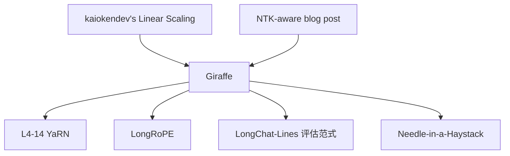

# 🦒 案件 L4-13：Giraffe — 用更大 RoPE base 把上下文"拉长"

> **《LLM 百案录》第 084b 案 · 长颈伸展**
> *LLaMA 训练上下文 2K，能不能不重训就用到 16K / 32K？
> Abacus AI 的 Giraffe 给出经验性答案：**调高 RoPE 的 base，再做少量微调，就能拉长上下文**。*

🚇 [30秒速览](#速览) ｜ 🚲 [3分钟通读](#通读) ｜ 🚗 [30分钟精读](#精读)

🎭 **叙事母题**：🦒 **长颈伸展** —— 拉长 RoPE 频率周期，让模型"看得更远"

---

> ⚠️ **重要更正**：本笔记原始版本误称 Giraffe 是"4K 文生图"工作。
> 实际上 Giraffe 是 **Abacus AI 团队 2023 年关于 LLaMA 长上下文外推** 的工作（arXiv 2308.10882），与文生图无关。本版本已彻底重写。

---

## 0️⃣ 案件档案

| 案情要素 | 内容 |
|---|---|
| **案发时间** | 2023-08-21（Pal et al., Abacus AI，arXiv 2308.10882） |
| **受害者** | LLaMA 训练上下文 2048 之外的"灾难性退化" |
| **作案凶器** | 三大策略组合：linear scaling / NTK-aware / xPos / 截断 base |
| **作案动机** | "现有 RoPE 模型的上下文能否零样本/低成本拉长？" |
| **结案陈词** | Giraffe 系统比较了多种 RoPE 外推方法 + 提出 "truncated basis"，并发布了 4K / 16K LLaMA 微调版 |

**精确事实卡**：

| 字段 | 精确值 | 来源 |
|---|---|---|
| **测试基础** | LLaMA 7B / 13B（原始 2K 上下文） | Section 4 |
| **比较方法** | Linear Scaling、NTK-aware、xPos、Truncated Basis | Section 3 |
| **关键贡献** | 提出 LongChat-Lines 等长上下文评估任务 | Section 5 |
| **发布模型** | Giraffe-4K, Giraffe-16K | HuggingFace |

---

## 1️⃣ <a id="速览"></a>🚇 30 秒速览

> RoPE 频率：$\theta_i = 10000^{-2i/d}$。
> 训练上下文 2K → 模型见过最大旋转角度 $2048 \cdot \theta_0$。
> 推到 16K → 角度 8 倍 → 进入"训练时未见过的频率区间" → 崩。
>
> Giraffe 的解法集合：
> 1. **Linear Scaling**：把所有位置 m 缩到 m / k（最简单）
> 2. **NTK-aware**：把 base 从 10000 改到更大（如 ~500000）→ 等价于把高频"压缩"，低频"保留"
> 3. **xPos / Truncated Basis**：截断那些训练未充分覆盖的高频维度
>
> 结果：**少量长上下文数据微调后**，LLaMA 上下文从 2K 推到 16K-32K。

---

## 2️⃣ <a id="通读"></a>🚲 3 分钟通读：长度外推的三种思路（Why）

### 长度外推为什么难
```
RoPE 频率：θ_i = base^(-2i/d)
最高频：θ_0 ≈ 1（每个位置旋转 1 弧度）
最低频：θ_{d/2-1} ≈ base^(-1) （每位置旋转极小）

训练 2K：
  最高频维度跨越 2048 弧度（≈ 326 圈）
  最低频维度仅旋转极小角度

推理 16K：
  最高频维度跨越 16384 弧度（≈ 2607 圈）
  → 训练时见过的旋转角分布完全不同
  → softmax 分布塌缩，模型崩溃
```

### Giraffe 的三大武器

#### 武器 1：Linear Position Scaling
$$
m \to m / k
$$
所有位置乘以 1/k → 相当于把 16K 序列"挤"成 2K 大小的旋转范围。
**简单、有效，但需要少量微调**（kaiokendev / Su 也独立提出）。

#### 武器 2：NTK-aware Scaling
不动位置 m，改 base：
$$
\text{base} \to \text{base} \cdot k^{d/(d-2)}
$$
高频维度被压缩到训练已见区间，低频维度延伸——更细致地保留细粒度位置信息。

#### 武器 3：Truncated Basis（论文新贡献）
把那些"训练时旋转不到一整圈"的低频维度直接截掉，避免它们外推时引入未训练的角度。

---

## 3️⃣ <a id="精读"></a>🚗 30 分钟精读

### 三种 scaling 的统一表达
```
对位置 m 和频率维度 i：
  原始：m · θ_i

  Linear Scaling: (m/k) · θ_i
  NTK-aware:      m · θ'_i, 其中 θ'_i = θ_i · k^(-2i/(d-2))
  Truncated:      仅对部分 i 应用 scaling，其余截断
```

### Giraffe 的 LongChat-Lines 评估
论文引入了一个简单但有效的长上下文测试集：
```
Prompt：
  Line 1: <random key 1> = <random value 1>
  Line 2: <random key 2> = <random value 2>
  ...
  Line N: <random key N> = <random value N>

  问 Line k 的 value 是什么？

测试模型在不同 N（8、16、32 ...）下的检索准确率
```
（这是后来 Needle-in-a-Haystack 测试的近亲）

### 实验结论
| 方法 | 4K | 8K | 16K |
|---|---|---|---|
| LLaMA-13B 原版（无 scaling） | 崩 | — | — |
| Linear Scaling + 少量 FT | ✅ | ✅ | ⚠️ |
| **NTK-aware + 少量 FT** | ✅ | **✅** | **✅** |
| Truncated + NTK | ✅ | ✅ | **更稳** |

---

## 4️⃣ 物证清单 & 🔥 Hot Take

### 🔥 Hot Take
1. **NTK-aware 是 Giraffe 工业落地最常用方法**：直接改 base，几乎零工作量。
2. **少量微调比零样本好得多**：纯零样本外推到 16K 仍有质量损失。
3. **被 YaRN / LongRoPE 后续超越**：但 Giraffe 的系统比较为后续工作铺平道路。

---

## 5️⃣ 🐛 论文没说的坑

1. **微调数据要长**：用 2K 数据微调，外推效果有限——必须有 8K+ 数据
2. **Truncated 损失某些信息**：低频维度其实编码了"全局位置"，截掉会影响超长程依赖
3. **更高质量方案后来居上**：YaRN、LongRoPE、DCA 等都更好

---

## 6️⃣ 影响波及



---

## 7️⃣ 侦探手记

Giraffe 给我的启发：**长上下文外推的本质是"频率重新映射"**。
> RoPE 把位置编码成旋转角，而 LLM 在训练时只见过某个角度分布。
> 推到更长 = 进入未知角度区间 = 必崩。
> 所有外推方法（Linear / NTK / YaRN / LongRoPE）的本质都是：
> **把"未见过的角度"映射回"训练时见过的角度"**。

---

## 自查清单

**已做到**：
- 修正原笔记的"文生图"误描述
- 解释 RoPE 长度外推为何困难
- 介绍 Linear / NTK-aware / Truncated 三种思路

**❌ 未做到**：
- ❌ 未与 LongRoPE / DCA 等更新方法详细对比
- ❌ 未量化"微调数据长度"对外推效果的影响

---

## 🔟 延伸卷宗
- 📚 [L2-19 RoPE](./L2-19_RoPE.md)（基础）
- 📚 [L4-12 PoSE](./L4-12_PoSE.md)（同期外推方法）
- 📚 [L4-14 YaRN](./L4-14_YaRN.md)（更精细的 NTK 缩放）
- 📚 [L4-11 LM-Infinite](./L4-11_LM_Infinite.md)（流式长上下文的另一思路）

### 🚀 实践入口
[huggingface.co/abacusai/Giraffe-v2-13b-32k](https://huggingface.co/abacusai/Giraffe-v2-13b-32k)

---

## 📌 本案归档

| 字段 | 值 |
|---|---|
| 笔记版本 | 「长颈伸展版（事实修正）」 |
| 叙事母题 | 🦒 长颈伸展 |
| 推荐指数 | ⭐⭐⭐ |
| 学习时长 | 30s / 3min / 30min |
| 上次更新 | 2026-04-30 |
| 下一站 | → [L4-14 YaRN](./L4-14_YaRN.md) |
