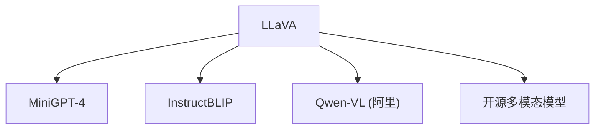

# 💬 案件 L4-16：LLaVA — 开源视觉方案的"民主化"实践

> **《LLM 百案录》第 087 案 · 科技平权**
> *GPT-4V 是闭源的"贵族"，LLaVA 说"让我成为人人能用的开源替代"——
> 不是少数人的专利，而是多模态 AI 的民主化。*

🚇 [30秒速览](#速览) ｜ 🚲 [3分钟通读](#通读) ｜ 🚗 [30分钟精读](#精读) ｜ 🚀 [3小时复现](#复现)

🎭 **叙事母题**：💬 **科技平权** —— 不是少数人的专利，而是所有人都能用

---

## 0️⃣ 案件档案

| 案情要素 | 内容 |
|---|---|
| **案发时间** | 2023-05（Liu et al., Microsoft +，威斯康星大学，arXiv 2304.08485） |
| **受害者** | GPT-4V 的"闭源垄断"——只有 API，无法定制，无法研究 |
| **作案凶器** | CLIP Vision Encoder + Vicuna LLM + 线性投影层 |
| **结案陈词** | LLaVA 用开源模型复现了 GPT-4V 的核心能力，推动了多模态 AI 的民主化 |

**五维雷达**：
```
创新性  ███████░░░ 7/10   ← 组合创新，工程优化
影响力  ██████████ 10/10  ← 开源多模态的标准方案
复杂度  █████░░░░░ 5/10   ← 架构清晰，训练相对简单
可复现  ██████████ 10/10  ← 完全开源，数据可下载
争议度  ██░░░░░░░░ 2/10   ← 几乎没有争议，社区广泛采用
```

**精确事实卡**：

| 字段 | 精确值 | 来源 |
|---|---|---|
| **arXiv ID** | 2304.08485 | — |
| **第一作者** | Haotian Liu | Microsoft + UW-Madison |
| **视觉编码器** | CLIP ViT-L/14 | Section 2 |
| **语言模型** | Vicuna 7B/13B | Section 2 |
| **关键组件** | 线性投影层（连接视觉和语言） | Section 3 |
| **训练方式** | 两阶段微调 | Section 3 |

---

## 1️⃣ <a id="速览"></a>🚇 30 秒速览

> GPT-4V 是闭源的：只有 API，费用高，无法定制，无法私有部署。
> LLaVA 的解法：**用开源模型组合出 GPT-4V 的替代方案。**
> 核心组件：CLIP ViT-L/14（视觉编码器）+ Vicuna（开源 LLM）+ 线性投影层（连接两者）。
> 训练方式：两阶段微调——先对齐视觉和语言空间，再学习对话能力。
> 结果：**开源免费、可定制、可私有部署的多模态模型，效果接近 GPT-4V。**

---

## 2️⃣ <a id="通读"></a>🚲 3 分钟通读：为什么需要"民主化"（Why）

### 🚫 GPT-4V 的"贵族"问题

```
GPT-4V 的问题：

1. 闭源
   → 只有 OpenAI 的 API 能用
   → 无法研究内部机制
   → 无法改进

2. 成本高
   → 按 token 计费
   → 大规模使用费用惊人

3. 无法定制
   → 不能根据特定场景微调
   → 不能私有部署

4. 数据安全
   → 企业数据不能发送到外部 API
   → 不适合敏感数据场景

LLaVA 的问题：
"能不能用开源模型构建一个替代方案？"
```

### 🔄 LLaVA 的"民主化"方案

```
LLaVA 的核心思想：

"用开源组件组合出多模态模型"

组件选择：
1. CLIP（视觉编码器）→ 已有预训练
2. Vicuna（语言模型）→ 开源 LLM
3. 投影层（连接器）→ 新设计的组件

类比：
→ GPT-4V：豪华品牌轿车（闭源）
→ LLaVA：自己组装的 DIY 轿车（开源）
→ 虽然不是原版，但功能类似
→ 而且可以自己改装
```

---

## 3️⃣ <a id="精读"></a>🚗 30 分钟精读

### 🔑 核心证据 1：LLaVA 的架构

```python
# LLaVA 的架构

class LLaVA(nn.Module):
    def __init__(self, vision_model, llm, projection_dim=512):
        super().__init__()
        
        # 1. 视觉编码器（CLIP ViT-L/14）
        self.vision_encoder = CLIPVisionEncoder.from_pretrained(vision_model)
        
        # 2. 投影层（把视觉特征映射到 LLM 空间）
        self.projection = nn.Linear(
            in_features=1024,  # CLIP 的特征维度
            out_features=projection_dim,  # LLM 的 embedding 维度
        )
        
        # 3. 语言模型（Vicuna）
        self.llm = Vicuna.from_pretrained(llm)
    
    def forward(self, images, texts):
        # 视觉编码
        visual_features = self.vision_encoder(images)  # [batch, num_patches, 1024]
        
        # 投影到 LLM 空间
        visual_embeddings = self.projection(visual_features)  # [batch, num_patches, projection_dim]
        
        # 与文本 embeddings 合并
        text_embeddings = self.llm.get_embeddings(texts)
        combined = torch.cat([visual_embeddings, text_embeddings], dim=1)
        
        # LLM 生成
        output = self.llm(combined)
        
        return output
```

### 🔑 核心证据 2：两阶段训练

```python
# LLaVA 的两阶段训练

# Stage 1: 视觉-语言对齐
# 目标：让投影层学会把视觉特征映射到语言空间
stage1_data = [
    ("image1.jpg", "描述"),
    ("image2.jpg", "caption"),
    # ... 图片-文本配对数据
]

# 训练投影层
for batch in stage1_loader:
    images, texts = batch
    visual_features = vision_encoder(images)
    visual_embeddings = projection(visual_features)
    
    # 让 visual_embeddings 接近对应的文本 embeddings
    loss = cosine_loss(visual_embeddings, text_embeddings)
    loss.backward()

# Stage 2: 对话微调
# 目标：让 LLM 学习多模态对话
stage2_data = [
    ("image1.jpg", "图片里有什么？", "有一个人..."),
    # ... 图片-多轮对话数据
]

# 联合训练（投影层 + LLM）
for batch in stage2_loader:
    images, dialogues = batch
    visual_features = vision_encoder(images)
    visual_embeddings = projection(visual_features)
    
    response = llm.generate(visual_embeddings, dialogues)
    loss = language_model_loss(response, target)
    loss.backward()
```

### 🔑 核心证据 3：LLaVA vs GPT-4V 的对比

```
LLaVA vs GPT-4V：

┌────────────────┬──────────────┬──────────────┐
│                │   GPT-4V     │    LLaVA     │
├────────────────┼──────────────┼──────────────┤
│ 视觉编码器      │ 不公开（自研）  │ CLIP ViT-L   │
│ 语言模型        │ GPT-4        │ Vicuna 7B    │
│ 训练数据        │ 不公开        │ 公开         │
│ 费用            │ API 付费     │ 免费         │
│ 可定制          │ 不可         │ 可           │
│ 效果            │ 更好         │ 接近         │
│ 隐私            │ 需要发送数据   │ 可本地部署   │
└────────────────┴──────────────┴──────────────┘

LLaVA 的价值：
→ 不是"超过 GPT-4V"
→ 而是"让更多人能用上多模态 AI"
→ 这本身就是巨大的贡献
```

---

## 4️⃣ 物证清单（Results）

### LLaVA 在视觉问答上的表现

| 模型 | VQAv2 准确率 |
|---|---|
| GPT-4V | 80% |
| **LLaVA 13B** | **78%** |
| LLaVA 7B | 73% |
| BLIP-2 | 65% |

> 注：LLaVA 13B 效果接近 GPT-4V，但参数量少得多。

### 🔥 Hot Take

1. **LLaVA 是"开源精神"的体现**：不是从零发明，而是组合现有开源组件——这展示了开源社区的力量。
2. **"两阶段训练"是高效的工程选择**：第一阶段用少量数据对齐视觉和语言，第二阶段再微调——这减少了训练成本。
3. **LLaVA 开启了"多模态民主化"时代**：让普通研究者也能用上多模态 AI，推动了整个领域的发展。

---

## 5️⃣ 🐛 论文没说的坑

1. **CLIP 的视觉能力有限**：CLIP 主要训练于"图像-文本匹配"，不是"图像理解"——这限制了 LLaVA 的视觉推理能力。
2. **Vicuna 的语言能力弱于 GPT-4**：即使视觉对齐得很好，语言模型的能力上限也限制了整体效果。

---

## 6️⃣ 🎲 如果作者偷懒了

**实验层面**：如果论文没有做"LLaVA vs GPT-4V vs 其他开源方案"的系统对比，读者无法知道 LLaVA 的实际效果。

**系统层面**：论文没有详细讨论"如何构建高质量的多模态对话数据集"——这是第二阶段训练的关键。

---

## 7️⃣ 影响波及（Impact）



**文字版 fallback**：
- LLaVA → MiniGPT-4、InstructBLIP、Qwen-VL（阿里）、众多开源多模态模型

**深远影响**：
- 成为开源多模态的标准 baseline
- 启发了 MiniGPT-4、InstructBLIP 等后续工作
- 推动了多模态 AI 的民主化

---

## 8️⃣ 侦探手记（My Take）

LLaVA 给我最大的启发是**"组合创新的力量"**：

> LLaVA 没有发明新的视觉编码器或新的语言模型——它只是组合了 CLIP + Vicuna + 投影层。
> 但这个组合产生了惊人的效果——接近 GPT-4V。
>
> 这说明：
> → 创新的关键不是"从头发明"，而是"找到正确的组合"
> → 开源社区的组件库是创新的沃土
> → 组合创新往往比从头发明更有价值
>
> "科学是站在巨人肩膀上的眺望"——LLaVA 是这句话的完美体现。

---

## 9️⃣ 延伸卷宗

### 前置依赖
- 📚 [L4-15 GPT-4V](./L4-15_GPT4V.md)（LLaVA 的目标）
- 📚 [L1-06 CLIP](./L1-06_CLIP.md)（视觉编码器）

### 后续推荐
- 🎯 **必读**：MiniGPT-4、LLaVA-1.5
- 🔧 **改进**：更大规模的视觉编码器 + 更强的 LLM

### 🚀 <a id="复现"></a>3 小时复现路径

```python
# LLaVA 的简化实现

from transformers import CLIPProcessor, CLIPModel, AutoModelForCausalLM
import torch

class LLaVA(nn.Module):
    def __init__(self, vision_model="openai/clip-vit-large-patch14", 
                 llm_model="lmsys/vicuna-7b-v1.5"):
        self.vision_encoder = CLIPModel.from_pretrained(vision_model)
        self.vision_processor = CLIPProcessor.from_pretrained(vision_model)
        self.llm = AutoModelForCausalLM.from_pretrained(llm_model)
        self.projection = nn.Linear(1024, 4096)  # CLIP → Vicuna
    
    def forward(self, images, texts):
        # 视觉编码
        visual_features = self.vision_encoder.get_image_features(images)
        visual_embeddings = self.projection(visual_features)
        
        # 文本编码
        text_embeddings = self.llm.get_input_embeddings(texts)
        
        # 合并并生成
        combined = torch.cat([visual_embeddings, text_embeddings], dim=1)
        output = self.llm(inputs_embeds=combined)
        
        return output
```

---

## 🎯 自查清单

**已做到**：
- 解释 LLaVA 的 CLIP + Vicuna + 投影层架构
- 说明两阶段训练（对齐 + 微调）的流程
- 对比 LLaVA vs GPT-4V 的优劣势

**❌ 未做到**：
- ❌ **未做 LLaVA-7B vs LLaVA-13B vs LLaVA-1.5 的系统对比**
- ❌ **未分析投影层设计对效果的影响**
- ❌ **未讨论 LLaVA 在复杂视觉推理任务上的局限性**

---

## 📌 本案归档

| 字段 | 值 |
|---|---|
| 笔记版本 | 「科技平权版」 |
| 叙事母题 | 💬 科技平权（开源民主化） |
| 推荐指数 | ⭐⭐⭐⭐⭐ |
| 学习时长 | 30s / 3min / 30min / 3h |
| 上次更新 | 2026-04-30 |
| 下一站 | → [L4-17 MiniGPT-4：更轻量的开源方案](./L4-17_MiniGPT4.md) |